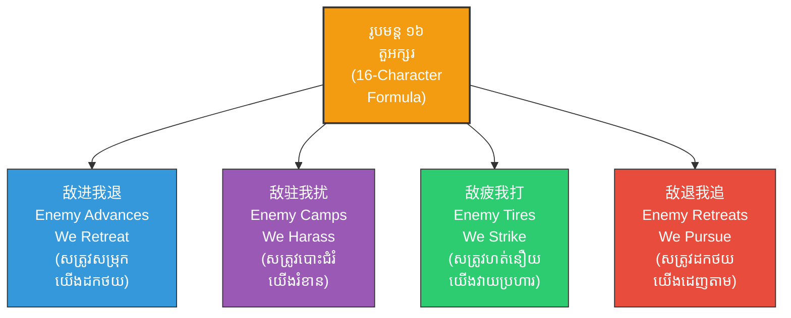
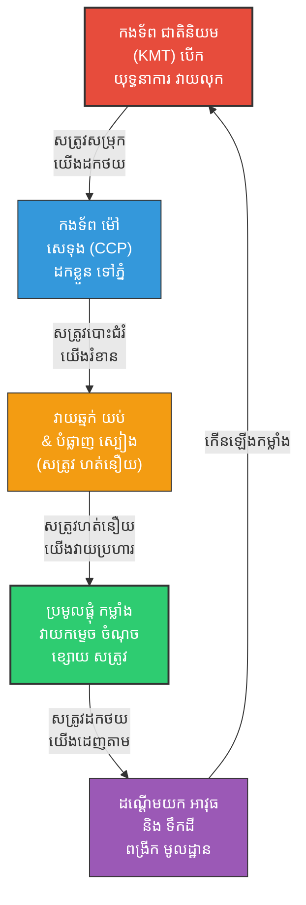

# The Guerrilla Strategy of Mao Zedong (យុទ្ធសាស្ត្រវាយឆ្មក់របស់ ម៉ៅ សេទុង៖ ការយកក្បួនសឹកស៊ុនអ៊ូឈ្នះទ័ពជាតិនិយមចិន)

**Author:** ichamrong  
**Date:** 2026-05-27  
**Tags:** #maozedong #guerrillawarfare #suntzu #artofwar #strategy #military #china #philosophy #psychology  
**Category:** Biographies / Related / Classics  
**Read Time:** ~25 min  

---

## 📌 មាតិកា (Table of Contents)
- [សេចក្តីផ្តើម៖ ការប្រឈមមុខគ្នារវាងយក្ស និងស្រមោច (Introduction: The Clash of the Giant and the Ant)](#intro)
- [១. បរិបទប្រវត្តិសាស្ត្រ និងសង្គ្រាមស៊ីវិលចិន (Historical Context & Chinese Civil War)](#historical-context)
- [២. រូបមន្ត ១៦ តួអក្សរដ៏ល្បីល្បាញ (The Famous 16-Character Formula)](#16-characters)
- [៣. 🏛️ [គ្រឹះទស្សនវិជ្ជា] / [Philosophical Core] - ទស្សនវិជ្ជាស្នូល៖ តុល្យភាពយិនយ៉ាង និងភាពអសមកាល (The Philosophical Core: Yin-Yang Duality & Asymmetry)](#philosophical-core)
- [៤. 🧠 [យន្តការចិត្តសាស្ត្រ] / [Psychological Mechanism] - យន្តការចិត្តសាស្ត្រ៖ ការលើកទឹកចិត្តអសមកាល និងភាពធន់ (Psychological Mechanism: Asymmetric Motivation & Resilience)](#psychological-mechanisms)
- [៥. 🚀 [មេរៀនអនុវត្ត] / [Practical Application] - ដំណាក់កាលទាំង ៣ នៃសង្គ្រាមទាហានព្រៃ (The Three Stages of Guerrilla Warfare)](#three-stages)
- [៦. គំនូសបំរែបំរួលយុទ្ធសាស្ត្រវាយឆ្មក់ (Guerrilla Strategic Loop Diagram)](#strategic-loop)
- [៧. ⚠️ [ភាពផ្ទុយគ្នា និងការរិះគន់] / [Paradoxes & Criticisms] - ដែនកំណត់នៃយុទ្ធសាស្ត្រវាយឆ្មក់ក្នុងសម័យទំនើប (Limits in Modern Contexts)](#paradoxes-criticisms)
- [សេចក្តីសន្និដ្ឋាន៖ កម្លាំងចិត្ត និងយុទ្ធសាស្ត្រឈ្នះលើកម្លាំងបាយ (Conclusion: Spirit & Strategy Over Brute Force)](#conclusion)
- [🔗 ឯកសារទាក់ទង (Related Topics)](#related-topics)
- [ឯកសារយោង (References)](#references)

---

## សេចក្តីផ្តើម៖ ការប្រឈមមុខគ្នារវាងយក្ស និងស្រមោច (Introduction: The Clash of the Giant and the Ant)

> **«សត្រូវសម្រុក យើងដកថយ សត្រូវបោះជំរំ យើងរំខាន សត្រូវហត់នឿយ យើងវាយប្រហារ សត្រូវដកថយ យើងដេញតាម។» — ម៉ៅ សេទុង**  
> *(“Enemy advances, we retreat; enemy camps, we harass; enemy tires, we strike; enemy retreats, we pursue.” — Mao Zedong)*

នៅក្នុងប្រវត្តិសាស្ត្រយោធាសម័យទំនើប គ្មានព្រឹត្តិការណ៍ណាដែលបង្ហាញពីប្រសិទ្ធភាពនៃយុទ្ធសាស្ត្រ «យកទន់ឈ្នះរឹង យកតិចឈ្នះច្រើន» ខ្លាំងជាង **សង្គ្រាមស៊ីវិលចិន (Chinese Civil War)** នោះឡើយ។ កងទ័ពជាតិនិយមចិន (Kuomintang - KMT) ក្រោមការដឹកនាំរបស់ ជៀង កាយចៀក (Chiang Kai-shek) គឺជាយក្សដ៏មានអំណាចដែលមានទាហានរាប់លាននាក់ អាវុធទំនើបៗ និងការគាំទ្រផ្នែកហិរញ្ញវត្ថុពីមហាអំណាចលោកខាងលិច។ ផ្ទុយទៅវិញ កងទ័ពបដិវត្តន៍របស់ **ម៉ៅ សេទុង (Mao Zedong)** គឺជាស្រមោចដ៏កំសត់ ដែលមានតែទាហានស្ម័គ្រចិត្តលំដាប់កសិករ អាវុធចាស់ៗ និងស្បៀងអាហារខ្សត់ខ្សោយ។

ប៉ុន្តែ ម៉ៅ សេទុង បានកាន់ក្បួនសឹកអមតៈរបស់ **ស៊ុន អ៊ូ (Sun Tzu) - The Art of War** មកធ្វើជាអាវុធសម្ងាត់។ តាមរយៈការសិក្សា និងយល់ដឹងយ៉ាងស៊ីជម្រៅពីទស្សនវិជ្ជាសឹកបុរាណ ម៉ៅ បានបង្កើត **«យុទ្ធសាស្ត្រសង្គ្រាមទាហានព្រៃ» (Guerrilla Warfare / 游击战)** ដែលជាការវាយឆ្មក់ឥតស្រមោល ធ្វើឱ្យកងទ័ពជាតិនិយមដ៏ធំធេងរបស់ជៀង កាយចៀក ច្របូកច្របល់ ហត់នឿយ និងចុះខ្សោយម្តងបន្តិចៗ រហូតដល់ត្រូវបរាជ័យទាំងស្រុងនៅឆ្នាំ ១៩៤៩។

---

## ១. បរិបទប្រវត្តិសាស្ត្រ និងសង្គ្រាមស៊ីវិលចិន (Historical Context & Chinese Civil War)

ក្រោយការដួលរលំនៃរាជវង្សឈីង (Qing Dynasty) ប្រទេសចិនបានធ្លាក់ចូលក្នុងភាពវឹកវរ និងជម្លោះផ្ទៃក្នុងរវាងបក្សជាតិនិយម (KMT) និងបក្សកុម្មុយនីស្ត (CCP)។ នៅទសវត្សរ៍ឆ្នាំ ១៩៣០ កងទ័ពរបស់ជៀង កាយចៀក បានបើកយុទ្ធនាការឡោមព័ទ្ធកម្ទេចកងទ័ពរបស់ម៉ៅ សេទុង ជាច្រើនលើកច្រើនសា បង្ខំឱ្យកងទ័ពម៉ៅធ្វើការដកថយជាប្រវត្តិសាស្ត្រចម្ងាយជាង ៩,៦០០ គីឡូម៉ែត្រ ដែលគេហៅថា **«ការដើរក្បួនវែង» (The Long March / 长征)**។

ក្នុងស្ថានភាពដែលទាហានស្លាប់ និងរត់ចោលជួររាប់សែននាក់ ម៉ៅ សេទុង មិនបានអស់សង្ឃឹមឡើយ。 គាត់បានដឹងថា ការប្រយុទ្ធគ្នាចំមុខ (Conventional Warfare) ជាមួយកងទ័ពជាតិនិយម គឺស្មើនឹងការធ្វើអត្តឃាត។ ម៉ៅ បានងាកទៅរកទស្សនវិជ្ជារបស់ស៊ុនអ៊ូ ដែលពោលថា៖ *«បើមិនអាចយកឈ្នះដោយកម្លាំងបាយ ត្រូវយកឈ្នះដោយយុទ្ធសាស្ត្រ»*។ គាត់បានចាប់ផ្តើមប្រមូលផ្តុំកសិករ និងបង្កើតមូលដ្ឋានបង្អែកនៅតាមតំបន់ជនបទភ្នំដាច់ស្រយាល ហើយចាប់ផ្តើមបណ្តុះបណ្តាលពួកគេនូវយុទ្ធវិធីវាយឆ្មក់។

---

## ២. រូបមន្ត ១៦ តួអក្សរដ៏ល្បីល្បាញ (The Famous 16-Character Formula)

ស្នូលនៃយុទ្ធសាស្ត្រទាហានព្រៃរបស់ម៉ៅ សេទុង ត្រូវបានសង្ខេបជាភាសាចិនបុរាណចំនួន ១៦ តួអក្សរ (16-Character Formula) ដែលជាការយកគោលការណ៍ «Deception» (ការបោកបញ្ឆោត) និង «Adaptability» (ភាពបត់បែនដូចទឹក) របស់ស៊ុនអ៊ូមកប្រើប្រាស់ជាក់ស្តែង៖

1. **敌进我退 (សត្រូវសម្រុក យើងដកថយ - Enemy Advances, We Retreat):**
   នៅពេលសត្រូវប្រើប្រាស់កម្លាំងធំមកវាយប្រហារ កងទ័ពទាហានព្រៃត្រូវតែដកថយភ្លាមៗ ជៀសវាងការប៉ះទង្គិចចំមុខ។ នេះស្របនឹងពាក្យស៊ុនអ៊ូ៖ *«បើដឹងខ្លួនថាខ្សោយជាង ត្រូវចេះដកថយ»*។
   
2. **敌驻我扰 (សត្រូវបោះជំរំ យើងរំខាន - Enemy Camps, We Harass):**
   នៅពេលសត្រូវឈប់សម្រាក ឬបោះជំរំ កងទ័ពទាហានព្រៃមិនត្រូវទុកឱ្យពួកគេសម្រាកស្រួលឡើយ។ ត្រូវប្រើក្រុមកាំភ្លើងតូចៗវាយឆ្មក់ពេលយប់ បង្កការភ័យខ្លាច និងរំខានមិនឱ្យដេកលក់ ដើម្បីបំបាក់ស្មារតីសត្រូវ។
   
3. **敌疲我打 (សត្រូវហត់នឿយ យើងវាយប្រហារ - Enemy Tires, We Strike):**
   ក្រោយពីដេញតាមកងទ័ពម៉ៅ និងរងការរំខានឥតឈប់ឈរ កងទ័ពជាតិនិយមនឹងចាប់ផ្តើមហត់នឿយ អស់កម្លាំង និងបាក់ទឹកចិត្ត។ នៅពេលនោះហើយដែលកងទ័ពម៉ៅប្រមូលផ្តុំកម្លាំងទាំងអស់ដើម្បី «វាយកម្ទេចចំណុចខ្សោយបំផុតរបស់សត្រូវ»。
   
4. **敌退我追 (សត្រូវដកថយ យើងដេញតាម - Enemy retreats, We Pursue):**
   នៅពេលសត្រូវសម្រេចចិត្តដកថយដោយសារទ្រាំមិនបាន កងទ័ពទាហានព្រៃត្រូវតែដេញតាមវាយប្រហារពីក្រោយភ្លាមៗ ដើម្បីបង្កការខូចខាត និងដណ្តើមយកគ្រឿងយុទ្ធោបករណ៍របស់ពួកគេ។

> [!IMPORTANT]
> **មេរៀនគ្រឹះ (Core Principle of the 16-Character Formula):**
> គោលការណ៍គ្រឹះនៃរូបមន្តនេះ មិនមែនជាការការពារទឹកដីឱ្យខានតែបាននោះទេ តែជាការបំផ្លាញកម្លាំងយោធារបស់សត្រូវ ខណៈពេលរក្សាកម្លាំងរបស់ខ្លួនឯងឱ្យបានគង់វង្ស។ ទឹកដីអាចដណ្តើមមកវិញបាន ប៉ុន្តែការបាត់បង់កងទ័ព គឺស្មើនឹងការបាត់បង់អ្វីៗទាំងអស់។

---

## 🏛️ [គ្រឹះទស្សនវិជ្ជា] / [Philosophical Core] - ទស្សនវិជ្ជាស្នូល៖ តុល្យភាពយិនយ៉ាង និងភាពអសមកាល (The Philosophical Core: Yin-Yang Duality & Asymmetry)

យុទ្ធសាស្ត្ររបស់ម៉ៅ សេទុង បានយកគោលការណ៍ **យិនយ៉ាង (Yin-Yang Duality)** និងទស្សនវិជ្ជាតាវនិយម (Daoism) មកអនុវត្តក្នុងសមរភូមិជាក់ស្តែង៖

### ក. ការដកថយជាសកម្មភាពវាយលុក (Retreat as Active Preparation)
នៅក្នុងសង្គ្រាមប្រពៃណី ការដកថយត្រូវបានគេមើលឃើញថាជា «បរាជ័យ» (Yin)។ ប៉ុន្តែ ម៉ៅ បានបកស្រាយតាមទស្សនវិជ្ជាតាវនិយមថា ការដកថយគឺជាការបង្កើតថាមពល ដើម្បីវាយបកវិញយ៉ាងខ្លាំងក្លា (Yang)៖
*   **ភាពទន់ខ្សោយបណ្តោះអាសន្ន (Strategic Softness):** ការដកថយដើម្បីអូសសត្រូវឱ្យដើរចូលដីភូមិសាស្ត្រដែលយើងគ្រប់គ្រង ធ្វើឱ្យកម្លាំងវាយលុករបស់ពួកគេចុះខ្សោយ និងបែកខ្ញែក។
*   **តុល្យភាពនៃកម្លាំង (Energy Balance):** ការរក្សាថាមពលផ្ទៃក្នុង ខណៈពេលកំពុងបំផ្លាញធនធាន និងពេលវេលារបស់គូប្រកែងយឺតៗ។

### ខ. ការយក «Moral Law» (Tao) មកបង្កើតសាមគ្គីភាព
ស៊ុនអ៊ូបានចែងថា កត្តាទី១ នៃសង្គ្រាមគឺ «គុណធម៌ និងការរួបរួមនៃចិត្តប្រជាជន» (Tao/道)។ ម៉ៅបានបកប្រែគោលការណ៍នេះទៅជា **«គោលការណ៍វិន័យកងទ័ព និងកសិករ»**៖
*   ទាហានរបស់ម៉ៅមិនត្រូវបានអនុញ្ញាតឱ្យលួច ឬធ្វើបាបប្រជាជនឡើយ។ ពួកគេត្រូវជួយកសិករច្រូតកាត់ស្រូវ និងគោរពទំនៀមទម្លាប់អ្នកស្រុក។
*   **លទ្ធផល៖** ប្រជាជនកសិកររាប់លាននាក់បានស្ម័គ្រចិត្តធ្វើជាចារបុរស ផ្តល់ស្បៀង និងលាក់បំពួនទាហានរបស់ម៉ៅ។ នេះជាការយកឈ្នះតាមផ្លូវទស្សនវិជ្ជាសីលធម៌ និងចិត្តសាស្ត្រមហាជន។

---

## 🧠 [យន្តការចិត្តសាស្ត្រ] / [Psychological Mechanism] - យន្តការចិត្តសាស្ត្រ៖ ការលើកទឹកចិត្តអសមកាល និងភាពធន់ (Psychological Mechanism: Asymmetric Motivation & Resilience)

យុទ្ធសាស្ត្រទាហានព្រៃរបស់ម៉ៅ ដំណើរការយ៉ាងល្អដោយសារកត្តាចិត្តសាស្ត្រនិងវិទ្យាសាស្ត្រនៃការគិត (Cognitive Science) ស៊ីជម្រៅ៖

### ក. Asymmetric Motivation (ការលើកទឹកចិត្តមិនស្មើគ្នា)
*   **កងទ័ពជាតិនិយម (KMT):** ទាហានភាគច្រើនត្រូវបានបង្ខំឱ្យចូលបម្រើកងទ័ព ឬប្រយុទ្ធដើម្បីលុយកាក់ និងមេទ័ពពុករលួយ។ ពួកគេមាន «ស្មារតីប្រយុទ្ធទាប» និងងាយរងគ្រោះដោយសារការភ័យខ្លាច (Loss Aversion)។
*   **ទាហានព្រៃ (CCP):** ពួកគេប្រយុទ្ធដើម្បី «ដីធ្លី ការរំដោះខ្លួន និងឧត្តមគតិជាតិ»។ ចិត្តសាស្ត្រនៃការមានគោលបំណងច្បាស់លាស់ (Self-Determination Theory) ជួយឱ្យពួកគេមានភាពធន់ផ្លូវចិត្តខ្ពស់ ទោះបីជាត្រូវដើរក្បួនចម្ងាយ ៩,៦០០ គីឡូម៉ែត្រ (The Long March) ក្នុងស្ថានភាពអត់ឃ្លានក៏ដោយ។

### ខ. ការប្រើប្រាស់ច្បាប់ «ដីមរណៈ» ពេញមួយយុទ្ធនាការ
តាមរយៈការដកថយចូលទៅក្នុងព្រៃ និងភ្នំជ្រៅៗ ម៉ៅ បានដាក់ទាហានរបស់ខ្លួននៅក្នុងស្ថានភាព **«ដីមរណៈ» (Death Ground / 死地)** ជានិច្ច៖
*   ពួកគេដឹងថាបើដកថយ ឬចុះចាញ់ ពួកគេនឹងត្រូវសម្លាប់ដោយគ្មានមេត្តា។
*   **Psychological Inoculation:** ស្ថានភាពគ្មានជម្រើសនេះ បានបំប្លែងភាពភ័យខ្លាចទៅជាកម្លាំងសាមគ្គីភាព និងការប្រយុទ្ធដាច់ខាតដើម្បីរស់រានមានជីវិត (Hyper-focus)។

> [!TIP]
> **គន្លឹះយុទ្ធសាស្ត្រ (Strategic Takeaway on Asymmetric Motivation):**
> នៅក្នុងសង្គ្រាមមិនសមាមាត្រ ស្មារតីនិងជំនឿចិត្តផ្លូវចិត្ត (Intrinsic Motivation) គឺជាកត្តាកំណត់ជ័យជម្នះធំជាងកម្លាំងបច្ចេកវិទ្យានិងលុយកាក់ (Extrinsic Incentives)។ ការបង្កើតក្តីសង្ឃឹម និងទស្សនវិស័យរួមដល់ថ្នាក់ក្រោម គឺជាអាវុធផ្លូវចិត្តដ៏ខ្លាំងក្លាបំផុត។

---

## 🚀 [មេរៀនអនុវត្ត] / [Practical Application] - ដំណាក់កាលទាំង ៣ នៃសង្គ្រាមទាហានព្រៃ (The Three Stages of Guerrilla Warfare)

នៅក្នុងសៀវភៅរបស់គាត់ស្តីពី **«On Guerrilla Warfare» (១៩៣៧)** ម៉ៅ បានពន្យល់ថា សង្គ្រាមទាហានព្រៃត្រូវតែឆ្លងកាត់ដំណាក់កាលយុទ្ធសាស្ត្រចំនួន ៣ ដើម្បីផ្លាស់ប្តូរជោគវាសនារបស់រដ្ឋ៖

1. **ដំណាក់កាលទី ១៖ ការពង្រឹងកម្លាំង និងការរៀបចំ (Organization & Consolidation)**
   - ផ្តោតលើការបង្កើតមូលដ្ឋានបង្អែកសម្ងាត់នៅតាមជនបទ។
   - ឃោសនាទាក់ទាញការគាំទ្រពីកសិករ និងបង្កើតបណ្តាញចារកម្ម។
   - ជៀសវាងការប្រយុទ្ធទាំងអស់ដែលមិនចាំបាច់ ដើម្បីការពារកម្លាំង។

2. **ដំណាក់កាលទី ២៖ ការវាយប្រហារកម្រិតទាប (Progressive Expansion)**
   - ចាប់ផ្តើមយុទ្ធនាការវាយឆ្មក់ឥតឈប់ឈរលើប៉ុស្តិ៍យាមតូចៗ និងក្បួនស្បៀងសត្រូវ។
   - ដណ្តើមយកអាវុធសត្រូវមកបំពាក់ឱ្យខ្លួនឯង។
   - ធ្វើឱ្យសត្រូវភ័យខ្លាច មិនហ៊ានចេញក្រៅទីក្រុងធំៗ (Cognitive Overload)។

3. **ដំណាក់កាលទី ៣៖ ការវាយលុកទ្រង់ទ្រាយធំ (Decisive Transition)**
   - នៅពេលកម្លាំងទាហានព្រៃកើនឡើងរាប់លាននាក់ និងមានអាវុធគ្រប់គ្រាន់ ពួកគេផ្លាស់ប្តូរទៅជាកងទ័ពផ្លូវការ (Regular Army)។
   - បើកការវាយលុកចំមុខទ្រង់ទ្រាយធំ ដើម្បីដណ្តើមយកទីក្រុង និងកម្ទេចសត្រូវទាំងស្រុង។

> [!IMPORTANT]
> **មេរៀនគ្រឹះនៃការបែងចែកដំណាក់កាល (Systemic Transition Rule):**
> ការប្រញាប់ប្រញាល់ផ្លាស់ប្តូរពីដំណាក់កាលមួយទៅដំណាក់កាលមួយទៀត ដោយគ្មានការត្រៀមលក្ខណៈគ្រប់គ្រាន់ គឺជាការធ្វើអត្តឃាត។ ភាពអត់ធ្មត់ជាយុទ្ធសាស្ត្រ (Strategic Patience) គឺជាគន្លឹះរហូតដល់សមាមាត្រនៃកម្លាំងផ្លាស់ប្តូរទាំងស្រុង។

---

## ៦. គំនូសបំរែបំរួលយុទ្ធសាស្ត្រវាយឆ្មក់ (Guerrilla Strategic Loop Diagram)

---

## ⚠️ [ភាពផ្ទុយគ្នា និងការរិះគន់] / [Paradoxes & Criticisms] - ដែនកំណត់នៃយុទ្ធសាស្ត្រវាយឆ្មក់ក្នុងសម័យទំនើប (Limits in Modern Contexts)

ទោះបីជាយុទ្ធសាស្ត្រទាហានព្រៃរបស់ម៉ៅ សេទុង ទទួលបានជោគជ័យយ៉ាងធំធេងក្នុងប្រវត្តិសាស្ត្រចិនក៏ដោយ ក៏វាមានភាពផ្ទុយគ្នា និងដែនកំណត់ធ្ងន់ធ្ងរនៅក្នុងបរិបទសម័យទំនើប៖

### ក. ភាពងាយរងគ្រោះចំពោះបច្ចេកវិទ្យាទំនើប (Vulnerability to High-Tech Surveillance)
*   **ការឃ្លាំមើលតាមអាកាស និង AI៖** នៅក្នុងសម័យបច្ចុប្បន្ន ដែលមានយន្តហោះដ្រូនគ្មានមនុស្សបើក (UAVs) ប្រព័ន្ធចាប់កម្ដៅ (Thermal Imaging) និងប្រព័ន្ធផ្កាយរណបស៊ើបការណ៍ជំនាន់ថ្មី ទីតាំងភ្នំ ឬព្រៃជ្រៅលែងជាកន្លែងលាក់ខ្លួនដ៏មានសុវត្ថិភាពទៀតហើយ។ គូប្រកួតអាចមើលឃើញ និងបំផ្លាញមូលដ្ឋានបង្អែកបានយ៉ាងងាយស្រួល។
*   **ការទប់ស្កាត់ព័ត៌មាន (Information Blockade):** បច្ចេកវិទ្យាកាត់ផ្តាច់អ៊ិនធឺណិត និងបណ្តាញទំនាក់ទំនងរបស់រដ្ឋអំណាច អាចធ្វើឱ្យកងទ័ពទាហានព្រៃបាត់បង់សមត្ថភាពទំនាក់ទំនង និងការឃោសនាស្វែងរកការគាំទ្រពីមហាជន។

### ខ. ការពឹងផ្អែកលើការគាំទ្ររបស់ប្រជាជន (The Burden on Civilian Population)
*   **ទ្រឹស្តីទឹកនិងត្រី៖** ម៉ៅធ្លាប់ពោលថា «ប្រជាជនគឺជាទឹក ទាហានព្រៃគឺជាត្រី»។ ប៉ុន្តែ យុទ្ធសាស្ត្រនេះបង្កើតសម្ពាធ និងទុក្ខវេទនាយ៉ាងខ្លាំងដល់ជនស៊ីវិល។ ប្រសិនបើសត្រូវប្រើប្រាស់យុទ្ធសាស្ត្រកាត់ផ្តាច់ស្បៀង និងការធ្វើទារុណកម្មលើអ្នកភូមិ (ដូចជាយុទ្ធនាការ Strategic Hamlet Program) ទំនាក់ទំនងរវាង «ទឹក និងត្រី» នឹងត្រូវកាត់ផ្តាច់ ដែលនាំទៅរកការដួលរលំនៃទាហានព្រៃ។

> [!WARNING]
> **ហានិភ័យនៃយុទ្ធសាស្ត្រអសមកាល (Risks of Asymmetric Stalemate):**
> យុទ្ធសាស្ត្រវាយឆ្មក់អាចបង្កើតផលវិបាកជាប្រព័ន្ធ ប្រសិនបើមិនអាចឈានទៅដល់ដំណាក់កាលទី ៣ (Decisive Transition) បានលឿន។ សង្គ្រាមនឹងធ្លាក់ចូលក្នុងភាពជាប់គាំងរាប់ទសវត្សរ៍ ដែលបំផ្លិចបំផ្លាញសេដ្ឋកិច្ចជាតិ ហេដ្ឋារចនាសម្ព័ន្ធ និងជីវិតមនុស្សរាប់លាននាក់ ដោយគ្មានដំណោះស្រាយយុទ្ធសាស្ត្រច្បាស់លាស់។

---

## សេចក្តីសន្និដ្ឋាន៖ កម្លាំងចិត្ត និងយុទ្ធសាស្ត្រឈ្នះលើកម្លាំងបាយ (Conclusion: Spirit & Strategy Over Brute Force)

ជ័យជម្នះរបស់ ម៉ៅ សេទុង លើកងទ័ពជាតិនិយមចិន មិនមែនជាការឈ្នះដោយសារអាវុធទំនើប ឬលុយកាក់សន្ធឹកសន្ធាប់នោះទេ តែវាជាជ័យជម្នះនៃ **«បញ្ញាញាណយុទ្ធសាស្ត្រ»**។ តាមរយៈការយកទ្រឹស្តីជាងពីរពាន់ឆ្នាំមុនរបស់ស៊ុនអ៊ូមកកែច្នៃ និងអនុវត្តក្នុងសម័យទំនើប ម៉ៅ បានបង្ហាញឱ្យពិភពលោកឃើញថា កងទ័ពដែលធំ និងរឹងមាំបំផុត ក៏អាចដួលរលំបានដែរ ប្រសិនបើប្រឈមមុខនឹងសត្រូវដែលមើលមិនឃើញ មិនអាចទាយទុកជាមុនបាន និងមានប្រជាជននៅពីក្រោយខ្នង។

យុទ្ធសាស្ត្រសង្គ្រាមទាហានព្រៃរបស់ម៉ៅ សេទុង បានក្លាយជាមេរៀន និងជាគំរូយុទ្ធសាស្ត្រយោធាដ៏សំខាន់ ដែលត្រូវបានយកទៅប្រើប្រាស់ដោយចលនាតស៊ូជាច្រើននៅទូទាំងពិភពលោក រួមទាំងការប្រយុទ្ធរបស់កងទ័ពវៀតកុង (Viet Cong) យកឈ្នះលើកងទ័ពសហរដ្ឋអាមេរិកនៅក្នុងសង្គ្រាមវៀតណាមផងដែរ។

---

## 🔗 ឯកសារទាក់ទង (Related Topics)
* [ជីវប្រវត្តិ ស៊ុន អ៊ូ (The Biography of Sun Tzu)](../01-sun-tzu-biography.md)
* [សៀវភៅ The Art of War (The Art of War Book)](01-the-art-of-war.md)
* [ជីវប្រវត្តិណាប៉ូឡេអុង (Napoleon Biography)](../../napoleon/01-napoleon-biography.md)

## ឯកសារយោង (References)
* **Mao, Zedong (1937).** *On Guerrilla Warfare*. Translated by Samuel B. Griffith. Marine Corps Association (1961).
* **Mao, Zedong (1967).** *Selected Military Writings of Mao Tse-tung*. Foreign Languages Press, Peking.
* **Sun, Tzu (1910).** *The Art of War*. Translated by Lionel Giles. London: Luzac & Co.
* **Lynch, Michael (2010).** *The Chinese Civil War (1927–1949)*. Osprey Publishing.
* **Lao, Tzu (1993).** *Tao Te Ching*. Translated by Stephen Mitchell. HarperPerennial.
* **Griffith, Samuel B. (1963).** *The Chinese People's Liberation Army*. McGraw-Hill Book Company.

---
*Last updated: 2026-05-27*
