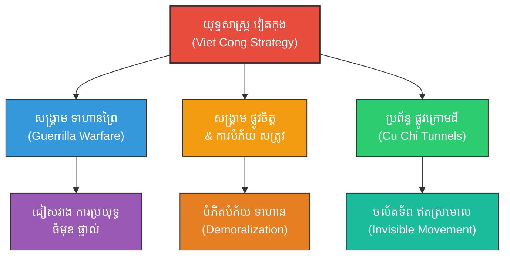

# Viet Cong Strategy (យុទ្ធសាស្ត្រសង្គ្រាមវៀតណាម៖ របៀបដែលឧត្តមសេនីយ៍ វ៉ូ ង្វៀនយ៉ាប យកឈ្នះមហាអំណាច)

**Author:** ichamrong  
**Date:** 2026-05-27  
**Tags:** #vietcong #strategy #vonguyengiap #vietnamwar #suntzu #military #asymmetrical #philosophy #psychology  
**Category:** Biographies / Related / Military  
**Read Time:** ~20 min  

---

## 📌 មាតិកា (Table of Contents)
- [សេចក្តីផ្តើម៖ កាយវិភាគវិទ្យានៃយុទ្ធសាស្ត្រមិនស្មើភាព (Introduction: Asymmetric Strategy Anatomy)](#intro)
- [១. ទស្សនៈវិភាគ និងបរិបទប្រវត្តិសាស្ត្រ (Perspective & Historical Context)](#context)
- [២. 🏛️ [គ្រឹះទស្សនវិជ្ជា] / [Philosophical Core] - ទស្សនវិជ្ជាស្នូល៖ តាវនិយមផ្អែកលើធាតុដី និងការរលាយចូលធម្មជាតិ (The Philosophical Core: Earth-Centric Daoism & Nature Integration)](#philosophical-core)
- [៣. 🧠 [យន្តការចិត្តសាស្ត្រ] / [Psychological Mechanism] - យន្តការចិត្តសាស្ត្រ៖ ការវាយប្រហារចិត្ត និងលំអៀងចក្ខុវិស័យ (Psychological Mechanism: Mind Demoralization & Tunnel-Vision Exploitation)](#psychological-mechanisms)
- [៤. គំនូសបំរែបំរួលយុទ្ធសាស្ត្រ (Strategic Mermaid Diagram)](#diagram)
- [៥. ⚠️ [ភាពផ្ទុយគ្នា និងការរិះគន់] / [Paradoxes & Criticisms] - ភាពផ្ទុយគ្នា និងការរិះគន់ (Paradoxes & Criticisms)](#paradoxes-criticisms)
- [៦. 🚀 [មេរៀនអនុវត្ត] / [Practical Application] - តារាងប្រៀបធៀបយុទ្ធសាស្ត្រ (Strategic Comparison Table)](#comparison-table)
- [សេចក្តីសន្និដ្ឋាន (Conclusion)](#conclusion)
- [🔗 ឯកសារទាក់ទង (Related Topics)](#related-topics)
- [ឯកសារយោង (References)](#references)

---

## សេចក្តីផ្តើម៖ កាយវិភាគវិទ្យានៃយុទ្ធសាស្ត្រមិនស្មើភាព (Introduction: Asymmetric Strategy Anatomy)

> **«បើដឹងខ្លួនថាខ្លាំងជាង ត្រូវវាយលុក។ បើដឹងខ្លួនថាខ្សោយជាង ត្រូវដកថយ។ ជៀសវាងចំណុចខ្លាំងរបស់សត្រូវ វាយប្រហារចំចំណុចខ្សោយបំផុត។» — ស៊ុន អ៊ូ**  
> *(“If you know you are stronger, attack. If you know you are weaker, retreat. Avoid the enemy's strength, and strike their weakest point.” — Sun Tzu)*

សមរភូមិ Dien Bien Phu (១៩៥៤) និងសង្គ្រាមវៀតណាម (Vietnam War) គឺជាសក្ខីភាពដ៏អស្ចារ្យបំផុតនៃការយកទ្រឹស្តីស៊ុនអ៊ូមកប្រើប្រាស់ជាក់ស្តែងដោយឧត្តមសេនីយ៍ **វ៉ូ ង្វៀនយ៉ាប (Vo Nguyen Giap)**។ យល់ច្បាស់ពីចំណុចខ្លាំងរបស់បារាំងនិងអាមេរិកដែលមានអាវុធយុទ្ធោបករណ៍ទំនើប លោកបានដឹកនាំកងទ័ពវៀតកុង (Viet Cong) ឱ្យប្រើប្រាស់ដីព្រៃភ្នំ និងប្រព័ន្ធផ្លូវក្រោមដី (Cu Chi Tunnels) ដើម្បីធ្វើសង្គ្រាមវាយឆ្មក់ឥតស្រមោល ដែលជាយុទ្ធសាស្ត្រសង្គ្រាមមិនស្មើភាព (Asymmetrical Warfare)។

---

## ១. ទស្សនៈវិភាគ និងបរិបទប្រវត្តិសាស្ត្រ (Perspective & Historical Context)

សង្គ្រាមវៀតណាមគឺជាគំរូយោធាដ៏ល្បីល្បាញបំផុតនៃការយកឈ្នះរបស់កងទ័ពខ្សោយលើកងទ័ពខ្លាំង។ ឧត្តមសេនីយ៍ វ៉ូ ង្វៀនយ៉ាប ធ្លាប់បានសិក្សាយ៉ាងជ្រៅជ្រះពីក្បួនសឹករបស់ស៊ុនអ៊ូ និងយុទ្ធសាស្ត្រទាហានព្រៃរបស់ម៉ៅ សេទុង។ លោកបានយល់ឃើញថា កងទ័ពអាមេរិក និងបារាំង មានប្រៀបផ្នែកបច្ចេកវិទ្យា និងអាវុធធុនធ្ងន់ ប៉ុន្តែពួកគេមានចំណុចខ្សោយផ្នែកការចល័តទ័ពក្នុងព្រៃក្រាស់ មិនស៊ាំនឹងអាកាសធាតុ និងការភ័យខ្លាចការវាយឆ្មក់យប់ព្រលប់។

លោកបានបង្កើតយុទ្ធសាស្ត្រ «សង្គ្រាមប្រជាជន» (People's War) ដោយកៀងគរប្រជាជនគ្រប់រូបឱ្យចូលរួមចំណែកក្នុងសង្គ្រាម ធ្វើឱ្យសមរភូមិគ្មានព្រំដែនច្បាស់លាស់។ អាមេរិកមិនដឹងថានរណាជាសត្រូវពិតប្រាកដឡើយ ដែលបង្កជាសម្ពាធផ្លូវចិត្តយ៉ាងធ្ងន់ធ្ងរដល់កងទ័ពរបស់ពួកគេ។

---

## 🏛️ [គ្រឹះទស្សនវិជ្ជា] / [Philosophical Core] - ទស្សនវិជ្ជាស្នូល៖ តាវនិយមផ្អែកលើធាតុដី និងការរលាយចូលធម្មជាតិ (The Philosophical Core: Earth-Centric Daoism & Nature Integration)

យុទ្ធសាស្ត្រវៀតកុងគឺជាឧទាហរណ៍ជាក់ស្តែងនៃការអនុវត្ត **ទស្សនវិជ្ជាតាវនិយម (Daoism)** ផ្អែកលើកត្តាភូមិសាស្ត្រ និងភាពទន់បត់បែនដូចទឹក៖

### ក. ការរលាយចូលជាធ្លុងមួយជាមួយធម្មជាតិ (Formless Merging)
*   **Earth Element (ធាតុដី):** កងទ័ពវៀតកុងមិនព្យាយាមផ្លាស់ប្តូរធម្មជាតិ ឬប្រយុទ្ធប្រឆាំងនឹងព្រៃឈើដ៏ក្រាស់នោះឡើយ។ ផ្ទុយទៅវិញ ពួកគេលាក់ខ្លួន និងធ្វើដំណើរតាមប្រព័ន្ធផ្លូវក្រោមដី (Cu Chi Tunnels)។ ពួកគេរលាយចូលទៅក្នុងព្រៃឈើ ភក់ និងភ្នំ ធ្វើខ្លួនឱ្យគ្មានរូបរាង (*Formless / 无形*)។
*   **ទឹកបត់បែន (Water Fluidity):** ពួកគេប្រើជីវិតរស់នៅបែបសាមញ្ញ និងប្រើធម្មជាតិធ្វើជាខែលការពារខ្លួនពីគ្រាប់បែកទំនើបៗ។

### ខ. ការប្រើប្រាស់ «ភាពទទេ» នៃកម្លាំងសត្រូវ
នៅពេលអាមេរិកបញ្ជូនកម្លាំងធំចូលព្រៃ វៀតកុងនឹងដកថយភ្លាមៗ ធ្វើឱ្យអាមេរិកវាយចំ «ភាពទទេស្អាត» (Xu / 虚)។ នៅពេលអាមេរិកដកកម្លាំងចេញវិញ ឬធ្វេសប្រហែស វៀតកុងនឹងវាយលុកចំចំណុចខ្សោយ និងទំហំកម្លាំងពិត (Shi / 实)។ នេះជាតុល្យភាពយុទ្ធសាស្ត្រយិនយ៉ាងដ៏ល្អឥតខ្ចោះ។

> [!TIP]
> **គន្លឹះយុទ្ធសាស្ត្រ (Strategic Daoist Takeaway):**
> នៅក្នុងការប្រកួតប្រជែងមិនស្មើភាព ចូរកុំព្យាយាមប្រឈមមុខនឹងកម្លាំងបច្ចេកវិទ្យា ឬលុយកាក់ដ៏ច្រើនលើសលប់របស់ដៃគូប្រកួតឡើយ។ ចូររំលាយខ្លួនចូលទៅក្នុងប្រព័ន្ធភូមិសាស្ត្រ និងតម្រូវការទីផ្សារលាក់កំបាំង រួចវាយលុកចេញពីកន្លែងដែលសត្រូវស្មានមិនដល់។

---

## 🧠 [យន្តការចិត្តសាស្ត្រ] / [Psychological Mechanism] - យន្តការចិត្តសាស្ត្រ៖ ការវាយប្រហារចិត្ត និងលំអៀងចក្ខុវិស័យ (Psychological Mechanism: Mind Demoralization & Tunnel-Vision Exploitation)

ឧត្តមសេនីយ៍ វ៉ូ ង្វៀនយ៉ាប បានយកឈ្នះកងទ័ពអាមេរិកនៅលើ «សមរភូមិផ្លូវចិត្ត» ដោយប្រើប្រាស់យន្តការចិត្តសាស្ត្រកម្រិតខ្ពស់៖

### ក. Demoralization & Cognitive Attrition (ការវាយប្រហារស្មារតី)
*   **ការប្រើប្រាស់អន្ទាក់៖** ការប្រើអន្ទាក់ឫស្សី (Punji sticks) ឬអន្ទាក់ផ្ទុះកម្រិតទាប មិនមែនធ្វើឡើងដើម្បីសម្លាប់ទាហានអាមេរិកទាំងអស់នោះទេ ប៉ុន្តែវាបង្កើតឱ្យមាន **លំអៀងនៃការភ័យខ្លាច (Loss Aversion & Fear Bias)**។ 
*   **លទ្ធផលផ្លូវចិត្ត៖** រាល់ពេលដែលទាហានម្នាក់ឈានជើងដើរ ពួកគេនឹងភ័យខ្លាចការរងរបួស។ ភាពភ័យខ្លាចរ៉ាំរ៉ៃនេះធ្វើឱ្យស្មារតីរបស់ពួកគេខូចខាតទាំងស្រុង (Post-Traumatic Stress & Exhaustion) និងបង្កឱ្យមានការបាក់ទឹកចិត្តក្នុងជួរកងទ័ពយ៉ាងធ្ងន់ធ្ងរ។

### ខ. ការកេងប្រវ័ញ្ចលើលំអៀងចក្ខុវិស័យ (Tunnel-Vision Exploitation)
កងទ័ពអាមេរិកមានទំនោរផ្តោតលើតែ «បច្ចេកវិទ្យា និងចំនួនគ្រាប់បែកដែលបានទម្លាក់» ហៅថាលំអៀងចក្ខុវិស័យ (Tunnel-Vision Bias)។ វៀតកុងបានយល់ពីចំណុចនេះ ហើយបង្វែរការយកចិត្តទុកដាក់របស់អាមេរិកឱ្យផ្តោតលើចំណុចក្តៅមួយចំនួន (ដូចជាសមរភូមិ Khe Sanh) ខណៈដែលខ្លួនកំពុងរៀបចំផែនការវាយលុកទ្រង់ទ្រាយធំនៅទូទាំងប្រទេស (Tet Offensive - ១៩៦៨)។

> [!IMPORTANT]
> **មេរៀនគ្រឹះនៃការសម្រេចចិត្ត (Systemic Attrition Rule):**
> ជ័យជម្នះក្នុងស្ថានភាពសង្គ្រាមអសមកាល គឺមិនមែនស្ថិតនៅលើចំនួនគូប្រកួតដែលត្រូវបានកម្ទេចឡើយ តែវាស្ថិតនៅលើសមត្ថភាពបំបាក់ឆន្ទៈប្រយុទ្ធ (Will to Fight) និងស្មារតីរបស់គូប្រកួតទាំងស្រុង។

---

## ៤. គំនូសបំរែបំរួលយុទ្ធសាស្ត្រ (Strategic Mermaid Diagram)

---

## ⚠️ [ភាពផ្ទុយគ្នា និងការរិះគន់] / [Paradoxes & Criticisms] - ភាពផ្ទុយគ្នា និងការរិះគន់ (Paradoxes & Criticisms)

ទោះបីជាទទួលបានជោគជ័យជាប្រវត្តិសាស្ត្រក៏ដោយ ក៏យុទ្ធសាស្ត្ររបស់វៀតកុងមានភាពផ្ទុយគ្នា និងការរិះគន់យ៉ាងធ្ងន់ធ្ងរ៖

*   **តម្លៃយុទ្ធសាស្ត្រ ធៀបនឹងតម្លៃជីវិត (Strategic Victory vs. Human Cost):** ទោះបីជាវៀតកុងឈ្នះសង្គ្រាម ក៏ចំនួនទាហាន និងប្រជាជនវៀតណាមដែលបានបាត់បង់ជីវិតមានចំនួនរហូតដល់រាប់លាននាក់។ នេះផ្ទុយពីទ្រឹស្តីស៊ុនអ៊ូដែលលើកឡើងថា *«យុទ្ធសាស្ត្រល្អបំផុត គឺរក្សាជីវិតកងទ័ពខ្លួន និងសត្រូវឱ្យបានច្រើនបំផុត»*។ វាក្លាយជា «ជ័យជម្នះក្នុងតម្លៃសែនថ្លៃ» (Pyrrhic Victory)។
*   **សីលធម៌យោធា និងការរងគ្រោះរបស់ជនស៊ីវិល (Military Morality & Human Shielding):** ការប្រើប្រាស់យុទ្ធសាស្ត្រវាយឆ្មក់លាក់ខ្លួន និងការមិនបញ្ចេញអត្តសញ្ញាណ (សម្លៀកបំពាក់ស៊ីវិល) បង្កឱ្យមានការសម្លាប់ប្រជាជនស្លូតត្រង់ដោយសារការភាន់ច្រឡំ។ ការលាក់ខ្លួនក្នុងភូមិករ ធ្វើឱ្យប្រជាជនកសិករក្លាយជាខែលការពារគ្រាប់បែក។

> [!CAUTION]
> **ដែនកំណត់នៃការប្រើប្រាស់មហាជន (Limits of People's War):**
> ការបំផុសឱ្យប្រជាជនស៊ីវិលទាំងអស់ចូលរួមក្នុងសមរភូមិ អាចលុបបំបាត់បន្ទាត់ព្រំដែនរវាង «យុទ្ធជន» (Combatants) និង «ជនស៊ីវិល» (Non-combatants) ដែលផ្ទុយនឹងច្បាប់សង្គ្រាមអន្តរជាតិ និងបើកផ្លូវឱ្យមានការសម្លាប់រង្គាលយ៉ាងព្រៃផ្សៃ។

---

## 🚀 [មេរៀនអនុវត្ត] / [Practical Application] - តារាងប្រៀបធៀបយុទ្ធសាស្ត្រ (Strategic Comparison Table)

| គោលការណ៍ស៊ុនអ៊ូ (Sun Tzu's Principle) | យុទ្ធវិធីវៀតកុង (Viet Cong Tactic) | លទ្ធផលជាក់ស្តែង (Practical Result) |
| :--- | :--- | :--- |
| *«ជៀសវាងចំណុចខ្លាំង វាយចំណុចខ្សោយ»* | យុទ្ធសាស្ត្រវាយឆ្មក់ឥតស្រមោល (Hit and Run) | អាមេរិកមិនអាចប្រើប្រាស់យន្តហោះទម្លាក់គ្រាប់បែកចំគោលដៅបានឡើយ។ |
| *«ប្រើប្រាស់ដីដើម្បីប្រៀបសឹក»* | ការប្រើប្រាស់ដីព្រៃភ្នំ និងប្រព័ន្ធផ្លូវក្រោមដី | បង្កើតជាឧបសគ្គយ៉ាងធំធេងដល់ការដើរក្បួន និងចល័តទ័ពរបស់សត្រូវ។ |
| *«សីលធម៌ និងការស្របចិត្តគ្នា»* | ការកៀងគរប្រជាជនកសិករឱ្យចូលរួម | ទទួលបានបណ្តាញភ្នែកច្រមុះ និងភស្តុភារគ្រប់ទីកន្លែង។ |

---

## 🧭 ការរុករកយុទ្ធសាស្ត្រ (Strategic Navigation - Down the Rabbit Hole)
*   **[« យុទ្ធសាស្ត្រមុន (Previous Strategy)](02-mao-zedong-guerrilla-warfare.md)**
*   **[យុទ្ធសាស្ត្របន្ទាប់ (Next Strategy) »](04-business-management.md)**

---

## សេចក្តីសន្និដ្ឋាន (Conclusion)

ការយល់ដឹង និងការយកយុទ្ធសាស្ត្រសឹកអមតៈរបស់ស៊ុនអ៊ូមកអនុវត្តជាក់ស្តែង ជួយឱ្យយើងមានសមត្ថភាពគិតជាប្រព័ន្ធ សម្រេចចិត្តយ៉ាងត្រជាក់ចិត្ត និងចេះបត់បែនគ្រប់កាលៈទេសៈ ដើម្បីសម្រេចបានជោគជ័យ និងជ័យជម្នះអមតៈនៅក្នុងជីវិត និងការងារប្រចាំថ្ងៃ។

---

## 🔗 ឯកសារទាក់ទង (Related Topics)
*   [ជីវប្រវត្តិ ស៊ុន អ៊ូ (The Biography of Sun Tzu)](../01-sun-tzu-biography.md)
*   [សៀវភៅ The Art of War (The Art of War Book)](01-the-art-of-war.md)
*   [យុទ្ធសាស្ត្រវាយឆ្មក់របស់ ម៉ៅ សេទុង (Mao Zedong Strategy)](02-mao-zedong-guerrilla-warfare.md)

## ឯកសារយោង (References)
*   **Giap, Vo Nguyen (1962).** *People's War, People's Army*. Foreign Languages Publishing House, Hanoi.
*   **Sun, Tzu (1910).** *The Art of War*. Translated by Lionel Giles. London: Luzac & Co.
*   **Sheehan, Neil (1988).** *A Bright Shining Lie: John Paul Vann and America in Vietnam*. Random House.
*   **Lao, Tzu (1993).** *Tao Te Ching*. Translated by Stephen Mitchell. HarperPerennial.
*   **Logevall, Fredrik (2012).** *Embers of War: The Fall of an Empire and the Making of America's Vietnam*. Random House.
*   **Karnow, Stanley (1983).** *Vietnam: A History*. Viking Press.

---
*Last updated: 2026-05-27*
