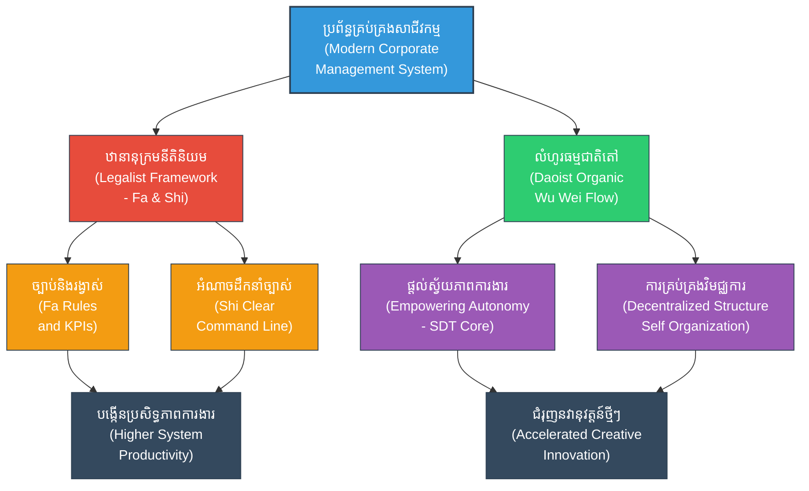

# Business Management (ការគ្រប់គ្រងអាជីវកម្ម៖ យុទ្ធសាស្ត្រស៊ុនអ៊ូក្នុងពិភពសាជីវកម្ម)

**Author:** ichamrong  
**Date:** 2026-05-27  
**Tags:** #business #management #leadership #mba #suntzu #corporate #organization  
**Category:** Biographies / Related / Business  
**Read Time:** ~15 min  

---

## 📌 មាតិកា (Table of Contents)
- [សេចក្តីផ្តើម៖ កាយវិភាគវិទ្យានៃយុទ្ធសាស្ត្រ (Introduction: Strategic Anatomy)](#intro)
- [១. ទស្សនៈវិភាគ និងបរិបទគ្រប់គ្រងទំនើប (Perspective & Modern Corporate Context)](#context)
- [២. ទស្សនវិជ្ជាស្នូល (The Philosophical Core)](#philosophical-core)
- [៣. យន្តការចិត្តសាស្ត្រ (Psychological Mechanism)](#psychological-mechanism)
- [៤. គំនូសបំរែបំរួលយុទ្ធសាស្ត្រ (Strategic Mermaid Diagram)](#diagram)
- [៥. ការផ្សារភ្ជាប់គ្នារវាងគោលការណ៍ជាក់ស្តែង និងក្បួនសឹកស៊ុនអ៊ូ (Connecting to Sun Tzu's Art of War)](#suntzu-connection)
- [៦. ភាពផ្ទុយគ្នា និងការរិះគន់ (Paradoxes & Criticisms)](#paradoxes-criticisms)
- [៧. តារាងប្រៀបធៀបយុទ្ធសាស្ត្រ (Strategic Comparison Table)](#comparison-table)
- [សេចក្តីសន្និដ្ឋាន (Conclusion)](#conclusion)
- [🔗 ឯកសារទាក់ទង (Related Topics)](#related-topics)
- [ឯកសារយោង (References)](#references)

---

## សេចក្តីផ្តើម៖ កាយវិភាគវិទ្យានៃយុទ្ធសាស្ត្រ (Introduction: Strategic Anatomy)

> **«ការគ្រប់គ្រងមនុស្សច្រើន គឺមិនខុសពីការគ្រប់គ្រងមនុស្សតិចឡើយ វាអាស្រ័យលើការរៀបចំរចនាសម្ព័ន្ធ និងឋានានុក្រមដឹកនាំច្បាស់លាស់។» — ស៊ុន អ៊ូ**

នៅក្នុងពិភពជំនួញដែលពោរពេញដោយការប្រកួតប្រជែងនិងផ្លាស់ប្តូរលឿន គោលការណ៍របស់ស៊ុនអ៊ូត្រូវបានយកទៅបង្រៀននៅក្នុងកម្មវិធីសិក្សាគោលសម្រាប់ថ្នាក់អនុបណ្ឌិតគ្រប់គ្រងពាណិជ្ជកម្ម (MBA) នៅទូទាំងពិភពលោក។ ការគ្រប់គ្រងសាជីវកម្មទំនើបទាមទារឱ្យមានការចាត់ចែងធនធាន និងការដឹកនាំមនុស្សប្រកបដោយប្រសិទ្ធភាពខ្ពស់បំផុត ដោយប្រើប្រាស់តុល្យភាពរវាងភាពតឹងរ៉ឹង និងការផ្តល់សិទ្ធិអំណាចសម្រេចចិត្ត។

---

## ១. ទស្សនៈវិភាគ និងបរិបទគ្រប់គ្រងទំនើប (Perspective & Modern Corporate Context)

សាជីវកម្មលំដាប់ពិភពលោកតែងតែប្រៀបប្រដូចទីផ្សារទៅនឹងសមរភូមិសឹក។ គូប្រជែងអាជីវកម្មគឺជាសត្រូវ ឯផលិតផលនិងសេវាកម្មគឺជាអាវុធយុទ្ធោបករណ៍។ អ្នកដឹកនាំក្រុមហ៊ុន (CEOs) ត្រូវដើរតួជាមេទ័ពធំដែលត្រូវរៀបចំផែនការ និងវិភាគស្ថានភាពទីផ្សារយ៉ាងល្អិតល្អន់មុននឹងបោះទុនវិនិយោគ។ 

ទោះជាយ៉ាងណា ក្នុងបរិបទអាជីវកម្មបច្ចុប្បន្ន ភាពជោគជ័យមិនត្រឹមតែផ្អែកលើការបញ្ជាពីលើចុះក្រោម (Command-and-Control) នោះទេ តែវាទាមទារនូវយន្តការគ្រប់គ្រងបែបទំនើបដែលចេះសម្របខ្លួនទៅនឹងការផ្លាស់ប្តូរឆាប់រហ័ស ដូចជាការគ្រប់គ្រងបែបវិមជ្ឈការ (Decentralized Leadership) ដែលធ្វើឱ្យបុគ្គលិកមានភាពម្ចាស់ការលើការងាររបស់ពួកគេ។

---

## ២. 🏛️ [គ្រឹះទស្សនវិជ្ជា] / [Philosophical Core] - ទស្សនវិជ្ជាស្នូល (The Philosophical Core)

การគ្រប់គ្រងសហគ្រាសប្រកបដោយភាពរស់រវើក គឺការធ្វើឱ្យមានស៊ីមេទ្រីរវាងសាលាគំនិតពីរដ៏ផ្ទុយគ្នាក្នុងប្រវត្តិសាស្ត្រចិន៖

*   **ទស្សនវិជ្ជានីតិនិយម (Legalism/Fajia - 法家):** តំណាងដោយទ្រឹស្តីរបស់ហាន ហ្វေးស៊ី (Han Feizi) ដែលផ្តោតលើគ្រឹះបីគឺ៖
    *   **ហ្វា (Fa - 法):** ច្បាប់ វិន័យ និងប្រព័ន្ធរង្វាស់តម្លៃ (KPIs) ដែលច្បាស់លាស់ មិនលំអៀង។
    *   **ស៊ូ (Shu - 術):** វិធីសាស្ត្រគ្រប់គ្រង និងការត្រួតពិនិត្យភាពស្មោះត្រង់របស់ប្រធានផ្នែក (Management Techniques)。
    *   **ស៊ី (Shi - 勢):** អំណាច និងឋានៈស្របច្បាប់របស់អ្នកដឹកនាំ ដើម្បីរក្សាសណ្តាប់ធ្នាប់សាជីវកម្ម។
*   **ទស្សនវិជ្ជាតៅនិយម (Daoism - 道家):** តំណាងដោយលំហូរធម្មជាតិ និងគំនិត **«អសកម្មសកម្ម» (Wu-Wei - 無為)**។ ទស្សនៈនេះយល់ឃើញថា សហគ្រាសគឺជាសារពាង្គកាយមានជីវិត (Organic Entity) ដែលមិនអាចគ្រប់គ្រងដោយការបង្ខិតបង្ខំគ្រប់ជំហាននោះឡើយ។ អ្នកដឹកនាំត្រូវបង្កើតបរិយាកាសអំណោយផល រួចទុកឱ្យប្រព័ន្ធដំណើរការ និងកែតម្រូវដោយខ្លួនឯងទៅតាមការប្រែប្រួលនៃទីផ្សារ។

---

## ៣. 🧠 [យន្តការចិត្តសាស្ត្រ] / [Psychological Mechanism] - យន្តការចិត្តសាស្ត្រ (Psychological Mechanism)

ចលនការនៃការដឹកនាំមនុស្សក្នុងស្ថាប័នជោគជ័យ ត្រូវបានជំរុញដោយយន្តការចិត្តសាស្ត្រសំខាន់ៗ៖

*   **ទ្រឹស្តីការកំណត់វាសនាដោយខ្លួនឯង (Self-Determination Theory - SDT):** ការជម្រុញទឹកចិត្តផ្ទៃក្នុង (Intrinsic Motivation) របស់បុគ្គលិកកើតឡើងតាមរយៈ៖
    *   **ស្វ័យភាព (Autonomy):** សេរីភាពក្នុងការសម្រេចចិត្តលើវិធីសាស្ត្របំពេញការងារ បញ្ចៀសការត្រួតពិនិត្យហួសហេតុ។
    *   **សមត្ថភាព (Competence):** អារម្មណ៍ថាខ្លួនមានការរីកចម្រើន និងអាចសម្រេចកិច្ចការលំបាកៗបាន។
    *   **ទំនាក់ទំនង (Relatedness):** អារម្មណ៍នៃការផ្សារភ្ជាប់ និងមានតម្លៃក្នុងក្រុមការងារ។
*   **ផលប៉ះពាល់ផ្លូវចិត្តនៃការគ្រប់គ្រងល្អិតល្អន់ជ្រុល (Micromanagement Trauma):** การលូកដៃគ្រប់គ្រងការងារតូចតាចពីថ្នាក់លើ នឹងកេះឱ្យមាន៖
    *   **ការផ្ទុកលើសចំណុះនៃសក្ដានុពលយល់ដឹង (Cognitive Overload):** การបារម្ភពីការចាប់កំហុស ធ្វើឱ្យថយចុះថាមពលខួរក្បាលក្នុងការច្នៃប្រឌិត។
    *   **ការរៀនទទួលយកភាពអស់សង្ឃឹម (Learned Helplessness):** នៅពេលរាល់ការសម្រេចចិត្តត្រូវបានច្រានចោល ឬកែប្រែដោយប្រធាន បុគ្គលិកនឹងឈប់គិតគំនិតថ្មីៗ ហើយរង់ចាំតែបញ្ជា។
    *   **ភាពលំអៀងផ្លូវចិត្ត/ការខ្វិននៃការសម្រេចចិត្ត (Analysis Paralysis & Tilt):** การភ័យខ្លាចនឹងបង្កជាសម្ពាធ ធ្វើឱ្យការសម្រេចចិត្តមានភាពយឺតយ៉ាវ និងបាត់បង់លំនឹងការងារ។

---

## ៤. គំនូសបំរែបំរួលយុទ្ធសាស្ត្រ (Strategic Mermaid Diagram)

---

## ៥. 🚀 [មេរៀនអនុវត្ត] / [Practical Application] - ការផ្សារភ្ជាប់គ្នារវាងគោលការណ៍ជាក់ស្តែង និងក្បួនសឹកស៊ុនអ៊ូ (Connecting to Sun Tzu's Art of War)

### ក. ឋានានុក្រម និងសញ្ញាបញ្ជា (Structure & Communication)
ស៊ុនអ៊ូបានលើកឡើងថា ការបញ្ជាទ័ពធំឱ្យមានរបៀបរៀបរយ គឺប្រើប្រាស់ «ទង់ និងស្គរ» (សញ្ញាបញ្ជា)。 ក្នុងអាជីវកម្ម នេះគឺជារចនាសម្ព័ន្ធព័ត៌មានវិទ្យា និងប្រព័ន្ធទំនាក់ទំនងផ្ទៃក្នុង (Internal Communication) ដែលជួយឱ្យបុគ្គលិកគ្រប់រូបយល់ពីគោលដៅ និងទិសដៅរបស់ក្រុមហ៊ុនបានច្បាស់លាស់។ វិន័យ និងការវាស់វែងការងារត្រូវតែរៀបចំឡើងជាប្រព័ន្ធ (Systemized) មិនមែនផ្អែកលើអារម្មណ៍បុគ្គលឡើយ។

### ខ. การជៀសវាង Micromanagement (Trust & Delegation)
> [!IMPORTANT]
> «ពេលបញ្ជាដាច់ខាតហើយ ស្តេចមិនត្រូវលូកដៃកិច្ចការរបស់មេទ័ពនៅលើសមរភូមិឡើយ»。 អ្នកដឹកនាំអាជីវកម្មឆ្លាតវៃត្រូវចេះប្រគល់សិទ្ធិសម្រេចចិត្ត (Delegation) ដល់ប្រធានផ្នែកដែលមានជំនាញជាក់ស្តែង ជៀសវាងការគ្រប់គ្រងតឹងរ៉ឹងពេកដែលធ្វើឱ្យបុគ្គលិកបាត់បង់សេរីភាពក្នុងការច្នៃប្រឌិត និងភាពជាម្ចាស់ការ (Ownership)។

---

## ៦. ⚠️ [ភាពផ្ទុយគ្នា និងការរិះគន់] / [Paradoxes & Criticisms] - ភាពផ្ទុយគ្នា និងការរិះគន់ (Paradoxes & Criticisms)

> [!WARNING]
> *   **ភាពផ្ទុយគ្នានៃការគ្រប់គ្រង និងភាពបត់បែន (The Control-Flexibility Paradox):** การរឹតបន្តឹងវិន័យតាមបែបនីតិនិយមជួយឱ្យការងារមានភាពច្បាស់លាស់ និងកាត់បន្ថយកំហុស ប៉ុន្តែវាក៏អាចសម្លាប់ស្មារតីច្នៃប្រឌិត និងការកែប្រែទាន់សភាពការណ៍ ប្រសិនបើរៀបចំច្បាប់តឹងរ៉ឹងហួសហេតុ។
> *   **ការប្រកួតប្រជែងផ្ទៃក្នុង (Internal Competition vs. Collaboration):** การជំរុញឱ្យបុគ្គលិកប្រកួតប្រជែងគ្នាខ្លាំង ដើម្បីសម្រេចបានសន្ទស្សន៍សមិទ្ធកម្មការងារ (KPIs) អាចបង្កើនលទ្ធផលការងារក្នុងរយៈពេលខ្លី ប៉ុន្តែវាអាចបំផ្លាញស្មារតីសហការជាក្រុម (Teamwork) និងបង្កើតជាបរិយាកាសការងារពុល (Toxic Workplace Culture) ក្នុងរយៈពេលវែង។
> *   **ដែនកំណត់នៃវិមជ្ឈការ (Decentralization Limits):** ទោះបីជាការផ្តល់ស្វ័យភាពជំរុញទឹកចិត្តក៏ដោយ តែការខ្វះប្រព័ន្ធតាមដាន និងការណែនាំពីថ្នាក់ដឹកនាំកណ្តាល អាចបង្កជាភាពវឹកវរ និងកង្វះសមកាលកម្មរវាងនាយកដ្ឋាននីមួយៗ (Silo Effect)។

---

## ៧. តារាងប្រៀបធៀបយុទ្ធសាស្ត្រ (Strategic Comparison Table)

| គោលការណ៍ស៊ុនអ៊ូ (Sun Tzu's Principle) | របៀបគ្រប់គ្រងអាជីវកម្ម (Business Management Style) | លទ្ធផលជាក់ស្តែង (Practical Result) |
| :--- | :--- | :--- |
| *«ការរៀបចំឋានានុក្រមដឹកនាំ»* | การបង្កើតរចនាសម្ព័ន្ធការងារច្បាស់លាស់ និង KPI នីតិនិយម | ជួយសម្រួលដល់ដំណើរការការងារ កាត់បន្ថយការយឺតយ៉ាវ និងការសម្រេចចិត្តលឿន។ |
| *«ស្តេចមិនលូកដៃកិច្ចការមេទ័ព»* | การចាត់តាំងការងារ និងការផ្តល់ Autonomy (SDT) | បង្កើនទំនុកចិត្ត ភាពច្នៃប្រឌិត និងការទទួលខុសត្រូវរបស់បុគ្គលិក។ |
| *«វិន័យតឹងរ៉ឹង តែមានមេត្តា»* | การបង្កើតវប្បធម៌ការងារដ៏រឹងមាំ និងយកចិត្តទុកដាក់លើបុគ្គលិក | រក្សាបាននូវបុគ្គលិកឆ្នើម បង្កើនភាពស្មោះត្រង់ និងកាត់បន្ថយអត្រាលាឈប់។ |

---

## 🧭 ការរុករកយុទ្ធសាស្ត្រ (Strategic Navigation - Down the Rabbit Hole)
*   **[« យុទ្ធសាស្ត្រមុន (Previous Strategy)](03-viet-cong-strategy.md)**
*   **[យុទ្ធសាស្ត្របន្ទាប់ (Next Strategy) »](05-romance-of-the-three-kingdoms.md)**

---

## សេចក្តីសន្និដ្ឋាន (Conclusion)

🚀 การគ្រប់គ្រងអាជីវកម្មប្រកបដោយជោគជ័យ និងចីរភាព មិនមែនកើតឡើងតាមរយៈការប្រើប្រាស់អំណាចផ្តាច់ការ ឬការបណ្តោយតាមយថាកម្មឡើយ។ វាគឺជាតុល្យភាពដ៏វិសេសវិសាលរវាងរចនាសម្ព័ន្ធច្បាស់លាស់បែបនីតិនិយម (Legalist Order) និងការបត់បែនលំហូរធម្មជាតិបែបតៅនិយម (Daoist Flow)។ តាមរយៈការយល់ដឹងពីចិត្តសាស្ត្ររបស់បុគ្គលិក និងការផ្តល់ស្វ័យភាពសមស្រប អ្នកដឹកនាំអាចកសាងអង្គភាពមួយដ៏រឹងមាំ មិនត្រឹមតែអាចទប់ទល់នឹងព្យុះនៃទីផ្សារប៉ុណ្ណោះទេ ថែមទាំងអាចលូតលាស់ដោយស្វ័យប្រវត្តទៀតផង។

---

## 🔗 ឯកសារទាក់ទង (Related Topics)
*   [ជីវប្រវត្តិ ស៊ុន អ៊ូ (The Biography of Sun Tzu)](../01-sun-tzu-biography.md)
*   [សៀវភៅ The Art of War (The Art of War Book)](01-the-art-of-war.md)
*   [យុទ្ធសាស្ត្រវាយឆ្មក់របស់ ម៉ៅ សេទុង (Mao Zedong Strategy)](02-mao-zedong-guerrilla-warfare.md)

## ឯកសារយោង (References)
*   **Deci, E. L., & Ryan, R. M.** (2000). *The "What" and "Why" of Goal Pursuits: Human Needs and the Self-Determination of Behavior*. Psychological Inquiry, 11(4), 227-268.
*   **Han Feizi** (Transl. Burton Watson, 2003). *Han Feizi: Basic Writings*. Columbia University Press.
*   **Lao Tzu** (Transl. Stephen Mitchell, 1988). *Tao Te Ching*. Harper & Row.
*   **Sun Tzu** (Transl. Lionel Giles, 1910). *The Art of War*. British Museum.
*   **McNeilly, Mark.** (2012). *Sun Tzu and the Art of Business: Six Strategic Principles for Managers*. Oxford University Press.
*   **Modern Strategic Applications and Case Studies Analysis** (2026 Edition).

---
*Last updated: 2026-05-27*
