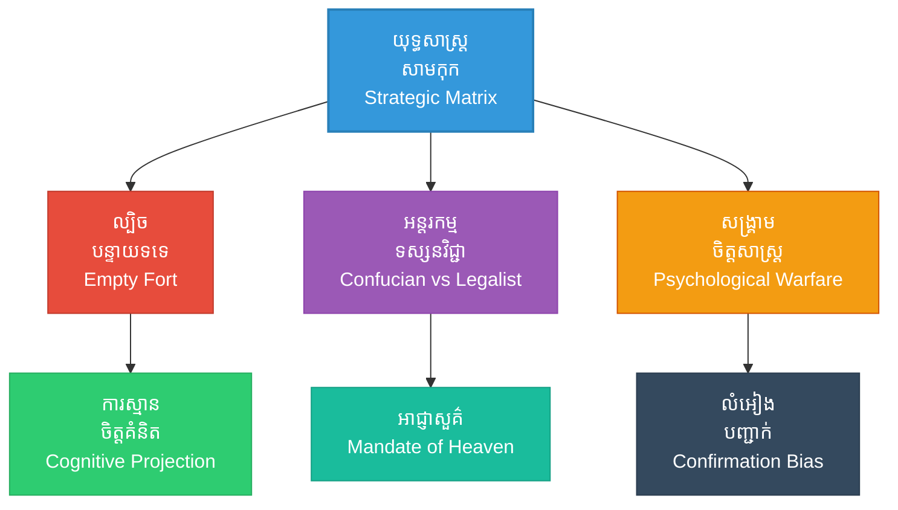

# Romance of the Three Kingdoms (សង្គ្រាមរបស់សាមកុក៖ ល្បែងយុទ្ធសាស្ត្ររបស់ខុងមិញ និងឆាវឆាវ)

**Author:** ichamrong  
**Date:** 2026-05-27  
**Tags:** #threekingdoms #zhugeliang #caocao #suntzu #artofwar #strategy #classics  
**Category:** Biographies / Related / Classics  
**Read Time:** ~15 min  

---

## 📌 មាតិកា (Table of Contents)
- [សេចក្តីផ្តើម៖ កាយវិភាគវិទ្យានៃយុទ្ធសាស្ត្រ (Introduction: Strategic Anatomy)](#intro)
- [១. ទស្សនៈវិភាគ និងបរិបទប្រវត្តិសាស្ត្រ (Perspective & Context Analysis)](#context)
- [២. 🏛️ [គ្រឹះទស្សនវិជ្ជា] ទស្សនវិជ្ជាស្នូល (The Philosophical Core)](#philosophy-core)
- [៣. 🧠 [យន្តការចិត្តសាស្ត្រ] យន្តការចិត្តសាស្ត្រ (Psychological Mechanism)](#psychological-mechanism)
- [៤. 📊 គំនូសបំរែបំរួលយុទ្ធសាស្ត្រ (Strategic Mermaid Diagram)](#diagram)
- [៥. 🚀 [មេរៀនអនុវត្ត] ការផ្សារភ្ជាប់គ្នារវាងគោលការណ៍ជាក់ស្តែង និងក្បួនសឹកស៊ុនអ៊ូ (Connecting to Sun Tzu's Art of War)](#suntzu-connection)
- [៦. ⚠️ [ភាពផ្ទុយគ្នា និងការរិះគន់] ភាពផ្ទុយគ្នា និងការរិះគន់ (Paradoxes & Criticisms)](#paradoxes-criticisms)
- [៧. តារាងប្រៀបធៀបយុទ្ធសាស្ត្រ (Strategic Comparison Table)](#comparison-table)
- [សេចក្តីសន្និដ្ឋាន (Conclusion)](#conclusion)
- [🔗 ឯកសារទាក់ទង (Related Topics)](#related-topics)
- [ឯកសារយោង (References)](#references)

---

## សេចក្តីផ្តើម៖ កាយវិភាគវិទ្យានៃយុទ្ធសាស្ត្រ (Introduction: Strategic Anatomy)

> **«យុទ្ធសាស្ត្រកំពូល គឺការវាយបំបែកផែនការ និងល្បិចកលរបស់សត្រូវតាំងពីពួកគេមិនទាន់ធ្វើសកម្មភាព។» — ស៊ុន អ៊ូ**

ប្រលោមលោកប្រវត្តិសាស្ត្រ **«សាមកុក» (Romance of the Three Kingdoms)** គឺជាសមរភូមិនៃខួរក្បាល និងយុទ្ធសាស្ត្រដ៏រស់រវើកបំផុតនៅក្នុងប្រវត្តិសាស្ត្រចិន។ តួអង្គសំខាន់ៗដូចជា **ជូកឺ លៀង (ខុងមិញ)** និង **ឆាវ ឆាវ** គឺជាអ្នកអនុវត្ត និងកែច្នៃទ្រឹស្តីស៊ុនអ៊ូយ៉ាងស្ទាត់ជំនាញបំផុត ដើម្បីបង្កើតជាសមរភូមិដ៏គួរឱ្យជក់ចិត្ត។

> [!IMPORTANT]
> **មេរៀនគ្រឹះ (Core Maxim):**
> ជ័យជម្នះក្នុងសមរភូមិសាមកុក មិនមែនកើតឡើងពីកម្លាំងបាយសុទ្ធសាធនោះទេ ប៉ុន្តែជាលទ្ធផលនៃការដណ្តើមយកប្រៀបខាងផ្លូវចិត្ត ភាពត្រឹមត្រូវនៃសីលធម៌នយោបាយ និងការប្រើប្រាស់ធនធានធម្មជាតិប្រកបដោយប្រសិទ្ធភាព។

---

## ១. ទស្សនៈវិភាគ និងបរិបទប្រវត្តិសាស្ត្រ (Perspective & Context Analysis)

ក្នុងសម័យកាលសាមកុក ប្រទេសចិនត្រូវបានបែងចែកជាបីរដ្ឋធំៗគឺ វី (Wei), ស៊ូ (Shu), និង អ៊ូ (Wu)។ រដ្ឋវីរបស់ឆាវឆាវមានទំហំធំ និងមានប្រៀបខាងកម្លាំងទ័ព ឯរដ្ឋស៊ូរបស់លីវ ប៉ី មានទំហំតូច និងខ្សត់ធនធាន។ ដើម្បីរស់រានមានជីវិត និងប្រជែងអំណាច ជូកឺ លៀង (ខុងមិញ) បានប្រើប្រាស់យុទ្ធសាស្ត្របោកបញ្ឆោត និងចិត្តសាស្ត្រកម្រិតខ្ពស់ដើម្បីការពារខ្លួន និងវាយលុកគូប្រជែង។

ឆាវ ឆាវ ខ្លួនឯងក៏ជាមេទ័ពដ៏ពូកែម្នាក់ដែលបានសរសេរពន្យល់ និងបកស្រាយក្បួនសឹកស៊ុនអ៊ូជាលើកដំបូងបង្អស់ ដែលជួយឱ្យទ្រឹស្តីនេះត្រូវបានរក្សាទុកយ៉ាងត្រឹមត្រូវរហូតដល់បច្ចុប្បន្ន។

---

## ២. 🏛️ [គ្រឹះទស្សនវិជ្ជា] ទស្សនវិជ្ជាស្នូល (The Philosophical Core)

យុទ្ធសាស្ត្រនៅក្នុងសាមកុកមិនមែនគ្រាន់តែជាល្បិចកលនៅលើសមរភូមិប៉ុណ្ណោះទេ ប៉ុន្តែវាត្រូវបានចាក់ឫសយ៉ាងជ្រៅនៅក្នុងមនោគមវិជ្ជា និងសាលាទស្សនវិជ្ជាចិនបុរាណ៖

### ក. អាជ្ញាសួគ៌ (Mandate of Heaven - 天命)
យោងទៅតាមទស្សនវិជ្ជាចិនបុរាណ អធិរាជគ្រប់គ្រងផែនដីបានដោយសារតែទទួលបាន «អាជ្ញាសួគ៌» (Mandate of Heaven)។ នៅពេលដែលរាជវង្សហានចុះខ្សោយ និងពោរពេញដោយអំពើពុករលួយ យុទ្ធសាស្ត្ររបស់តួអង្គនីមួយៗគឺដើម្បីទាមទារភាពស្របច្បាប់ (Legitimacy) នេះ៖
*   **លីវ ប៉ី និង ខុងមិញ:** តំណាងឱ្យមនោគមវិជ្ជាស្តាររាជវង្សហានឡើងវិញ ដោយផ្អែកលើការយល់ឃើញថា ពួកគាត់មានឈាមជ័ររាជវង្ស និងមានគុណធម៌ស្របតាមអាជ្ញាសួគ៌ (Confucian Heaven's Will)។
*   **ឆាវ ឆាវ:** បង្ហាញពីលក្ខណៈជាក់ស្តែងនិយម (Pragmatism) ដោយការ «ក្តោបក្តាប់អធិរាជ ដើម្បីបញ្ជាពួកមហាក្សត្រត្រឡប់មកវិញ» (Holding the Emperor to vassal kings) ដែលជាការយកភាពស្របច្បាប់របស់អាជ្ញាសួគ៌មកធ្វើជាឧបករណ៍នយោបាយកម្រិតខ្ពស់។

### ខ. ភក្ដីភាពបែបខុងជឺ ធៀបនឹង មហិច្ឆតាបែបនីតិនិយម (Confucian Loyalty vs. Legalist Ambition)
ការប៉ះទង្គិចគ្នានៃមនោគមវិជ្ជាទាំងពីរនេះបង្កើតបានជាចំណុចរបត់យុទ្ធសាស្ត្រដ៏ធំ៖
*   **ទស្សនវិជ្ជាខុងជឺ (Confucianism):** ផ្តោតលើ *«គុណធម៌» (Ren)* និង *«ភក្ដីភាព» (Loyalty)*។ លីវ ប៉ី ប្រើប្រាស់គុណធម៌នេះដើម្បីទាក់ទាញបេះដូងប្រជាជន និងអ្នកប្រាជ្ញ ស្របតាមគោលការណ៍របស់ស៊ុនអ៊ូដែលថា «សីលធម៌» (Moral Law/Tao) គឺជាកត្តាដំបូងបង្អស់នៃជ័យជម្នះ។
*   **ទស្សនវិជ្ជានីតិនិយម (Legalism/Fajia):** ផ្តោតលើ *«អំណាច» (Shi)*, *«ច្បាប់» (Fa)*, និង *«យុទ្ធវិធី» (Shu)*។ ឆាវ ឆាវ និងមេទ័ពរបស់លោកអនុវត្តច្បាប់ និងវិន័យយ៉ាងតឹងរ៉ឹង មិនគិតពីខ្សែស្រឡាយ ឬសីលធម៌ប្រពៃណីឡើយ ប៉ុន្តែផ្តោតលើប្រសិទ្ធភាពជាក់ស្តែង និងការសម្រេចគោលដៅ។

> [!TIP]
> **គន្លឹះយុទ្ធសាស្ត្រ (Strategic Tip):**
> ក្នុងការដឹកនាំទំនើប ការផ្សំគ្នារវាងការកសាងម៉ាកសញ្ញាដោយគុណធម៌ (Confucian Tao) និងការរៀបចំរចនាសម្ព័ន្ធប្រតិបត្តិការដោយច្បាប់វិន័យ (Legalist System) គឺជាគន្លឹះបង្កើតស្ថិរភាពរយៈពេលវែង។

---

## ៣. 🧠 [យន្តការចិត្តសាស្ត្រ] យន្តការចិត្តសាស្ត្រ (Psychological Mechanism)

សមរភូមិសាមកុកគឺជាឧទាហរណ៍ជាក់ស្តែងនៃការធ្វើសង្គ្រាមចិត្តសាស្ត្រ ដែលប្រើប្រាស់កម្រិតខួរក្បាលរបស់សត្រូវមកវាយបកសត្រូវវិញ៖

### ក. ការស្មានចិត្តគំនិតកម្រិតខ្លាំង (Extreme Cognitive Projection)
នៅក្នុង **«ល្បិចបន្ទាយទទេ» (Empty Fort Strategy)** ខុងមិញមិនបានប្រើប្រាស់កម្លាំងទ័ពពិតប្រាកដឡើយ ប៉ុន្តែប្រើប្រាស់ការយល់ដឹងពីបុគ្គលិកលក្ខណៈ និងវិធីសាស្ត្រគិតរបស់គូប្រជែង (ស៊ីម៉ា អ៊ី)។ ខុងមិញដឹងច្បាស់ថា ស៊ីម៉ា អ៊ី ជាមនុស្សមានការប្រុងប្រយ័ត្នខ្ពស់ មិនចូលចិត្តផ្សងព្រេង និងតែងតែសង្ស័យច្រើន។ តាមរយៈការអង្គុយលេងពិណយ៉ាងស្ងប់ស្ងាត់ និងបើកទ្វារបន្ទាយចំហ ខុងមិញបាន «ចាក់បញ្ចាំង» គំនិតភ័យខ្លាចទៅក្នុងខួរក្បាលរបស់ស៊ីម៉ា អ៊ី ដោយបង្ខំឱ្យលោកបង្កើតស្បៃភក់នៃការសង្ស័យនៅក្នុងចិត្តខ្លួនឯង។

### ខ. លំអៀងនៃការបញ្ជាក់ និងការជាប់គាំងនៃការវិភាគ (Confirmation Bias & Analysis Paralysis)
*   **លំអៀងនៃការបញ្ជាក់ (Confirmation Bias):** ស៊ីម៉ា អ៊ី មានការសន្មតទុកជាមុន (Prior Belief) ថាខុងមិញជាមនុស្សប្រុងប្រយ័ត្នខ្លាំង និងមិនដែលធ្វើអ្វីដោយគ្មានផែនការច្បាស់លាស់ឡើយ។ នៅពេលឃើញបន្ទាយទទេ និងខុងមិញអង្គុយលេងពិណ ព័ត៌មានដែលឃើញនេះបានចូលទៅបញ្ជាក់ពីការសន្មតទុកជាមុនរបស់គាត់ភ្លាមៗ បង្កើតបានជាលំអៀងនៃការបញ្ជាក់ ដែលធ្វើឱ្យគាត់បដិសេធលទ្ធភាពដែលថា «បន្ទាយនេះទទេរពិតប្រាកដមែន»។
*   **ការជាប់គាំងនៃការវិភាគ (Analysis Paralysis):** ភាពមិនច្បាស់លាស់ (Ambiguity) និងកង្វះព័ត៌មានពិតប្រាកដ បង្កើតឱ្យមានការភ័យខ្លាចការខាតបង់ (Loss Aversion)។ ស៊ីម៉ា អ៊ី វិភាគលើលទ្ធភាពផ្សេងៗច្រើនពេក រហូតដល់ចិត្តគំនិតត្រូវគាំង (Paralyzed) ហើយជ្រើសរើសផ្លូវដែលមានសុវត្ថិភាពបំផុត គឺការដកថយ។

---

## ៤. 📊 គំនូសបំរែបំរួលយុទ្ធសាស្ត្រ (Strategic Mermaid Diagram)

---

## ៥. 🚀 [មេរៀនអនុវត្ត] ការផ្សារភ្ជាប់គ្នារវាងគោលការណ៍ជាក់ស្តែង និងក្បួនសឹកស៊ុនអ៊ូ (Connecting to Sun Tzu's Art of War)

### ក. ល្បិចបន្ទាយទទេ (The Empty Fort Strategy)
នៅពេលកងទ័ពរបស់ស៊ីម៉ា អ៊ី លើកទ័ពរាប់សែននាក់មកឡោមព័ទ្ធ ខុងមិញមានទាហានការពារតែពីរបីនាក់ប៉ុណ្ណោះ។ លោកបានបញ្ជាឱ្យបើកទ្វារបន្ទាយធំៗ ហើយអង្គុយលេងពិណយ៉ាងស្ងប់ស្ងាត់នៅលើកំពូលបន្ទាយ។ ស៊ីម៉ា អ៊ី យល់ថាខុងមិញជាមនុស្សប្រុងប្រយ័ត្នខ្ពស់ មិនដែលធ្វើអ្វីប្រថុយប្រថានឡើយ ដូច្នេះលោកសន្និដ្ឋានថាមានទ័ពបង្កប់ រួចបញ្ជាឱ្យដកទ័ពថយជាបន្ទាន់។ នេះជាការអនុវត្តជាក់ស្តែងនៃគោលការណ៍ «ពេលខ្សោយបំផុត ត្រូវធ្វើពុតជាខ្លាំងបំផុត»។

### ខ. ការប្រើប្រាស់អាកាសធាតុ និងភូមិសាស្ត្រ (Heaven & Earth)
ក្នុងសមរភូមិទន្លេក្រហម (Battle of Red Cliffs) ខុងមិញបានគណនាដឹងពីការផ្លាស់ប្តូរទិសខ្យល់យ៉ាងត្រឹមត្រូវ ដើម្បីប្រើប្រាស់ភ្លើងវាយកម្ទេចកងទ័ពជើងទឹកដ៏ធំធេងរបស់ឆាវឆាវ ស្របតាមក្បួនស៊ុនអ៊ូត្រង់ជំពូក *«ការវាយប្រហារដោយភ្លើង»* និង *«ស្ថានភាពអាកាសធាតុ»*។

---

## ៦. ⚠️ [ភាពផ្ទុយគ្នា និងការរិះគន់] ភាពផ្ទុយគ្នា និងការរិះគន់ (Paradoxes & Criticisms)

ទោះបីជាយុទ្ធសាស្ត្រទាំងនេះមើលទៅហាក់បីដូចជាអស្ចារ្យ និងទទួលជ័យជម្នះដ៏ត្រចះត្រចង់ក៏ដោយ ក៏វាមានភាពទន់ខ្សោយ និងអាចបណ្តាលឱ្យវិនាសអន្តរាយបាន ប្រសិនបើប្រើប្រាស់ក្នុងបរិបទខុសគ្នា៖

### ក. អន្ទាក់នៃការគិតស្មុគស្មាញជ្រុល (The Cognitive Over-Sophistication Trap)
*   **ដែនកំណត់នៃ «ល្បិចបន្ទាយទទេ»:** ល្បិចនេះដំណើរការទៅបាន លុះត្រាតែគូប្រជែងគឺជាអ្នកយុទ្ធសាស្ត្រដ៏វៃឆ្លាត និងគិតច្រើនដូចជា ស៊ីម៉ា អ៊ី ប៉ុណ្ណោះ។ ប្រសិនបើគូប្រជែងជាមេទ័ពគ្មានការអប់រំ គិតខ្លី ឬមានចិត្តឆេវឆាវដែលចូលចិត្តសម្រុកចូលដោយមិនខ្វល់ពីល្បិចកល (ដូចជា លីពូ ឬ ម៉ាឆាវ) នោះពួកគេនឹងវាយសម្រុកចូលបន្ទាយភ្លាមៗ ហើយខុងមិញនឹងត្រូវចាប់ខ្លួនជាក់ជាមិនខាន។ យុទ្ធសាស្ត្រនេះមានប្រសិទ្ធភាពតែប្រឆាំងនឹង «ភាពឆ្លាតវៃ» ប៉ុន្តែបរាជ័យ (Failure) យ៉ាងធ្ងន់ធ្ងរនៅចំពោះមុខ «ភាពល្ងង់ខ្លៅដែលមិនខ្លាចស្លាប់»។

### ខ. ជម្លោះរវាងសីលធម៌ និងប្រសិទ្ធភាព (Moral-Efficiency Duality)
*   **ភាពផ្ទុយគ្នានៃគុណធម៌របស់រដ្ឋស៊ូ:** ខុងមិញព្យាយាមរក្សាភាពត្រឹមត្រូវតាមបែបខុងជឺ (Confucian moral high ground) ប៉ុន្តែនៅក្នុងការអនុវត្តជាក់ស្តែង លោកត្រូវប្រើប្រាស់ល្បិចបោកបញ្ឆោត ពិសពុល និងយុទ្ធវិធីគ្មានមេត្តាជាច្រើនដង។ ការព្យាយាមដើរលើផ្លូវពីរដែលផ្ទុយគ្នា (គុណធម៌ដ៏វិសុទ្ធ និងល្បិចសឹកដ៏ខ្មៅងងឹត) បង្កើតជាទំនាស់ផ្លូវចិត្ត និងដែនកំណត់នយោបាយ ដែលចុងក្រោយមិនអាចយកឈ្នះរដ្ឋវីដែលមានភាពជាក់ស្តែងនិយមខ្ពស់ និងផ្អែកលើការកសាងប្រព័ន្ធច្បាប់ច្បាស់លាស់។

> [!WARNING]
> **ភាពផ្ទុយគ្នា និងការរិះគន់ (Paradox & Risks):**
> ការផ្អែកខ្លាំងលើល្បិចកលបន្លំភ្នែក (Deception) បង្កើតនូវវិបត្តិទំនុកចិត្តរវាងសម្ព័ន្ធមិត្ត។ សម្ព័ន្ធភាពរវាងរដ្ឋស៊ូ និងរដ្ឋអ៊ូបានរលាយសាបសូន្យដោយសារតែការមិនទុកចិត្តគ្នា និងការលួចចាក់ពីក្រោយខ្នងដើម្បីផលប្រយោជន៍ទឹកដី។

---

## ៧. តារាងប្រៀបធៀបយុទ្ធសាស្ត្រ (Strategic Comparison Table)

| គោលការណ៍ស៊ុនអ៊ូ (Sun Tzu's Principle) | ព្រឹត្តិការណ៍សាមកុក (Three Kingdoms Event) | លទ្ធផលជាក់ស្តែង (Practical Result) | ដែនកំណត់យុទ្ធសាស្ត្រ (Strategic Boundary) |
| :--- | :--- | :--- | :--- |
| *«ពេលខ្សោយបំផុត ត្រូវធ្វើពុតជាខ្លាំង»* | ល្បិចបន្ទាយទទេរបស់ខុងមិញ | បង្ខំឱ្យកងទ័ពស៊ីម៉ា អ៊ី ដកថយដោយគ្មានការបង្ហូរឈាមទាហានម្នាក់។ | បរាជ័យភ្លាមៗ ប្រសិនបើប្រឈមមុខនឹងសត្រូវឆេវឆាវដែលមិនគិតច្រើន។ |
| *«ការបំបែកសម្ព័ន្ធភាពសត្រូវ»* | ការចងសម្ព័ន្ធមិត្តរវាងរដ្ឋស៊ូ និងរដ្ឋអ៊ូ | ទប់ទល់នឹងរដ្ឋវីដ៏មានអំណាចរបស់ឆាវឆាវបានរាប់សិបឆ្នាំ។ | ផុយស្រួយ និងងាយនឹងបែកបាក់ដោយសារតែផលប្រយោជន៍ដែនដី (ដូចការបាត់បង់ខេត្តជិញចូវ)。 |
| *«ការប្រើប្រាស់ភ្លើងជាអាវុធ»* | សមរភូមិទន្លេក្រហម (Red Cliffs) | វាយកម្ទេចកងទ័ពរាប់សែននាក់របស់ឆាវឆាវឱ្យខ្ចាត់ខ្ចាយ។ | អាស្រ័យទាំងស្រុងលើអាកាសធាតុ (កត្តាខាងក្រៅដែលមិនអាចគ្រប់គ្រងបាន ១០០%)។ |

---

## 🧭 ការរុករកយុទ្ធសាស្ត្រ (Strategic Navigation - Down the Rabbit Hole)
*   **[« យុទ្ធសាស្ត្រមុន (Previous Strategy)](04-business-management.md)**
*   **[យុទ្ធសាស្ត្របន្ទាប់ (Next Strategy) »](06-sports-psychology.md)**

---

## សេចក្តីសន្និដ្ឋាន (Conclusion)

សម័យកាលសាមកុកគឺជាសក្ខីភាពដ៏អស្ចារ្យដែលបង្ហាញថា ជ័យជម្នះមិនមែនសម្រេចបានតែដោយសារចំនួនទ័ព និងកម្លាំងបាយប៉ុណ្ណោះទេ ប៉ុន្តែអាស្រ័យលើការយល់ដឹងស៊ីជម្រៅអំពីចិត្តសាស្ត្រមនុស្ស ភាពស៊ីសង្វាក់គ្នានៃមនោគមវិជ្ជា និងសីលធម៌ដឹកនាំ។ យុទ្ធសាស្ត្ររបស់ខុងមិញ និងឆាវឆាវ គឺជាមេរៀនមាសសម្រាប់ការគិតបែបយុទ្ធសាស្ត្រក្នុងសម័យទំនើប៖ ចូរស្គាល់គំនិតគូប្រជែងឱ្យច្បាស់ជាងខ្លួនឯង ប៉ុន្តែកុំធ្លាក់ចូលទៅក្នុងអន្ទាក់នៃការគិតស្មុគស្មាញជ្រុល ដែលអាចបំផ្លាញខ្លួនឯងវិញ។

---

## 🔗 ឯកសារទាក់ទង (Related Topics)
*   [ជីវប្រវត្តិ ស៊ុន អ៊ូ (The Biography of Sun Tzu)](../01-sun-tzu-biography.md)
*   [សៀវភៅ The Art of War (The Art of War Book)](01-the-art-of-war.md)
*   [យុទ្ធសាស្ត្រវាយឆ្មក់របស់ ម៉ៅ សេទុង (Mao Zedong Strategy)](02-mao-zedong-guerrilla-warfare.md)

## ឯកសារយោង (References)
*   **Luo Guanzhong.** (14th Century). *Romance of the Three Kingdoms (三国演义)*.
*   **Sun Tzu.** *The Art of War (Translated by Lionel Giles)*.
*   **Sawyer, R. D.** (2007). *The Seven Military Classics of Ancient China*. Basic Books.
*   **Kahneman, D.** (2011). *Thinking, Fast and Slow*. Farrar, Straus and Giroux. (Applying Confirmation Bias and Analysis Paralysis to strategic warfare).
*   **de Bary, W. T.** (1999). *Sources of Chinese Tradition*. Columbia University Press. (Analyzing Confucian and Legalist dynamics in dynastic China).
*   **Tversky, A. & Kahneman, D.** (1991). *Loss Aversion in Riskless Choice: A Reference-Dependent Model*. The Quarterly Journal of Economics.

---
*Last updated: 2026-05-27*
