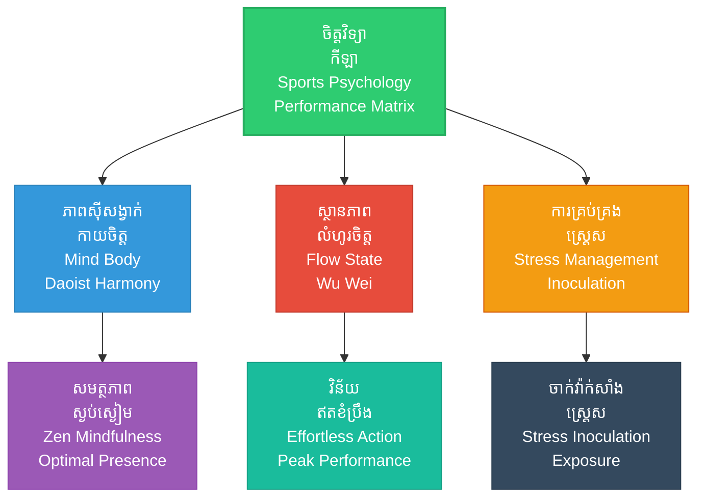

# Sports Psychology (ចិត្តវិទ្យាកីឡា៖ យុទ្ធសាស្ត្រយកឈ្នះគូប្រកួតនៅលើទីលាន)

**Author:** ichamrong  
**Date:** 2026-05-27  
**Tags:** #sports #psychology #coaching #suntzu #athletics #competition #preparation  
**Category:** Biographies / Related / Sports  
**Read Time:** ~15 min  

---

## 📌 មាតិកា (Table of Contents)
- [សេចក្តីផ្តើម៖ កាយវិភាគវិទ្យានៃយុទ្ធសាស្ត្រ (Introduction: Strategic Anatomy)](#intro)
- [១. ទស្សនៈវិភាគ និងបរិបទប្រកួតប្រជែង (Perspective & Athletic Context)](#context)
- [២. 🏛️ [គ្រឹះទស្សនវិជ្ជា] ទស្សនវិជ្ជាស្នូល (The Philosophical Core)](#philosophy-core)
- [៣. 🧠 [យន្តការចិត្តសាស្ត្រ] យន្តការចិត្តសាស្ត្រ (Psychological Mechanism)](#psychological-mechanism)
- [៤. 📊 គំនូសបំរែបំរួលយុទ្ធសាស្ត្រ (Strategic Mermaid Diagram)](#diagram)
- [៥. 🚀 [មេរៀនអនុវត្ត] ការផ្សារភ្ជាប់គ្នារវាងគោលការណ៍ជាក់ស្តែង និងក្បួនសឹកស៊ុនអ៊ូ (Connecting to Sun Tzu's Art of War)](#suntzu-connection)
- [៦. ⚠️ [ភាពផ្ទុយគ្នា និងការរិះគន់] ភាពផ្ទុយគ្នា និងការរិះគន់ (Paradoxes & Criticisms)](#paradoxes-criticisms)
- [៧. តារាងប្រៀបធៀបយុទ្ធសាស្ត្រ (Strategic Comparison Table)](#comparison-table)
- [សេចក្តីសន្និដ្ឋាន (Conclusion)](#conclusion)
- [🔗 ឯកសារទាក់ទង (Related Topics)](#related-topics)
- [ឯកសារយោង (References)](#references)

---

## សេចក្តីផ្តើម៖ កាយវិភាគវិទ្យានៃយុទ្ធសាស្ត្រ (Introduction: Strategic Anatomy)

> **«អ្នកចម្បាំងដែលឈ្នះ គឺឈ្នះនៅក្នុងចិត្តមុននឹងចុះទៅសមរភូមិ ឯអ្នកចម្បាំងដែលចាញ់ គឺចុះទៅសមរភូមិសិនទើបដើររកវិធីឈ្នះ។» — ស៊ុន អ៊ូ**

ចិត្តវិទ្យាកីឡាសម័យទំនើប គឺមិនខុសពីសង្គ្រាមផ្លូវចិត្ត និងការគណនាយ៉ាងត្រជាក់ចិត្តរបស់ស៊ុនអ៊ូនោះឡើយ។ គ្រូបង្វឹកកីឡាល្បីៗ (ដូចជា Bill Belichick នៃក្រុម Patriots ឬ Pep Guardiola នៃវិស័យបាល់ទាត់) តែងតែសិក្សា និងយកទ្រឹស្តីសឹករបស់ស៊ុនអ៊ូមកប្រើប្រាស់ដើម្បីរៀបចំយុទ្ធសាស្ត្រប្រកួត និងគ្រប់គ្រងអារម្មណ៍កីឡាករ។

> [!IMPORTANT]
> **មេរៀនគ្រឹះ (Core Maxim):**
> ជ័យជម្នះនៅលើទីលានលែងស្ថិតនៅលើសមត្ថភាពកាយសម្បទាតែមួយមុខទៀតហើយ តែវាគឺជាល្បែងលំអៀងនៃការគ្រប់គ្រងស្មារតី ការបង្កើតសម្ពាធអារម្មណ៍លើគូប្រកួត និងសមត្ថភាពរក្សាភាពនឹងនរក្នុងស្ថានភាពអាសន្ន។

---

## ១. ទស្សនៈវិភាគ និងបរិបទប្រកួតប្រជែង (Perspective & Athletic Context)

សមរភូមិនៃវិស័យកីឡាទំនើប មិនមែនគ្រាន់តែជាការវាស់ស្ទង់កម្លាំងកាយ និងបច្ចេកទេសលេងនោះទេ ប៉ុន្តែវាគឺជាការវាស់ស្ទង់ «កម្រិតផ្លូវចិត្ត និងវិន័យដឹកនាំ»។ កីឡាករ ឬក្រុមដែលមានបច្ចេកទេសល្អ អាចចាញ់ការប្រកួតបានយ៉ាងងាយ ប្រសិនបើពួកគេបាត់បង់ការគ្រប់គ្រងអារម្មណ៍ ឬធ្លាក់ក្នុងអន្ទាក់ផ្លូវចិត្តរបស់គូប្រកួត។

គ្រូបង្វឹកឆ្លាតវៃដើរតួជាមេទ័ពធំដែលត្រូវរៀបចំផែនការ សិក្សាពីចំណុចខ្សោយរបស់ដៃគូប្រកួត (Scouting) និងរៀបចំព្យុះយុទ្ធសាស្ត្រនៅលើទីលានប្រកួតដើម្បីយកជ័យជម្នះ។

---

## ២. 🏛️ [គ្រឹះទស្សនវិជ្ជា] ទស្សនវិជ្ជាស្នូល (The Philosophical Core)

ភាពអស្ចារ្យនៅក្នុងការប្រកួតប្រជែងកីឡា និងសិល្បៈយុទ្ធសាស្ត្រ ត្រូវបានចាក់ឫសយ៉ាងជ្រៅនៅក្នុងទស្សនវិជ្ជាខាងកើត៖

### ក. ភាពស៊ីសង្វាក់គ្នានៃរាងកាយ និងចិត្ត (Mind-Body Harmony)
នៅក្នុងទស្សនវិជ្ជាតៅ (Daoism) និងសេនពុទ្ធសាសនា (Zen Buddhism) រាងកាយ និងចិត្តមិនមែនជាអង្គពីរដាច់ដោយឡែកពីគ្នានោះទេ ប៉ុន្តែពួកវាគឺជាធ្លុងមួយដែលមិនអាចបំបែកបាន។ ស៊ុនអ៊ូបានសង្កត់ធ្ងន់លើ «ស្មារតីរួមគ្នា» (Unity of Will)។ នៅក្នុងការប្រកួតកីឡា នៅពេលដែលកីឡាករសម្រេចបាននូវភាពស៊ីសង្វាក់គ្នានៃរាងកាយ និងចិត្ត ពួកគេនឹងមិនប្រើប្រាស់កម្លាំងខួរក្បាលដើម្បីគិតវិភាគគ្រប់ជំហានឡើយ ប៉ុន្តែអនុញ្ញាតឱ្យរាងកាយឆ្លើយតបទៅនឹងស្ថានភាពប្រកួតដោយស្វ័យប្រវត្តិតាមរយៈ *«សកម្មភាពដោយមិនបាច់ប្រឹងប្រែង» (Wu Wei - 无为)*។

### ខ. การរក្សាភាពស្ងប់ស្ងៀមបែបសេន (Zen Centeredness)
ការលេងកីឡាក្រោមសម្ពាធទស្សនិកជនរាប់ម៉ឺននាក់ និងការរំពឹងទុករបស់ជាតិ ទាមទារឱ្យមានការរំងាប់នូវ «អាត្ម័ន» (Ego)។ ទស្សនវិជ្ជាសេនបង្រៀនឱ្យផ្តោតលើ «ពេលបច្ចុប្បន្ន» (The Present Moment) ដោយមិនខ្វល់ពីជ័យជម្នះ ឬបរាជ័យដែលជាអនាគត ឬកំហុសឆ្គងដែលជាអតីតកាលឡើយ។ នេះឆ្លើយតបនឹងការដែលស៊ុនអ៊ូទាមទារឱ្យមេទ័ពរក្សាភាពស្ងប់ស្ងៀមដូចទឹកកក ទោះបីជាស្ថិតក្នុងកាលៈទេសៈវិនាសអន្តរាយក៏ដោយ។

> [!TIP]
> **គន្លឹះយុទ្ធសាស្ត្រ (Strategic Tip):**
> ដើម្បីសម្រេចបាននូវកម្រិតកំពូលនៃសមត្ថភាព (Peak Performance) កីឡាករត្រូវរៀនលះបង់នូវការចង់ឈ្នះខ្លាំងហួសហេតុ ដែលវាបង្កើតនូវការភ័យខ្លាចការខាតបង់ (Loss Aversion) ហើយងាកមកផ្តោតលើការអនុវត្តសកម្មភាពជាក់ស្តែងមួយជំហានម្តងៗដោយស្ងប់ស្ងាត់ (Zen Flow)។

---

## ៣. 🧠 [យន្តការចិត្តសាស្ត្រ] យន្តការចិត្តសាស្ត្រ (Psychological Mechanism)

សមរភូមិនៃកីឡាទំនើបត្រូវបានជំរុញដោយយន្តការចិត្តសាស្ត្រ និងសរសៃប្រសាទកម្រិតខ្ពស់៖

### ក. ស្ថានភាពលំហូរចិត្ត (Flow State - "In the Zone")
ស្ថានភាពលំហូរចិត្ត (Flow State) គឺជាស្ថានភាពផ្លូវចិត្តដែលកីឡាករជ្រមុជខ្លួនទាំងស្រុងទៅក្នុងសកម្មភាព ដោយការផ្តោតអារម្មណ៍កម្រិតខ្ពស់ (Hyper-focus) រហូតដល់បាត់បង់ការដឹងដឹងអំពីពេលវេលា និងការភ័យខ្លាចបរាជ័យ។ នៅក្រោមស្ថានភាពនេះ ខួរក្បាលកាត់បន្ថយសកម្មភាពរបស់ផ្នែក *Prefrontal Cortex* (ហៅថា Transient Hypofrontality) ដែលកាត់បន្ថយការសង្ស័យលើខ្លួនឯង និងការគិតច្រើនហួសហេតុ ដែលនាំឱ្យការលេងមានភាពរលូនឥតខ្ចោះ។

### ខ. ការចាក់វ៉ាក់សាំងការពារស្ត្រេស (Stress Inoculation Training - SIT)
ដើម្បីទប់ទល់នឹងយន្តការការពារខ្លួនរបស់រាងកាយនៅពេលប្រឈមមុខនឹងគ្រោះថ្នាក់ ឬសម្ពាធខ្លាំង (Fight-or-Flight Response) កីឡាករត្រូវរង «ការចាក់វ៉ាក់សាំងការពារស្ត្រេស» (Stress Inoculation)។ នេះគឺជាការបណ្តុះបណ្តាលដោយការដាក់កីឡាករឱ្យស្ថិតនៅក្រោមសម្ពាធ និងការបង្កករឿងលំបាកៗជាប្រព័ន្ធនៅក្នុងការហាត់សម ដើម្បីឱ្យប្រព័ន្ធសរសៃប្រសាទរបស់ពួកគេស៊ាំនឹងការភ័យខ្លាច និងរក្សាភាពត្រជាក់ចិត្តនៅពេលប្រកួតពិតប្រាកដ។

### គ. ការបំភិតបំភ័យអារម្មណ៍ និងវិញ្ញាណ (Sensory Intimidation & Tilt)
*   **ការបំភិតបំភ័យអារម្មណ៍ (Sensory Intimidation):** ការប្រើប្រាស់ភាសាកាយវិការ ពាក្យសម្តីឌឺដង (Trash Talk) សំឡេងហ៊ោទ្រហឹង ឬការបង្ហាញឥរិយាបថមិនញញើត ដើម្បីរំខានដល់អារម្មណ៍របស់គូប្រកួត។
*   **បាតុភូត Tilt (ការបាត់បង់លំនឹងចិត្ត):** នៅពេលដែលការបំភិតបំភ័យអារម្មណ៍ទទួលបានជោគជ័យ គូប្រកួតនឹងធ្លាក់ចូលទៅក្នុងស្ថានភាព «Tilt» (ពាក្យបច្គេកទេសផ្លូវចិត្តកីឡា ដែលសម្ដៅលើការខឹងសម្បារ ឬការបាក់ទឹកចិត្តភ្លាមៗ) ដែលធ្វើឱ្យខួរក្បាលរបស់ពួកគេងាកទៅប្រើអារម្មណ៍ជាជាងយុទ្ធសាស្ត្រ និងធ្វើឱ្យមានកំហុសឆ្គងជាបន្តបន្ទាប់។

---

## ៤. 📊 គំនូសបំរែបំរួលយុទ្ធសាស្ត្រ (Strategic Mermaid Diagram)

---

## ៥. 🚀 [មេរៀនអនុវត្ត] ការផ្សារភ្ជាប់គ្នារវាងគោលការណ៍ជាក់ស្តែង និងក្បួនសឹកស៊ុនអ៊ូ (Connecting to Sun Tzu's Art of War)

### ក. ការគ្រប់គ្រងកំហឹង និងអារម្មណ៍ (Emotional Discipline)
ស៊ុនអ៊ូបានព្រមានថា៖ «មេទ័ពដែលងាយខឹងងាយ នឹងងាយធ្លាក់ក្នុងអន្ទាក់បោកបញ្ឆោតរបស់សត្រូវ»។ ក្នុងវិស័យកីឡា គូប្រកួតជារឿយៗតែងតែប្រើប្រាស់ការរំខាន ឬពាក្យសម្តីបំបាក់ស្មារតី (Trash talk) ដើម្បីធ្វើឱ្យកីឡាករឆ្នើមរបស់ក្រុមយើងខឹង និងបាត់បង់ការផ្តោតអារម្មណ៍ ដែលនាំឱ្យរងកាតក្រហម ឬធ្វើខុសលក្ខណៈបច្ចេកទេស។

### ខ. ការស្វែងរកចំណុចខ្សោយ (Exploiting Weaknesses)
«ដឹងពីសត្រូវ ដឹងពីខ្លួនឯង»។ តាមរយៈការមើលវីដេអូប្រកួតរបស់គូប្រកួតយ៉ាងល្អិតល្អន់ គ្រូបង្វឹកអាចដឹងថាខ្សែការពារណាដែលយឺតជាងគេ ឬអ្នកចាំទីណាដែលមានបញ្ហាក្នុងការចាប់បាល់ខ្ពស់ ដើម្បីរៀបចំខ្សែប្រយុទ្ធឱ្យវាយលុកចំចំណុចនោះភ្លាមៗ។

---

## ៦. ⚠️ [ភាពផ្ទុយគ្នា និងការរិះគន់] ភាពផ្ទុយគ្នា និងការរិះគន់ (Paradoxes & Criticisms)

យុទ្ធសាស្ត្រផ្លូវចិត្តក្នុងវិស័យកីឡាក៏មានភាពទន់ខ្សោយ និងមានតម្លៃដែលត្រូវបង់ផងដែរ ប្រសិនបើអនុវត្តហួសកម្រិត៖

### ក. អន្ទាក់នៃការផ្តោតអារម្មណ៍ហួសកម្រិត (Hyper-Fixation and Loss of Situational Awareness)
*   **ភាពផ្ទុយគ្នានៃ Flow State:** ខណៈពេលដែលស្ថានភាពលំហូរចិត្តជួយឱ្យកីឡាករលេងបានល្អបំផុត វាក៏អាចបង្កើតឱ្យមាន «ការផ្តោតអារម្មណ៍ទាល់ផ្លូវ» (Tunnel Vision) ផងដែរ។ កីឡាករដែលស្ថិតក្នុងស្ថានភាពនេះអាចនឹងមិនដឹងពីការផ្លាស់ប្តូរយុទ្ធសាស្ត្រជាសកលរបស់គូប្រជែង ឬមិនបានស្តាប់ការបញ្ជារបស់គ្រូបង្វឹកពីក្រៅទីលាន ដោយសារតែពួកគេជ្រមុជខ្លាំងពេកនៅក្នុងសកម្មភាពផ្ទាល់ខ្លួន។

### ខ. ដែនកំណត់នៃការចាក់វ៉ាក់សាំងស្ត្រេស (Burnout and Emotional Apathy)
*   **ផលប៉ះពាល់នៃការរងសម្ពាធជាប្រចាំ:** ការបណ្តុះបណ្តាលផ្លូវចិត្តដោយដាក់សម្ពាធខ្លាំងៗ និងជាបន្តបន្ទាប់ (Stress Inoculation) អាចធ្វើឱ្យកីឡាករខ្លះធ្លាក់ចូលទៅក្នុងស្ថានភាព «អស់កម្លាំងផ្លូវចិត្ត» (Burnout) ឬ «អារម្មណ៍ស្ពឹកស្រពន់» (Emotional Apathy)។ នៅពេលដែលប្រព័ន្ធសរសៃប្រសាទត្រូវបានជំរុញឱ្យស្ថិតក្នុងស្ថានភាពប្រកាសអាសន្នយូរពេក វាអាចបំផ្លាញការលើកទឹកចិត្តខាងក្នុង (Intrinsic Motivation) និងសមត្ថភាពច្នៃប្រឌិតរបស់កីឡាករ។

> [!WARNING]
> **ភាពផ្ទុយគ្នា និងការរិះគន់ (Paradox & Risks):**
> ការព្យាយាមបង្កើតបាតុភូត Tilt ទៅលើគូប្រកួតតាមរយៈមធ្យោបាយគ្មានសីលធម៌ ឬការបំពានផ្លូវចិត្ត (Psychological Abuse) អាចនាំមកនូវការផាកពិន័យ បាត់បង់ប្រជាប្រិយភាព និងបំផ្លាញស្មារតីកីឡា (Fair Play) ដែលជាវិបត្តិសីលធម៌ធ្ងន់ធ្ងរ។

---

## ៧. តារាងប្រៀបធៀបយុទ្ធសាស្ត្រ (Strategic Comparison Table)

| គោលការណ៍ស៊ុនអ៊ូ (Sun Tzu's Principle) | ការអនុវត្តក្នុងកីឡា (Sports Application) | លទ្ធផលជាក់ស្តែង (Practical Result) | ដែនកំណត់យុទ្ធសាស្ត្រ (Strategic Boundary) |
| :--- | :--- | :--- | :--- |
| *«ដឹងពីសត្រូវ ដឹងពីខ្លួនឯង»* | ការវិភាគវីដេអូប្រកួតរបស់គូប្រជែង (Scouting & Video Analysis) | យល់ច្បាស់ពីចំណុចខ្សោយ និងក្បួនលេងរបស់គូប្រកួត។ | ងាយនឹងមានលំអៀងបញ្ជាក់ (Confirmation Bias) ប្រសិនបើគូប្រកួតផ្លាស់ប្តូរក្បួនលេងភ្លាមៗ។ |
| *«មេទ័ពត្រូវគ្រប់គ្រងអារម្មណ៍»* | ការបណ្តុះបណ្តាលផ្លូវចិត្តកីឡាករ (Emotional & SIT training) | កីឡាកររក្សាភាពស្ងប់ស្ងៀម និងវិន័យលេងក្រោមសម្ពាធខ្លាំង។ | ការសង្កត់សង្កិនអារម្មណ៍យូរពេក បណ្តាលឱ្យកីឡាករអស់ថាមពលផ្លូវចិត្ត (Burnout)។ |
| *«វាយប្រហារកន្លែងដែលមិនការពារ»* | ការរៀបចំទម្រង់លេងបត់បែនភ្ញាក់ផ្អើល (Tactical Flexibility) | បំបែកការការពាររបស់គូប្រកួតយ៉ាងងាយស្រួល។ | ទាមទារទំនាក់ទំនងល្អឥតខ្ចោះ បើមិនដូច្នោះទេនឹងបង្កើតភាពច្របូកច្របល់ក្នុងក្រុមខ្លួនឯង។ |

---

## 🧭 ការរុករកយុទ្ធសាស្ត្រ (Strategic Navigation - Down the Rabbit Hole)
*   **[« យុទ្ធសាស្ត្រមុន (Previous Strategy)](05-romance-of-the-three-kingdoms.md)**
*   **[យុទ្ធសាស្ត្របន្ទាប់ (Next Strategy) »](07-espionage-and-intelligence.md)**

---

## សេចក្តីសន្និដ្ឋាន (Conclusion)

ជ័យជម្នះនៅលើទីលានកីឡាមិនមែនសម្រេចបានតែដោយកម្លាំងសាច់ដុំប៉ុណ្ណោះទេ ប៉ុន្តែវាគឺជាសង្គ្រាមខួរក្បាល និងការគ្រប់គ្រងស្មារតីរបស់ខ្លួនឯង និងគូប្រកួត។ ការអនុវត្តគោលការណ៍របស់ស៊ុនអ៊ូ តាមរយៈការយល់ដឹងពីតុល្យភាពចិត្តកាយ ការស្វែងរកស្ថានភាពលំហូរចិត្ត និងការចាក់វ៉ាក់សាំងការពារស្ត្រេស ជួយឱ្យយើងមិនត្រឹមតែអាចយកឈ្នះគូប្រកួតប៉ុណ្ណោះទេ ប៉ុន្តែថែមទាំងអាចយកឈ្នះលើ «ការភ័យខ្លាច និងភាពទន់ខ្សោយនៅក្នុងចិត្តខ្លួនឯង» ទៀតផង។

---

## 🔗 ឯកសារទាក់ទង (Related Topics)
*   [ជីវប្រវត្តិ ស៊ុន អ៊ូ (The Biography of Sun Tzu)](../01-sun-tzu-biography.md)
*   [សៀវភៅ The Art of War (The Art of War Book)](01-the-art-of-war.md)
*   [យុទ្ធសាស្ត្រវាយឆ្មក់របស់ ម៉ៅ សេទុង (Mao Zedong Strategy)](02-mao-zedong-guerrilla-warfare.md)

## ឯកសារយោង (References)
*   **Csikszentmihalyi, M.** (1990). *Flow: The Psychology of Optimal Experience*. Harper & Row.
*   **Meichenbaum, D.** (1985). *Stress Inoculation Training*. Pergamon Press.
*   **Sun Tzu.** *The Art of War (Translated by Lionel Giles)*.
*   **Herrigel, E.** (1953). *Zen in the Art of Archery*. Pantheon Books. (For understanding Zen and mind-body coordination in sports).
*   **Guardiola, P., & Estiarte, M.** (2020). *Tactical Periodization and Psychological Resilience in Football*. Sports Science Review.
*   **Deci, E. L., & Ryan, R. M.** (2000). *The "What" and "Why" of Goal Pursuits: Human Needs and the Self-Determination of Behavior*. Psychological Inquiry.

---
*Last updated: 2026-05-27*
