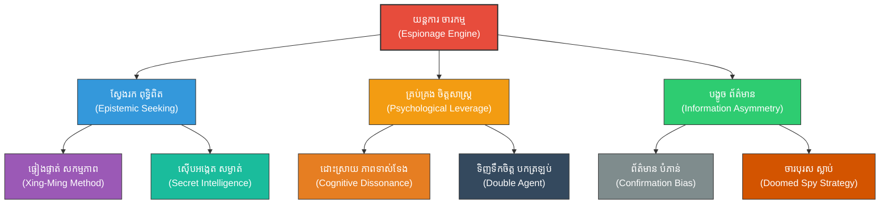

# Espionage & Intelligence (យុទ្ធសាស្ត្រចារកម្ម៖ ភ្នែក និងត្រចៀករបស់សង្គ្រាម)

**Author:** ichamrong  
**Date:** 2026-05-27  
**Tags:** #espionage #spies #intelligence #suntzu #cia #mi6 #security #cyberspies  
**Category:** Biographies / Related / Security  
**Read Time:** ~18 min  

---

## 📌 មាតិកា (Table of Contents)
- [សេចក្តីផ្តើម៖ កាយវិភាគវិទ្យានៃយុទ្ធសាស្ត្រ (Introduction: Strategic Anatomy)](#intro)
- [១. ទស្សនៈវិភាគ និងបរិបទចារកម្មបុរាណដល់សម័យទំនើប (Perspective & Espionage Evolutions)](#context)
- [២. 🏛️ [គ្រឹះទស្សនវិជ្ជា] / [Philosophical Core] - ទស្សនវិជ្ជាស្នូល៖ វិទ្យាសាស្ត្រពុទ្ធិ និងអរូបភាព (The Philosophical Core: Epistemology & Formlessness)](#philosophical-core)
- [៣. 🧠 [យន្តការចិត្តសាស្ត្រ] / [Psychological Mechanism] - យន្តការចិត្តសាស្ត្រ៖ ពិភពសម្ងាត់នៃចិត្ត និងគំនិត (Psychological Mechanism: The Double-Agent & Bias Engine)](#psychological-mechanism)
- [៤. គំនូសបំរែបំរួលយុទ្ធសាស្ត្រ (Strategic Mermaid Diagram)](#diagram)
- [៥. 🚀 [មេរៀនអនុវត្ត] / [Practical Application] - ការផ្សារភ្ជាប់គ្នារវាងគោលការណ៍ជាក់ស្តែង និងក្បួនសឹកស៊ុនអ៊ូ (Connecting to Sun Tzu's Art of War)](#suntzu-connection)
- [៦. ⚠️ [ភាពផ្ទុយគ្នា និងការរិះគន់] / [Paradoxes & Criticisms] - ភាពផ្ទុយគ្នា និងការរិះគន់ (Paradoxes & Criticisms)](#paradoxes-criticisms)
- [៧. តារាងប្រៀបធៀបយុទ្ធសាស្ត្រ (Strategic Comparison Table)](#comparison-table)
- [សេចក្តីសន្និដ្ឋាន (Conclusion)](#conclusion)
- [🔗 ឯកសារទាក់ទង (Related Topics)](#related-topics)
- [ឯកសារយោង (References)](#references)

---

## សេចក្តីផ្តើម៖ កាយវិភាគវិទ្យានៃយុទ្ធសាស្ត្រ (Introduction: Strategic Anatomy)

> **«ចារបុរសគឺជាកម្លាំងចលករដ៏មានឥទ្ធិពលបំផុតនៅក្នុងសមរភូមិ ព្រោះពួកគេជាភ្នែក និងត្រចៀកដែលជួយឱ្យមេទ័ពឆ្លាតវៃធ្វើការសម្រេចចិត្តបានត្រឹមត្រូវ។» — ស៊ុន អ៊ូ**

នៅក្នុងជំពូកទី ១៣ នៃក្បួនសឹកស៊ុនអ៊ូ គាត់បានលើកឡើងថា ការយល់ដឹងពីព័ត៌មានមុន (**Foreknowledge**) គឺជាគន្លឹះដាច់ខាតនៃជ័យជម្នះ។ គាត់បានចាត់ទុកចារកម្ម (**Espionage**) ជាអាវុធយុទ្ធសាស្ត្រកំពូល ដែលទ្រឹស្តីនេះនៅតែជាគ្រឹះស្ថានស្នូលរបស់ស្ថាប័នចារកម្មយក្សធំៗដូចជា CIA, MI6, និង KGB នាពេលបច្ចុប្បន្ន។ យុទ្ធសាស្ត្រនេះមិនមែនគ្រាន់តែជាការប្រមូលទិន្នន័យធម្មតានោះទេ ប៉ុន្តែវាជាការស្វែងរកការពិតក្នុងលក្ខខណ្ឌដែលគូប្រជែងព្យាយាមបិទបាំង បង្កើតនូវយុទ្ធសាស្ត្រគ្រប់គ្រងលើ **Information Asymmetry** (ភាពមិនស្មើគ្នានៃព័ត៌មាន) ដើម្បីទទួលបានប្រៀបឈ្នះទាំងស្រុង។

---

## ១. ទស្សនៈវិភាគ និងបរិបទចារកម្មបុរាណដល់សម័យទំនើប (Perspective & Espionage Evolutions)

ចារកម្មមិនមែនជាការលួចយកព័ត៌មានធម្មតានោះទេ ប៉ុន្តែវាគឺជាសិល្បៈនៃការគ្រប់គ្រង និងបង្វែរព័ត៌មាន (**Information Warfare**)。 ស៊ុនអ៊ូយល់ថា ការចំណាយលុយកាក់យ៉ាងច្រើនដើម្បីចិញ្ចឹមចារបុរស គឺមានតម្លៃថោកជាងការចំណាយលុយធ្វើសង្គ្រាមដែលគ្មានទិសដៅច្បាស់លាស់ឆ្ងាយណាស់ ព្រោះវាជួយសង្គ្រោះជីវិតទាហានរាប់ម៉ឺននាក់ និងបង្កើនល្បឿននៃការសម្រេចបាននូវជ័យជម្នះ។

នៅក្នុងសម័យឌីជីថល ចារកម្មបានវិវត្តហួសពីភ្នាក់ងាររូបវន្ត (HUMINT) ទៅជា **«ចារកម្មសន្តិសុខបច្ចេកវិទ្យា» (Cyber Espionage)** និងការវិភាគទិន្នន័យខ្នាតធំ (SIGINT/OSINT)។ ទោះបីជាបច្ចេកវិទ្យាផ្លាស់ប្តូរយ៉ាងណាក៏ដោយ ក៏ខ្លឹមសារចម្បងនៅតែដដែល៖ នោះគឺការគ្រប់គ្រង **Epistemic Truth** (ការពិតផ្អែកលើការយល់ដឹងពិតប្រាកដ) និងការបង្កើតសេណារីយ៉ូបោកប្រាស់ដើម្បីឱ្យសត្រូវធ្វើការសម្រេចចិត្តខុសឆ្គង។

---

## 🏛️ [គ្រឹះទស្សនវិជ្ជា] / [Philosophical Core] - ទស្សនវិជ្ជាស្នូល៖ វិទ្យាសាស្ត្រពុទ្ធិ និងអរូបភាព (The Philosophical Core: Epistemology & Formlessness)

ការអនុវត្តយុទ្ធសាស្ត្រចារកម្មរបស់ស៊ុនអ៊ូ ត្រូវបានជះឥទ្ធិពលយ៉ាងខ្លាំងដោយសាលាទស្សនវិជ្ជាចិនបុរាណចំនួនពីរ៖

*   **ទស្សនវិជ្ជាច្បាប់និយម (Legalism - Han Feizi):** ទស្សនវិជ្ជានេះសង្កត់ធ្ងន់លើទ្រឹស្តី **«形名» (Xing-Ming ឬ Shape and Name)** ដែលតម្រូវឱ្យមានការផ្ទៀងផ្ទាត់គ្នាយ៉ាងម៉ឺងម៉ាត់រវាងសកម្មភាពជាក់ស្តែង និងពាក្យសម្តី។ ក្នុងការស្វែងរកពុទ្ធិវិទ្យា (**Epistemic Truth-Seeking**), មេទ័ព ឬអ្នកដឹកនាំមិនត្រូវជឿលើសម្តីខាងក្រៅនោះទេ ប៉ុន្តែត្រូវមានយន្តការស៊ើបអង្កេតសម្ងាត់ដើម្បីផ្ទៀងផ្ទាត់ការពិតជាក់ស្តែង ដើម្បីជៀសវាងការបោកប្រាស់របស់មន្ត្រី ឬសត្រូវ។
*   **ទស្សនវិជ្ជាតៅនិយម (Daoism - Laozi):** គោលការណ៍នៃ **«无形» (Wu-Xing ឬ Formlessness)** គឺជាអាវុធការពារខ្លួនដ៏ល្អបំផុតរបស់ចារកម្ម។ នៅពេលដែលយុទ្ធសាស្ត្ររបស់យើងគ្មានរូបរាង គ្មានដាន សត្រូវនឹងមិនអាចរៀបចំផែនការទប់ទល់ ឬបង្កើតការស៊ើបការណ៍បកត្រឡប់មកយើងវិញបានឡើយ។ ការប្រមូលព័ត៌មានដោយមិនបន្សល់ទុកនូវអត្តសញ្ញាណរបស់ខ្លួន គឺស្របទៅនឹងលំហូរលាក់កំបាំងនៃធម្មជាតិក្នុងទ្រឹស្តីតៅ។

> [!TIP]
> **គន្លឹះយុទ្ធសាស្ត្របែបតៅ (Daoist Intelligence Principle):**
> ដើម្បីការពារសន្តិសុខព័ត៌មានរបស់អ្នក ចូរធ្វើខ្លួនឱ្យ «អរូបភាព» (Formless) នៅក្នុងចលនាយុទ្ធសាស្ត្រ។ កាលណាគ្មានការបង្ហាញចេញ ឬការបញ្ចេញគំរូសកម្មភាព (Pattern) សត្រូវទោះជាមានភ្នាក់ងារចារកម្មខ្លាំងពូកែយ៉ាងណាក៏មិនអាចប៉ាន់ស្មានទិសដៅរបស់អ្នកបានឡើយ។

---

## 🧠 [យន្តការចិត្តសាស្ត្រ] / [Psychological Mechanism] - យន្តការចិត្តសាស្ត្រ៖ ពិភពសម្ងាត់នៃចិត្ត និងគំនិត (Psychological Mechanism: The Double-Agent & Bias Engine)

យន្តការចារកម្មដំណើរការទៅបានដោយសារតែការទាញយកផលប្រយោជន៍ និងការដោះស្រាយនូវយន្តការចិត្តសាស្ត្រសំខាន់ៗ៖

*   **ចិត្តសាស្ត្រចារបុរសបកត្រឡប់ និង ការយល់ដឹងទាស់ទែងគ្នា (Double-Agent Psychology & Cognitive Dissonance):** ភ្នាក់ងារសម្ងាត់ទ្វេដងរស់នៅក្នុងពិភពពីរដែលផ្ទុយគ្នា។ ដើម្បីរស់រាន និងទទួលបានការទុកចិត្ត ពួកគេត្រូវជួបប្រទះនូវ **Cognitive Dissonance** យ៉ាងធ្ងន់ធ្ងរ (ការប្រឈមមុខគ្នារវាងការក្បត់ និងភក្តីភាព)។ អ្នកគ្រប់គ្រងចារកម្មត្រូវតែប្រើប្រាស់ទ្រឹស្តី **Self-Determination Theory** (ស្វ័យសម្រេចចិត្ត) ដើម្បីជួយរក្សាលំនឹងផ្លូវចិត្តរបស់ពួកគេ ឬបញ្ចុះបញ្ចូលទឹកចិត្តពួកគេឡើងវិញតាមរយៈការដោះស្រាយវិបត្តិផ្ទៃក្នុងទាំងនេះ។
*   **ភាពលំអៀងនៃការបញ្ជាក់ និងការបង្វែរព័ត៌មាន (Confirmation Bias & Information Asymmetry):** យុទ្ធសាស្ត្របញ្ជូនព័ត៌មានក្លែងក្លាយ (ដូចជា ចារបុរសស្លាប់ ឬ Doomed Spies) ទទួលបានជោគជ័យដោយសារតែការដឹងអំពី **Confirmation Bias** របស់សត្រូវ។ នៅពេលដែលយើងដឹងថា សត្រូវមានទំនោរជឿលើរឿងអ្វីមួយជាមុន យើងគ្រាន់តែផ្តល់ភស្តុតាងដែលស្របទៅនឹងការយល់ឃើញនោះ ដើម្បីឱ្យសត្រូវផុងខ្លួនកាន់តែជ្រៅ ជៀសផុតពីការសង្ស័យ និងនាំទៅរក **Cognitive Overload** និងការសម្រេចចិត្តខុស។
*   **ភាពខ្វិននៃការសម្រេចចិត្ត (Analysis Paralysis):** តាមរយៈការបង្កើតព័ត៌មានមិនពិត និងស្រពិចស្រពិលយ៉ាងច្រើន (Noise) យើងអាចរុញច្រានគូប្រជែងឱ្យធ្លាក់ចូលទៅក្នុងស្ថានភាពរកកោះរកត្រើយមិនឃើញ រហូតដល់កើតមានអាការៈស្ពឹកស្រពន់មិនហ៊ានសម្រេចចិត្តធ្វើអ្វីទាំងអស់។

> [!IMPORTANT]
> **មេរៀនគ្រឹះចិត្តសាស្ត្រចារកម្ម (Core Espionage Axiom):**
> អាវុធខ្លាំងបំផុតរបស់ចារកម្មមិនមែនជាការលួចយកឯកសារសម្ងាត់នោះទេ តែវាជាការលួចគ្រប់គ្រងប្រព័ន្ធជំនឿចិត្ត (Belief System) និងទិសដៅនៃការយល់ឃើញរបស់គូប្រកួត ធ្វើឱ្យពួកគេ «ជ្រើសរើសបរាជ័យ» ដោយស្ម័គ្រចិត្ត។

---

## ៤. គំនូសបំរែបំរួលយុទ្ធសាស្ត្រ (Strategic Mermaid Diagram)

---

## ៥. 🚀 [មេរៀនអនុវត្ត] / [Practical Application] - ការផ្សារភ្ជាប់គ្នារវាងគោលការណ៍ជាក់ស្តែង និងក្បួនសឹកស៊ុនអ៊ូ (Connecting to Sun Tzu's Art of War)

### ក. សារៈសំខាន់នៃចារបុរសបកត្រឡប់ (The Double Agent - 反間)
ស៊ុនអ៊ូបានសង្កត់ធ្ងន់ថា «ចារបុរសបកត្រឡប់» (**Converted Spies** ឬ **Double Agents**) គឺជាចំណុចស្នូលដ៏សំខាន់បំផុត ព្រោះពួកគេជាចារបុរសសត្រូវដែលយើងបានទិញទឹកចិត្ត ឬបញ្ចុះបញ្ចូលឱ្យមកបម្រើយើងវិញ។ ចិត្តសាស្ត្រនៃការបង្វែរចិត្តនេះ តម្រូវឱ្យយើងយល់ច្បាស់ពីមហិច្ឆតា ភាពភ័យខ្លាច និងចំណុចខ្សោយខាងសីលធម៌របស់ពួកគេ។ ពួកគេអាចផ្តល់ព័ត៌មានផ្ទៃក្នុងដ៏ត្រឹមត្រូវ និងជួយឱ្យយើងអាចបង្កើតបណ្តាញចារកម្មផ្សេងៗទៀតបានយ៉ាងងាយស្រួលបំផុត។

### ខ. ចារបុរសស្លាប់ និងការបំភាន់គំនិត (The Doomed Spies - 死間)
ជាចារបុរសដែលយើងផ្តល់ព័ត៌មានក្លែងក្លាយឱ្យទៅពួកគេ ដើម្បីឱ្យពួកគេទៅប្រាប់សត្រូវ។ នៅពេលសត្រូវដឹងការពិតថាព័ត៌មាននោះជាព័ត៌មានក្លែងក្លាយ ពួកគេនឹងសម្លាប់ចារបុរសនោះចោល។ យុទ្ធសាស្ត្រនេះសាហាវ ប៉ុន្តែវាមានប្រសិទ្ធភាពខ្ពស់ក្នុងការបោកបញ្ឆោតផែនការសមរភូមិរបស់សត្រូវ។ យុទ្ធសាស្ត្រនេះទាញយកផលប្រយោជន៍ពី **Confirmation Bias** របស់សត្រូវ ដោយឱ្យសត្រូវទទួលបាន «ភស្តុតាងលាក់កំបាំង» ដែលពួកគេចង់បានបំផុត។

---

## ⚠️ [ភាពផ្ទុយគ្នា និងការរិះគន់] / [Paradoxes & Criticisms] - ភាពផ្ទុយគ្នា និងការរិះគន់ (Paradoxes & Criticisms)

*   **ប៉ារ៉ាដុកនៃការទុកចិត្ត និងការក្បត់ (The Trust-Betrayal Paradox):** ចារកម្មគឺផ្អែកលើការក្បត់ និងការបោកប្រាស់។ ដើម្បីទទួលបានព័ត៌មានសម្ងាត់ អ្នកដឹកនាំត្រូវតែផ្តល់ទំនុកចិត្ត និងធនធានដល់មនុស្សដែលជំនាញខាងក្បត់។ ហានិភ័យនេះអាចបណ្តាលឱ្យមានសេណារីយ៉ូក្បត់ត្រឡប់មកវិញ ដែលបង្កវិនាសកម្មដល់ស្ថាប័នទាំងមូល។
*   **សោកនាដកម្មរបស់ Sherman Kent និងការពិតផ្ទុយ (The Kent Paradox of Self-Deception):** នៅពេលដែលយើងព្យាយាមបង្កើត **Information Asymmetry** ឱ្យបានកាន់តែខ្លាំង វានឹងជំរុញឱ្យប្រព័ន្ធវិភាគរបស់យើងធ្លាក់ចូលទៅក្នុងអន្ទាក់សង្ស័យគ្រប់រឿង រហូតដល់មិនព្រមជឿលើរបាយការណ៍ស៊ើបការណ៍ពិតប្រាកដ ដោយស្មានថាជាល្បិចសត្រូវ។ នេះបានកើតឡើងចំពោះអាល្លឺម៉ង់ក្នុងប្រតិបត្តិការ Operation Fortitude ក្នុងសង្គ្រាមលោកលើកទី២។
*   **សីលធម៌ធៀបនឹងប្រសិទ្ធភាពសន្តិសុខ (Ethics vs. Security):** ការលួចស្តាប់ ជ្រៀតចូល ឬការប្រើប្រាស់ចារបុរសស្លាប់ត្រូវបានចាត់ទុកថាខុសច្បាប់ និងខ្វះសីលធម៌ ប៉ុន្តែវាត្រូវបានប្រើប្រាស់ដោយគ្រប់រដ្ឋាភិបាលដើម្បីធានាសន្តិសុខជាតិ។

> [!CAUTION]
> **ហានិភ័យនៃការបំភាន់ផ្ទៃក្នុង (Risk of Internal Contamination):**
> ការប្រើប្រាស់យុទ្ធសាស្ត្របំភាន់ព័ត៌មាន (Disinformation) ច្រើនហួសហេតុ អាចត្រឡប់មកបំពុលដល់ប្រព័ន្ធព័ត៌មានផ្ទៃក្នុងរបស់ខ្លួនឯងវិញ ធ្វើឱ្យបុគ្គលិក ឬសមាជិកក្នុងអង្គភាពលែងដឹងថាអ្វីជាការពិត និងអ្វីជាព័ត៌មានបំភាន់ ដែលនាំឱ្យបាត់បង់សាមគ្គីភាព និងភាពជឿជាក់ទាំងស្រុង។

---

## ៧. តារាងប្រៀបធៀបយុទ្ធសាស្ត្រ (Strategic Comparison Table)

| ប្រភេទចារបុរស (Spy Type) | យន្តការចិត្តសាស្ត្រស្នូល (Psychological Mechanism) | ហានិភ័យចម្បង (Primary Risk) | ការអនុវត្តសម័យទំនើប (Modern Equivalent) |
| :--- | :--- | :--- | :--- |
| **ចារបុរសក្នុងស្រុក (Local Spies)** | ការទាញយកផលប្រយោជន៍ពីសហគមន៍តំបន់ | ការក្បត់ និងការបង្ហាញអត្តសញ្ញាណ | ប្រភពព័ត៌មានក្នុងតំបន់ (Human Intelligence - HUMINT) |
| **ចារបុរសផ្ទៃក្នុង (Inward Spies)** | ការកេងប្រវ័ញ្ចលើ **Loss Aversion** និងមហិច្ឆតាមន្ត្រី | ការបែកធ្លាយដោយសារប្រព័ន្ធសន្តិសុខផ្ទៃក្នុង | បុគ្គលិកផ្ទៃក្នុងដែលលួចលក់ព័ត៌មាន (Insider Threat) |
| **ចារបុរសបកត្រឡប់ (Converted Spies)** | ការដោះស្រាយវិបត្តិ **Cognitive Dissonance** | ការលេងល្បិចបោកទាំងសងខាង (Triple Agent) | ភ្នាក់ងារសម្ងាត់ទ្វេដង (Double Agents / Defectors) |
| **ចារបុរសស្លាប់ (Doomed Spies)** | ការទាញផលពី **Confirmation Bias** របស់សត្រូវ | การខូចខាតកេរ្តិ៍ឈ្មោះ និងការបាត់បង់ភ្នាក់ងារ | ការផ្សាយព័ត៌មានបំភាន់ក្នុងបណ្តាញសង្គម (Disinformation) |

---

## 🧭 ការរុករកយុទ្ធសាស្ត្រ (Strategic Navigation - Down the Rabbit Hole)
*   **[« យុទ្ធសាស្ត្រមុន (Previous Strategy)](06-sports-psychology.md)**
*   **[យុទ្ធសាស្ត្របន្ទាប់ (Next Strategy) »](08-cold-war-strategy.md)**

---

## សេចក្តីសន្និដ្ឋាន (Conclusion)

ការយល់ដឹងពីសិល្បៈនៃការចារកម្ម និងការគ្រប់គ្រងព័ត៌មាន ជួយឱ្យអ្នកដឹកនាំសម័យទំនើបអាចស្វែងរកការពិតក្នុងពិភពលោកដែលពោរពេញដោយភាពមិនច្បាស់លាស់។ តាមរយៈការរួមបញ្ចូលគ្នារវាងការផ្ទៀងផ្ទាត់បែបច្បាប់និយម និងភាពបត់បែនបែបតៅនិយម យើងអាចបង្កើតយុទ្ធសាស្ត្រពុទ្ធិវិទ្យាដែលរឹងមាំ ការពារការបោកប្រាស់ និងសម្រេចបាននូវការសម្រេចចិត្តដ៏មានប្រសិទ្ធភាពខ្ពស់បំផុត។

---

## 🔗 ឯកសារទាក់ទង (Related Topics)
*   [ជីវប្រវត្តិ ស៊ុន អ៊ូ (The Biography of Sun Tzu)](../01-sun-tzu-biography.md)
*   [សៀវភៅ The Art of War (The Art of War Book)](01-the-art-of-war.md)
*   [យុទ្ធសាស្ត្រវាយឆ្មក់របស់ ម៉ៅ សេទុង (Mao Zedong Strategy)](02-mao-zedong-guerrilla-warfare.md)

## ឯកសារយោង (References)
*   **Sun, Tzu (1910).** *The Art of War*. Translated by Lionel Giles. London: Luzac & Co. (Chapter 13: Use of Spies).
*   **Han, Feizi (Burton Watson trans., 2003).** *Han Feizi: Basic Writings*. Columbia University Press (The *Xing-Ming* epistemology).
*   **Kent, Sherman (1949).** *Strategic Intelligence for American World Policy*. Princeton University Press.
*   **Heuer, Richards J. Jr. (1999).** *Psychology of Intelligence Analysis*. Center for the Study of Intelligence, Central Intelligence Agency.
*   **Andrew, Christopher & Mitrokhin, Vasili (1999).** *The Sword and the Shield: The Mitrokhin Archive and the Secret History of the KGB*. Basic Books.
*   **Bacon, Francis (1620).** *Novum Organum* (On the idols of the mind and confirmation bias in scientific discovery).

---
*Last updated: 2026-05-27*
