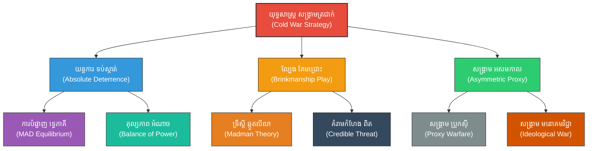

# Cold War Strategy (សង្គ្រាមកម្រិតទាប៖ ទ្រឹស្តីឈ្នះដោយមិនបាច់ច្បាំងក្នុងសម័យសង្គ្រាមត្រជាក់)

**Author:** ichamrong  
**Date:** 2026-05-27  
**Tags:** #coldwar #deterrence #containment #suntzu #geopolitics #peace #asymmetrical  
**Category:** Biographies / Related / Geopolitics  
**Read Time:** ~18 min  

---

## 📌 មាតិកា (Table of Contents)
- [សេចក្តីផ្តើម៖ កាយវិភាគវិទ្យានៃយុទ្ធសាស្ត្រ (Introduction: Strategic Anatomy)](#intro)
- [១. ទស្សនៈវិភាគ និងបរិបទភូមិសាស្ត្រនយោបាយ (Perspective & Geopolitical Context)](#context)
- [២. 🏛️ [គ្រឹះទស្សនវិជ្ជា] / [Philosophical Core] - ទស្សនវិជ្ជាស្នូល៖ ភាពប្រាកដនិយម និងការគ្រប់គ្រងស្មារតី (The Philosophical Core: Realism & Stoic Control)](#philosophical-core)
- [៣. 🧠 [យន្តការចិត្តសាស្ត្រ] / [Psychological Mechanism] - យន្តការចិត្តសាស្ត្រ៖ ទ្រឹស្តីហ្គេម និងមាត់ជ្រោះមរណៈ (Psychological Mechanism: Game Theory & Brinkmanship)](#psychological-mechanism)
- [៤. គំនូសបំរែបំរួលយុទ្ធសាស្ត្រ (Strategic Mermaid Diagram)](#diagram)
- [៥. 🚀 [មេរៀនអនុវត្ត] / [Practical Application] - ការផ្សារភ្ជាប់គ្នារវាងគោលការណ៍ជាក់ស្តែង និងក្បួនសឹកស៊ុនអ៊ូ (Connecting to Sun Tzu's Art of War)](#suntzu-connection)
- [៦. ⚠️ [ភាពផ្ទុយគ្នា និងការរិះគន់] / [Paradoxes & Criticisms] - ភាពផ្ទុយគ្នា និងការរិះគន់ (Paradoxes & Criticisms)](#paradoxes-criticisms)
- [៧. តារាងប្រៀបធៀបយុទ្ធសាស្ត្រ (Strategic Comparison Table)](#comparison-table)
- [សេចក្តីសន្និដ្ឋាន (Conclusion)](#conclusion)
- [🔗 ឯកសារទាក់ទង (Related Topics)](#related-topics)
- [ឯកសារយោង (References)](#references)

---

## សេចក្តីផ្តើម៖ កាយវិភាគវិទ្យានៃយុទ្ធសាស្ត្រ (Introduction: Strategic Anatomy)

> **«សិល្បៈកំពូលនៃសង្គ្រាម គឺការកម្ចាត់ និងបង្ខំឱ្យសត្រូវចុះចាញ់ដោយមិនចាំបាច់បង្ហូរឈាមកងទ័ពផ្ទាល់ខ្លួនឡើយ។» — ស៊ុន អ៊ូ**

សម័យកាលសង្គ្រាមត្រជាក់ (Cold War) រវាងសហរដ្ឋអាមេរិក និងសហភាពសូវៀត គឺជាសមរភូមិភូមិសាស្ត្រនយោបាយដ៏ធំធេងដែលគ្មានការប៉ះទង្គិចយោធាផ្ទាល់មុខរវាងមហាអំណាចទាំងពីរឡើយ។ ផ្ទុយទៅវិញ ពួកគេបានយកគោលការណ៍ «ឈ្នះដោយមិនបាច់ប្រយុទ្ធ» របស់ស៊ុនអ៊ូមកធ្វើជាគ្រឹះស្ថានយុទ្ធសាស្ត្ររបស់ពួកគេ។ ក្នុងយុគសម័យដែលមានការគំរាមកំហែងបំផ្លាញគ្នាទៅវិញទៅមក (**Mutually Assured Destruction - MAD**), យុទ្ធសាស្ត្រការពារទប់ស្កាត់ (**Absolute Deterrence**) និងការលេងល្បិចគែមមាត់ជ្រោះ (**Brinkmanship**) បានក្លាយជាឧបករណ៍ភូមិសាស្ត្រនយោបាយកំពូលដើម្បីពង្រីកអំណាចដោយមិនបាច់បញ្ឆេះសង្គ្រាមលោកលើកទី៣។

---

## ១. ទស្សនៈវិភាគ និងបរិបទភូមិសាស្ត្រនយោបាយ (Perspective & Geopolitical Context)

ក្រោយសង្គ្រាមលោកលើកទី២ ការលេចឡើងនៃអាវុធនុយក្លេអ៊ែរបានធ្វើឱ្យសង្គ្រាមចំមុខក្លាយជាការបំផ្លាញទ្វេភាគី (MAD)។ មហាអំណាចទាំងពីរដឹងថា ការប្រឈមមុខគ្នាដោយកម្លាំងយោធានឹងនាំមកនូវការវិនាសសូន្យសម្រាប់មនុស្សជាតិទាំងមូល។ 

ពួកគេបានប្តូរមកប្រើប្រាស់យុទ្ធសាស្ត្រការពារទប់ស្កាត់តាមរយៈអំណាចរារាំង (**Deterrence**), សង្គ្រាមប្រូកស៊ី (**Proxy Wars**), ការប្រជែងបច្ចេកវិទ្យា (Space Race) និងសង្គ្រាមព័ត៌មាន ដើម្បីបង្ខំឱ្យភាគីម្ខាងទៀតចុះខ្សោយ និងដួលរលំដោយខ្លួនឯង ស្របតាមក្បួនសឹកស៊ុនអ៊ូ។ យុទ្ធសាស្ត្រទាំងនេះដំណើរការទៅបានដោយសារតែតុល្យភាពដ៏គ្រោះថ្នាក់នៃល្បែងចិត្តសាស្ត្រ និងការគំរាមកំហែងដែលគួរឱ្យជឿជាក់។

---

## 🏛️ [គ្រឹះទស្សនវិជ្ជា] / [Philosophical Core] - ទស្សនវិជ្ជាស្នូល៖ ភាពប្រាកដនិយម និងការគ្រប់គ្រងស្មារតី (The Philosophical Core: Realism & Stoic Control)

យុទ្ធសាស្ត្រសង្គ្រាមត្រជាក់ផ្អែកលើគ្រឹះទស្សនវិជ្ជាពីរ៖

*   **ទស្សនវិជ្ជាប្រាកដនិយមបែបហបស៍ (Hobbesian Realism - Thomas Hobbes):** ទ្រឹស្តីរបស់លោក Thomas Hobbes នៅក្នុងសៀវភៅ *Leviathan* បានបញ្ជាក់ថា ស្ថានភាពធម្មជាតិរបស់មនុស្សគឺស្ថិតក្នុង «សង្គ្រាមរវាងគ្រប់គ្នាប្រឆាំងនឹងគ្រប់គ្នា» (**War of all against all**)。 ក្នុងទំនាក់ទំនងអន្តរជាតិដែលគ្មានអាជ្ញាធរកណ្តាលគ្រប់គ្រង (Anarchy), រដ្ឋនីមួយៗត្រូវតែពឹងផ្អែកលើការកសាងកម្លាំងការពារខ្លួនឯង។ **Absolute Deterrence** គឺជាលទ្ធផលទស្សនវិជ្ជានៃការបង្កើតសន្តិភាពតាមរយៈការបង្កើនការភ័យខ្លាចដល់កម្រិតអតិបរមា។
*   **ទស្សនវិជ្ជាស្តូអ៊ិក (Stoicism):** យុទ្ធសាស្ត្រ Brinkmanship (ការជំរុញសង្គ្រាមដល់គែមមាត់ជ្រោះ) តម្រូវឱ្យអ្នកដឹកនាំមានភាពស្ងប់ស្ងៀម និងគ្រប់គ្រងស្មារតីយ៉ាងដាច់ខាត ស្រដៀងទៅនឹងលទ្ធិស្តូអ៊ិក។ ការមិនចុះចាញ់នឹងអារម្មណ៍ភ័យខ្លាច ឬ **Strategic Tilt** (ការបាត់បង់លំនឹងចិត្តដោយសារសម្ពាធ) គឺជាគន្លឹះដើម្បីរក្សាភាពត្រជាក់ចិត្តនៅពេលដែលសង្គ្រាមបំផ្លាញលោកអាចកើតឡើងគ្រប់វិនាទី។

> [!TIP]
> **គន្លឹះយុទ្ធសាស្ត្របែបស្តូអ៊ិក (Stoic Strategic Principle):**
> ក្នុងវិបត្តិកម្រិតខ្ពស់ អារម្មណ៍គឺសត្រូវលាក់មុខ។ គន្លឹះដើម្បីយកឈ្នះលើ Brinkmanship គឺការរក្សាស្មារតីឱ្យនឹងធឹងដូចថ្មដាចំកណ្តាលព្យុះ ធ្វើឱ្យដៃគូប្រកួតភ័យស្លន់ស្លោ និងធ្វើការសម្រេចចិត្តថយក្រោយមុន។

---

## 🧠 [យន្តការចិត្តសាស្ត្រ] / [Psychological Mechanism] - យន្តការចិត្តសាស្ត្រ៖ ទ្រឹស្តីហ្គេម និងមាត់ជ្រោះមរណៈ (Psychological Mechanism: Game Theory & Brinkmanship)

យន្តការដែលជំរុញឱ្យយុទ្ធសាស្ត្រសង្គ្រាមត្រជាក់ដំណើរការ គឺផ្អែកលើគំរូចិត្តសាស្ត្រ និងគណិតវិទ្យា៖

*   **ទ្រឹស្តីហ្គេម និងលំនឹងណាស (Game Theory & Nash Equilibrium):** យុទ្ធសាស្ត្រ MAD គឺជាឧទាហរណ៍ជាក់ស្តែងនៃ **Nash Equilibrium** នៅក្នុងហ្គេម *Prisoner's Dilemma*។ ភាគីទាំងពីរដឹងថា ការបើកការវាយប្រហារមុននឹងនាំមកនូវការបំផ្លាញខ្លួនឯង (Loss Aversion កម្រិតកំពូល)។ ដូច្នេះ ជម្រើសដែលមានសនិទានភាពបំផុតសម្រាប់ពួកគេគឺការមិនវាយប្រហារ ប៉ុន្តែត្រូវបង្កើនការអភិវឌ្ឍអាវុធដើម្បីបំភ័យសត្រូវជានិច្ច។
*   **យន្តការ Brinkmanship និងទ្រឹស្តីឆ្កួតលីលា (The Madman Theory):** បង្កើតឡើងដោយ Thomas Schelling និងអនុវត្តដោយលោក Richard Nixon។ យន្តការនេះគំរាមគូភាគីដោយចេតនាឱ្យជឿថាខ្លួន «អាចនឹងឆ្កួតលីលា» ហ៊ានចុចប៊ូតុងនុយក្លេអ៊ែរ ប្រសិនបើសត្រូវមិនព្រមថយក្រោយ។ នេះទាញយកផលប្រយោជន៍ពី **Risk Perception** (ការវាយតម្លៃហានិភ័យ) របស់សត្រូវ ដើម្បីបង្ខំឱ្យពួកគេថយក្រោយដោយសារតែការភ័យខ្លាច។
*   **ភាពខ្វិនក្នុងការសម្រេចចិត្ត (Analysis Paralysis):** ក្នុងពេលមានវិបត្តិ (ដូចជា វិបត្តិកាំជ្រួចគុយបា), ការផ្តល់ព័ត៌មាន និងសម្ពាធពេលវេលាដ៏ខ្លី អាចរុញច្រានគូប្រជែងឱ្យធ្លាក់ចូលទៅក្នុង **Cognitive Overload** ដែលអាចធ្វើឱ្យពួកគេកើតមាន **Analysis Paralysis** ឬធ្វើការសម្រេចចិត្តខុសឆ្គងដោយសារតែការភ័យស្លន់ស្លោ។

> [!IMPORTANT]
> **មេរៀនគ្រឹះទ្រឹស្តីហ្គេម (Nash Equilibrium Axiom):**
> ក្នុងស្ថិរភាព MAD ជម្រើសដែលរក្សាសន្តិភាពបំផុតមិនមែនកើតចេញពីគុណធម៌នោះទេ តែវាជាលទ្ធផលនៃការគណនាផលប្រយោជន៍ និងការភ័យខ្លាចពីការបំផ្លាញខ្លួនឯង។

---

## ៤. គំនូសបំរែបំរួលយុទ្ធសាស្ត្រ (Strategic Mermaid Diagram)

---

## ៥. 🚀 [មេរៀនអនុវត្ត] / [Practical Application] - ការផ្សារភ្ជាប់គ្នារវាងគោលការណ៍ជាក់ស្តែង និងក្បួនសឹកស៊ុនអ៊ូ (Connecting to Sun Tzu's Art of War)

### ក. การឈ្នះដោយមិនបាច់ច្បាំង (Winning without Fighting - 伐謀)
ស៊ុនអ៊ូយល់ថា ការប្រយុទ្ធដោយបង្ហូរឈាមគឺជាជម្រើសចុងក្រោយបង្អស់។ ក្នុងសង្គ្រាមត្រជាក់ សហរដ្ឋអាមេរិកបានប្រើប្រាស់ប្រព័ន្ធសេដ្ឋកិច្ចសេរី ការទូត និងការបិទខ្ទប់សេដ្ឋកិច្ច (Containment Policy) ដើម្បីធ្វើឱ្យសេដ្ឋកិច្ចកុម្មុយនីស្តរបស់សូវៀតចុះខ្សោយ និងដួលរលំពីខាងក្នុងដោយខ្លួនឯងនៅឆ្នាំ ១៩៩១។ នេះគឺជាជ័យជម្នះកំពូលដែលស៊ុនអ៊ូធ្លាប់បានចែង៖ «ការបំផ្លាញផែនការ និងប្រព័ន្ធរបស់សត្រូវ តាំងពីមិនទាន់ចាប់ផ្តើមធ្វើសង្គ្រាម»។

### ខ. ការទប់ស្កាត់តាមរយៈភាពខ្លាំង (Deterrence - 显势)
«ពេលយើងខ្លាំង ត្រូវបង្ហាញឱ្យសត្រូវដឹងដើម្បីកុំឱ្យពួកគេហ៊ានមកវាយប្រហារ»។ ការបង្កើនសមត្ថភាពអាវុធនុយក្លេអ៊ែរ និងការធ្វើសមយុទ្ធយោធារបស់ភាគីទាំងពីរ មិនមែនដើម្បីយកទៅវាយប្រហារគ្នានោះទេ ប៉ុន្តែវាជាការបង្ហាញឥទ្ធិពលដើម្បីរារាំងគូប្រជែងមិនឱ្យហ៊ានបើកការវាយប្រហារមុន។ នេះស្របទៅនឹងគោលការណ៍បង្ខំឱ្យសត្រូវប្រុងប្រយ័ត្ន និងដកខ្លួនថយដោយខ្លួនឯង។

---

## ⚠️ [ភាពផ្ទុយគ្នា និងការរិះគន់] / [Paradoxes & Criticisms] - ភាពផ្ទុយគ្នា និងការរិះគន់ (Paradoxes & Criticisms)

*   **ប៉ារ៉ាដុកនៃសន្តិភាពតាមរយៈការបំផ្លិចបំផ្លាញ (The Peace-Destruction Paradox):** ការរក្សាសន្តិភាពសកលគឺពឹងផ្អែកទាំងស្រុងលើការគំរាមកំហែងបំផ្លាញគ្នាទៅវិញទៅមកដោយអាវុធនុយក្លេអ៊ែរ។ សន្តិភាពត្រូវបានសាងសង់លើគំនរភ្នំនៃការភ័យខ្លាច ដែលជាស្ថិរភាពដ៏ផុយស្រួយបំផុត និងមិនអាចទាយទុកជាមុនបាន។
*   **ដែនកំណត់នៃភាពសនិទានភាព និងហានិភ័យនៃ "Strategic Tilt":** ទ្រឹស្តីហ្គេម និង MAD សន្មតថាភាគីទាំងសងខាងជាមនុស្សដែលមានសនិទានភាពខ្ពស់ជានិច្ច (**Rational Actors**)。 ប៉ុន្តែ ប្រសិនបើអ្នកដឹកនាំណាម្នាក់កើតមានអាការៈភ័យខ្លាចជ្រុល (Tilt) ឬការយល់ច្រឡំលើប្រព័ន្ធរ៉ាដា (ដូចជាករណី Stanislav Petrov នៅឆ្នាំ ១៩៨៣) ពិភពលោកទាំងមូលអាចនឹងត្រូវបំផ្លាញដោយសារតែកំហុសបច្ចេកទេសតែមួយគត់។
*   **សោកនាដកម្មសង្គ្រាមប្រូកស៊ី (Proxy War Devastation):** ទោះបីជាគ្មានសង្គ្រាមផ្ទាល់រវាងមហាអំណាចទាំងពីរក៏ដោយ ក៏ប្រជាជននៅក្នុងប្រទេសទីបី (ដូចជា កូរ៉េ វៀតណាម អាហ្វហ្គានីស្ថាន និងកម្ពុជា) ត្រូវរងគ្រោះស្លាប់បាត់បង់ជីវិតរាប់លាននាក់ដោយសារតែសង្គ្រាមប្រូកស៊ីរបស់មហាអំណាចទាំងនោះ។

> [!CAUTION]
> **ហានិភ័យនៃយុទ្ធសាស្ត្រឆ្កួតលីលា (Risks of Brinkmanship):**
> យុទ្ធសាស្ត្រ Brinkmanship អាចនឹងបង្វែរជាវិនាសកម្ម ប្រសិនបើដៃគូប្រកួតសម្រេចចិត្តមិនថយក្រោយ ដោយសារតែការភ័យខ្លាចការបាត់បង់កេរ្តិ៍ឈ្មោះ ឬការយល់ច្រឡំថាខ្លួនត្រូវបានវាយប្រហារពិតប្រាកដ។

---

## ៧. តារាងប្រៀបធៀបយុទ្ធសាស្ត្រ (Strategic Comparison Table)

| គោលការណ៍ស៊ុនអ៊ូ (Sun Tzu's Principle) | យុទ្ធសាស្ត្រសង្គ្រាមត្រជាក់ (Cold War Strategy) | យន្តការចិត្តសាស្ត្រ (Psychological Mechanism) | លទ្ធផលជាក់ស្តែង (Practical Result) |
| :--- | :--- | :--- | :--- |
| **«ឈ្នះដោយមិនបាច់ប្រយុទ្ធ»** | ការបិទខ្ទប់សេដ្ឋកិច្ច និងសង្គ្រាមចិត្តសាស្ត្រ | **Loss Aversion** & ការសាបព្រោះការភ័យខ្លាច | សហភាពសូវៀតដួលរលំដោយគ្មានសង្គ្រាមធំផ្ទុះឡើង។ |
| **«បង្ហាញភាពខ្លាំងដើម្បីទប់សត្រូវ»** | ការកសាងអាវុធនុយក្លេអ៊ែរ និងសម្ព័ន្ធភាពយោធា | **Nash Equilibrium** នៃយុទ្ធសាស្ត្រ MAD | បង្កើតជាប្រព័ន្ធតុល្យភាពអំណាចសកល។ |
| **«បោកប្រាស់តាមរយៈការបំភាន់»** | យុទ្ធសាស្ត្រមាត់ជ្រោះ (**Brinkmanship**) | **Madman Theory** & ការគ្រប់គ្រងហានិភ័យ | បង្ខំឱ្យសត្រូវថយក្រោយក្នុងពេលមានវិបត្តិ (Cuban Missile Crisis)។ |

---

## 🧭 ការរុករកយុទ្ធសាស្ត្រ (Strategic Navigation - Down the Rabbit Hole)
*   **[« យុទ្ធសាស្ត្រមុន (Previous Strategy)](07-espionage-and-intelligence.md)**
*   **[យុទ្ធសាស្ត្របន្ទាប់ (Next Strategy) »](09-gaming-strategies.md)**

---

## សេចក្តីសន្និដ្ឋាន (Conclusion)

យុទ្ធសាស្ត្រសង្គ្រាមត្រជាក់បានបង្ហាញថា ការរួមបញ្ចូលគ្នារវាងការទប់ស្កាត់ដាច់ខាត (**Absolute Deterrence**) និងការគ្រប់គ្រងស្មារតីតាមបែបស្តូអ៊ិក អាចរក្សាតុល្យភាពស្ថិរភាពដ៏ស្មុគស្មាញបាន។ ទោះជាយ៉ាងណាក៏ដោយ ស្ថិរភាពនេះគឺផុយស្រួយណាស់ ដែលតម្រូវឱ្យអ្នកដឹកនាំសម័យទំនើបត្រូវយល់ច្បាស់ពីដែនកំណត់នៃទ្រឹស្តីហ្គេម ដើម្បីចៀសវាងការធ្លាក់ចូលទៅក្នុងអន្ទាក់បំផ្លាញខ្លួនឯង។

---

## 🔗 ឯកសារទាក់ទង (Related Topics)
*   [ជីវប្រវត្តិ ស៊ុន អ៊ូ (The Biography of Sun Tzu)](../01-sun-tzu-biography.md)
*   [សៀវភៅ The Art of War (The Art of War Book)](01-the-art-of-war.md)
*   [យុទ្ធសាស្ត្រវាយឆ្មក់របស់ ម៉ៅ សេទុង (Mao Zedong Strategy)](02-mao-zedong-guerrilla-warfare.md)

## ឯកសារយោង (References)
*   **Sun, Tzu (1910).** *The Art of War*. Translated by Lionel Giles. London: Luzac & Co. (Chapter 3: Attack by Stratagem).
*   **Hobbes, Thomas (1651).** *Leviathan*. Edited by Richard Tuck. Cambridge University Press.
*   **Schelling, Thomas C. (1960).** *The Strategy of Conflict*. Harvard University Press.
*   **Allison, Graham & Zelikow, Philip (1999).** *Essence of Decision: Explaining the Cuban Missile Crisis*. Longman.
*   **Petrov, Stanislav (2004).** *The Man Who Saved the World*. Documentary on the 1983 Soviet nuclear false alarm.
*   **Gaddis, John Lewis (2005).** *The Cold War: A New History*. Penguin Press.

---
*Last updated: 2026-05-27*
