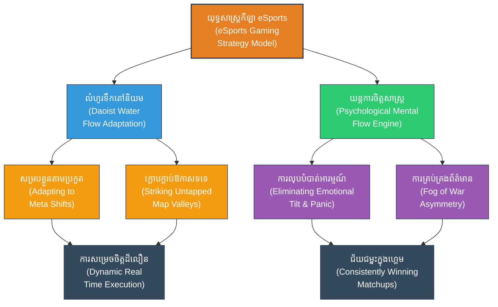

# Gaming & eSports Strategies (យុទ្ធសាស្ត្រហ្គេម និងកីឡា eSports៖ ក្បួនសឹកស៊ុនអ៊ូក្នុងសមរភូមិឌីជីថល)

**Author:** ichamrong  
**Date:** 2026-05-27  
**Tags:** #gaming #esports #strategy #suntzu #starcraft #dota2 #moba #coaching #psychology  
**Category:** Biographies / Related / Gaming  
**Read Time:** ~15 min  

---

## 📌 មាតិកា (Table of Contents)
- [សេចក្តីផ្តើម៖ កាយវិភាគវិទ្យានៃយុទ្ធសាស្ត្រ (Introduction: Strategic Anatomy)](#intro)
- [១. ទស្សនៈវិភាគ និងបរិបទហ្គេមទំនើប (Perspective & Modern eSports Context)](#context)
- [២. ទស្សនវិជ្ជាស្នូល (The Philosophical Core)](#philosophical-core)
- [៣. យន្តការចិត្តសាស្ត្រ (Psychological Mechanism)](#psychological-mechanism)
- [៤. គំនូសបំរែបំរួលយុទ្ធសាស្ត្រ (Strategic Mermaid Diagram)](#diagram)
- [៥. ការផ្សារភ្ជាប់គ្នារវាងគោលការណ៍ជាក់ស្តែង និងក្បួនសឹកស៊ុនអ៊ូ (Connecting to Sun Tzu's Art of War)](#suntzu-connection)
- [៦. ភាពផ្ទុយគ្នា និងការរិះគន់ (Paradoxes & Criticisms)](#paradoxes-criticisms)
- [៧. តារាងប្រៀបធៀបយុទ្ធសាស្ត្រ (Strategic Comparison Table)](#comparison-table)
- [សេចក្តីសន្និដ្ឋាន (Conclusion)](#conclusion)
- [🔗 ឯកសារទាក់ទង (Related Topics)](#related-topics)
- [ឯកសារយោង (References)](#references)

---

## សេចក្តីផ្តើម៖ កាយវិភាគវិទ្យានៃយុទ្ធសាស្ត្រ (Introduction: Strategic Anatomy)

> **«យុទ្ធសាស្ត្រសឹកដ៏ឆ្លាតវៃគឺត្រូវជៀសវាងកន្លែងដែលសត្រូវការពាររឹងមាំ ហើយត្រូវវាយលុកចំកន្លែងដែលសត្រូវខ្វះការការពារ។» — ស៊ុន អ៊ូ**

កីឡាអេឡិចត្រូនិក (eSports) និងហ្គេមយុទ្ធសាស្ត្រទំនើប (ដូចជា StarCraft, Dota 2, League of Legends, Mobile Legends) មិនមែនគ្រាន់តែជាការកំសាន្តធម្មតានោះទេ ប៉ុន្តែវាគឺជាសមរភូមិឌីជីថលដ៏ស្វិតស្វាញមួយដែលទាមទារនូវ **ការសម្រេចចិត្តក្នុងល្បឿនលឿនបំផុត (Real-time decision making)** ការគ្រប់គ្រងធនធាន និងការយល់ដឹងពីចិត្តសាស្ត្រគូប្រកួត។ គោលការណ៍របស់ស៊ុនអ៊ូត្រូវបានអនុវត្តជារៀងរាល់វិនាទីនៅក្នុងការប្រកួតលំដាប់អាជីព។

---

## ១. ទស្សនៈវិភាគ និងបរិបទហ្គេមទំនើប (Perspective & Modern eSports Context)

នៅក្នុងការប្រកួតប្រជែង eSports កម្រិតខ្ពស់ ជំនាញបច្ចេកទេសដៃ (Micro-mechanics) របស់កីឡាករម្នាក់ៗគឺស្ទើរតែស្មើៗគ្នា។ អ្វីដែលបង្កើតភាពខុសគ្នាដាច់ស្រឡះរវាងក្រុមឈ្នះ និងក្រុមចាញ់ គឺ **«យុទ្ធសាស្ត្រចក្ខុវិស័យម៉ាក្រូ» (Macro-strategy / Game Sense)** និងការគ្រប់គ្រងចិត្តសាស្ត្រក្រោមសម្ពាធខ្លាំង។

កីឡាករត្រូវរៀបចំយុទ្ធនាការជ្រើសរើសតួអង្គ (Drafting Phase) បង្កើតស្ថានភាពព័ត៌មានអសមកាល (Information Asymmetry) តាមរយៈការគ្រប់គ្រង «អ័ព្ទសង្គ្រាម» (Fog of War) និងស្វែងរកចន្លោះប្រហោងដើម្បីវាយឆ្មក់យកជ័យជម្នះ ស្របតាមទស្សនៈរបស់ស៊ុនអ៊ូ។

---

## 📂 ២. 🏛️ [គ្រឹះទស្សនវិជ្ជា] / [Philosophical Core] - ទស្សនវិជ្ជាស្នូល (The Philosophical Core)

ការគ្រប់គ្រងសមរភូមិឌីជីថលទាមទារការយល់ដឹងយ៉ាងជ្រៅជ្រះពីទស្សនវិជ្ជាបូព៌ា៖

*   **លំហូរទឹកបែបតៅនិយម (Daoist Water Flow - 水之法):** ស៊ុនអ៊ូសរសេរថា៖ «កងទ័ពប្រៀបដូចជាទឹក ទឹកគ្មានរូបរាងថេរឡើយ ទឹកហូរចៀសពីទីខ្ពស់ទៅកាន់ទីទាប»។
    *   **ការសម្របខ្លួនតាមស្ថានភាព (Dynamic Adaptation/Meta Adaptation):** នៅក្នុងហ្គេម គ្មានយុទ្ធសាស្ត្រណាមួយអាចប្រើឈ្នះរាល់ដងឡើយ។ ក្រុមលំដាប់ពិភពលោកត្រូវតែ «បត់បែនដូចទឹក» ផ្លាស់ប្តូររបៀបលេងទៅតាមចលនារបស់សត្រូវ (Counter-play) និងការវិវត្តនៃច្បាប់ហ្គេម (Meta Shift)។
    *   **ការវាយលុកចំណុចទទេ (Striking the Void - 虚实):** ជៀសវាងការប្រឈមមុខទល់មុខ (Direct clash) ជាមួយក្រុមសត្រូវដែលមានអត្ថប្រយោជន៍ ឬកម្រិតកម្លាំងខ្លាំងជាង។ ផ្ទុយទៅវិញ ត្រូវ «ហូរ» ទៅកាន់កន្លែងដែលសត្រូវធ្វេសប្រហែស (ដូចជាការលួចវាយបំបែកផ្ទះ/Split Push) បង្ខំឱ្យសត្រូវច្របូកច្របល់។

---

## 🧠 ៣. 🧠 [យន្តការចិត្តសាស្ត្រ] / [Psychological Mechanism] - យន្តការចិត្តសាស្ត្រ (Psychological Mechanism)

ចិត្តសាស្ត្ររបស់កីឡាករគឺជាកត្តាកំណត់លទ្ធផលនៃការប្រកួតក្រោមសម្ពាធខ្ពស់៖

*   **លទ្ធផលនៃការលំអៀងផ្លូវចិត្ត ឬការលំអៀងអារម្មណ៍ (Tilt / Emotional Volatility):** Tilt គឺជាបាតុភូតចិត្តសាស្ត្រដែលកីឡាករធ្លាក់ចូលក្នុងស្ថានភាពខឹងសម្បារ ភ័យស្លន់ស្លោ ឬបាក់ទឹកចិត្ត ក្រោយពេលធ្វើខុស ឬជួបឧបសគ្គក្នុងហ្គេម៖
    *   **ការគិតខ្វិន (Analysis Paralysis):** ការភ័យខ្លាចនឹងធ្វើឱ្យខួរក្បាលប្រើប្រាស់ថាមពលគិតហួសហេតុ ធ្វើឱ្យការសម្រេចចិត្តក្នុងល្បឿនលឿនយឺតយ៉ាវ និងខុសទិសដៅ។
    *   **Loss Aversion Framing:** ការភ័យខ្លាចនឹងការបាត់បង់ពិន្ទុ ឬចាញ់ បង្ខំឱ្យកីឡាករលេងដោយភាពភ័យខ្លាចខ្លាំង រហូតដល់មិនហ៊ានបង្កើតឱកាសវាយបក និងបាត់បង់ភាពច្នៃប្រឌិត។
*   **ស្ថានភាពលំហូរចិត្តសាស្ត្រ (Flow State / Hyper-focus):** ស្ថានភាពដែលកីឡាករមានការផ្តោតអារម្មណ៍កម្រិតខ្ពស់បំផុត រវាងរាងកាយ និងចិត្តដំណើរការរួមគ្នាជាធ្លុងមួយដោយស្វ័យប្រវត្ត។ ដើម្បីចូលទៅក្នុង Flow State កីឡាករត្រូវរៀនគ្រប់គ្រងការដកដង្ហើម និងការលុបបំបាត់អារម្មណ៍ក្រៅហ្គេម (Stoic Mindfulness)។

---

## ៤. គំនូសបំរែបំរួលយុទ្ធសាស្ត្រ (Strategic Mermaid Diagram)

---

## ៥. 🚀 [មេរៀនអនុវត្ត] / [Practical Application] - ការផ្សារភ្ជាប់គ្នារវាងគោលការណ៍ជាក់ស្តែង និងក្បួនសឹកស៊ុនអ៊ូ (Connecting to Sun Tzu's Art of War)

### ក. ការគ្រប់គ្រងព័ត៌មាន និងការបោកបញ្ឆោត (Information Control & Deception)
ស៊ុនអ៊ូបង្រៀនថា៖ «សង្គ្រាមទាំងអស់គឺផ្អែកលើការបោកបញ្ឆោត»។ នៅក្នុងហ្គេម MOBA ដូចជា Dota 2 ក្រុមការងារប្រើប្រាស់ **«Wards» (ភ្នែកទិព្វ)** ដើម្បីបើកផែនទី និងគ្រប់គ្រងចលនាសត្រូវ។ ការធ្វើពុតជាដកថយ ឬការបោះជំរុំស្ទាក់វាយឆ្មក់ក្នុងអ័ព្ទ (Smoke of Deceit) គឺជាការអនុវត្តជាក់ស្តែងនៃការបោកបញ្ឆោត ដើម្បីបង្កើតការយល់ច្រឡំដល់សត្រូវ និងដណ្តើមយកជ័យជម្នះដោយងាយស្រួល។

### ខ. ការគ្រប់គ្រងស្ថានភាពផ្លូវចិត្តសត្រូវ (Manipulating Enemy Emotions)
> [!IMPORTANT]
> «បើសត្រូវឆេវឆាវ ត្រូវធ្វើពុតជាចុះញ៉ម ដើម្បីបង្កើនភាពក្រអឺតក្រទមរបស់ពួកគេ រួចវាយប្រហារពេលពួកគេធ្វេសប្រហែស»។ ក្នុង eSports នេះគឺការប្រើប្រាស់បច្ចេកទេសផ្លូវចិត្ត (Mind Games) ដូចជា ការលេងឌឺដងក្នុងហ្គេម (Chat Wheels, Emotes) ដើម្បីជម្រុញឱ្យគូប្រជែងខឹងសម្បារ (Tilt) ដែលធ្វើឱ្យពួកគេបាត់បង់ការវិនិច្ឆ័យដ៏ត្រឹមត្រូវ និងសម្រេចចិត្តខុសឆ្គង។

---

## ៦. ⚠️ [ភាពផ្ទុយគ្នា និងការរិះគន់] / [Paradoxes & Criticisms] - ភាពផ្ទុយគ្នា និងការរិះគន់ (Paradoxes & Criticisms)

> [!WARNING]
> *   **ភាពផ្ទុយគ្នានៃស្ថិរភាព និងការច្នៃប្រឌិត (The Meta-Innovation Paradox):** ការពឹងផ្អែកតែទៅលើរបៀបលេងដែលពេញនិយមនិងមានសុវត្ថិភាពបំផុតក្នុងសម័យកាល (Meta) ជួយរក្សាស្ថិរភាពក្រុម ប៉ុន្តែវាកាត់បន្ថយភាពច្នៃប្រឌិតយុទ្ធសាស្ត្រថ្មីៗ។ ក្រុមដែលចេះបង្កើតយុទ្ធសាស្ត្រប្លែកៗ (Pocket Strat) តែងតែអាចបង្កើតការភ្ញាក់ផ្អើល និងវាយបំបាក់ Meta ចាស់បានយ៉ាងងាយ។
> *   **ហានិភ័យនៃការលេងបែបគ្មានរូបរាង (Formless Play Overextension):** ការព្យាយាមបត់បែន និងវាយឆ្មក់គេចពីការប្រយុទ្ធខ្លាំងពេក អាចធ្វើឱ្យក្រុមការងារបាត់បង់ការគ្រប់គ្រងគោលដៅធំ (Objectives) នាំទៅរកការខាតបង់ធនធាន និងចាញ់ការប្រកួត ប្រសិនបើសត្រូវដឹងទាន់ និងបង្ខំឱ្យលេងក្បួនសឹកវាយលុកចំមុខ។

---

## ៧. តារាងប្រៀបធៀបយុទ្ធសាស្ត្រ (Strategic Comparison Table)

| គោលការណ៍ស៊ុនអ៊ូ (Sun Tzu's Principle) | យុទ្ធសាស្ត្រកីឡា eSports (eSports Gaming Strategy) | លទ្ធផលជាក់ស្តែង (Practical Result) |
| :--- | :--- | :--- |
| *« All warfare is based on deception »* | ការប្រើប្រាស់ Smoke of Deceit ឬលាក់ខ្លួនក្នុងអ័ព្ទសង្គ្រាម | វាយឆ្មក់គូប្រកួតពីខាងក្រោយ បង្កើតការភ្ញាក់ផ្អើល និងដណ្តើមយកជ័យជម្នះ។ |
| *« ជៀសកន្លែងពេញ វាយកន្លែងទទេ »* | ការលួចវាយបំបែកផ្ទះ (Split Push) ពេលសត្រូវចេញឆ្ងាយ | គ្រប់គ្រងល្បឿនហ្គេម បង្ខំឱ្យសត្រូវដកថយមកការពារជំរំផ្ទាល់ខ្លួន។ |
| *« បើសត្រូវងាយខឹង ត្រូវធ្វើឱ្យគេខឹង »* | ការប្រើប្រាស់ Mind Games ដើម្បីបំបែកអារម្មណ៍គូប្រកួត | បង្ខំឱ្យគូប្រកួតធ្លាក់ចូលក្នុងស្ថានភាព Tilt និងធ្វើការសម្រេចចិត្តខុសឆ្គង។ |

---

## 🧭 ការរុករកយុទ្ធសាស្ត្រ (Strategic Navigation - Down the Rabbit Hole)
*   **[« យុទ្ធសាស្ត្រមុន (Previous Strategy)](08-cold-war-strategy.md)**
*   **[យុទ្ធសាស្ត្របន្ទាប់ (Next Strategy) »](10-diplomacy-strategy.md)**

---

## សេចក្តីសន្និដ្ឋាន (Conclusion)

🚀 ពិភព eSports គឺជាភស្តុតាងជាក់ស្តែងដែលបង្ហាញថា ទោះបីជាពេលវេលាកន្លងផុតទៅរាប់ពាន់ឆ្នាំ និងបច្ចេកវិទ្យាវិវត្តលឿនយ៉ាងណាក៏ដោយ ក៏ក្បួនសឹកចិត្តសាស្ត្ររបស់ស៊ុនអ៊ូនៅតែរស់រវើក និងមានឥទ្ធិពលបំផុត។ ជ័យជម្នះនៅក្នុងការប្រកួតកម្រិតពិភពលោក មិនមែនជារបស់អ្នកដែលដៃលឿនបំផុតនោះទេ ប៉ុន្តែជារបស់អ្នកដែលចេះគ្រប់គ្រងស្មារតីខ្លួនឯង រក្សាភាពស្ងប់ស្ងៀម (Stoic Mind) និងចេះសម្របខ្លួនដូចទឹក (Daoist Adaptability) ដើម្បីយកឈ្នះចិត្តសាស្ត្រគូប្រជែង។

---

## 🔗 ឯកសារទាក់ទង (Related Topics)
*   [ជីវប្រវត្តិ ស៊ុន អ៊ូ (The Biography of Sun Tzu)](../01-sun-tzu-biography.md)
*   [សៀវភៅ The Art of War (The Art of War Book)](01-the-art-of-war.md)
*   [យុទ្ធសាស្ត្រវាយឆ្មក់របស់ ម៉ៅ សេទុង (Mao Zedong Strategy)](02-mao-zedong-guerrilla-warfare.md)

## ឯកសារយោង (References)
*   **Cain, Susan.** (2012). *Quiet: The Power of Introverts in a World That Can't Stop Talking*. Crown Publishing.
*   **Csikszentmihalyi, M.** (1990). *Flow: The Psychology of Optimal Experience*. Harper & Row.
*   **Lao Tzu** (Transl. Stephen Mitchell, 1988). *Tao Te Ching*. Harper & Row.
*   **Sun Tzu** (Transl. Lionel Giles, 1910). *The Art of War*. British Museum.
*   **Loehr, James E.** (1986). *Mental Toughness Training for Sports: Achieving Athletic Excellence*. Plume.
*   **Strategic eSports Systems and Psychology in Digital Arenas** (2026 Edition).

---
*Last updated: 2026-05-27*
