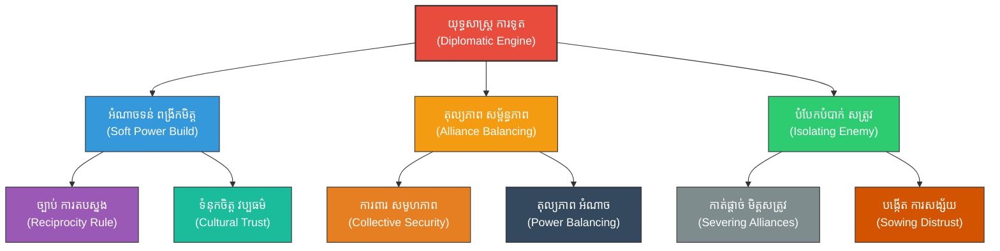

# Diplomacy Strategy (យុទ្ធសាស្ត្រការទូត៖ សិល្បៈនៃការចរចា និងការបង្កើតសម្ព័ន្ធមិត្ត)

**Author:** ichamrong  
**Date:** 2026-05-27  
**Tags:** #diplomacy #geopolitics #negotiation #alliances #suntzu #peace #treaty  
**Category:** Biographies / Related / Geopolitics  
**Read Time:** ~18 min  

---

## 📌 មាតិកា (Table of Contents)
- [សេចក្តីផ្តើម៖ កាយវិភាគវិទ្យានៃយុទ្ធសាស្ត្រ (Introduction: Strategic Anatomy)](#intro)
- [១. ទស្សនៈវិភាគ និងបរិបទការទូត (Perspective & Diplomatic Context)](#context)
- [២. 🏛️ [គ្រឹះទស្សនវិជ្ជា] / [Philosophical Core] - ទស្សនវិជ្ជាស្នូល៖ តុល្យភាពរវាងមេត្តាធម៌ និងប្រាកដនិយម (The Philosophical Core: Confucian Harmony vs. Realpolitik)](#philosophical-core)
- [៣. 🧠 [យន្តការចិត្តសាស្ត្រ] / [Psychological Mechanism] - យន្តការចិត្តសាស្ត្រ៖ ច្បាប់នៃការតបស្នង និងឥទ្ធិពលក្រុម (Psychological Mechanism: Reciprocity & In-Group Dynamics)](#psychological-mechanism)
- [៤. គំនូសបំរែបំរួលយុទ្ធសាស្ត្រ (Strategic Mermaid Diagram)](#diagram)
- [៥. 🚀 [មេរៀនអនុវត្ត] / [Practical Application] - ការផ្សារភ្ជាប់គ្នារវាងគោលការណ៍ជាក់ស្តែង និងក្បួនសឹកស៊ុនអ៊ូ (Connecting to Sun Tzu's Art of War)](#suntzu-connection)
- [៦. ⚠️ [ភាពផ្ទុយគ្នា និងការរិះគន់] / [Paradoxes & Criticisms] - ភាពផ្ទុយគ្នា និងការរិះគន់ (Paradoxes & Criticisms)](#paradoxes-criticisms)
- [៧. តារាងប្រៀបធៀបយុទ្ធសាស្ត្រ (Strategic Comparison Table)](#comparison-table)
- [សេចក្តីសន្និដ្ឋាន (Conclusion)](#conclusion)
- [🔗 ឯកសារទាក់ទង (Related Topics)](#related-topics)
- [ឯកសារយោង (References)](#references)

---

## សេចក្តីផ្តើម៖ កាយវិភាគវិទ្យានៃយុទ្ធសាស្ត្រ (Introduction: Strategic Anatomy)

> **«យុទ្ធសាស្ត្រកំពូលទីពីរក្នុងសង្គ្រាម គឺការកាត់ផ្តាច់ និងបំផ្លាញសម្ព័ន្ធភាពទាក់ទងរបស់សត្រូវជាមួយរដ្ឋដទៃទៀត។» — ស៊ុន អ៊ូ**

ការទូតគឺជាសមរភូមិយុទ្ធសាស្ត្រដែលគ្មានការបង្ហូរឈាម។ នៅក្នុងពិភពភូមិសាស្ត្រនយោបាយ គោលការណ៍របស់ស៊ុនអ៊ូត្រូវបានយកទៅប្រើប្រាស់ដើម្បីបង្កើតតុល្យភាពអំណាច បង្កើតសម្ព័ន្ធភាពរឹងមាំ និងចរចាដោះស្រាយទំនាស់ពីចំណុចដែលមានប្រៀបខ្ពស់បំផុត។ การទូតសម័យទំនើបបានពឹងផ្អែកយ៉ាងខ្លាំងលើការរួមបញ្ចូលគ្នារវាងកម្លាំងទន់ (**Soft Power**), ការគ្រប់គ្រងតុល្យភាពសម្ព័ន្ធភាព (**Strategic Alliance Balancing**), និងច្បាប់ចិត្តសាស្ត្រនៃការតបស្នង (**Reciprocity Principle**) ដើម្បីពង្រីកឥទ្ធិពលដោយសន្តិវិធី។

---

## ១. ទស្សនៈវិភាគ និងបរិបទការទូត (Perspective & Diplomatic Context)

នៅក្នុងឆាកអន្តរជាតិ រដ្ឋនីមួយៗតែងតែស្វែងរកផលប្រយោជន៍ជាតិ និងសុវត្ថិភាពរស់រានមានជីវិតរៀងៗខ្លួន។ ស៊ុនអ៊ូបានបង្រៀនថា ការប្រើប្រាស់កម្លាំងយោធាដោយគ្មានការគិតគូរពីប្រព័ន្ធការទូត និងសម្ព័ន្ធមិត្ត គឺជាការធ្វើឱ្យរដ្ឋខ្លួនឯងឯកោ និងងាយរងការវាយប្រហារពីសម្ព័ន្ធមិត្តសត្រូវ។

ការទូតដ៏មានប្រសិទ្ធភាពខ្ពស់ គឺការបញ្ចុះបញ្ចូលដៃគូឱ្យយល់ស្របតាមទិសដៅរបស់យើងតាមរយៈឥទ្ធិពលវប្បធម៌ ឬគុណតម្លៃ (Soft Power) ជាជាងការបង្ខិតបង្ខំដោយអាវុធ (Hard Power)。 ការបង្កើតតុល្យភាពយុទ្ធសាស្ត្រនេះជួយធានាថា រដ្ឋតូចៗអាចរស់រានបានរវាងមហាអំណាចធំៗ ឯមហាអំណាចធំៗអាចពង្រីកឥទ្ធិពលរបស់ខ្លួនដោយគ្មានការទប់ទល់យ៉ាងខ្លាំងក្លាពីសហគមន៍អន្តរជាតិ។

---

## 🏛️ [គ្រឹះទស្សនវិជ្ជា] / [Philosophical Core] - ទស្សនវិជ្ជាស្នូល៖ តុល្យភាពរវាងមេត្តាធម៌ និងប្រាកដនិយម (The Philosophical Core: Confucian Harmony vs. Realpolitik)

ការទូតយុទ្ធសាស្ត្ររបស់ស៊ុនអ៊ូមានការប្រទាក់ក្រឡាគ្នារវាងសាលាទស្សនវិជ្ជាពីរ៖

*   **លទ្ធិខុងជឺ (Confucianism):** សាលានេះសង្កត់ធ្ងន់លើតម្លៃនៃ **«仁» (Ren - មេត្តាធម៌/គុណធម៌)** និង **«礼» (Li - សីលធម៌/ពិធីការ)**。 ក្នុងការទូត នេះឆ្លុះបញ្ចាំងតាមរយៈការកសាង관계ដែលមានទំនុកចិត្តយូរអង្វែង ផ្អែកលើការគោរពគ្នាទៅវិញទៅមក និងការស្វែងរកសុខដុមរមនា (Harmony)។ **Soft Power** ភាគច្រើនត្រូវបានជំរុញដោយតម្លៃសីលធម៌ និងវប្បធម៌បែបខុងជឺនេះ ដែលទាក់ទាញប្រទេសដទៃឱ្យចង់ចងមិត្តដោយស្ម័គ្រចិត្ត។
*   **ភាពប្រាកដនិយមបែបម៉ាគីយ៉ាវ៉ាលី (Machiavellian Realism):** ផ្ទុយពីលទ្ធិខុងជឺ, ទស្សនវិជ្ជានេះយល់ថា ទំនាក់ទំនងការទូតគឺគ្រាន់តែជាឧបករណ៍សម្រាប់បម្រើផលប្រយោជន៍រដ្ឋ និងការពារអំណាចផ្ទាល់ខ្លួនប៉ុណ្ណោះ។ ការចងសម្ព័ន្ធមិត្ត និងការបំបែកបំបាក់សម្ព័ន្ធភាពសត្រូវ ត្រូវធ្វើឡើងដោយភាពបត់បែន ប្រាកដនិយម និងទាញយកប្រៀបឱ្យបានខ្ពស់បំផុត ស្របតាមគោលការណ៍ «គ្មានមិត្តអចិន្ត្រៃយ៍ គ្មានសត្រូវអចិន្ត្រៃយ៍ មានតែផលប្រយោជន៍អចិន្ត្រៃយ៍» (Realpolitik)។

> [!TIP]
> **គន្លឹះយុទ្ធសាស្ត្រការទូតបែបខុងជឺ (Confucian Soft Power Lesson):**
> ក្នុងកិច្ចព្រមព្រៀងយូរអង្វែង ទំនុកចិត្ត (Trust) គឺជាកម្លាំងដែលមានប្រសិទ្ធភាព និងតម្លៃថោកជាងការប្រើប្រាស់សម្ពាធយោធា ឬសេដ្ឋកិច្ច។ ការបង្ហាញការគោរពតាមសីលធម៌ការទូត (Li) ជួយដោះស្រាយជម្លោះមុនពេលវាក្លាយជាវិបត្តិ។

---

## 🧠 [យន្តការចិត្តសាស្ត្រ] / [Psychological Mechanism] - យន្តការចិត្តសាស្ត្រ៖ ច្បាប់នៃការតបស្នង និងឥទ្ធិពលក្រុម (Psychological Mechanism: Reciprocity & In-Group Dynamics)

ការទូតទទួលបានជោគជ័យដោយសារតែការប្រើប្រាស់ឱ្យមានប្រសិទ្ធភាពនូវយន្តការចិត្តសាស្ត្រសង្គម៖

*   **ច្បាប់នៃការតបស្នង (The Reciprocity Principle):** ផ្អែកលើទ្រឹស្តីរបស់លោក Robert Cialdini។ មនុស្ស និងរដ្ឋ តែងមានសម្ពាធផ្លូវចិត្តចង់ «សងគុណ» ឬតបស្នងវិញ នៅពេលដែលពួកគេទទួលបានអំណោយ ជំនួយ ឬការសម្បទានណាមួយពីភាគីម្ខាងទៀត។ ការផ្តល់ជំនួយសេដ្ឋកិច្ច ឬវ៉ាក់សាំង (Soft Power) គឺជាការបង្កើត «បំណុលសីលធម៌» ដែលបង្ខំឱ្យប្រទេសទទួលជំនួយត្រូវគាំទ្រគោលនយោបាយការទូតរបស់យើងនៅពេលក្រោយ។
*   **សក្ដានុពលក្រុមក្នុង និងក្រៅក្រុម (In-Group vs. Out-Group Dynamics):** ការទូតជោគជ័យត្រូវបង្កើតឱ្យមានអារម្មណ៍ថា «យើងជាក្រុមតែមួយ» (In-Group) ជាមួយសម្ព័ន្ធមិត្ត តាមរយៈការសង្កត់ធ្ងន់លើតម្លៃរួម ឬសត្រូវរួម។ ផ្ទុយទៅវិញ ត្រូវរុញច្រានគូប្រជែងឱ្យទៅជា «ក្រុមក្រៅ» (Out-Group) ដើម្បីងាយស្រួលក្នុងការធ្វើឱ្យពួកគេឯកោពីសហគមន៍អន្តរជាតិ។
*   **ភាពលំអៀងនៃការបញ្ជាក់ និងការយល់ឃើញ (Confirmation Bias in Alliances):** សម្ព័ន្ធមិត្តតែងតែបកស្រាយសកម្មភាពរបស់គ្នាទៅវិញទៅមកក្នុងផ្លូវវិជ្ជមានជានិច្ច ដោយសារតែទំនុកចិត្ត និងការរំពឹងទុកជាមុន ដែលជួយការពារ관계មិនឱ្យបែកបាក់ដោយសារតែកំហុសតូចតាច។

> [!IMPORTANT]
> **មេរៀនគ្រឹះចិត្តសាស្ត្រការទូត (Reciprocity Rule of Statecraft):**
> ជំនួយអន្តរជាតិមិនមែនជាទង្វើសប្បុរសធម៌សុទ្ធសាធនោះទេ តែវាជាការវិនិយោគសេដ្ឋកិច្ច និងសីលធម៌ ដើម្បីសាងសង់ប្រព័ន្ធជំពាក់គុណ (Obligation Network) សម្រាប់គាំទ្រឥទ្ធិពលភូមិសាស្ត្រនយោបាយនៅថ្ងៃអនាគត។

---

## ៤. គំនូសបំរែបំរួលយុទ្ធសាស្ត្រ (Strategic Mermaid Diagram)

---

## ៥. 🚀 [មេរៀនអនុវត្ត] / [Practical Application] - ការផ្សារភ្ជាប់គ្នារវាងគោលការណ៍ជាក់ស្តែង និងក្បួនសឹកស៊ុនអ៊ូ (Connecting to Sun Tzu's Art of War)

### ក. ការកាត់ផ្តាច់សម្ព័ន្ធភាពសត្រូវ (Isolating the Enemy - 伐交)
ស៊ុនអ៊ូបានសរសេរថា៖ «មេទ័ពពូកែ ត្រូវវាយកម្ទេចសម្ព័ន្ធភាពរបស់សត្រូវមុនគេ»。 ក្នុងការទូត នេះគឺការប្រើប្រាស់យុទ្ធសាស្ត្រដើម្បីបង្កការសង្ស័យ បំបែកបំបាក់ទំនុកចិត្តរវាងសត្រូវ និងដៃគូរបស់ពួកគេ ដើម្បីធ្វើឱ្យសត្រូវក្លាយជាបុគ្គលឯកោ គ្មានអ្នកជួយជ្រោមជ្រែង ងាយស្រួលគាបសង្កត់ និងចុះចាញ់ដោយមិនបាច់ប្រើប្រាស់កម្លាំងបាយឡើយ។

### ខ. ការទាក់ទាញដៃគូ និងសិល្បៈនៃការផ្តល់ឱ្យ (Soft Power & Reciprocity)
ស៊ុនអ៊ូយល់ថា «ការប្រើប្រាស់នុយដើម្បីទាក់ទាញសត្រូវ ឬការផ្តល់អត្ថប្រយោជន៍ដើម្បីចងមិត្ត» គឺជាគន្លឹះដាច់ខាត។ ជំនួសឱ្យការគំរាមកំហែង យើងផ្តល់ជូននូវកិច្ចសហប្រតិបត្តិការសេដ្ឋកិច្ច ការផ្ទេរបច្ចេកវិទ្យា និងការការពារសន្តិសុខ ដែលយន្តការនេះបង្កើតបាននូវចំណងសាមគ្គីភាពយ៉ាងរឹងមាំ និងយូរអង្វែង ផ្អែកលើការជឿទុកចិត្តជាក់ស្តែង។

---

## ⚠️ [ភាពផ្ទុយគ្នា និងការរិះគន់] / [Paradoxes & Criticisms] - ភាពផ្ទុយគ្នា និងការរិះគន់ (Paradoxes & Criticisms)

*   **ប៉ារ៉ាដុកនៃការធ្លាក់ចូលក្នុងអន្ទាក់សម្ព័ន្ធភាព (The Entrapment Paradox):** ការបង្កើតសម្ព័ន្ធភាពការពាររួម (ដូចជា អង្គការណាតូ) ជួយធានាសន្តិសុខពិតមែន ប៉ុន្តែវាក៏បង្កជាហានិភ័យ **Entrapment** ផងដែរ។ នោះគឺនៅពេលដែលសមាជិកណាម្នាក់អូសទាញយើងឱ្យធ្លាក់ចូលទៅក្នុងសង្គ្រាមដែលយើងមិនចង់ធ្វើ ឬគ្មានផលប្រយោជន៍ជាតិផ្ទាល់ខ្លួនទាល់តែសោះ។
*   **ភាពទន់ខ្សោយនៃ Soft Power ក្នុងវិបត្តិបន្ទាន់:** ថ្វីត្បិតតែ Soft Power មានប្រសិទ្ធភាពខ្ពស់ក្នុងការកសាងរូបភាព និងឥទ្ធិពលរយៈពេលវែង ប៉ុន្តែវានឹងគ្មានប្រយោជន៍ទាល់តែសោះ នៅពេលដែលត្រូវប្រឈមមុខនឹងការឈ្លានពានយោធាភ្លាមៗ (Hard Power) របស់គូប្រជែងដែលខ្វះសីលធម៌ និងមិនខ្វល់ពីឥទ្ធិពលកេរ្តិ៍ឈ្មោះអន្តរជាតិ។
*   **ដែនកំណត់នៃច្បាប់តបស្នង:** ការផ្តល់ជំនួយច្រើនពេកអាចបណ្តាលឱ្យប្រទេសទទួលជំនួយកើតមានអារម្មណ៍អាក់អន់ចិត្ត ឬសង្ស័យពី «របៀបវារៈលាក់កំបាំង» របស់ប្រទេសផ្តល់ជំនួយ ដែលអាចបង្វែរពីការតបស្នងជាវិជ្ជមាន ទៅជាការប្រឆាំង និងការបដិសេធឥទ្ធិពលវិញ។

> [!CAUTION]
> **ប៉ារ៉ាដុកនៃការបាត់បង់អធិបតេយ្យភាព (Loss of Sovereignty Risk):**
> ការចងសម្ព័ន្ធមិត្តជាមួយមហាអំណាចធំពេក អាចធ្វើឱ្យប្រទេសតូចៗបាត់បង់ស្វ័យភាពយុទ្ធសាស្ត្រ (Strategic Autonomy) និងបង្ខំចិត្តអនុវត្តតាមគោលនយោបាយដែលបំផ្លាញសន្តិសុខជាតិរបស់ខ្លួន ដើម្បីតែរក្សាទំនាក់ទំនងសម្ព័ន្ធភាព។

---

## ៧. តារាងប្រៀបធៀបយុទ្ធសាស្ត្រ (Strategic Comparison Table)

| គោលការណ៍ស៊ុនអ៊ូ (Sun Tzu's Principle) | យុទ្ធសាស្ត្រការទូតសម័យទំនើប | យន្តការចិត្តសាស្ត្រ (Psychological Mechanism) | លទ្ធផលជាក់ស្តែង (Practical Result) |
| :--- | :--- | :--- | :--- |
| **«កាត់ផ្តាច់សម្ព័ន្ធភាពសត្រូវ»** | ការឯកោការទូត និងការដាក់ទណ្ឌកម្មសមូហភាព | **In-Group vs. Out-Group** Exclusion | បង្ខំឱ្យរដ្ឋសត្រូវទន់ខ្សោយ និងយល់ព្រមចរចាដោយគ្មានបង្កសង្គ្រាម។ |
| **«ឈ្នះដោយមិនបាច់ច្បាំង»** | การប្រើប្រាស់ជំនួយ និងឥទ្ធិពលវប្បធម៌ (**Soft Power**) | **Reciprocity Principle** (ច្បាប់តបស្នង) | រក្សាបាននូវស្ថិរភាពយូរអង្វែង និងពង្រីកឥទ្ធិពលមិត្តភាព។ |
| **«បង្កើតនុយទាក់ទាញចិត្ត»** | ការចរចាពាណិជ្ជកម្ម និងកិច្ចព្រមព្រៀងផលប្រយោជន៍ | **Mutual Benefit** & **Loss Aversion** | ដៃគូព្រមសហការដោយសារខ្លាចបាត់បង់អត្ថប្រយោជន៍រួម។ |

---

## 🧭 ការរុករកយុទ្ធសាស្ត្រ (Strategic Navigation - Down the Rabbit Hole)
*   **[« យុទ្ធសាស្ត្រមុន (Previous Strategy)](09-gaming-strategies.md)**
*   **[យុទ្ធសាស្ត្របន្ទាប់ (Next Strategy) »](11-marketing-strategy.md)**

---

## សេចក្តីសន្និដ្ឋាន (Conclusion)

ការទូតប្រកបដោយយុទ្ធសាស្ត្រគឺជាការរួមបញ្ចូលគ្នាយ៉ាងចុះសម្រុងគ្នារវាងការកសាងទំនុកចិត្តបែបខុងជឺ និងភាពប្រាកដនិយមបែបម៉ាគីយ៉ាវ៉ាលី។ តាមរយៈការយល់ដឹងពីសិល្បៈនៃការបង្កើតតុល្យភាពសម្ព័ន្ធមិត្ត និងការទាញយកផលប្រយោជន៍ពីច្បាប់ចិត្តសាស្ត្រនៃការតបស្នង អ្នកដឹកនាំអាចសម្រេចបានជោគជ័យយូរអង្វែង ការពារសន្តិភាព និងរក្សាបាននូវឧត្តមភាពយុទ្ធសាស្ត្រជានិរន្តរ៍។

---

## 🔗 ឯកសារទាក់ទង (Related Topics)
*   [ជីវប្រវត្តិ ស៊ុន អ៊ូ (The Biography of Sun Tzu)](../01-sun-tzu-biography.md)
*   [សៀវភៅ The Art of War (The Art of War Book)](01-the-art-of-war.md)
*   [យុទ្ធសាស្ត្រវាយឆ្មក់របស់ ម៉ៅ សេទុង (Mao Zedong Strategy)](02-mao-zedong-guerrilla-warfare.md)

## ឯកសារយោង (References)
*   **Sun, Tzu (1910).** *The Art of War*. Translated by Lionel Giles. London: Luzac & Co. (Chapter 3: Attack by Stratagem).
*   **Confucius (1938).** *The Analects of Confucius*. Translated by Arthur Waley. George Allen & Unwin.
*   **Machiavelli, Niccolò (1532).** *The Prince*. Translated by George Bull. Penguin Classics (1961).
*   **Cialdini, Robert B. (1984).** *Influence: The Psychology of Persuasion*. Harper Business.
*   **Nye, Joseph S. Jr. (2004).** *Soft Power: The Means to Success in World Politics*. PublicAffairs.
*   **Walt, Stephen M. (1987).** *The Origins of Alliances*. Cornell University Press (Explaining the balance of threat theory).

---
*Last updated: 2026-05-27*
