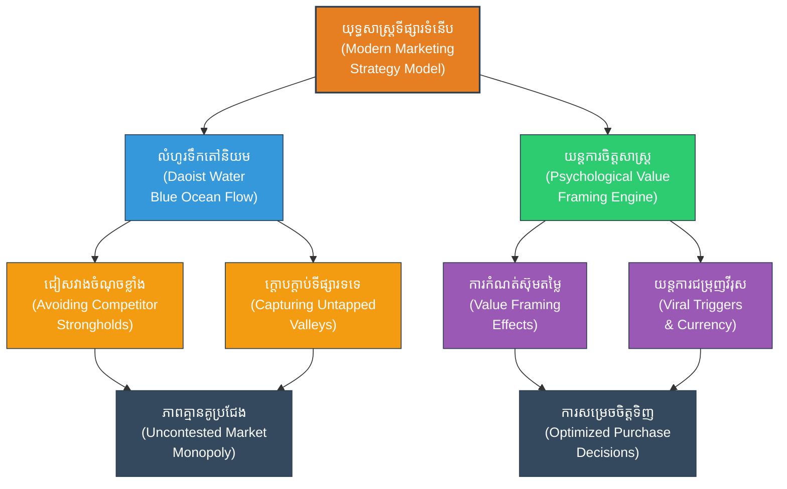

# Marketing Strategy (ការធ្វើទីផ្សារ៖ យុទ្ធសាស្ត្រស្វែងរកមហាសមុទ្រខៀវ)

**Author:** ichamrong  
**Date:** 2026-05-27  
**Tags:** #marketing #business #blueocean #advertising #suntzu #strategy #sales  
**Category:** Biographies / Related / Business  
**Read Time:** ~15 min  

---

## 📌 មាតិកា (Table of Contents)
- [សេចក្តីផ្តើម៖ កាយវិភាគវិទ្យានៃយុទ្ធសាស្ត្រ (Introduction: Strategic Anatomy)](#intro)
- [១. ទស្សនៈវិភាគ និងយុទ្ធសាស្ត្រទីផ្សារទំនើប (Perspective & Modern Marketing Context)](#context)
- [២. ទស្សនវិជ្ជាស្នូល (The Philosophical Core)](#philosophical-core)
- [៣. យន្តការចិត្តសាស្ត្រ (Psychological Mechanism)](#psychological-mechanism)
- [៤. គំនូសបំរែបំរួលយុទ្ធសាស្ត្រ (Strategic Mermaid Diagram)](#diagram)
- [៥. ការផ្សារភ្ជាប់គ្នារវាងគោលការណ៍ជាក់ស្តែង និងក្បួនសឹកស៊ុនអ៊ូ (Connecting to Sun Tzu's Art of War)](#suntzu-connection)
- [៦. ភាពផ្ទុយគ្នា និងការរិះគន់ (Paradoxes & Criticisms)](#paradoxes-criticisms)
- [៧. តារាងប្រៀបធៀបយុទ្ធសាស្ត្រ (Strategic Comparison Table)](#comparison-table)
- [សេចក្តីសន្និដ្ឋាន (Conclusion)](#conclusion)
- [🔗 ឯកសារទាក់ទង (Related Topics)](#related-topics)
- [ឯកសារយោង (References)](#references)

---

## សេចក្តីផ្តើម៖ កាយវិភាគវិទ្យានៃយុទ្ធសាស្ត្រ (Introduction: Strategic Anatomy)

> **«យុទ្ធសាស្ត្រសឹកដ៏ឆ្លាតវៃគឺត្រូវជៀសវាងកន្លែងដែលសត្រូវការពាររឹងមាំ ហើយត្រូវវាយលុកចំកន្លែងដែលសត្រូវខ្វះការការពារ។» — ស៊ុន អ៊ូ**

ការធ្វើទីផ្សារ (Marketing) ទំនើបគឺជាសមរភូមិដើម្បីដណ្តើមយក «ចិត្ត និងចំណាប់អារម្មណ៍របស់អតិថិជន»។ នៅក្នុងយុគសម័យដែលមានការផ្សព្វផ្សាយព័ត៌មានយ៉ាងសន្ធឹកសន្ធាប់ ក្រុមហ៊ុនដែលជោគជ័យមិនមែនជាក្រុមហ៊ុនដែលស្រែកខ្លាំងជាងគេនោះទេ តែជាក្រុមហ៊ុនដែលចេះប្រើប្រាស់យុទ្ធសាស្ត្រវាយឆ្មក់ផ្លូវចិត្ត ស្វែងរកទីផ្សារដែលគូប្រជែងមើលរំលង និងបង្កើតលំហូរនៃសារព័ត៌មានដែលជ្រាបចូលទៅក្នុងខួរក្បាលរបស់អតិថិជនដោយស្វ័យប្រវត្តិ។

---

## ១. ទស្សនៈវិភាគ និងយុទ្ធសាស្ត្រទីផ្សារទំនើប (Perspective & Modern Marketing Context)

នៅក្នុងពិភពជំនួញ ទីផ្សារដែលមានការប្រកួតប្រជែងខ្លាំង គេហៅថា **«មហាសមុទ្រក្រហម» (Red Ocean)** ជាកន្លែងដែលក្រុមហ៊ុនជាច្រើនប្រកួតប្រជែងកាប់ចាក់គ្នាតាមរយៈការបញ្ចុះតម្លៃ ដែលផ្ទុយពីគោលការណ៍របស់ស៊ុនអ៊ូដែលបង្រៀនឱ្យបញ្ចៀសចំណុចខ្លាំងរបស់សត្រូវ។ ការប្រយុទ្ធគ្នាក្នុងមហាសមុទ្រក្រហមនាំទៅរកការខាតបង់ និងការបំផ្លាញតម្លៃម៉ាកយីហោ។

ដើម្បីជោគជ័យ ក្រុមហ៊ុនត្រូវស្វែងរក **«មហាសមុទ្រខៀវ» (Blue Ocean)** ដែលជាកន្លែងគ្មានគូប្រជែង ឬជាតម្រូវការអតិថិជនដែលមិនទាន់ត្រូវបានបំពេញ ដោយបង្កើតតម្លៃផលិតផលថ្មីប្លែកដាច់ដោយឡែក។ នេះគឺជាការផ្លាស់ប្តូរការផ្តោតអារម្មណ៍ពី «ការប្រយុទ្ធគ្នា» ទៅជា «ការធ្វើឱ្យការប្រកួតប្រជែងលែងមានន័យ»។

---

## ២. 🏛️ [គ្រឹះទស្សនវិជ្ជា] / [Philosophical Core] - ទស្សនវិជ្ជាស្នូល (The Philosophical Core)

យុទ្ធសាស្ត្រទីផ្សារដ៏មានឥទ្ធិពលត្រូវតែបង្កប់នូវទស្សនវិជ្ជាដ៏ជ្រាលជ្រៅ៖

*   **លំហូរទឹកបែបតៅនិយម (Daoist Water Flow - 水之法):** ស៊ុនអ៊ូបានសរសេរថា៖ «ក្បួនសឹកគឺដូចជាទឹក ទឹកហូរចៀសកន្លែងខ្ពស់ ហើយធ្លាក់ចុះមកកន្លែងទាប។ យុទ្ធសាស្ត្រសឹកគឺចៀសវាងចំណុចខ្លាំង ហើយវាយលុកចំណុចខ្សោយ»។ 
    *   **ភាពទន់ភ្លន់យកឈ្នះភាពរឹងរូស:** ជំនួសឱ្យការចំណាយទុនរាប់លានដុល្លារដើម្បីវាយកម្ទេចគូប្រជែងធំ យុទ្ធសាស្ត្រទីផ្សារបែបតៅនិយមណែនាំឱ្យក្រុមហ៊ុន «ហូរ» ទៅរកចំណុចដែលគ្មានការការពារ ពោលគឺផ្នែកទីផ្សារតូចៗ (Niche Markets) ឬតម្រូវការដែលមិនទាន់មាននរណាបំពេញ (Unmet Needs)។
    *   **ការសម្របខ្លួនតាមអតិថិជន:** ទឹកគ្មានរាងថេរឡើយ វាប្រែប្រួលទៅតាមភាជនៈដែលផ្ទុកវា។ ទីផ្សារក៏ដូចគ្នា អ្នកទីផ្សារត្រូវកែប្រែសារ និងទម្រង់ផលិតផលទៅតាមចិត្តសាស្ត្រ និងការវិវត្តនៃសង្គមរបស់អ្នកប្រើប្រាស់។

---

## ៣. 🧠 [យន្តការចិត្តសាស្ត្រ] / [Psychological Mechanism] - យន្តការចិត្តសាស្ត្រ (Psychological Mechanism)

ការសម្រេចចិត្តទិញរបស់អតិថិជនមិនមែនជាការគិតបែបហេតុផលទាំងស្រុងនោះទេ តែវាត្រូវបានគ្រប់គ្រងដោយយន្តការចិត្តសាស្ត្រច្បាស់លាស់៖

*   **ឥទ្ធិពលនៃការកំណត់ស៊ុម (Framing Effects):** ការសម្រេចចិត្តរបស់មនុស្សប្រែប្រួលទៅតាមរបៀបដែលព័ត៌មានត្រូវបានបង្ហាញ (Frame)៖
    *   **ស៊ុមខ្លាចបាត់បង់ (Loss Aversion Framing):** មនុស្សមានការឈឺចាប់នឹងការបាត់បង់ខ្លាំងជាងអារម្មណ៍សប្បាយចិត្តនឹងការទទួលបានទ្វេដង (Kahneman & Tversky)។ ការផ្សព្វផ្សាយដែលសង្កត់ធ្ងន់លើ «ឱកាសដែលអ្នកនឹងខកខាន» (FOMO - Fear of Missing Out) តែងតែមានប្រសិទ្ធភាពជាង «អ្វីដែលអ្នកនឹងទទួលបាន»។
    *   **ស៊ុមយោងតម្លៃ (Anchoring Frame):** ការបង្ហាញតម្លៃដើមខ្ពស់ រួចបញ្ចុះតម្លៃចុះមកទាប ធ្វើឱ្យខួរក្បាលអតិថិជនយករូបមន្តតម្លៃដំបូងជាគោល ធ្វើឱ្យពួកគេយល់ថាខ្លួនចំណេញច្រើន។
*   **យន្តការវីរុស និងការជម្រុញផ្លូវចិត្ត (Viral Psychological Triggers - STEPPS Model):** ដើម្បីឱ្យយុទ្ធនាការទីផ្សារល្បីល្បាញដោយស្វ័យប្រវត្ត (Word of Mouth) គេត្រូវប្រើប្រាស់៖
    *   **តម្លៃសង្គម (Social Currency):** បង្កើតខ្លឹមសារដែលធ្វើឱ្យអ្នកចែករំលែកមើលទៅហាក់ដូចជាមនុស្សឆ្លាត ទាន់សម័យ ឬមានចំណេះដឹង។
    *   **ការជម្រុញចំណុចចងចាំ (Triggers):** ការផ្សារភ្ជាប់ផលិតផលទៅនឹងបរិស្ថានជុំវិញខ្លួនប្រចាំថ្ងៃ (ឧ. កាហ្វេ និងការភ្ញាក់ពីគេង)។
    *   **អារម្មណ៍ខ្លាំង (Emotion):** ជម្រុញអារម្មណ៍ដែលមានកម្រិតរំញោចខ្ពស់ (High Arousal) ដូចជា ការស្ញប់ស្ញែង (Awe) ការកំប្លែងខ្លាំង ឬការខឹងសម្បារ ដែលធ្វើឱ្យមនុស្សមិនអាចនៅស្ងៀមបាន។

---

## ៤. គំនូសបំរែបំរួលយុទ្ធសាស្ត្រ (Strategic Mermaid Diagram)

---

## ៥. 🚀 [មេរៀនអនុវត្ត] / [Practical Application] - ការផ្សារភ្ជាប់គ្នារវាងគោលការណ៍ជាក់ស្តែង និងក្បួនសឹកស៊ុនអ៊ូ (Connecting to Sun Tzu's Art of War)

### ក. យុទ្ធសាស្ត្រមហាសមុទ្រខៀវ (Avoid Strength, Strike Weakness)
«ជៀសវាងកន្លែងពេញ វាយប្រហារកន្លែងទទេ»។ ឧទាហរណ៍ជាក់ស្តែងគឺក្រុមហ៊ុន Apple ពេលបញ្ចេញទូរស័ព្ទ iPhone ដំបូងគេបង្អស់ លោក Steve Jobs មិនបានចូលរួមប្រកួតប្រជែងលក់ទូរស័ព្ទចុចប៊ូតុងធម្មតាជាមួយ Nokia ឡើយ ប៉ុន្តែលោកបានបង្កើតទីផ្សារថ្មីស្រឡាងគឺ «ទូរស័ព្ទអេក្រង់ប៉ះឆ្លាតវៃ» (Smartphones) ដែលធ្វើឱ្យ Nokia ធ្លាក់ខ្លួនចុះខ្សោយ និងបរាជ័យទាំងស្រុង។

### ខ. ការក្តោបក្តាប់ចិត្តសាស្ត្រអតិថិជន (Understanding the Customer)
> [!IMPORTANT]
> «ដឹងពីខ្លួនឯង ដឹងពីអតិថិជន»។ យុទ្ធនាការធ្វើទីផ្សារដែលជោគជ័យខ្ពស់ មិនមែនកើតឡើងដោយសារការចំណាយលុយផ្សាយពាណិជ្ជកម្មច្រើននោះទេ ប៉ុន្តែវាផ្អែកលើការយល់ដឹងយ៉ាងជ្រៅជ្រះពីចិត្តវិទ្យា ចំណង់ចំណូលចិត្ត និងការឈឺចាប់ (Pain points) របស់អតិថិជន ដើម្បីរៀបចំយុទ្ធនាការដែលដោះស្រាយបញ្ហារបស់ពួកគេបានយ៉ាងចំគោលដៅ។

---

## ៦. ⚠️ [ភាពផ្ទុយគ្នា និងការរិះគន់] / [Paradoxes & Criticisms] - ភាពផ្ទុយគ្នា និងការរិះគន់ (Paradoxes & Criticisms)

> [!WARNING]
> *   **ភាពផ្ទុយគ្នានៃការបោកបញ្ឆោត និងទំនុកចិត្ត (The Deception-Trust Paradox):** ស៊ុនអ៊ូនិយាយថា៖ «ក្បួនសឹកគឺផ្អែកលើការបោកបញ្ឆោត»។ ទោះជាយ៉ាងណា ក្នុងទីផ្សារទំនើប បើការផ្សព្វផ្សាយបំផ្លើសហួសពីការពិត (Hype) ឬការប្រើល្បិចបន្លំស៊ុមតម្លៃត្រូវបានរកឃើញ វានឹងបំផ្លាញកេរ្តិ៍ឈ្មោះម៉ាកសញ្ញា (Brand Equity) ទាំងស្រុង និងបាត់បង់ទំនុកចិត្តអតិថិជនជារៀងរហូត។
> *   **ហានិភ័យនៃមហាសមុទ្រខៀវ (Blue Ocean First-Mover Trap):** ការចូលទៅកាន់ទីផ្សារថ្មីស្រឡាងគ្មានគូប្រជែង អាចធ្វើឱ្យក្រុមហ៊ុនចំណាយដើមទុនច្រើនលើសលប់ក្នុងការអប់រំទីផ្សារ (Market Education) ប៉ុន្តែគូប្រជែងដែលចូលមកក្រោយ (Fast Followers) អាចចម្លងគំនិត និងឆក់យកអតិថិជនបានយ៉ាងងាយ ដោយមិនចាំបាច់ហត់នឿយសាកល្បង។
> *   **ភាពរហ័សហួសកំណត់នៃវីរុស (Viral Burnout):** យុទ្ធនាការដែលល្បីល្បាញលឿនពេក (Viral Marketing) តែងតែមានអាយុកាលខ្លី និងរលត់ទៅវិញយ៉ាងលឿន ប្រសិនបើផលិតផលស្នូលគ្មានតម្លៃពិតប្រាកដ ឬមិនអាចបំពេញតាមការរំពឹងទុករបស់អតិថិជន។

---

## ៧. តារាងប្រៀបធៀបយុទ្ធសាស្ត្រ (Strategic Comparison Table)

| គោលការណ៍ស៊ុនអ៊ូ (Sun Tzu's Principle) | យុទ្ធសាស្ត្រធ្វើទីផ្សារ (Marketing Application) | លទ្ធផលជាក់ស្តែង (Practical Result) |
| :--- | :--- | :--- |
| *«វាយលុកកន្លែងដែលមិនការពារ»* | យុទ្ធសាស្ត្រមហាសមុទ្រខៀវ (Blue Ocean) | បង្កើតទីផ្សារថ្មី ដណ្តើមយកអតិថិជនដំបូងដោយគ្មានគូប្រជែង។ |
| *« Deception (ការបោកបញ្ឆោត)»* | ការកំណត់ស៊ុមតម្លៃ និងការបង្កើតចំណាប់អារម្មណ៍ | ទាក់ទាញចិត្តអតិថិជនឱ្យផ្តោតលើតម្លៃពិសេស ដែលជៀសឆ្ងាយពីគូប្រកួត។ |
| *«ស្គាល់ស្ថានភាពសត្រូវ»* | ការវិភាគទិន្នន័យអតិថិជន និងការធ្វើតេស្ត A/B Testing | យល់ដឹងពីការឆ្លើយតបផ្លូវចិត្តរបស់អតិថិជនដើម្បីកែលម្អយុទ្ធនាការ។ |

---

## 🧭 ការរុករកយុទ្ធសាស្ត្រ (Strategic Navigation - Down the Rabbit Hole)
*   **[« យុទ្ធសាស្ត្រមុន (Previous Strategy)](10-diplomacy-strategy.md)**
*   **[យុទ្ធសាស្ត្របន្ទាប់ (Next Strategy) »](12-cybersecurity-strategy.md)**

---

## សេចក្តីសន្និដ្ឋាន (Conclusion)

🚀 ទីផ្សារទំនើបមិនមែនជាការប៉ះទង្គិចគ្នាដោយកម្លាំងបាយ ឬដើមទុននោះទេ តែវាជាការប្រយុទ្ធគ្នាដោយបញ្ញាញាណ និងការយល់ដឹងពីលំហូរនៃចិត្តសាស្ត្រមនុស្ស។ តាមរយៈការអនុវត្តទស្សនវិជ្ជាតៅនិយមនៃលំហូរទឹកដើម្បីបញ្ចៀសសង្គ្រាមតម្លៃ និងការប្រើប្រាស់ឥទ្ធិពលនៃការកំណត់ស៊ុមផ្លូវចិត្ត ក្រុមហ៊ុនអាចបង្កើតសមរភូមិផ្ទាល់ខ្លួនដែលពួកគេតែងតែកាន់កាប់ជ័យជម្នះជានិច្ច។

---

## 🔗 ឯកសារទាក់ទង (Related Topics)
*   [ជីវប្រវត្តិ ស៊ុន អ៊ូ (The Biography of Sun Tzu)](../01-sun-tzu-biography.md)
*   [សៀវភៅ The Art of War (The Art of War Book)](01-the-art-of-war.md)
*   [យុទ្ធសាស្ត្រវាយឆ្មក់របស់ ម៉ៅ សេទុង (Mao Zedong Strategy)](02-mao-zedong-guerrilla-warfare.md)

## ឯកសារយោង (References)
*   **Berger, J.** (2013). *Contagious: Why Things Catch On*. Simon & Schuster.
*   **Kahneman, D.** (2011). *Thinking, Fast and Slow*. Farrar, Straus and Giroux.
*   **Kim, W. C., & Mauborgne, R.** (2005). *Blue Ocean Strategy: How to Create Uncontested Market Space and Make the Competition Irrelevant*. Harvard Business School Press.
*   **Lao Tzu** (Transl. Stephen Mitchell, 1988). *Tao Te Ching*. Harper & Row.
*   **Sun Tzu** (Transl. Lionel Giles, 1910). *The Art of War*. British Museum.
*   **Scholarly Studies in Marketing Psychology and Customer Framing Models** (2026 Edition).

---
*Last updated: 2026-05-27*
