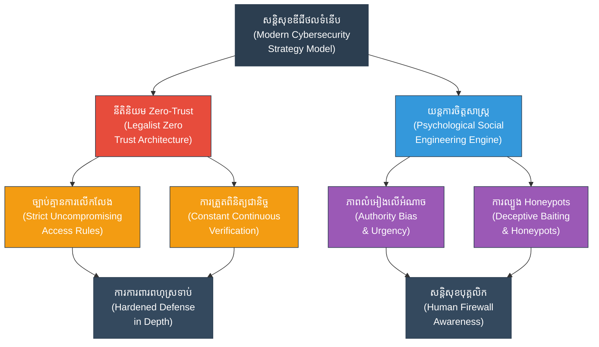

# Cybersecurity (សន្តិសុខអ៊ិនធឺណិត៖ ការការពារ និងការវាយប្រហារលើសមរភូមិឌីជីថល)

**Author:** ichamrong  
**Date:** 2026-05-27  
**Tags:** #cybersecurity #security #infosec #redteam #blueteam #suntzu #hacker #defense  
**Category:** Biographies / Related / Security  
**Read Time:** ~15 min  

---

## 📌 មាតិកា (Table of Contents)
- [សេចក្តីផ្តើម៖ កាយវិភាគវិទ្យានៃយុទ្ធសាស្ត្រ (Introduction: Strategic Anatomy)](#intro)
- [១. ទស្សនៈវិភាគ និងបរិបទសន្តិសុខឌីជីថល (Perspective & Digital Defense Context)](#context)
- [២. ទស្សនវិជ្ជាស្នូល (The Philosophical Core)](#philosophical-core)
- [៣. យន្តការចិត្តសាស្ត្រ (Psychological Mechanism)](#psychological-mechanism)
- [៤. គំនូសបំរែបំរួលយុទ្ធសាស្ត្រ (Strategic Mermaid Diagram)](#diagram)
- [៥. การផ្សារភ្ជាប់គ្នារវាងគោលការណ៍ជាក់ស្តែង និងក្បួនសឹកស៊ុនអ៊ូ (Connecting to Sun Tzu's Art of War)](#suntzu-connection)
- [៦. ភាពផ្ទុយគ្នា និងការរិះគន់ (Paradoxes & Criticisms)](#paradoxes-criticisms)
- [៧. តារាងប្រៀបធៀបយុទ្ធសាស្ត្រ (Strategic Comparison Table)](#comparison-table)
- [សេចក្តីសន្និដ្ឋាន (Conclusion)](#conclusion)
- [🔗 ឯកសារទាក់ទង (Related Topics)](#related-topics)
- [ឯកសារយោង (References)](#references)

---

## សេចក្តីផ្តើម៖ កាយវិភាគវិទ្យានៃយុទ្ធសាស្ត្រ (Introduction: Strategic Anatomy)

> **«ការការពារដ៏មាំមួនបំភិតបំភ័យមិនឱ្យសត្រូវហ៊ានបើកការវាយប្រហារ គឺអាស្រ័យលើការយល់ដឹងពីប្រព័ន្ធការពារខ្លួនឯង និងរបៀបវាយប្រហាររបស់សត្រូវ។» — ស៊ុន អ៊ូ**

សមរភូមិនៃសន្តិសុខអ៊ិនធឺណិត (Cybersecurity) គឺជាកន្លែងដែលការគិតជាប្រព័ន្ធ និងចិត្តវិទ្យារបស់ស៊ុនអ៊ូត្រូវបានអនុវត្តជារៀងរាល់វិនាទី។ การការពារប្រព័ន្ធទិន្នន័យ ការស្វែងរកចំណុចខ្សោយ និងការទប់ស្កាត់ការជ្រៀតចូលរបស់ Hacker គឺជាការប្រយុទ្ធឥតស្រមោលនៅក្នុងពិភពឌីជីថល ដែលទាមទារនូវការអនុវត្តច្បាប់ការពារដ៏តឹងរ៉ឹងបំផុត និងការប្រុងប្រយ័ត្នខ្ពស់ចំពោះល្បិចកលបោកបញ្ឆោត។

---

## ១. ទស្សនៈវិភាគ និងបរិបទសន្តិសុខឌីជីថល (Perspective & Digital Defense Context)

នៅក្នុងពិភពបច្ចេកវិទ្យាទំនើប គ្មានប្រព័ន្ធណាមួយដែលមានសុវត្ថិភាព ១០០% នោះឡើយ។ Hacker តែងតែស្វែងរកវិធីជ្រៀតចូលលួចទិន្នន័យដើម្បីប្រយោជន៍ផ្ទាល់ខ្លួន ឬបំផ្លាញប្រព័ន្ធរដ្ឋ។ ដូច្នេះ ស្ថាប័នការពារត្រូវយល់ច្បាស់ពីប្រព័ន្ធការពារខ្លួនឯង និងស្គាល់ល្បិចកលវាយប្រហាររបស់ Hacker។

ការការពារឌីជីថលត្រូវបានបែងចែកជាពីរក្រុមធំៗគឺ ក្រុមការពារសកម្ម (Blue Team) និងក្រុមវាយប្រហារសាកល្បង (Red Team) ដែលក្រុមទាំងពីរត្រូវធ្វើការប្រកួតប្រជែង និងកែលម្អប្រព័ន្ធការពាររួមគ្នា ស្របតាមក្បួនសឹកស៊ុនអ៊ូ ដើម្បីស្វែងរកចំណុចខ្សោយមុនពេលសត្រូវពិតប្រាកដរកឃើញ។

---

## ២. 🏛️ [គ្រឹះទស្សនវិជ្ជា] / [Philosophical Core] - ទស្សនវិជ្ជាស្នូល (The Philosophical Core)

គ្រឹះការពារដ៏រឹងមាំ និងមានប្រសិទ្ធភាពបំផុតនៅក្នុងវិស័យ Cybersecurity គឺផ្អែកលើការយល់ឃើញរបស់សាលាគំនិតបុរាណ៖

*   **ទស្សនវិជ្ជានីតិនិយម (Legalism/Fajia - 法家):** ហាន ហ្វេស៊ី (Han Feizi) ជឿជាក់យ៉ាងមុតមាំថា ធម្មជាតិរបស់មនុស្សគឺអាត្មានិយម និងមិនអាចទុកចិត្តបានឡើយ។ សណ្តាប់ធ្នាប់ និងសុវត្ថិភាពអាចកើតមានទៅបាន លុះត្រាតែមានប្រព័ន្ធច្បាប់ (Fa) ដ៏តឹងរ៉ឹងបំផុត និងការអនុវត្តច្បាប់ដោយគ្មានការលើកលែង។
    *   **ស្ថាបត្យកម្មសន្តិសុខគ្មានការទុកចិត្ត (Zero-Trust Architecture):** នេះគឺជាការអនុវត្តជាក់ស្តែងនៃនីតិនិយមនៅក្នុងសម័យឌីជីថល។ គោលការណ៍គ្រឹះគឺ **«មិនទុកចិត្តនរណាម្នាក់ឡើយ ផ្ទៀងផ្ទាត់ជានិច្ច» (Never Trust, Always Verify)**។ ទោះបីជាអ្នកប្រើប្រាស់នោះស្ថិតនៅក្នុងបណ្តាញផ្ទៃក្នុង ឬមានឋានៈជាប្រធានក្រុមហ៊ុន (C-Level Executives) ក៏ដោយ ប្រព័ន្ធត្រូវតែផ្ទៀងផ្ទាត់អត្តសញ្ញាណ និងសិទ្ធិចូលប្រើប្រាស់រាល់ពេលដែលមានសកម្មភាព។
    *   **ការអនុវត្តដោយស្វ័យប្រវត្តិ និងច្បាស់លាស់:** ការកំណត់សិទ្ធិអំណាច និងច្បាប់ Firewall ត្រូវតែត្រូវបានអនុវត្តដោយម៉ាស៊ីន (Automated Rules) ដើម្បីលុបបំបាត់ការអនុគ្រោះដោយសារមនោសញ្ចេតនារបស់មនុស្ស។

---

## ៣. 🧠 [យន្តការចិត្តសាស្ត្រ] / [Psychological Mechanism] - យន្តការចិត្តសាស្ត្រ (Psychological Mechanism)

ខ្សែការពារដែលទន់ខ្សោយបំផុតនៅក្នុងប្រព័ន្ធ Cybersecurity មិនមែនជា Software នោះទេ ប៉ុន្តែគឺជា «មនុស្ស»។ Hacker តែងតែប្រើប្រាស់វិស្វកម្មសង្គម (Social Engineering) ដើម្បីកេងប្រវ័ញ្ចលើភាពទន់ខ្សោយ និងភាពលំអៀងផ្លូវចិត្តរបស់មនុស្ស៖

*   **ភាពលំអៀងទៅរកអំណាច (Authority Bias):** មនុស្សមានទំនោរគោរព និងធ្វើតាមបញ្ជារបស់អ្នកដែលមានអំណាច ឬឋានៈខ្ពស់ជាងដោយមិនសូវសួរដេញដោល។ Hacker តែងតែបន្លំខ្លួនធ្វើជាប្រធានក្រុមហ៊ុន (CEO/CTO) ដើម្បីផ្ញើសារបង្ខំឱ្យបុគ្គលិកផ្ញើព័ត៌មានសម្ងាត់ ឬវេរប្រាក់។
*   **ការបង្ខំឱ្យស្លន់ស្លោ និងការរឹតត្បិតពេលវេលា (Urgency & Scarcity Framing):** យុទ្ធនាការបោកបញ្ឆោត (Phishing) តែងតែប្រើប្រាស់ការគំរាមកំហែងដូចជា «គណនីរបស់អ្នកនឹងត្រូវបិទក្នុងរយៈពេល ៥ នាទី ប្រសិនបើមិនធ្វើការផ្ទៀងផ្ទាត់»។ យន្តការនេះបង្ខំឱ្យខួរក្បាលប្រើប្រាស់ **ប្រព័ន្ធទី ១ (System 1 - លឿន និងប្រើប្រាស់អារម្មណ៍)** រួចរំលងចោលការវិភាកហេតុផលរបស់ **ប្រព័ន្ធទី ២ (System 2 - យឺត និងហ្មត់ចត់)** នាំឱ្យជនរងគ្រោះធ្លាក់ក្នុងអន្ទាក់ភ្លាមៗ។
*   **ភាពលំអៀងទៅរកការបញ្ជាក់ (Confirmation Bias):** Hacker បង្កើតសារក្លែងក្លាយដែលស្របទៅនឹងការរំពឹងទុករបស់ជនរងគ្រោះ (ឧ. ផ្ញើវិក្កយបត្រក្លែងក្លាយក្នុងថ្ងៃបង់ប្រាក់ខែ) ធ្វើឱ្យជនរងគ្រោះមិនមានការសង្ស័យ និងចុច Link មេរោគដោយងាយ។

---

## ៤. គំនូសបំរែបំរួលយុទ្ធសាស្ត្រ (Strategic Mermaid Diagram)

---

## ៥. 🚀 [មេរៀនអនុវត្ត] / [Practical Application] - ការផ្សារភ្ជាប់គ្នារវាងគោលការណ៍ជាក់ស្តែង និងក្បួនសឹកស៊ុនអ៊ូ (Connecting to Sun Tzu's Art of War)

### ក. ស្គាល់ខ្លួនឯង ស្គាល់ដៃគូ (Know Thyself, Know Thy Threat)
«បើដឹងពីចំណុចខ្សោយរបស់ខ្លួនឯង និងដឹងពីសមត្ថភាពវាយប្រហាររបស់សត្រូវ ទោះប្រឈមមុខមួយរយដង ក៏មិនជួបគ្រោះថ្នាក់ដែរ»។ ក្នុង Cybersecurity នេះគឺការធ្វើ **Vulnerability Assessment** (ស្គាល់ចំណុចខ្សោយខ្លួនឯង) និង **Threat Intelligence** (ស្គាល់របៀបលេង បច្ចេកវិទ្យា និងទម្លាប់របស់ Hacker) ដើម្បីរៀបចំប្រព័ន្ធការពារទប់ស្កាត់បានទាន់ពេលវេលា។

### ខ. ការការពារសកម្ម និងការធ្វើពុត (Defense & Honeypots)
> [!IMPORTANT]
> ស៊ុនអ៊ូបង្រៀនឱ្យប្រើប្រាស់ល្បិចដើម្បីបញ្ឆោតសត្រូវ។ ក្នុងប្រព័ន្ធបច្ចេកវិទ្យា គេបង្កើត **«Honeypots»** (ម៉ាស៊ីនបោកបញ្ឆោត) ដែលជាម៉ាស៊ីនទិន្នន័យក្លែងក្លាយមើលទៅដូចជាមានប្រព័ន្ធការពារខ្សោយ ដើម្បីល្បួងឱ្យ Hacker ចូលមកវាយប្រហារ។ តាមរយៈការសង្កេតរបៀបជ្រៀតចូលរបស់ Hacker ក្នុង Honeypot ក្រុមការពារអាចយល់ដឹងពីបច្ចេកទេសវាយប្រហារថ្មីៗ រួចយកទៅរៀបចំប្រព័ន្ធការពារពិតប្រាកដឱ្យកាន់តែមាំមួន។

---

## ៦. ⚠️ [ភាពផ្ទុយគ្នា និងការរិះគន់] / [Paradoxes & Criticisms] - ភាពផ្ទុយគ្នា និងការរិះគន់ (Paradoxes & Criticisms)

> [!WARNING]
> *   **ភាពផ្ទុយគ្នានៃសន្តិសុខ និងភាពងាយស្រួល (The Security-Usability Paradox):** ការបង្កើនប្រព័ន្ធសន្តិសុខឱ្យកាន់តែតឹងរ៉ឹងខ្លាំងតាមបែបនីតិនិយម (ដូចជាការទាមទារការប្តូរ Password ញឹកញាប់ និងការផ្ទៀងផ្ទាត់ច្រើនដង) ធ្វើឱ្យប្រព័ន្ធកាន់តែមានសុវត្ថិភាព ប៉ុន្តែវាកាត់បន្ថយភាពងាយស្រួលក្នុងការប្រើប្រាស់។ វាក៏ជម្រុញឱ្យបុគ្គលិកលួចបង្កើតវិធីវាងច្បាប់ (Shadow IT) ដែលបង្កើតចំណុចខ្សោយធំជាងមុនទៅវិញ។
> *   **ហានិភ័យផ្ទៃក្នុង និងចារកម្ម (The Insider Threat & Spies):** ប្រព័ន្ធការពារឌីជីថលទោះបីជាមាំមួនពីខាងក្រៅយ៉ាងណាក៏ដោយ ក៏អាចដួលរលំបានយ៉ាងងាយ ប្រសិនបើមានការធ្វេសប្រហែស ឬការសហការលួចព័ត៌មានពីសំណាក់បុគ្គលិកផ្ទៃក្នុង (Inward Spies)។ ស៊ុនអ៊ូធ្លាប់បានបញ្ជាក់ពីអំណាចនៃចារកម្មផ្ទៃក្នុងថាជាអ្នកបំផ្លាញសមរភូមិពីខាងក្នុង។
> *   **ការជឿជាក់ហួសហេតុលើស្វ័យប្រវត្តិកម្ម (Over-reliance on Automation):** การពឹងផ្អែកទាំងស្រុងលើប្រព័ន្ធវៃឆ្លាតការពារស្វ័យប្រវត្តិ អាចធ្វើឱ្យក្រុមការពារបាត់បង់ការយកចិត្តទុកដាក់ និងការវិភាគដោយផ្ទាល់ខ្លួន (Complacency) ដែលជាចំណុចខ្សោយធំបំផុតពេលជួបការវាយប្រហារថ្មីៗដែលមិនទាន់មានក្នុងទិន្នន័យ (Zero-Day Attacks)។

---

## ៧. តារាងប្រៀបធៀបយុទ្ធសាស្ត្រ (Strategic Comparison Table)

| គោលការណ៍ស៊ុនអ៊ូ (Sun Tzu's Principle) | យុទ្ធសាស្ត្រសន្តិសុខឌីជីថល (Cybersecurity Strategy) | លទ្ធផលជាក់ស្តែង (Practical Result) |
| :--- | :--- | :--- |
| *«ដឹងពីខ្លួនឯង ដឹងពីសត្រូវ»* | ការធ្វើ Penetration Testing & Threat Intel | ដឹងពីចំណុចខ្សោយរបស់ប្រព័ន្ធមុនពេល Hacker រកឃើញ និងវាយប្រហារ។ |
| *«ការបោកបញ្ឆោតសត្រូវ»* | ការបង្កើត Honeypots (ប្រព័ន្ធទិន្នន័យល្បួង) | ទាក់ទាញ និងសិក្សាពីរបៀបវាយប្រហាររបស់ Hacker ដោយសុវត្ថិភាព។ |
| *«ការពារដើម្បីមិនអាចចាញ់»* | ការបង្កើតប្រព័ន្ធការពារពហុស្រទាប់ និង Zero-Trust | ទោះបីជា Hacker ជ្រៀតចូលបានមួយស្រទាប់ ក៏មិនអាចយកទិន្នន័យស្នូលបានដែរ។ |

---

## 🧭 ការរុករកយុទ្ធសាស្ត្រ (Strategic Navigation - Down the Rabbit Hole)
*   **[« យុទ្ធសាស្ត្រមុន (Previous Strategy)](11-marketing-strategy.md)**
*   **[យុទ្ធសាស្ត្របន្ទាប់ (Next Strategy) »](13-risk-management.md)**

---

## សេចក្តីសន្និដ្ឋាន (Conclusion)

🚀 សន្តិសុខអ៊ិនធឺណិតមិនមែនជាបញ្ហាបច្ចេកវិទ្យាសុទ្ធសាធនោះទេ តែវាជាការប្រកួតប្រជែងរវាងចិត្តសាស្ត្រមនុស្ស និងច្បាប់វិន័យ។ តាមរយៈការរួមបញ្ចូលយុទ្ធសាស្ត្រគ្មានការទុកចិត្ត (Zero-Trust) បែបនីតិនិយម ដែលទប់ស្កាត់រាល់សកម្មភាពមិនប្រក្រតី និងការយល់ដឹងពីយន្តការផ្លូវចិត្តដែល Hacker ប្រើប្រាស់ដើម្បីបោកបញ្ឆោត បណ្តាញព័ត៌មានរបស់យើងនឹងអាចក្លាយជាសមរភូមិមួយដ៏រឹងមាំដែលមិនអាចវាយបំបែកបាន។

---

## 🔗 ឯកសារទាក់ទង (Related Topics)
*   [ជីវប្រវត្តិ ស៊ុន អ៊ូ (The Biography of Sun Tzu)](../01-sun-tzu-biography.md)
*   [សៀវភៅ The Art of War (The Art of War Book)](01-the-art-of-war.md)
*   [យុទ្ធសាស្ត្រវាយឆ្មក់របស់ ម៉ៅ សេទុង (Mao Zedong Strategy)](02-mao-zedong-guerrilla-warfare.md)

## ឯកសារយោង (References)
*   **Cialdini, R. B.** (2009). *Influence: Science and Practice*. Pearson Education.
*   **Han Feizi** (Transl. Burton Watson, 2003). *Han Feizi: Basic Writings*. Columbia University Press.
*   **Kahneman, D.** (2011). *Thinking, Fast and Slow*. Farrar, Straus and Giroux.
*   **National Institute of Standards and Technology (NIST)** (2020). *NIST Special Publication 800-207: Zero Trust Architecture*. NIST.
*   **Sun Tzu** (Transl. Lionel Giles, 1910). *The Art of War*. British Museum.
*   **Academic Analyses of Zero-Trust Models and Digital Social Engineering Defenses** (2026 Edition).

---
*Last updated: 2026-05-27*
