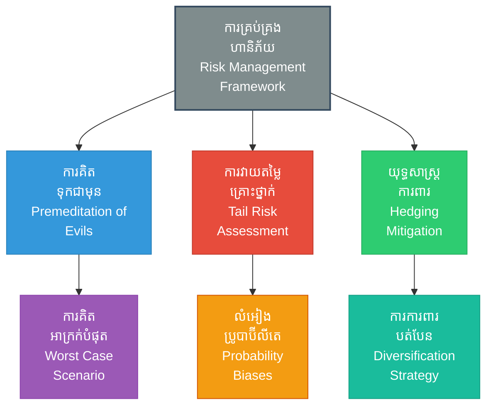

# Risk Management (ការគ្រប់គ្រងហានិភ័យ៖ ការគណនាយ៉ាងត្រជាក់ចិត្តមុនពេលសម្រេចចិត្ត)

**Author:** ichamrong  
**Date:** 2026-05-27  
**Tags:** #riskmanagement #finance #business #risk #suntzu #strategy #calculation #insurance  
**Category:** Biographies / Related / Business  
**Read Time:** ~15 min  

---

## 📌 មាតិកា (Table of Contents)
- [សេចក្តីផ្តើម៖ កាយវិភាគវិទ្យានៃយុទ្ធសាស្ត្រ (Introduction: Strategic Anatomy)](#intro)
- [១. ទស្សនៈវិភាគ និងការគណនាហានិភ័យ (Perspective & Risk Assessment Context)](#context)
- [២. 🏛️ [គ្រឹះទស្សនវិជ្ជា] ទស្សនវិជ្ជាស្នូល (The Philosophical Core)](#philosophy-core)
- [៣. 🧠 [យន្តការចិត្តសាស្ត្រ] យន្តការចិត្តសាស្ត្រ (Psychological Mechanism)](#psychological-mechanism)
- [៤. 📊 គំនូសបំរែបំរួលយុទ្ធសាស្ត្រ (Strategic Mermaid Diagram)](#diagram)
- [៥. 🚀 [មេរៀនអនុវត្ត] ការផ្សារភ្ជាប់គ្នារវាងគោលការណ៍ជាក់ស្តែង និងក្បួនសឹកស៊ុនអ៊ូ (Connecting to Sun Tzu's Art of War)](#suntzu-connection)
- [៦. ⚠️ [ភាពផ្ទុយគ្នា និងការរិះគន់] ភាពផ្ទុយគ្នា និងការរិះគន់ (Paradoxes & Criticisms)](#paradoxes-criticisms)
- [៧. តារាងប្រៀបធៀបយុទ្ធសាស្ត្រ (Strategic Comparison Table)](#comparison-table)
- [សេចក្តីសន្និដ្ឋាន (Conclusion)](#conclusion)
- [🔗 ឯកសារទាក់ទង (Related Topics)](#related-topics)
- [ឯកសារយោង (References)](#references)

---

## សេចក្តីផ្តើម៖ កាយវិភាគវិទ្យានៃយុទ្ធសាស្ត្រ (Introduction: Strategic Anatomy)

> **«ស្តេចដែលគ្មានប្រាជ្ញាញាណមិនត្រូវធ្វើសង្គ្រាមដោយសារកំហឹងមួយពេល ហើយមេទ័ពមិនត្រូវប្រយុទ្ធដោយសារកំហឹងខឹងងាយនោះឡើយ។» — ស៊ុន អ៊ូ**

សង្គ្រាមគឺជាបញ្ហាដ៏ធំធេងដែលជះឥទ្ធិពលលើជីវិត និងសេចក្តីស្លាប់របស់រដ្ឋទាំងមូល ដូច្នេះការសម្រេចចិត្តនីមួយៗត្រូវតែផ្អែកលើការគណនាយ៉ាងល្អិតល្អន់។ នៅក្នុងវិស័យហិរញ្ញវត្ថុ និងធុរកិច្ចទំនើប គោលការណ៍នេះត្រូវបានគេស្គាល់ថា **«ការគ្រប់គ្រងហានិភ័យ» (Risk Management)**។

> [!IMPORTANT]
> **មេរៀនគ្រឹះ (Core Maxim):**
> យោងតាមច្បាប់សឹកស៊ុនអ៊ូ ការប្រថុយប្រថានដោយគ្មានការរៀបចំទុកជាមុនគឺស្មើនឹងការស្វែងរកសេចក្តីស្លាប់។ ហានិភ័យត្រូវតែត្រូវបានកំណត់អត្តសញ្ញាណ គណនាផលចំណេញប្រៀបធៀបនឹងការបាត់បង់ (Risk-Reward Ratio) និងបង្កើតប្រព័ន្ធការពារទុកជាមុន។

---

## ១. ទស្សនៈវិភាគ និងការគណនាហានិភ័យ (Perspective & Risk Assessment Context)

ស៊ុនអ៊ូគឺជាបុគ្គលដំបូងគេបង្អស់ដែលសរសេរពីសារៈសំខាន់នៃការវិភាគថ្លៃដើម និងអត្ថប្រយោជន៍ (Cost-Benefit Analysis) មុនពេលចាប់ផ្តើមជម្លោះ។ លោកបានបញ្ជាក់ថា សង្គ្រាមដែលអូសបន្លាយយូរអង្វែងនឹងធ្វើឱ្យសេដ្ឋកិច្ចរដ្ឋចុះខ្សោយ និងដួលរលំ ទោះបីជាឈ្នះការប្រយុទ្ធក៏ដោយ។

នៅក្នុងការវិនិយោគហិរញ្ញវត្ថុទំនើប អ្នកចាត់ចែងមូលនិធិត្រូវតែគណនាហានិភ័យ លទ្ធភាពជោគជ័យ (Probability) និងរៀបចំផែនការការពារហានិភ័យ (Hedging) ដើម្បីធានានិរន្តរភាពសាច់ប្រាក់របស់ក្រុមហ៊ុន។

---

## ២. 🏛️ [គ្រឹះទស្សនវិជ្ជា] ទស្សនវិជ្ជាស្នូល (The Philosophical Core)

ការគ្រប់គ្រងហានិភ័យមិនមែនគ្រាន់តែជាការប្រើប្រាស់គណិតវិទ្យា និងស្ថិតិប៉ុណ្ណោះទេ ប៉ុន្តែវាត្រូវបានចាក់ឫសយ៉ាងជ្រៅនៅក្នុងប្រព័ន្ធគំនិតទស្សនវិជ្ជាដឹកនាំ៖

### ក. ការគិតទុកជាមុនពីគ្រោះមហន្តរាយបែបស្តូអ៊ិក (Premeditatio Malorum)
នៅក្នុងទស្សនវិជ្ជាស្តូអ៊ិក (Stoicism) របស់លោក Seneca និង Marcus Aurelius មានគោលការណ៍មួយហៅថា *Premeditatio Malorum* (ការគិតទុកជាមុនពីគ្រោះអាក្រក់បំផុត)។ នេះគឺជាការតាំងចិត្តគិតស្រមៃជាមុនពីគ្រប់សេណារីយ៉ូនៃមហន្តរាយ ការក្បត់ ឬការបរាជ័យដែលអាចកើតមានឡើង។ គោលគំនិតនេះស្របគ្នាទាំងស្រុងនឹងវិធីសាស្ត្ររបស់ស៊ុនអ៊ូ ដែលបានចែងថា «មេទ័ពឆ្លាតវៃ ត្រូវគិតគូរទាំងផលចំណេញ និងគ្រោះថ្នាក់ក្នុងពេលតែមួយ»។ នៅពេលយើងយល់ពីគ្រោះអាក្រក់បំផុតជាមុន យើងនឹងមិនមានការភ្ញាក់ផ្អើល ឬស្លន់ស្លោឡើយ ហើយចិត្តគំនិតនឹងស្ងប់ស្ងាត់ដើម្បីឆ្លើយតបយុទ្ធសាស្ត្រ។

### ខ. ការទទួលស្គាល់ភាពមិនប្រាកដប្រជា (Daoist Embracement of Uncertainty)
ទស្សនវិជ្ជាតៅ (Daoism) បង្រៀនថាលំហូរនៃសកលលោកគ្មានភាពប្រាកដប្រជាឡើយ។ ការប្រឆាំងនឹងភាពមិនប្រាកដប្រជានាំមកនូវការបាក់បែក ប៉ុន្តែការសម្របខ្លួនតាមវា (ដូចទឹក) នាំមកនូវជ័យជម្នះ។ ក្នុងការគ្រប់គ្រងហានិភ័យ ការដឹងថាគ្មានប្រព័ន្ធណាអាចទស្សន៍ទាយអនាគតបាន ១០០% ជួយឱ្យយើងមិនធ្លាក់ចូលទៅក្នុងអំនួតលើចំណេះដឹង (Epistemic Arrogance)។

> [!TIP]
> **គន្លឹះយុទ្ធសាស្ត្រ (Strategic Tip):**
> ក្នុងបរិបទអាជីវកម្ម មុនពេលចុះកិច្ចសន្យា ឬវិនិយោគធំ ចូរសួរខ្លួនឯងថា៖ *«តើអ្វីជាព្រឹត្តិការណ៍អាក្រក់បំផុតដែលអាចបំផ្លាញក្រុមហ៊ុនទាំងស្រុង? ហើយតើយើងមានគម្រោងទប់ស្កាត់វាហើយឬនៅ?»* នេះជាការអនុវត្ត *Premeditatio Malorum* ជាក់ស្តែង។

---

## ៣. 🧠 [យន្តការចិត្តសាស្ត្រ] យន្តការចិត្តសាស្ត្រ (Psychological Mechanism)

ការគ្រប់គ្រងហានិភ័យក្រោមសម្ពាធ តែងតែត្រូវបានរំខានដោយលំអៀងនៃការយល់ដឹងរបស់មនុស្ស៖

### ក. ការវាយតម្លៃហានិភ័យកន្ទុយ និងព្រឹត្តិការណ៍ស្វានខ្មៅ (Tail-Risk Assessment & Black Swan)
*   **ហានិភ័យកន្ទុយ (Tail-Risk):** នៅក្នុងរបបស្ថិតិ ហានិភ័យកន្ទុយគឺជាព្រឹត្តិការណ៍ដែលមានប្រូបាប៊ីលីតែកើតឡើងទាបបំផុត (Low Probability) ប៉ុន្តែបើវាកើតឡើង វានឹងបង្កើតការបំផ្លិចបំផ្លាញជាមហន្តរាយ (High Impact)។
*   **ព្រឹត្តិការណ៍ស្វានខ្មៅ (Black Swan Event):** មនុស្សភាគច្រើនតែងតែមើលរំលងហានិភ័យទាំងនេះ ដោយសារតែលំអៀងនៃការយល់ដឹង។ ក្រោមសម្ពាធខ្លាំង ខួរក្បាលរបស់មនុស្សងាយនឹងធ្លាក់ចូលទៅក្នុង «លំអៀងនៃការរស់រានមានជីវិត» (Survivorship Bias) ដោយគិតថា «រឿងនោះមិនដែលកើតឡើងពីមុនមកទេ ដូច្នេះវាក៏មិនកើតឡើងពេលនេះដែរ»។ ស៊ុនអ៊ូបានព្រមានមិនឱ្យមានភាពធ្វេសប្រហែសបែបនេះឡើយ ដោយទាមទារឱ្យមានការប្រុងប្រយ័ត្នជានិច្ចចំពោះស្ថានភាពមិនរំពឹងទុក។

### ខ. លំអៀងប្រូបាប៊ីលីតេ និងការភ័យខ្លាចការខាតបង់ (Probability Biases & Loss Aversion)
*   **លំអៀងប្រូបាប៊ីលីតេ (Probability Bias):** មនុស្សតែងតែបំផ្លើសពីប្រូបាប៊ីលីតេនៃព្រឹត្តិការណ៍វិជ្ជមាន (Optimism Bias) និងមើលស្រាលលទ្ធភាពនៃគ្រោះថ្នាក់។
*   **ការភ័យខ្លាចការខាតបង់ (Loss Aversion):** យោងតាមទ្រឹស្តីរំពឹងទុក (Prospect Theory) ការឈឺចាប់ពីការបាត់បង់ $១០០ គឺខ្លាំងជាងក្តីរីករាយពីការចំណេញបាន $១០០ ដល់ទៅ ២ដង។ ការណ៍នេះធ្វើឱ្យអ្នកគ្រប់គ្រងជាច្រើនពន្យារពេលក្នុងការ «កាត់ខាត» (Cut Loss/Sunk Cost Fallacy) ព្រោះសង្ឃឹមថាស្ថានភាពនឹងល្អប្រសើរឡើងវិញ ដែលនាំឱ្យខាតបង់កាន់តែធ្ងន់ធ្ងររហូតដល់វិនាសសាបសូន្យ។

---

## ៤. 📊 គំនូសបំរែបំរួលយុទ្ធសាស្ត្រ (Strategic Mermaid Diagram)

---

## ៥. 🚀 [មេរៀនអនុវត្ត] ការផ្សារភ្ជាប់គ្នារវាងគោលការណ៍ជាក់ស្តែង និងក្បួនសឹកស៊ុនអ៊ូ (Connecting to Sun Tzu's Art of War)

### ក. ការគណនាថ្លៃដើម (Cost-Benefit & Logistics)
ជំពូកទី ២ នៃក្បួនសឹកផ្តោតលើការចំណាយសេដ្ឋកិច្ចសង្គ្រាម។ ក្នុងជំនួញ មុនពេលបោះទុនវិនិយោគលើគម្រោងថ្មី ក្រុមហ៊ុនត្រូវធានាថា «ផលចំណេញដែលទទួលបាន ត្រូវតែធំជាងការចំណាយ និងហានិភ័យដែលត្រូវប្រឈមមុខ»។ ប្រសិនបើហានិភ័យខ្ពស់ពេក ជម្រើសល្អបំផុតគឺបញ្ចៀសគម្រោងនោះភ្លាមៗ។

### ខ. ការរក្សាភាពបត់បែនដើម្បីបញ្ចៀសហានិភ័យ (Risk Avoidance)
«បើមិនច្បាស់ថាឈ្នះ មិនត្រូវប្រយុទ្ធ»។ អ្នកគ្រប់គ្រងហានិភ័យត្រូវតែបង្កើតផែនការបម្រុង (Plan B & Plan C) ដើម្បីឆ្លើយតបនឹងការប្រែប្រួលរបស់ទីផ្សារ ជៀសវាងការដាក់ធនធានទាំងអស់ក្នុងជម្រើសតែមួយ (Diversification)។

---

## ៦. ⚠️ [ភាពផ្ទុយគ្នា និងការរិះគន់] ភាពផ្ទុយគ្នា និងការរិះគន់ (Paradoxes & Criticisms)

ទោះបីជាការគ្រប់គ្រងហានិភ័យមានសារៈសំខាន់ខ្លាំងយ៉ាងណាក៏ដោយ វាក៏បង្កើតឱ្យមាន «ភាពផ្ទុយគ្នា» (Paradoxes) នៅក្នុងការអនុវត្តជាក់ស្តែង៖

### ក. ភាពផ្ទុយគ្នានៃការបញ្ចៀសហានិភ័យ (The Risk Avoidance Paradox)
*   **អសកម្មភាពដោយសារការខ្លាចហានិភ័យ (Analysis Paralysis):** ការព្យាយាមការពារ និងវិភាគហានិភ័យគ្រប់ទិដ្ឋភាពទាំងអស់អាចសម្លាប់ការច្នៃប្រឌិត និងការលូតលាស់។ នៅក្នុងយុគសម័យដែលមានការផ្លាស់ប្តូរលឿន ការមិនហ៊ានប្រថុយប្រថានទាល់តែសោះ (Zero Risk Tolerance) គឺជា «ហានិភ័យដ៏ធំបំផុត» (The Greatest Risk of All) ពីព្រោះវាធ្វើឱ្យយើងបាត់បង់ឱកាសប្រកួតប្រជែង និងរងការវាយកម្ទេចពីគូប្រជែងដែលហ៊ានវាយលុក។

### ខ. ដែនកំណត់នៃការគិតទុកជាមុនពីគ្រោះអាក្រក់ (Premeditatio Malorum Trap)
*   **ការទស្សន៍ទាយបំផ្លាញស្មារតី (Self-Fulfilling Defeatism):** ការផ្តោតអារម្មណ៍ខ្លាំងពេកលើការគិតពីមហន្តរាយដែលអាចកើតឡើង អាចបង្កើតឱ្យមានការភ័យខ្លាច ស្លន់ស្លោ និងការមើលឃើញពិភពលោកក្នុងផ្លូវអវិជ្ជមានហួសហេតុ (Catastrophizing)។ ការណ៍នេះអាចកាត់បន្ថយស្មារតីប្រយុទ្ធរបស់កងទ័ព ឬបុគ្គលិក បង្កើតឱ្យមានស្មារតីចាញ់តាំងពីសមរភូមិមិនទាន់ចាប់ផ្តើម។

> [!WARNING]
> **ភាពផ្ទុយគ្នា និងការរិះគន់ (Paradox & Risks):**
> ការពឹងផ្អែកខ្លាំងលើទិន្នន័យស្ថិតិប្រវត្តិសាស្ត្រ (Historical Backtesting) ដើម្បីគ្រប់គ្រងហានិភ័យ បង្កើតនូវភាពងងឹតចំពោះព្រឹត្តិការណ៍ Black Swan។ គំរូហិរញ្ញវត្ថុជាច្រើនបានដួលរលំកាលពីឆ្នាំ ២០០៨ ដោយសារគណនាថាវិបត្តិអចលនទ្រព្យគ្មានលទ្ធភាពកើតឡើងទាល់តែសោះ។

---

## ៧. តារាងប្រៀបធៀបយុទ្ធសាស្ត្រ (Strategic Comparison Table)

| គោលការណ៍ស៊ុនអ៊ូ (Sun Tzu's Principle) | ការគ្រប់គ្រងហានិភ័យ (Risk Management) | លទ្ធផលជាក់ស្តែង (Practical Result) | ដែនកំណត់យុទ្ធសាស្ត្រ (Strategic Boundary) |
| :--- | :--- | :--- | :--- |
| *«មិនធ្វើសង្គ្រាមដោយសារកំហឹង»* | ជៀសវាងការសម្រេចចិត្តដោយប្រើអារម្មណ៍ (Avoiding Emotional Bias) | បញ្ចៀសការបោះទុនវិនិយោគប្រថុយប្រថានខ្លាំងដោយសារតែកំហឹង ឬចង់ផ្ចាញ់គូប្រជែង។ | អាចធ្វើឱ្យបាត់បង់ល្បឿនសម្រេចចិត្តក្នុងស្ថានភាពអាសន្ន។ |
| *«គណនាយ៉ាងល្អិតល្អន់មុនប្រយុទ្ធ»* | ការធ្វើតេស្តសាកល្បងហានិភ័យ (Stress Testing & Premeditatio Malorum) | ដឹងពីកម្រិតធន់របស់ក្រុមហ៊ុនចំពោះវិបត្តិសេដ្ឋកិច្ច ឬហានិភ័យកន្ទុយ (Tail-Risk)។ | ស្ថិតិប្រវត្តិសាស្ត្រមិនអាចទស្សន៍ទាយព្រឹត្តិការណ៍ថ្មីៗ (Black Swan) បានឡើយ។ |
| *«រក្សាផ្លូវដកថយប្រកបដោយសុវត្ថិភាព»* | យុទ្ធសាស្ត្រការពារហានិភ័យ (Hedging & Asset Diversification) | រក្សាបាននូវស្ថិរភាពហិរញ្ញវត្ថុ និងប្រតិបត្តិការនៅពេលទីផ្សារធ្លាក់ចុះ។ | ការការពារហួសកម្រិត (Over-hedging) បង្កើនថ្លៃដើម និងកាត់បន្ថយផលចំណេញ។ |

---

## 🧭 ការរុករកយុទ្ធសាស្ត្រ (Strategic Navigation - Down the Rabbit Hole)
*   **[« យុទ្ធសាស្ត្រមុន (Previous Strategy)](12-cybersecurity-strategy.md)**
*   **[យុទ្ធសាស្ត្របន្ទាប់ (Next Strategy) »](14-samurai-bushido.md)**

---

## សេចក្តីសន្និដ្ឋាន (Conclusion)

ការគ្រប់គ្រងហានិភ័យមិនមែនមានន័យថាជាការលុបបំបាត់រាល់ការប្រថុយប្រថាននោះទេ ប៉ុន្តែវាគឺជាការជ្រើសរើសហានិភ័យណាដែលគួរប្រថុយ និងការពារហានិភ័យណាដែលមិនអាចទទួលយកបាន។ តាមរយៈការបញ្ចូលគ្នារវាងការគិតទុកជាមុនពីគ្រោះមហន្តរាយរបស់ស្តូអ៊ិក និងការវិភាគហានិភ័យកន្ទុយប្រកបដោយវិន័យផ្លូវចិត្តខ្ពស់ យើងអាចរៀបចំខ្លួនដើម្បីឈរជើងយ៉ាងរឹងមាំក្រោមព្យុះសេដ្ឋកិច្ច និងឆ្ពោះទៅរកជ័យជម្នះអមតៈដូចដែលស៊ុនអ៊ូបានចែងទុក។

---

## 🔗 ឯកសារទាក់ទង (Related Topics)
*   [ជីវប្រវត្តិ ស៊ុន អ៊ូ (The Biography of Sun Tzu)](../01-sun-tzu-biography.md)
*   [សៀវភៅ The Art of War (The Art of War Book)](01-the-art-of-war.md)
*   [យុទ្ធសាស្ត្រវាយឆ្មក់របស់ ម៉ៅ សេទុង (Mao Zedong Strategy)](02-mao-zedong-guerrilla-warfare.md)

## ឯកសារយោង (References)
*   **Aurelius, M.** *Meditations*. (Stoic principles on fate and premeditation).
*   **Taleb, N. N.** (2007). *The Black Swan: The Impact of the Highly Improbable*. Random House.
*   **Kahneman, D., & Tversky, A.** (1979). *Prospect Theory: An Analysis of Decision under Risk*. Econometrica.
*   **Sun Tzu.** *The Art of War (Translated by Lionel Giles)*.
*   **Seneca, L. A.** *Letters from a Stoic*. (Stoic practice of Premeditatio Malorum).
*   **Markowitz, H.** (1952). *Portfolio Selection*. The Journal of Finance. (Mathematical foundation of diversification).

---
*Last updated: 2026-05-27*
