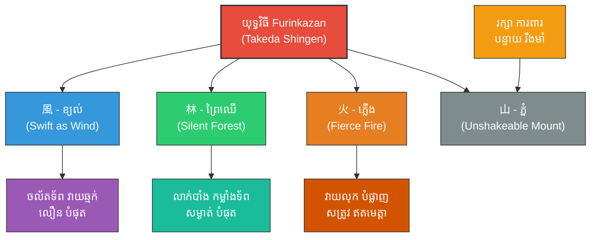

# Samurai Bushido (ឥទ្ធិពលលើសាមូរ៉ៃជប៉ុន៖ របៀបដែលសង្គ្រាមបុរាណជប៉ុនយកទ្រឹស្តីស៊ុនអ៊ូធ្វើជាត្រីវិស័យ)

**Author:** ichamrong  
**Date:** 2026-05-27  
**Tags:** #samurai #bushido #japan #takedashingen #suntzu #artofwar #history #martialarts #philosophy #psychology #zen  
**Category:** Biographies / Related / History  
**Read Time:** ~20 min  

---

## 📌 មាតិកា (Table of Contents)
- [សេចក្តីផ្តើម៖ កាយវិភាគវិទ្យានៃយុទ្ធសាស្ត្រចម្បាំង (Introduction: Strategic Samurai Anatomy)](#intro)
- [១. ទស្សនៈវិភាគ និងបរិបទប្រវត្តិសាស្ត្រជប៉ុន (Perspective & Japanese Feudal Context)](#context)
- [២. 🏛️ [គ្រឹះទស្សនវិជ្ជា] / [Philosophical Core] - ទស្សនវិជ្ជាស្នូល៖ សេនពុទ្ធសាសនា និងសេចក្តីស្លាប់ជាសេរីភាព (The Philosophical Core: Zen Buddhism & Death as Liberation)](#philosophical-core)
- [៣. 🧠 [យន្តការចិត្តសាស្ត្រ] / [Psychological Mechanism] - យន្តការចិត្តសាស្ត្រ៖ ការលុបបំបាត់ការស្ទាក់ស្ទើរ និងការផ្តោតអារម្មណ៍ជ្រៅ (Psychological Mechanism: Eliminating Hesitation & Hyper-Focus)](#psychological-mechanisms)
- [៤. គំនូសបំរែបំរួលយុទ្ធសាស្ត្រ (Strategic Mermaid Diagram)](#diagram)
- [៥. ⚠️ [ភាពផ្ទុយគ្នា និងការរិះគន់] / [Paradoxes & Criticisms] - ភាពផ្ទុយគ្នា និងការរិះគន់ (Paradoxes & Criticisms)](#paradoxes-criticisms)
- [៦. 🚀 [មេរៀនអនុវត្ត] / [Practical Application] - តារាងប្រៀបធៀបយុទ្ធសាស្ត្រ (Strategic Comparison Table)](#comparison-table)
- [សេចក្តីសន្និដ្ឋាន (Conclusion)](#conclusion)
- [🔗 ឯកសារទាក់ទង (Related Topics)](#related-topics)
- [ឯកសារយោង (References)](#references)

---

## សេចក្តីផ្តើម៖ កាយវិភាគវិទ្យានៃយុទ្ធសាស្ត្រចម្បាំង (Introduction: Strategic Samurai Anatomy)

> **«ចូរមានភាពរហ័សរហួនដូចខ្យល់ ស្ងៀមស្ងាត់ដូចព្រៃឈើ វាយលុកដណ្តើមយកជ័យដូចភ្លើងឆេះ និងរឹងមាំមិនរង្គើដូចភ្នំ។» — ស៊ុន អ៊ូ**  
> *(“Be extremely swift as the wind, silent as the forest, fierce as the fire, and unshakeable as the mountain.” — Sun Tzu)*

នៅសតវត្សរ៍ទី ៨ ក្បួនសឹកស៊ុនអ៊ូត្រូវបាននាំចូលទៅកាន់ប្រទេសជប៉ុន និងមានឥទ្ធិពលយ៉ាងជ្រៅជ្រះលើក្រមសីលធម៌ចម្បាំង **សាមូរ៉ៃ (Samurai)** និងរបៀបធ្វើសង្គ្រាមរបស់មេទ័ពល្បីៗក្នុងយុគសម័យសង្គ្រាមស៊ីវិល (Sengoku Period) ដូចជា **តាកេដា ស៊ីនហ្គែន (Takeda Shingen)**។

---

## ១. ទស្សនៈវិភាគ និងបរិបទប្រវត្តិសាស្ត្រជប៉ុន (Perspective & Japanese Feudal Context)

យុគសម័យសង្គ្រាមស៊ីវិលជប៉ុនគឺជាយុគសម័យដែលមានការបង្ហូរឈាម និងការក្បត់គ្នាយ៉ាងសាហាវដើម្បីដណ្តើមទឹកដី។ មេទ័ពសាមូរ៉ៃជប៉ុនបានរកឃើញថា ក្បួនសឹករបស់ស៊ុនអ៊ូផ្តល់នូវដំណោះស្រាយឆ្លាតវៃក្នុងការយកឈ្នះសត្រូវដោយប្រើប្រាស់យុទ្ធសាស្ត្រ និងការចល័តទ័ព ប្រសើរជាងការប្រើប្រាស់តែកម្លាំងកាយ និងដាវសាមូរ៉ៃ។

មេទ័ព តាកេដា ស៊ីនហ្គែន បានយកទ្រឹស្តីស៊ុនអ៊ូមកបង្កើតជាយុទ្ធវិធី និងក្រមវិន័យយោធាផ្ទាល់ខ្លួន ដែលជួយឱ្យលោកក្លាយជាមេទ័ពម្នាក់ដែលគួរឱ្យខ្លាចបំផុតក្នុងប្រវត្តិសាស្ត្រជប៉ុន។

---

## 🏛️ [គ្រឹះទស្សនវិជ្ជា] / [Philosophical Core] - ទស្សនវិជ្ជាស្នូល៖ សេនពុទ្ធសាសនា និងសេចក្តីស្លាប់ជាសេរីភាព (The Philosophical Core: Zen Buddhism & Death as Liberation)

ការរួមបញ្ចូលគ្នារវាងក្បួនសឹកស៊ុនអ៊ូ និងក្រមចម្បាំងរបស់ជប៉ុន បានបង្កើតជាទស្សនវិជ្ជាចម្លែកមួយ៖

### ក. ទ្រឹស្តី Mushin របស់សេន (Zen Mind of No-Mind - 无心)
*   **ចិត្តគ្មានចិត្ត (Mushin / 无心):** សាមូរ៉ៃបានយកទស្សនវិជ្ជា **Zen Buddhism** មកប្រើដើម្បីសម្រេចបាននូវស្ថានភាព «គ្មានគំនិត និងគ្មានអត្មា» (No-mind / No-ego)។ នៅពេលប្រយុទ្ធ ពួកគេមិនគិតពីជ័យជម្នះ ការចាញ់ ឬជីវិតខ្លួនឯងឡើយ។ ពួកគេគ្រាន់តែជា «ឧបករណ៍នៃធម្មជាតិ» ដែលធ្វើសកម្មភាពភ្លាមៗប្រៀបដូចជាទឹកដែលហូរចុះ។
*   **ការរួបរួមជាមួយស៊ុនអ៊ូ៖** នេះស្របទៅនឹងគោលការណ៍ «ភាពគ្មានរូបរាង» (*Formlessness*) របស់ស៊ុនអ៊ូ។ នៅពេលសាមូរ៉ៃគ្មានការភ័យខ្លាច ពួកគេនឹងគ្មានរូបរាងឱ្យសត្រូវចាប់ថ្នាក់ផ្លូវចិត្តបានឡើយ។

### ខ. ការទទួលយកសេចក្តីស្លាប់ជាសេរីភាព (Death as Freedom)
ក្រមសីលធម៌ Bushido (武士道) ចែងថា៖ *«ផ្លូវរបស់សាមូរ៉ៃ គឺស្ថិតនៅលើការយល់ដឹងពីសេចក្តីស្លាប់»*។ តាមរយៈការទទួលយកថារាងកាយអាចស្លាប់គ្រប់ពេល (Stoic Acceptance) សាមូរ៉ៃបានរំដោះខ្លួនចេញពីភាពភ័យខ្លាចទាំងអស់ ដែលធ្វើឱ្យកម្លាំងប្រយុទ្ធរបស់ពួកគេមានកម្រិតខ្ពស់បំផុត។

> [!TIP]
> **គន្លឹះយុទ្ធសាស្ត្របែបសេន (Zen Strategy Principle):**
> ក្នុងដំណោះស្រាយសមរភូមិជីវិត ឬជំនួញ ភាពរារែកភ័យខ្លាចការខូចខាត (Loss Aversion) គឺជាឧបសគ្គធំបំផុត។ ការផ្តាច់ចិត្តពីការតោងជាប់នឹងលទ្ធផល (Non-attachment) ជួយឱ្យចិត្តរបស់អ្នកមានសេរីភាពពេញលេញ និងធ្វើសកម្មភាពប្រកបដោយប្រសិទ្ធភាពអតិបរមា។

---

## 🧠 [យន្តការចិត្តសាស្ត្រ] / [Psychological Mechanism] - យន្តការចិត្តសាស្ត្រ៖ ការលុបបំបាត់ការស្ទាក់ស្ទើរ និងការផ្តោតអារម្មណ៍ជ្រៅ (Psychological Mechanism: Eliminating Hesitation & Hyper-Focus)

យុទ្ធវិធីសាមូរ៉ៃដំណើរការតាមរយៈការគ្រប់គ្រងស្មារតីចុងក្រោយ៖

### ក. ការលុបបំបាត់ការស្ទាក់ស្ទើរ (Eliminating Suki - 隙)
នៅក្នុងសិល្បៈដាវជប៉ុន (Kenjutsu) ពាក្យ **Suki (隙)** មានន័យថា «ការស្ទាក់ស្ទើរ ឬចន្លោះប្រហោងផ្លូវចិត្ត»៖
*   **យន្តការផ្លូវចិត្ត៖** នៅពេលមនុស្សគិតច្រើន ឬបារម្ភពីលទ្ធផល វានឹងបង្កើតឱ្យមានភាពយឺតយ៉ាវក្នុងការសម្រេចចិត្ត (Micro-hesitation) ទោះបីជាត្រឹមតែមួយភាគដប់នៃវិនាទីក៏ដោយ។
*   **ការដោះស្រាយ៖** ការបណ្តុះបណ្តាលផ្លូវចិត្តឱ្យធ្លាក់ចូលទៅក្នុងស្ថានភាព **Hyper-Focus (លំហូរអារម្មណ៍ខ្ពស់បំផុត - Flow State)** ជួយលុបបំបាត់ *Suki* ទាំងអស់ ធ្វើឱ្យរាល់ចលនាដាវមានភាពរហ័សរហួនដូចខ្យល់ ស្របតាមក្បួន Furinkazan។

### ខ. ចិត្តសាស្ត្រនៃភាពមិនរង្គើ (Unshakeable Mount Psychology)
*   **山 - ភ្នំ (Unshakeable):** នេះជាការរៀបចំចិត្តសាស្ត្រឱ្យមានភាពរឹងមាំមិនរង្គើចំពោះការបំភិតបំភ័យរបស់សត្រូវ (Mental Fortitude / Stoic Resilience)។ ទោះបីជាសត្រូវប្រើល្បិចបោកបញ្ឆោត ឬបង្កើតពាក្យចចាមអារ៉ាមបំភ័យយ៉ាងណាក៏ដោយ ក៏សាមូរ៉ៃនៅតែរក្សាភាពស្ងប់ស្ងៀម និងវាយតម្លៃស្ថានភាពដោយគ្មានការភ័យស្លន់ស្លោ (Deterring Tactical Tilt)។

> [!IMPORTANT]
> **មេរៀនគ្រឹះសីលដាវសាមូរ៉ៃ (Core Samurai Axiom):**
> ចន្លោះប្រហោងយុទ្ធសាស្ត្រ (Suki) មិនមែនកើតឡើងពីកង្វះបច្ចេកទេសឡើយ តែវាជាការបែកញែកផ្លូវចិត្តដោយសារតែមន្ទិលសង្ស័យ និងការភ័យខ្លាចសេចក្តីស្លាប់។

---

## ៤. គំនូសបំរែបំរួលយុទ្ធសាស្ត្រ (Strategic Mermaid Diagram)

---

## ⚠️ [ភាពផ្ទុយគ្នា និងការរិះគន់] / [Paradoxes & Criticisms] - ភាពផ្ទុយគ្នា និងការរិះគន់ (Paradoxes & Criticisms)

*   **ល្បិចកលធៀបនឹងកិត្តិយស (Deception vs. Honor):** ក្រមសីលធម៌ Bushido លើកតម្កើងការប្រយុទ្ធគ្នាចំមុខដោយកិត្តិយស (Fair duel) ប៉ុន្តែក្បួនសឹកស៊ុនអ៊ូបង្រៀនឱ្យប្រើល្បិចបោកសត្រូវ (Deception) ដែលបង្កជាទំនាស់ផ្លូវចិត្តសម្រាប់អ្នកចម្បាំងសាមូរ៉ៃខ្លះ។ ពួកគេយល់ឃើញថា ការបោកប្រាស់សត្រូវគឺជាទង្វើថោកទាប។
*   **សេចក្តីស្លាប់ធៀបនឹងការរស់រាន (Death vs. Survival):** Bushido បង្រៀនឱ្យសាមូរ៉ៃត្រៀមខ្លួនស្លាប់ជានិច្ចដើម្បីកិត្តិយស (Seppuku/Harakiri) ឯស៊ុនអ៊ូបង្រៀនឱ្យមេទ័ពធ្វើសកម្មភាពដើម្បី «រស់រានមានជីវិត និងរក្សាកងទ័ព» ជាចម្បង។ ការបូជាជីវិតដោយគ្មានផលប្រយោជន៍យុទ្ធសាស្ត្រ ត្រូវបានស៊ុនអ៊ូចាត់ទុកថាជាកំហុសយោធាដ៏ធ្ងន់ធ្ងរ។

> [!CAUTION]
> **ប៉ារ៉ាដុកនៃការគិតគូរហួសហេតុលើកិត្តិយស (The Honor Trap):**
> ក្នុងសមរភូមិជាក់ស្តែង ការប្រកាន់ខ្ជាប់នូវកិត្តិយសបែបបុរាណហួសហេតុ ដោយមិនព្រមបត់បែនប្រើប្រាស់យុទ្ធសាស្ត្រ ឬដកថយ អាចនាំទៅរកការបំផ្លិចបំផ្លាញកងទ័ពទាំងស្រុង ដូចដែលបានកើតឡើងចំពោះកងទ័ពសាមូរ៉ៃនៅសមរភូមិ Nagashino (១៥៧៥) ដែលត្រូវរលាយសាបសូន្យក្រោមគ្រាប់កាំភ្លើងភ្លើងរបស់ Oda Nobunaga។

---

## 🚀 [មេរៀនអនុវត្ត] / [Practical Application] - តារាងប្រៀបធៀបយុទ្ធសាស្ត្រ (Strategic Comparison Table)

| គោលការណ៍ស៊ុនអ៊ូ (Sun Tzu's Principle) | យុទ្ធវិធីសាមូរ៉ៃ (Samurai Application) | លទ្ធផលជាក់ស្តែង (Practical Result) |
| :--- | :--- | :--- |
| *«លឿនដូចខ្យល់ ស្ងាត់ដូចព្រៃ»* | ទង់សមរភូមិ Furinkazan របស់ស៊ីនហ្គែន | បង្កើតជាកងទ័ពចម្បាំងដែលមានសណ្តាប់ធ្នាប់ និងសាហាវបំផុត។ |
| *«មេដឹកនាំត្រូវមានវិន័យតឹងរ៉ឹង»* | ក្រមសីលធម៌ Bushido របស់សាមូរ៉ៃ | ទាហានយល់ព្រមបូជាជីវិតដើម្បីកិត្តិយស និងមេដឹកនាំរបស់ខ្លួន។ |
| *«ដឹងពីស្ថានភាពភូមិសាស្ត្រ»* | ការប្រើប្រាស់ប្រាសាទភ្នំដើម្បីការពារ | បង្កើតជាបន្ទាយការពារដែលសត្រូវមិនអាចវាយបែកបាន។ |

---

## 🧭 ការរុករកយុទ្ធសាស្ត្រ (Strategic Navigation - Down the Rabbit Hole)
*   **[« យុទ្ធសាស្ត្រមុន (Previous Strategy)](13-risk-management.md)**
*   **[យុទ្ធសាស្ត្របន្ទាប់ (Next Strategy) »](15-psychological-warfare.md)**

---

## សេចក្តីសន្និដ្ឋាន (Conclusion)

ការយល់ដឹង និងការយកយុទ្ធសាស្ត្រសឹកអមតៈរបស់ស៊ុនអ៊ូមកអនុវត្តជាក់ស្តែងជួយឱ្យសាមូរ៉ៃមានសមត្ថភាពគិតជាប្រព័ន្ធ សម្រេចចិត្តយ៉ាងត្រជាក់ចិត្ត និងចេះបត់បែនគ្រប់កាលៈទេសៈ ដើម្បីសម្រេចបានជោគជ័យ និងជ័យជម្នះអមតៈនៅក្នុងជីវិត និងការងារប្រចាំថ្ងៃ។

---

## 🔗 ឯកសារទាក់ទង (Related Topics)
*   [ជីវប្រវត្តិ ស៊ុន អ៊ូ (The Biography of Sun Tzu)](../01-sun-tzu-biography.md)
*   [សៀវភៅ The Art of War (The Art of War Book)](01-the-art-of-war.md)
*   [យុទ្ធសាស្ត្រវាយឆ្មក់របស់ ម៉ៅ សេទុង (Mao Zedong Strategy)](02-mao-zedong-guerrilla-warfare.md)

## ឯកសារយោង (References)
*   **Sun, Tzu (1910).** *The Art of War*. Translated by Lionel Giles. London: Luzac & Co.
*   **Tsunetomo, Yamamoto (1716).** *Hagakure: The Book of the Samurai*. Translated by William Scott Wilson. Kodansha International.
*   **Musashi, Miyamoto (1645).** *The Book of Five Rings*. Translated by Thomas Cleary. Shambhala Publications.
*   **Herrigel, Eugen (1953).** *Zen in the Art of Archery*. Pantheon Books (Explores Zen mind and *Mushin*).
*   **Turnbull, Stephen (1977).** *The Samurai: A Military History*. Osprey Publishing.
*   **Sato, Hiroaki (1995).** *The Sword & the Mind*. Overlook Press.

---
*Last updated: 2026-05-27*
