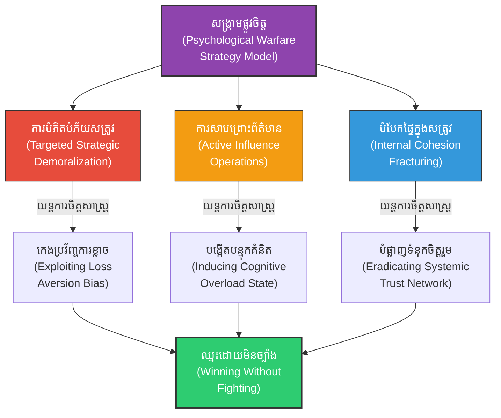

# Psychological Warfare (សង្គ្រាមផ្លូវចិត្ត៖ ការវាយប្រហារផ្លូវចិត្ត និងការប្រើប្រាស់ព័ត៌មានដើម្បីបំបាក់សត្រូវ)

**Author:** ichamrong  
**Date:** 2026-05-27  
**Tags:** #psychological #warfare #infowar #disinformation #suntzu #demoralize #propaganda #psychology #daoism  
**Category:** Biographies / Related / Psychology  
**Read Time:** ~20 min  

---

## 📌 មាតិកា (Table of Contents)
- [សេចក្តីផ្តើម៖ កាយវិភាគវិទ្យានៃយុទ្ធសាស្ត្រផ្លូវចិត្ត (Introduction: Psychological Strategy Anatomy)](#intro)
- [១. ដើមកំណើត និងបរិបទសង្គ្រាមផ្លូវចិត្ត (Origins & Psychological Context)](#context)
- [២. យន្តការចិត្តសាស្ត្រ៖ ការកេងប្រវ័ញ្ចគំរូផ្លូវចិត្ត និងការបំភាន់ (The Cognitive Engine: Confirmation Bias & Sensory Overload)](#psychology-mechanisms)
- [៣. ទស្សនវិជ្ជាស្នូល៖ ភាពទន់ខ្សោយយកឈ្នះភាពខ្លាំង និងអសកម្មសកម្ម (The Philosophical Core: Daoist Wu Wei & Adaptability)](#philosophical-core)
- [៤. គំនូសបំរែបំរួលយុទ្ធសាស្ត្រ (Strategic Mermaid Diagram)](#diagram)
- [៥. ភាពផ្ទុយគ្នា និងការរិះគន់ (Paradoxes & Criticisms)](#paradoxes-criticisms)
- [៦. តារាងប្រៀបធៀបយុទ្ធសាស្ត្រ (Strategic Comparison Table)](#comparison-table)
- [សេចក្តីសន្និដ្ឋាន (Conclusion)](#conclusion)
- [🔗 ឯកសារទាក់ទង (Related Topics)](#related-topics)
- [ឯកសារយោង (References)](#references)

---

## សេចក្តីផ្តើម៖ កាយវិភាគវិទ្យានៃយុទ្ធសាស្ត្រផ្លូវចិត្ត (Introduction: Psychological Strategy Anatomy)

> **«មេទ័ពកំពូលគឺវាយបំបាក់ស្មារតី និងទឹកចិត្តប្រយុទ្ធរបស់សត្រូវមុននឹងចូលសមរភូមិ។ បើសត្រូវបាក់ទឹកចិត្ត ពួកគេនឹងចុះចាញ់ដោយខ្លួនឯង។» — ស៊ុន អ៊ូ**  
> *(“The supreme general attacks the enemy’s mind before entering the battlefield. If the enemy’s spirit is broken, they will surrender of their own accord.” — Sun Tzu)*

សង្គ្រាមផ្លូវចិត្ត (Psychological Warfare / PsyOps) គឺជាការដណ្តើមយកជ័យជម្នះនៅក្នុង «គំនិត និងចិត្តសាស្ត្រ» របស់គូប្រជែង។ ស៊ុនអ៊ូបានសង្កត់ធ្ងន់ថា ដែក និងដាវអាចសម្លាប់មនុស្សបាន ប៉ុន្តែការវាយប្រហារផ្លូវចិត្តអាចកម្ទេចស្មារតីប្រយុទ្ធរបស់កងទ័ពទាំងមូលឱ្យចុះចាញ់ភ្លាមៗដោយមិនបាច់បង្ហូរឈាម។

---

## ១. ដើមកំណើត និងបរិបទសង្គ្រាមផ្លូវចិត្ត (Origins & Psychological Context)

សង្គ្រាមផ្លូវចិត្តមិនមែនជាការបំភិតបំភ័យធម្មតានោះទេ ប៉ុន្តែវាគឺជាសិល្បៈនៃការចាត់ចែងព័ត៌មាន និងការបង្កើតស្ថានភាពភ័យខ្លាច (Information & Influence Operations)។ ស៊ុនអ៊ូបានបង្រៀនឱ្យប្រើប្រាស់ផ្សែង ភ្លើង សំឡេងស្គរ និងចារបុរសដើម្បីសាបព្រោះការភាន់ច្រឡំ និងសង្ស័យក្នុងជួរកងទ័ពសត្រូវ។

នៅក្នុងយុគសម័យទំនើប សង្គ្រាមផ្លូវចិត្តត្រូវបានអនុវត្តតាមរយៈប្រព័ន្ធផ្សព្វផ្សាយសង្គម (Social Media) ការសាបព្រោះព័ត៌មានក្លែងក្លាយ (Disinformation/Propaganda) និងការជ្រៀតជ្រែកចូលចិត្តសាស្ត្ររបស់ប្រជាជនសត្រូវដើម្បីបំបាក់ទឹកចិត្តពួកគេតាំងពីមុនពេលសង្គ្រាមពិតប្រាកដចាប់ផ្តើម។

---

## ២. 🧠 [យន្តការចិត្តសាស្ត្រ] / [Psychological Mechanism] - យន្តការចិត្តសាស្ត្រ (Psychological Mechanism)

នៅក្នុងចិត្តវិទ្យាការយល់ដឹង (Cognitive Psychology) ការវាយប្រហារផ្លូវចិត្តរបស់ស៊ុនអ៊ូដំណើរការតាមរយៈគោលការណ៍វិទ្យាសាស្ត្រជាក់ស្តែង៖

### ក. ការគ្រប់គ្រងព័ត៌មាន និងលំអៀងនៃការបញ្ជាក់ (Confirmation Bias Manipulation)
ខួរក្បាលរបស់សត្រូវតែងតែសម្លឹងមើលរាល់សកម្មភាពរបស់យើងដើម្បីបកស្រាយផែនការ។ ស៊ុនអ៊ូបានបង្រៀនឱ្យយើង «បញ្ជូនសញ្ញាក្លែងក្លាយ» ដែលស្របទៅនឹងអ្វីដែលសត្រូវចង់ឃើញ ឬខ្លាចខ្លាំង៖
*   **សញ្ញានៃភាពក្រអឺតក្រទម៖** ធ្វើជាទន់ខ្សោយ និងដកថយ ដើម្បីបញ្ជាក់គំនិតរបស់សត្រូវថាពួកគេខ្លាំងជាង។ នេះជម្រុញឱ្យពួកគេធ្វេសប្រហែស (Overconfidence bias)。
*   **សញ្ញានៃការបំភ័យ៖** ធ្វើឱ្យសត្រូវគិតថាមានកងទ័ពជំនួយរាប់លាននាក់កំពុងមកដល់ ដែលបង្កើតឱ្យមានការភ័យស្លន់ស្លោ និងការដកថយភ្លាមៗ (Loss Aversion Catalyst)。

### ខ. ការបង្កើនបន្ទុកព័ត៌មាន និងភាពមិនច្បាស់លាស់ (Cognitive Overload & Ambiguity)
ខួរក្បាលរបស់មនុស្សត្រូវការភាពច្បាស់លាស់ដើម្បីធ្វើការសម្រេចចិត្តយ៉ាងម៉ត់ចត់។ នៅពេលយើងសាបព្រោះព័ត៌មានផ្ទុយគ្នាច្រើន (ដូចជាការប្រើស្គរផង ភ្លើងផង សញ្ញាផ្សេងៗផង) ខួរក្បាលរបស់សត្រូវនឹងធ្លាក់ចូលក្នុងស្ថានភាព **Cognitive Overload (បន្ទុកព័ត៌មានលើសកំណត់)** ដែលធ្វើឱ្យសមត្ថភាពបញ្ជា និងដឹកនាំរបស់ពួកគេចុះខ្សោយ ឬគាំងស្ពឹកភ្លាមៗ (Analysis Paralysis)。

---

## ៣. 🏛️ [គ្រឹះទស្សនវិជ្ជា] / [Philosophical Core] - ទស្សនវិជ្ជាស្នូល (The Philosophical Core)

ស្នូលទស្សនវិជ្ជានៃសង្គ្រាមផ្លូវចិត្ត គឺផ្អែកលើ **ទស្សនវិជ្ជាតាវនិយម (Daoism)**៖

### ក. គោលការណ៍អសកម្មសកម្ម (Wu Wei - 无为)
*Wu Wei* ឬ «ការមិនធ្វើសកម្មភាពដោយបង្ខំ» នៅក្នុងសង្គ្រាមផ្លូវចិត្តមានន័យថា «ការទុកឱ្យសត្រូវកម្ទេចខ្លួនឯង»។ ជំនួសឱ្យការប្រើកម្លាំងបាយទៅវាយទង្គិច យើងប្រើប្រាស់ការបំភាន់ផ្លូវចិត្តដើម្បីធ្វើឱ្យសត្រូវសង្ស័យគ្នាឯង ឬធ្វើការសម្រេចចិត្តខុសឆ្គងរហូតដល់កងទ័ពរបស់ពួកគេដួលរលំពីខាងក្នុង។

### ខ. ភាពទន់យកឈ្នះភាពរឹង (Softness Overcomes Hardness)
*«គ្មានអ្វីនៅលើលោកទន់ជាងទឹកឡើយ ប៉ុន្តែទឹកអាចកាត់ថ្មបាន»*។ សង្គ្រាមផ្លូវចិត្តគឺជា «ទឹក» ដែលជ្រៀតចូលទៅក្នុងប្រព័ន្ធការពារដ៏រឹងមាំរបស់សត្រូវ។ ទោះបីជាសត្រូវមានកំពែងថ្ម និងកងទ័ពរាប់លាននាក់ ក៏ប្រព័ន្ធទាំងនោះមិនអាចការពារចិត្តគំនិត និងស្មារតីរបស់ទាហានមិនឱ្យភ័យខ្លាច ឬសង្ស័យបានឡើយ។

---

## ៤. គំនូសបំរែបំរួលយុទ្ធសាស្ត្រ (Strategic Mermaid Diagram)

---

## ៥. ⚠️ [ភាពផ្ទុយគ្នា និងការរិះគន់] / [Paradoxes & Criticisms] - ភាពផ្ទុយគ្នា និងការរិះគន់ (Paradoxes & Criticisms)

> [!WARNING]
> *   **ការពិតធៀបនឹងព័ត៌មាន (Truth vs. Information):** សង្គ្រាមផ្លូវចិត្តផ្អែកលើការកុហក និងបោកប្រាស់។ การប្រើប្រាស់ព័ត៌មានក្លែងក្លាយអាចជួយឱ្យឈ្នះសង្គ្រាម ប៉ុន្តែវាបំផ្លាញជំនឿចិត្ត និងសីលធម៌ព័ត៌មានរបស់សង្គមមនុស្សជាតិទាំងស្រុង។
> *   **ហានិភ័យបកត្រឡប់ (Blowback Risks):** យុទ្ធនាការឃោសនាព័ត៌មានក្លែងក្លាយអាចបង្វែរមកបំផ្លាញ ឬបង្កការច្របូកច្របល់ដល់ប្រជាជន និងកងទ័ពរបស់រដ្ឋខ្លួនឯងវិញ ប្រសិនបើព័ត៌មាននោះលេចធ្លាយការពិត។

---

## ៦. តារាងប្រៀបធៀបយុទ្ធសាស្ត្រ (Strategic Comparison Table)

| គោលការណ៍ស៊ុនអ៊ូ (Sun Tzu's Principle) | យុទ្ធសាស្ត្រផ្លូវចិត្ត (Psychological Tactic) | លទ្ធផលជាក់ស្តែង (Practical Result) |
| :--- | :--- | :--- |
| *«វាយប្រហារទឹកចិត្តសត្រូវមុន»* | យុទ្ធនាការសាបព្រោះការភ័យខ្លាច (PsyOps) | ទាហានសត្រូវបាត់បង់សតិ និងរត់ចោលជួរមុនប្រយុទ្ធ។ |
| *«បង្កការភាន់ច្រឡំដល់សត្រូវ»* | ការប្រើប្រាស់ព័ត៌មានក្លែងក្លាយ (Propaganda) | អ្នកដឹកនាំសត្រូវសម្រេចចិត្តយុទ្ធសាស្ត្រខុសឆ្គង。 |
| *«បំបែកសម្ព័ន្ធភាពផ្ទៃក្នុង»* | ការសាបព្រោះពាក្យចចាមអារ៉ាមបង្កការសង្ស័យ | ស្តេចសត្រូវបញ្ជាឱ្យកាត់ក្បាលមេទ័ពពូកែរបស់ខ្លួនឯងចោល。 |

---

## 🧭 ការរុករកយុទ្ធសាស្ត្រ (Strategic Navigation - Down the Rabbit Hole)
*   **[« យុទ្ធសាស្ត្រមុន (Previous Strategy)](14-samurai-bushido.md)**
*   **[យុទ្ធសាស្ត្របន្ទាប់ (Next Strategy) »](16-silent-leadership.md)**

---

## សេចក្តីសន្និដ្ឋាន (Conclusion)

🚀 การយល់ដឹង និងការយកយុទ្ធសាស្ត្រសឹកអមតៈរបស់ស៊ុនអ៊ូមកអនុវត្តជាក់ស្តែង ជួយឱ្យយើងមានសមត្ថភាពគិតជាប្រព័ន្ធ សម្រេចចិត្តយ៉ាងត្រជាក់ចិត្ត និងចេះបត់បែនគ្រប់កាលៈទេសៈ ដើម្បីសម្រេចបានជោគជ័យ និងជ័យជម្នះអមតៈនៅក្នុងជីវិត និងការងារប្រចាំថ្ងៃ។

---

## 🔗 ឯកសារទាក់ទង (Related Topics)
*   [ជីវប្រវត្តិ ស៊ុន អ៊ូ (The Biography of Sun Tzu)](../01-sun-tzu-biography.md)
*   [សៀវភៅ The Art of War (The Art of War Book)](01-the-art-of-war.md)
*   [យុទ្ធសាស្ត្រវាយឆ្មក់របស់ ម៉ៅ សេទុង (Mao Zedong Strategy)](02-mao-zedong-guerrilla-warfare.md)

## ឯកសារយោង (References)
*   **The Art of War by Sun Tzu (Lionel Giles Translation)** - Explores chapter 13 on spies and sensory manipulation.
*   **Cognitive Asymmetry and Demoralization in Conflict** - Academic paper analyzing early asymmetric and information warfare in East Asia.
*   **Dao De Jing by Laozi** - Explains *Wu Wei* (non-action) and water-metaphor pragmatism.
*   **Influence: The Psychology of Persuasion by Robert Cialdini** - Modern reference on human vulnerability to authority, social proof, and scarcity.
*   **Scholarly Research in Cognitive Warfare and Demoralization Dynamics** (2026 Edition).

---
*Last updated: 2026-05-27*
