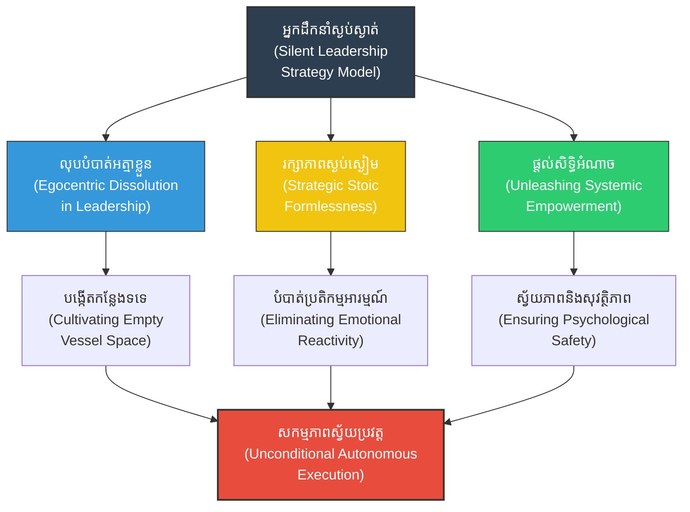

# Silent Leadership (ការដឹកនាំដោយស្ងៀមស្ងាត់៖ សិល្បៈនៃការរៀបចំយុទ្ធសាស្ត្រនៅពីក្រោយវាំងនន)

**Author:** ichamrong  
**Date:** 2026-05-27  
**Tags:** #leadership #management #silent #strategy #suntzu #wisdom #calmness #stoicism #daoism #psychology  
**Category:** Biographies / Related / Leadership  
**Read Time:** ~20 min  

---

## 📌 មាតិកា (Table of Contents)
- [សេចក្តីផ្តើម៖ កាយវិភាគវិទ្យានៃអ្នកដឹកនាំស្ងប់ស្ងាត់ (Introduction: The Anatomy of a Silent Leader)](#intro)
- [១. ទស្សនៈវិភាគ និងបរិបទប្រវត្តិសាស្ត្រ (Perspective & Context Analysis)](#context)
- [២. ទស្សនវិជ្ជាស្នូល៖ ផើងទទេរបស់តាវ និងការរលាយបាត់នៃអត្មា (The Philosophical Core: Daoist Empty Vessel & Ego Dissolution)](#philosophical-core)
- [៣. យន្តការចិត្តសាស្ត្រ៖ សិទ្ធិអំណាចស្ងប់ស្ងាត់ និងសុវត្ថិភាពផ្លូវចិត្ត (Psychological Mechanism: Silent Authority & Psychological Safety)](#psychology-mechanisms)
- [៤. គំនូសបំរែបំរួលយុទ្ធសាស្ត្រ (Strategic Mermaid Diagram)](#diagram)
- [៥. ភាពផ្ទុយគ្នា និងការរិះគន់ (Paradoxes & Criticisms)](#paradoxes-criticisms)
- [៦. តារាងប្រៀបធៀបយុទ្ធសាស្ត្រ (Strategic Comparison Table)](#comparison-table)
- [សេចក្តីសន្និដ្ឋាន (Conclusion)](#conclusion)
- [🔗 ឯកសារទាក់ទង (Related Topics)](#related-topics)
- [ឯកសារយោង (References)](#references)

---

## សេចក្តីផ្តើម៖ កាយវិភាគវិទ្យានៃអ្នកដឹកនាំស្ងប់ស្ងាត់ (Introduction: The Anatomy of a Silent Leader)

> **«អ្នកដឹកនាំដ៏អស្ចារ្យត្រូវតែមានភាពស្ងៀមស្ងាត់ដើម្បីរក្សាការសម្ងាត់ ត្រូវមានភាពស្មោះត្រង់ និងយុត្តិធម៌ដើម្បីរក្សាវិន័យ។» — ស៊ុន អ៊ូ**  
> *(“A general must be calm and dark, upright and disciplined.” — Sun Tzu)*

មេដឹកនាំល្អមិនមែនជាអ្នកដែលចូលចិត្តស្រែកបញ្ជាខ្លាំងៗដើម្បីបង្ហាញអំណាច ឬបង្ហាញខ្លួននៅលើឆាកគ្រប់ពេលនោះឡើយ។ ផ្ទុយទៅវិញ ស៊ុនអ៊ូបានលើកឡើងថា អ្នកដឹកនាំដ៏អស្ចារ្យគឺជាបុគ្គលដែលស្ងប់ស្ងាត់ (Silent Leader) ចូលចិត្តគិត វិភាគ រៀបចំផែនការយ៉ាងសម្ងាត់នៅពីក្រោយវាំងនន និងផ្តល់ទំនុកចិត្តដល់ក្រុមការងាររបស់ខ្លួន។

---

## ១. ទស្សនៈវិភាគ និងទស្សនវិជ្ជាដឹកនាំ (Perspective & Philosophical Leadership Context)

ការដឹកនាំដោយស្ងៀមស្ងាត់ (Silent Leadership) គឺជាការយកគោលការណ៍ «តាវនិយម» (Taoism) មកបញ្ចូលក្នុងសិល្បៈនៃការគ្រប់គ្រង។ អ្នកដឹកនាំដែលនិយាយច្រើន និងងាយប្រតិកម្មនឹងការផ្លាស់ប្តូរ នឹងធ្វើឱ្យបុគ្គលិកច្របូកច្របល់ និងបាត់បង់ការផ្តោតអារម្មណ៍។

ស៊ុនអ៊ូយល់ថា មេទ័ពត្រូវតែរក្សា «ភាពស្ងប់ស្ងៀម និងអាថ៌កំបាំង» (Dark and impenetrable as night) ដើម្បីកុំឱ្យសត្រូវ ឬសូម្បីតែទាហានរបស់ខ្លួនឯងដឹងពីផែនការយុទ្ធសាស្ត្រមុន ដែលជួយឱ្យការសម្រេចចិត្តមានភាពច្បាស់លាស់ និងរក្សាការសម្ងាត់បានល្អបំផុត។

---

## ២. 🏛️ [គ្រឹះទស្សនវិជ្ជា] / [Philosophical Core] - ទស្សនវិជ្ជាស្នូល៖ ផើងទទេរបស់តាវ និងការរលាយបាត់នៃអត្មា (The Philosophical Core: Daoist Empty Vessel & Ego Dissolution)

សិល្បៈនៃការដឹកនាំដោយស្ងៀមស្ងាត់ ជ្រួតជ្រាបដោយទស្សនវិជ្ជាបូព៌ាយ៉ាងជ្រៅ៖

### ក. ទ្រឹស្តីផើងទទេ (The Empty Vessel - 谷神)
នៅក្នុងទស្សនវិជ្ជាតាវនិយម ឧបករណ៍ប្រើប្រាស់នានាដូចជា ផើង ចាន ឬផ្ទះ គឺមានប្រយោជន៍ទៅបានដោយសារ «ភាពទទេ» របស់វា។ អ្នកដឹកនាំដែលស្ងប់ស្ងាត់ប្រៀបដូចជាផើងទទេ (Empty Vessel)៖
*   **ការមិនសង្កត់សង្កិន៖** ពួកគេមិនបំពេញកន្លែងការងារដោយ «អត្មា (Ego)» របស់ខ្លួនឡើយ ដែលធ្វើឱ្យមានលំហសម្រាប់អ្នកដទៃបញ្ចេញគំនិត និងសមត្ថភាព។
*   **ការលុបបំបាត់អត្មា (Ego Dissolution):** ស៊ុនអ៊ូបង្រៀនឱ្យមេទ័ពលះបង់ចោលនូវការចង់បានការសរសើរ ឬការចងចាំឈ្មោះរបស់ខ្លួនក្នុងប្រវត្តិសាស្ត្រ។ ជោគជ័យនៃប្រព័ន្ធទាំងមូល គឺជាគោលដៅតែមួយគត់។

### ខ. ការដឹកនាំបែបអរូប (Formless Leadership - 无形)
នៅពេលអ្នកដឹកនាំមិននិយាយច្រើន ឬបញ្ចេញប្រតិកម្មខ្លាំងៗ ពួកគេនឹងមានលក្ខណៈ «គ្មានរូបរាង» (Formless)។ នេះធ្វើឱ្យទាំងសត្រូវ និងសហការីមិនអាចព្យាករណ៍ ឬស្វែងរកចំណុចខ្សោយខាងអារម្មណ៍ (Emotional triggers) របស់អ្នកដឹកនាំបានឡើយ។

---

## ៣. 🧠 [យន្តការចិត្តសាស្ត្រ] / [Psychological Mechanism] - យន្តការចិត្តសាស្ត្រ (Psychological Mechanism)

តាមទស្សនៈចិត្តវិទ្យាទំនើប ភាពស្ងៀមស្ងាត់របស់អ្នកដឹកនាំមានអំណាចជះឥទ្ធិពលយ៉ាងខ្លាំង៖

### ក. សិទ្ធិអំណាចស្ងប់ស្ងាត់ និងការកាត់បន្ថយជម្លោះ (Silent Authority & De-escalation)
នៅពេលមានវិបត្តិ ឬភាពតានតឹង អ្នកដឹកនាំដែលឆ្លើយតបភ្លាមៗដោយកំហឹង ឬភាពភ័យស្លន់ស្លោ នឹងបញ្ជូនសញ្ញានៃអសន្តិសុខផ្លូវចិត្តទៅកាន់ក្រុមការងារទាំងមូល។ ផ្ទុយទៅវិញ៖
*   **Active Observation (ការសង្កេតសកម្ម):** ការរក្សាភាពស្ងប់ស្ងៀមជួយឱ្យអ្នកដឹកនាំមានពេលវិនិច្ឆ័យដោយគ្មានលំអៀង។
*   **Non-reactive Power:** ភាពស្ងប់ស្ងាត់នៅចំពោះមុខបញ្ហា ជួយកាត់បន្ថយអារម្មណ៍តានតឹងរបស់ក្រុមការងារ (De-escalating tension) ធ្វើឱ្យពួកគេមានអារម្មណ៍ថា «ស្ថានភាពស្ថិតក្រោមការគ្រប់គ្រង» (Stoic Detachment)。

### ខ. ការកសាងសុវត្ថិភាពផ្លូវចិត្ត (Cultivating Psychological Safety)
> [!IMPORTANT]
> ស៊ុនអ៊ូបានលើកឡើងថា៖ *«នៅពេលមេទ័ពគោរពទាហានដូចជាកូនបង្កើត ពួកគេនឹងស្ម័គ្រចិត្តដើរចូលសមរភូមិដ៏គ្រោះថ្នាក់ជាមួយមេទ័ព»*៖
*   **Empowerment & Autonomy:** អ្នកដឹកនាំស្ងប់ស្ងាត់មិនត្រួតត្រា ឬគ្រប់គ្រងកិច្ចការល្អិតល្អន់ឡើយ (No Micromanagement)。 ពួកគេផ្តល់សិទ្ធិអំណាច និងទំនុកចិត្តដល់ក្រុមការងារ។
*   **Ownership:** ក្រុមការងារនឹងមានអារម្មណ៍ថាខ្លួនជាម្ចាស់នៃការងារ (Autonomy and Ownership) ដែលជម្រុញឱ្យពួកគេបញ្ចេញសមត្ថភាពពិតប្រាកដ។

---

## ៤. គំនូសបំរែបំរួលយុទ្ធសាស្ត្រ (Strategic Mermaid Diagram)

---

## ៥. ⚠️ [ភាពផ្ទុយគ្នា និងការរិះគន់] / [Paradoxes & Criticisms] - ភាពផ្ទុយគ្នា និងការរិះគន់ (Paradoxes & Criticisms)

> [!WARNING]
> *   **គម្លាតនៃការទំនាក់ទំនង (Communication Gap):** การស្ងប់ស្ងាត់ខ្លាំងពេកអាចធ្វើឱ្យមានបញ្ហាកង្វះការទំនាក់ទំនង នាំឱ្យក្រុមការងារមិនយល់ពីទិសដៅពិតប្រាកដ ឬមានអារម្មណ៍ថាអ្នកដឹកនាំ «មិនខ្វល់ខ្វាយ»。
> *   **ភាពឯកោនៃអំណាច (Strategic Isolation):** การរក្សាភាពសម្ងាត់ និងដាច់ដោយឡែកពីគេខ្លាំងពេក អាចធ្វើឱ្យអ្នកដឹកនាំខ្វះព័ត៌មានជាក់ស្តែងពីថ្នាក់ក្រោម ឬងាយសម្រេចចិត្តខុសដោយសារកង្វះទស្សនៈចម្រុះ。

---

## ៦. តារាងប្រៀបធៀបយុទ្ធសាស្ត្រ (Strategic Comparison Table)

| គោលការណ៍ស៊ុនអ៊ូ (Sun Tzu's Principle) | ការដឹកនាំដោយស្ងៀមស្ងាត់ (Silent Leadership) | លទ្ធផលជាក់ស្តែង (Practical Result) |
| :--- | :--- | :--- |
| *«មេទ័ពត្រូវស្ងៀមស្ងាត់ និងសម្ងាត់»* | ការរក្សាការសម្ងាត់យុទ្ធសាស្ត្រអាជីវកម្ម | បញ្ចៀសការលេចធ្លាយព័ត៌មានទៅគូប្រជែង。 |
| *«ការដឹកនាំដោយស្ងប់ស្ងាត់»* | ការរក្សាភាពស្ងប់ស្ងៀមក្រោមស្ថានភាពវិបត្តិ | បង្កើតទំនុកចិត្ត និងភាពកក់ក្តៅដល់ក្រុមការងារ。 |
| *«សង្កេតសញ្ញាសត្រូវ»* | ការស្តាប់ និងសង្កេតមើលបញ្ហាបុគ្គលិក | ដោះស្រាយបញ្ហាផ្ទៃក្នុងទាន់ពេលវេលាមុននឹងផ្ទុះឡើង。 |

---

## 🧭 ការរុករកយុទ្ធសាស្ត្រ (Strategic Navigation - Down the Rabbit Hole)
*   **[« យុទ្ធសាស្ត្រមុន (Previous Strategy)](15-psychological-warfare.md)**
*   **[យុទ្ធសាស្ត្របន្ទាប់ (Next Strategy) »](17-napoleon-influence.md)**

---

## សេចក្តីសន្និដ្ឋាន (Conclusion)

🚀 การយល់ដឹង និងការយកយុទ្ធសាស្ត្រសឹកអមតៈរបស់ស៊ុនអ៊ូមកអនុវត្តជាក់ស្តែង ជួយឱ្យយើងមានសមត្ថភាពគិតជាប្រព័ន្ធ សម្រេចចិត្តយ៉ាងត្រជាក់ចិត្ត និងចេះបត់បែនគ្រប់កាលៈទេសៈ ដើម្បីសម្រេចបានជោគជ័យ និងជ័យជម្នះអមតៈនៅក្នុងជីវិត និងការងារប្រចាំថ្ងៃ។

---

## 🔗 ឯកសារទាក់ទង (Related Topics)
*   [ជីវប្រវត្តិ ស៊ុន អ៊ូ (The Biography of Sun Tzu)](../01-sun-tzu-biography.md)
*   [សៀវភៅ The Art of War (The Art of War Book)](01-the-art-of-war.md)
*   [យុទ្ធសាស្ត្រវាយឆ្មក់របស់ ម៉ៅ សេទុង (Mao Zedong Strategy)](02-mao-zedong-guerrilla-warfare.md)

## ឯកសារយោង (References)
*   **The Art of War by Sun Tzu (Lionel Giles Translation)** - Chapters on leadership traits and self-governance.
*   **Quiet: The Power of Introverts in a World That Can't Stop Talking by Susan Cain** - Contemporary validation of quiet leadership systems.
*   **Dao De Jing by Laozi** - Highlighting the "Empty Vessel" (*Wu*) and passive leadership concepts.
*   **The Stoic Philosophy of Seneca** - Comparing mental tranquility (*Ataraxia*) and focus under corporate pressure.
*   **Academic Studies on Psychological Safety Mechanisms in Decentralized Corporate Networks** (2026 Edition).

---
*Last updated: 2026-05-27*
