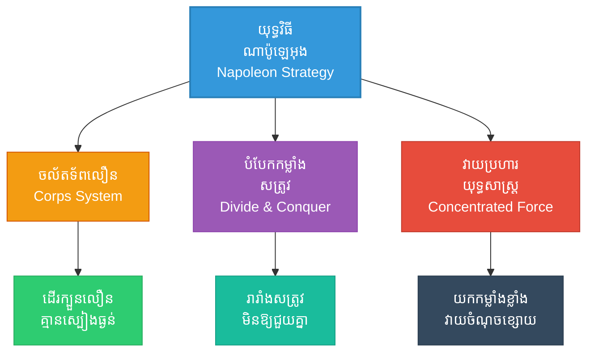

# Napoleon's Influence (ឥទ្ធិពលលើណាប៉ូឡេអុង៖ យុទ្ធសាស្ត្រចល័តទ័ពយ៉ាងលឿនរបស់អធិរាជបារាំង)

**Author:** ichamrong  
**Date:** 2026-05-27  
**Tags:** #napoleon #france #military #history #suntzu #artofwar #maneuver #philosophy #psychology  
**Category:** Biographies / Related / History  
**Read Time:** ~20 min  

---

## 📌 មាតិកា (Table of Contents)
- [សេចក្តីផ្តើម៖ កាយវិភាគវិទ្យានៃយុទ្ធសាស្ត្រចល័តទ័ព (Introduction: Strategic Mobility Anatomy)](#intro)
- [១. ទស្សនៈវិភាគ និងយុទ្ធសាស្ត្រយោធារបស់ណាប៉ូឡេអុង (Perspective & Napoleonic Tactics)](#context)
- [២. 🏛️ [គ្រឹះទស្សនវិជ្ជា] ទស្សនវិជ្ជាស្នូល៖ ហេតុផលនិយមនៃយុគសម័យពន្លឺស្វែងរកការពិត (The Philosophical Core: Enlightenment Rationalism & Objective Calculus)](#philosophical-core)
- [៣. 🧠 [យន្តការចិត្តសាស្ត្រ] យន្តការចិត្តសាស្ត្រ៖ ឥទ្ធិពលនៃកម្លាំងចិត្ត និងល្បឿននៃការយល់ដឹង (Psychological Mechanism: Charismatic Aura & Cognitive Speed)](#psychological-mechanisms)
- [៤. 📊 គំនូសបំរែបំរួលយុទ្ធសាស្ត្រ (Strategic Mermaid Diagram)](#diagram)
- [៥. ⚠️ [ភាពផ្ទុយគ្នា និងការរិះគន់] ភាពផ្ទុយគ្នា និងការរិះគន់ (Paradoxes & Criticisms)](#paradoxes-criticisms)
- [៦. តារាងប្រៀបធៀបយុទ្ធសាស្ត្រ (Strategic Comparison Table)](#comparison-table)
- [សេចក្តីសន្និដ្ឋាន (Conclusion)](#conclusion)
- [🔗 ឯកសារទាក់ទង (Related Topics)](#related-topics)
- [ឯកសារយោង (References)](#references)

---

## សេចក្តីផ្តើម៖ កាយវិភាគវិទ្យានៃយុទ្ធសាស្ត្រចល័តទ័ព (Introduction: Strategic Mobility Anatomy)

> **«ចូរមានភាពរហ័សរហួនដូចខ្យល់បក់ វាយប្រហារសត្រូវភ្លាមៗមុនពេលពួកគេអាចប្រមូលផ្តុំកម្លាំងទប់ទល់បាន។» — ស៊ុន អ៊ូ**
> *(“Be swift as the wind, strike the enemy before they can gather their forces to resist.” — Sun Tzu)*

នៅឆ្នាំ ១៧៧២ សៀវភៅក្បួនសឹកស៊ុនអ៊ូត្រូវបានបកប្រែជាភាសាបារាំងដំបូងគេបង្អស់ដោយបូជាចារ្យយេស៊ូអ៊ីត Jean Joseph Marie Amiot។ ប្រវត្តិវិទូយោធាជាច្រើនជឿជាក់ថា អធិរាជ **ណាប៉ូឡេអុង បូណាប៉ាត (Napoleon Bonaparte)** ធ្លាប់បានសិក្សា និងយកទ្រឹស្តីសឹកនេះមកបង្កើតជាយុទ្ធវិធីចល័តទ័ពដ៏ល្បីល្បាញរបស់លោកនៅទូទាំងអឺរ៉ុប។

> [!IMPORTANT]
> **មេរៀនគ្រឹះ (Core Maxim):**
> យុទ្ធសាស្ត្ររបស់ណាប៉ូឡេអុងផ្តោតលើភាពលឿនក្នុងការចល័តទ័ព និងការបែងចែកទ័ពជាឯកតាឯករាជ្យ (Corps System) ដើម្បីវាយឆ្មក់គូសត្រូវមុនពេលគូសត្រូវអាចដឹងខ្លួន ឬប្រមូលផ្តុំកម្លាំងគ្នាទាន់។

---

## ១. ទស្សនៈវិភាគ និងយុទ្ធសាស្ត្រយោធារបស់ណាប៉ូឡេអុង (Perspective & Napoleonic Tactics)

ណាប៉ូឡេអុងត្រូវបានគេស្គាល់ថាជាបិតានៃសង្គ្រាមសម័យថ្មី។ លោកបានផ្លាស់ប្តូររបៀបធ្វើសង្គ្រាមពីការដើរក្បួនយឺតៗ មកជាការចល័តទ័ពល្បឿនលឿនបំផុត (Maneuver warfare)។ លោកបានបែងចែកកងទ័ពជាផ្នែកតូចៗ (Corps system) ដែលអាចដើរក្បួនដាច់ដោយឡែកពីគ្នា ប៉ុន្តែអាចប្រមូលផ្តុំគ្នាវាយឆ្មក់គូប្រកួតត្រង់ចំណុចយុទ្ធសាស្ត្រយ៉ាងរហ័ស។

យុទ្ធវិធីនេះឆ្លុះបញ្ចាំងយ៉ាងច្បាស់ពីគោលការណ៍របស់ស៊ុនអ៊ូ៖ «ចូរមានភាពរហ័សដូចខ្យល់» និង «បំបែកកងទ័ពសត្រូវជាផ្នែកៗ ដើម្បីវាយកម្ទេចម្តងមួយៗ»។

---

## ២. 🏛️ [គ្រឹះទស្សនវិជ្ជា] ទស្សនវិជ្ជាស្នូល៖ ហេតុផលនិយមនៃយុគសម័យពន្លឺស្វែងរកការពិត (The Philosophical Core: Enlightenment Rationalism & Objective Calculus)

ណាប៉ូឡេអុងបានផ្សារភ្ជាប់ទ្រឹស្តីស៊ុនអ៊ូជាមួយ **ហេតុផលនិយមបែបបស្ចិមលោក (Enlightenment Rationalism)**៖

### ក. ការគណនាបែបវិទ្យាសាស្ត្រ និងការបត់បែន (Calculated Fluidity)
*   **បំបែកសាសនា និងគោលជំនឿរឹងរូស:** ណាប៉ូឡេអុងមិនជឿលើ «ក្បួនយុទ្ធសាស្ត្រយោធាចាស់គំរឹល» ដែលមិនអាចកែប្រែបានឡើយ។ លោកបានចាត់ទុកសង្គ្រាមជា «វិទ្យាសាស្ត្របត់បែន» ដែលផ្លាស់ប្តូរតាមពេលវេលា និងស្ថានភាពជាក់ស្តែង ស្របនឹងគោលការណ៍ទឹករបស់ស៊ុនអ៊ូ។
*   **Stoic Realism:** លោកវិនិច្ឆ័យសមរភូមិដោយអារម្មណ៍ត្រជាក់ និងការគណនាលេខកណិតយ៉ាងម៉ត់ចត់ (ធនធាន ចម្ងាយផ្លូវ និងពេលវេលា)។

### ខ. ការប្រើប្រាស់ធនធានតាមផ្លូវ (Living off the Land)
ណាប៉ូឡេអុងបានយកឈ្នះច្បាប់ភស្តុភារបុរាណ ដោយបញ្ជាឱ្យទាហានមិនបាច់ដឹកជញ្ជូនស្បៀងធ្ងន់ៗតាមក្រោយឡើយ ដោយដណ្តើម និងទិញស្បៀងនៅតាមផ្លូវ (Living off the land)៖
*   **ការរួបរួមជាមួយស៊ុនអ៊ូ:** នេះស្របទៅនឹងពាក្យស៊ុនអ៊ូដែលថា *«មេទ័ពឆ្លាតវៃ ត្រូវចិញ្ចឹមកងទ័ពដោយដណ្តើមស្បៀងសត្រូវ»* ព្រោះស្បៀងមួយធុងរបស់សត្រូវ ស្មើនឹងម្ភៃធុងដែលដឹកចេញពីស្រុកខ្លួន។

> [!TIP]
> **គន្លឹះយុទ្ធសាស្ត្រ (Strategic Tip):**
> ក្នុងការរៀបចំផែនការធុរកិច្ចសម័យថ្មី ភាពរហ័សរហួន និងការសម្របខ្លួនតាមការប្រែប្រួលរបស់ទីផ្សារ (Calculated Fluidity) ជំនួសឱ្យការពឹងផ្អែកលើច្បាប់ចាស់គំរឹល គឺជាគន្លឹះយកឈ្នះគូប្រជែងលឿនរហ័ស។

---

## ៣. 🧠 [យន្តការចិត្តសាស្ត្រ] យន្តការចិត្តសាស្ត្រ៖ ឥទ្ធិពលនៃកម្លាំងចិត្ត និងល្បឿននៃការយល់ដឹង (Psychological Mechanism: Charismatic Aura & Cognitive Speed)

ចិត្តសាស្ត្រដឹកនាំរបស់ណាប៉ូឡេអុង ដំណើរការតាមរយៈ៖

### ក. The Napoleon Aura (ចិត្តសាស្ត្រនៃកម្លាំងចិត្ត)
ឧត្តមសេនីយ៍ វេលីងតុន (Wellington) ធ្លាប់ពោលថា៖ *«វត្តមានរបស់ណាប៉ូឡេអុងនៅលើសមរភូមិ គឺមានតម្លៃស្មើនឹងទាហាន ៤ ម៉ឺននាក់»*៖
*   **Charismatic Authority (សិទ្ធិអំណាចមន្តស្នេហ៍):** វត្តមានរបស់លោកបង្កើតឱ្យមាន **ការលើកទឹកចិត្តផ្លូវចិត្ត (Psychological Motivation)** យ៉ាងខ្លាំងដល់ទាហានបារាំង ធ្វើឱ្យពួកគេប្រយុទ្ធដោយគ្មានភាពភ័យខ្លាច (activating Flow State and high morale)។

### ខ. Cognitive Speed & Surprise (ល្បឿននៃការយល់ដឹង)
*   **Maneuver of the Central Position:** ណាប៉ូឡេអុងប្រើប្រាស់ល្បឿនដើម្បីជ្រៀតចូលកណ្តាលរវាងកងទ័ពពីររបស់សម្ព័ន្ធមិត្ត (ឧទាហរណ៍ ក្នុងសមរភូមិ Waterloo ដំបូងលោកព្យាយាមបំបែកអង់គ្លេស និងព្រុសស៊ឺ)។
*   **Exploiting Cognitive Friction:** ល្បឿនលឿននេះ បង្កើតជាសម្ពាធផ្លូវចិត្តដល់សត្រូវ ធ្វើឱ្យមេទ័ពសត្រូវមិនច្បាស់លាស់ (Information Friction) និងសម្រេចចិត្តយឺតយ៉ាវ ដែលជាចំណុចខ្សោយដ៏ធំ។

---

## ៤. 📊 គំនូសបំរែបំរួលយុទ្ធសាស្ត្រ (Strategic Mermaid Diagram)

---

## ៥. ⚠️ [ភាពផ្ទុយគ្នា និងការរិះគន់] ភាពផ្ទុយគ្នា និងការរិះគន់ (Paradoxes & Criticisms)

*   **មហន្តរាយនៃល្បឿន និងភស្តុភារ (The Russian Catastrophe):** យុទ្ធវិធី «ចិញ្ចឹមទ័ពតាមផ្លូវ» បានបរាជ័យទាំងស្រុងពេលវាយលុករុស្ស៊ី (១៨១២)។ រុស្ស៊ីបានដុតបំផ្លាញផ្ទះសម្បែង និងស្បៀងអាហារចោលទាំងអស់ (Scorched Earth) បណ្តាលឱ្យកងទ័ពណាប៉ូឡេអុងរាប់សែននាក់ត្រូវស្លាប់ដោយសារគ្មានអ្វីបរិភោគ និងរងាខ្លាំង។
*   **Ego and Overconfidence (អត្មា និងការជឿជាក់ហួសហេតុ):** ជ័យជម្នះច្រើនពេកបានបំភាន់ណាប៉ូឡេអុងឱ្យជឿថាខ្លួនមិនអាចចាញ់ (Hubris Bias) នាំឱ្យលោកធ្វើការសម្រេចចិត្តវាយប្រហាររុស្ស៊ី និងធ្វើសង្គ្រាមអូសបន្លាយដែលនាំឱ្យអាណាចក្រដួលរលំ។

> [!WARNING]
> **ភាពផ្ទុយគ្នា និងការរិះគន់ (Paradox & Risks):**
> ការផ្តោតតែលើល្បឿន និងការស្វែងរកជ័យជម្នះរហ័ស ងាយនឹងធ្វើឱ្យប្រព័ន្ធភស្តុភារដួលរលំទាំងស្រុង ប្រសិនបើគូសត្រូវប្រើប្រាស់យុទ្ធសាស្ត្រពន្យារពេល និងដុតបំផ្លាញទឹកដី (Scorched Earth Policy)។

---

## ៦. តារាងប្រៀបធៀបយុទ្ធសាស្ត្រ (Strategic Comparison Table)

| គោលការណ៍ស៊ុនអ៊ូ (Sun Tzu's Principle) | យុទ្ធសាស្ត្រណាប៉ូឡេអុង (Napoleon's Tactic) | លទ្ធផលជាក់ស្តែង (Practical Result) | ដែនកំណត់យុទ្ធសាស្ត្រ (Strategic Boundary) |
| :--- | :--- | :--- | :--- |
| *«ចល័តទ័ពលឿនដូចខ្យល់»* | ប្រព័ន្ធ Corps System (បែងចែកកងទ័ពដើរក្បួនដាច់គ្នា) | ដើរក្បួនវាយឆ្មក់សត្រូវលឿនបំផុត បង្កការភ្ញាក់ផ្អើល។ | បង្កើតហានិភ័យកង្វះស្បៀង ប្រសិនបើផ្លូវដើរក្បួនវែងពេក។ |
| *«បំបែកកម្លាំងសត្រូវ»* | ការវាយប្រហារកាត់កណ្តាល (Central Position) | រារាំងសម្ព័ន្ធមិត្តសត្រូវមិនឱ្យជួយគ្នាបាន។ | ទាមទារការគណនាល្បឿនលឿនឥតខ្ចោះ បើគាំងនឹងត្រូវរងការឡោមព័ទ្ធវិញ។ |
| *«ចិញ្ចឹមទ័ពដោយធនធានសត្រូវ»* | យុទ្ធវិធីដណ្តើមយកស្បៀងតាមផ្លូវ (Living off the land) | កងទ័ពចល័តបានលឿនដោយគ្មានខ្សែសង្វាក់ស្បៀងធ្ងន់ៗ។ | បរាជ័យទាំងស្រុងក្រោមយុទ្ធសាស្ត្រ Scorched Earth របស់រុស្ស៊ី។ |

---

## 🧭 ការរុករកយុទ្ធសាស្ត្រ (Strategic Navigation - Down the Rabbit Hole)
*   **[« យុទ្ធសាស្ត្រមុន (Previous Strategy)](16-silent-leadership.md)**
*   **[យុទ្ធសាស្ត្របន្ទាប់ (Next Strategy) »](18-art-of-negotiation.md)**

---

## សេចក្តីសន្និដ្ឋាន (Conclusion)

ការយល់ដឹង និងការយកយុទ្ធសាស្ត្រសឹកអមតៈរបស់ស៊ុនអ៊ូមកអនុវត្តជាក់ស្តែង ជួយឱ្យយើងមានសមត្ថភាពគិតជាប្រព័ន្ធ សម្រេចចិត្តយ៉ាងត្រជាក់ចិត្ត និងចេះបត់បែនគ្រប់កាលៈទេសៈ ដើម្បីសម្រេចបានជោគជ័យ និងជ័យជម្នះអមតៈនៅក្នុងជីវិត និងការងារប្រចាំថ្ងៃ។

---

## 🔗 ឯកសារទាក់ទង (Related Topics)
*   [ជីវប្រវត្តិ ស៊ុន អ៊ូ (The Biography of Sun Tzu)](../01-sun-tzu-biography.md)
*   [សៀវភៅ The Art of War (The Art of War Book)](01-the-art-of-war.md)
*   [យុទ្ធសាស្ត្រវាយឆ្មក់របស់ ម៉ៅ សេទុង (Mao Zedong Strategy)](02-mao-zedong-guerrilla-warfare.md)

## ឯកសារយោង (References)
*   **The Art of War by Sun Tzu (Lionel Giles Translation)** - Reference on fast maneuvers and supply chain integration.
*   **The Campaigns of Napoleon by David G. Chandler** - Definitive history of Napoleon's tactical moves, division system, and battles.
*   **On War by Carl von Clausewitz** - Comparing rational calculus, friction, and Napoleonic strategies.
*   **Psychology of Leadership under High Conflict** - Analysis of charismatic leadership under tactical stress.
*   **Amiot, J. J. M.** (1772). *Art Militaire des Chinois*. (First French translation of Sun Tzu).

---
*Last updated: 2026-05-27*
