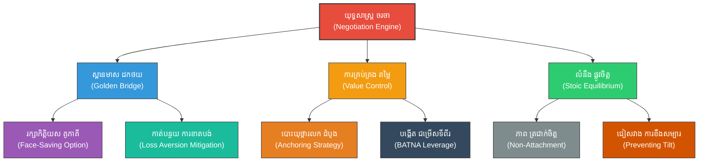

# The Art of Negotiation (សិល្បៈនៃការចរចា៖ ការផ្តល់ច្រកចេញដើម្បីរក្សាផលប្រយោជន៍រួម)

**Author:** ichamrong  
**Date:** 2026-05-27  
**Tags:** #negotiation #business #diplomacy #persuasion #suntzu #conflict #goldenbridge  
**Category:** Biographies / Related / Business  
**Read Time:** ~18 min  

---

## 📌 មាតិកា (Table of Contents)
- [សេចក្តីផ្តើម៖ កាយវិភាគវិទ្យានៃយុទ្ធសាស្ត្រ (Introduction: Strategic Anatomy)](#intro)
- [១. ទស្សនៈវិភាគ និងសិល្បៈចរចាទំនើប (Perspective & Modern Negotiation Context)](#context)
- [២. 🏛️ [គ្រឹះទស្សនវិជ្ជា] / [Philosophical Core] - ទស្សនវិជ្ជាស្នូល៖ ភាពបត់បែនដូចទឹក និងការរក្សាលំនឹងផ្លូវចិត្ត (The Philosophical Core: Daoist Flow & Stoic Poise)](#philosophical-core)
- [៣. 🧠 [យន្តការចិត្តសាស្ត្រ] / [Psychological Mechanism] - យន្តការចិត្តសាស្ត្រ៖ ការស្អប់ការខាតបង់ និងឥទ្ធិពលបោះយុថ្កា (Psychological Mechanism: Loss Aversion & Anchoring)](#psychological-mechanism)
- [៤. គំនូសបំរែបំរួលយុទ្ធសាស្ត្រ (Strategic Mermaid Diagram)](#diagram)
- [៥. 🚀 [មេរៀនអនុវត្ត] / [Practical Application] - ការផ្សារភ្ជាប់គ្នារវាងគោលការណ៍ជាក់ស្តែង និងក្បួនសឹកស៊ុនអ៊ូ (Connecting to Sun Tzu's Art of War)](#suntzu-connection)
- [៦. ⚠️ [ភាពផ្ទុយគ្នា និងការរិះគន់] / [Paradoxes & Criticisms] - ភាពផ្ទុយគ្នា និងការរិះគន់ (Paradoxes & Criticisms)](#paradoxes-criticisms)
- [៧. តារាងប្រៀបធៀបយុទ្ធសាស្ត្រ (Strategic Comparison Table)](#comparison-table)
- [សេចក្តីសន្និដ្ឋាន (Conclusion)](#conclusion)
- [🔗 ឯកសារទាក់ទង (Related Topics)](#related-topics)
- [ឯកសារយោង (References)](#references)

---

## សេចក្តីផ្តើម៖ កាយវិភាគវិទ្យានៃយុទ្ធសាស្ត្រ (Introduction: Strategic Anatomy)

> **«នៅពេលឡោមព័ទ្ធកងទ័ពសត្រូវ ត្រូវចេះទុកច្រកចេញ ឬផ្លូវរត់មួយឱ្យពួកគេ ជៀសវាងការបិទច្រកទាំងស្រុងដែលបង្ខំឱ្យពួកគេប្រយុទ្ធដល់ស្លាប់ជាមួយយើង។» — ស៊ុន អ៊ូ**

នៅក្នុងការចរចាអាជីវកម្ម ការទូត និងការដោះស្រាយវិវាទសម័យទំនើប គោលការណ៍ «ទុកច្រកចេញឱ្យគូភាគី» របស់ស៊ុនអ៊ូ គឺជាមគ្គុទ្ទេសក៍ដ៏មានឥទ្ធិពលបំផុត។ ការចរចាដែលជោគជ័យមិនមែនជាការកម្ទេចដៃគូចរចាឱ្យសូន្យបង់នោះទេ ប៉ុន្តែវាគឺជាសិល្បៈនៃការស្វែងរកច្រកចេញដែលរក្សាកិត្តិយស និងផលប្រយោជន៍រួម។ យុទ្ធសាស្ត្រចរចាទំនើបបានកែច្នៃគោលការណ៍ស៊ុនអ៊ូទៅជា **«ការសាងសង់ស្ពានមាសសម្រាប់គូភាគីដកថយ» (Building a Golden Bridge)** តាមរយៈការគ្រប់គ្រងឥទ្ធិពលចិត្តសាស្ត្រនៃការស្អប់ការខាតបង់ (**Loss Aversion**) និងសិល្បៈនៃការបោះយុថ្ការលកតម្លៃ (**Anchoring Effect**).

---

## ១. ទស្សនៈវិភាគ និងសិល្បៈចរចាទំនើប (Perspective & Modern Negotiation Context)

ការចរចាគឺមិនខុសពីការប្រយុទ្ធគ្នានោះទេ ប៉ុន្តែគោលដៅកំពូលរបស់វាគឺការចុះកិច្ចព្រមព្រៀងដែលផ្តល់ផលប្រយោជន៍ឱ្យគ្នាទៅវិញទៅមក (Win-Win)។ ប្រសិនបើភាគីម្ខាងព្យាយាមបង្ខំ គាបសង្កត់ ឬកម្ទេចភាគីម្ខាងទៀតឱ្យទាល់ច្រក (Win-Lose) ពួកគេនឹងគ្មានជម្រើសក្រៅពីប្រយុទ្ធតបតវិញយ៉ាងខ្លាំងក្លា ឬសម្រេចចិត្តដើរចេញពីតុចរចា ដែលបង្កការខូចខាតដល់ភាគីទាំងសងខាង។

ការសាងសង់ស្ពានមាស (Golden Bridge) ជួយសម្រាលបន្ទុកផ្លូវចិត្តរបស់ដៃគូចរចា ដោយធ្វើឱ្យពួកគេមានអារម្មណ៍ថា ពួកគេមិនបានចាញ់នោះទេ ប៉ុន្តែបានជ្រើសរើសដំណោះស្រាយដ៏ឆ្លាតវៃ និងរក្សាកិត្តិយស។ នៅក្នុងការចរចាទំនើប នេះតម្រូវឱ្យយល់ដឹងពីចំណុចខ្សោយ និងភាពភ័យខ្លាចរបស់ដៃគូចរចា ហើយប្រើប្រាស់វាមកបង្កើតសំណើដែលពួកគេមិនអាចបដិសេធបាន។

---

## 🏛️ [គ្រឹះទស្សនវិជ្ជា] / [Philosophical Core] - ទស្សនវិជ្ជាស្នូល៖ ភាពបត់បែនដូចទឹក និងការរក្សាលំនឹងផ្លូវចិត្ត (The Philosophical Core: Daoist Flow & Stoic Poise)

ការអនុវត្តសិល្បៈចរចាបែបស៊ុនអ៊ូ ត្រូវបានជះឥទ្ធិពលយ៉ាងខ្លាំងដោយ៖

*   **ទស្សនវិជ្ជាតៅនិយម (Daoism - Laozi):** គោលការណ៍នៃ **«柔能克刚» (Rou-Neng-Ke-Gang - ភាពទន់ភ្លន់យកឈ្នះភាពរឹងមាំ)** គឺជាគន្លឹះនៃស្ពានមាស។ ទឹកជាវត្ថុដែលទន់បំផុត ប៉ុន្តែវាអាចហូររំលាយថ្មដែលរឹងបំផុតបាន។ ក្នុងការចរចា ការមិនតបតនឹងកំហឹងដោយកំហឹង ប៉ុន្តែការយោគយល់ និងស្វែងរកដំណោះស្រាយបត់បែន ជួយឱ្យយើងគ្រប់គ្រងដំណើរការចរចាទាំងមូលដោយសន្តិវិធី និងជៀសវាងការប៉ះទង្គិចដែលមិនចាំបាច់។
*   **ទស្សនវិជ្ជាស្តូអ៊ិក (Stoicism):** សាលានេះបង្រៀនឱ្យមាន **Stoic Poise** (ភាពស្ងប់ស្ងៀមឥតរវើរវាយ) ដោយផ្តោតតែលើអ្វីដែលយើងអាចគ្រប់គ្រងបាន (ការត្រៀមខ្លួន ព័ត៌មាន និងអារម្មណ៍ខ្លួនឯង) និងមិនរវល់នឹងអ្វីដែលយើងមិនអាចគ្រប់គ្រងបាន (ប្រតិកម្ម ឬយុទ្ធសាស្ត្ររបស់គូភាគី)។ ការរក្សាស្មារតីត្រជាក់ជួយការពារយើងពី **Strategic Tilt** (ការសម្រេចចិត្តខុសដោយសារអារម្មណ៍ឆេវឆាវ) នៅពេលដៃគូចរចាប្រើប្រាស់យុទ្ធសាស្ត្រគាបសង្កត់។

> [!TIP]
> **គន្លឹះយុទ្ធសាស្ត្របែបតៅ (Daoist Water-like Yielding):**
> ពេលដៃគូចរចាមានអាកប្បកិរិយារឹងត្អឹង ឬខឹងសម្បារ ចូរកុំប្រឈមមុខចំៗឡើយ។ ចូរធ្វើខ្លួនឱ្យដូចជាទឹក បត់បែនតាមស្ថានភាព ស្រូបយកសម្ពាធ រួចនាំលំហូរចរចាត្រឡប់ទៅរកតំបន់ដែលរក្សាផលប្រយោជន៍រួមវិញ។

---

## 🧠 [យន្តការចិត្តសាស្ត្រ] / [Psychological Mechanism] - យន្តការចិត្តសាស្ត្រ៖ ការស្អប់ការខាតបង់ និងឥទ្ធិពលបោះយុថ្កា (Psychological Mechanism: Loss Aversion & Anchoring)

យុទ្ធសាស្ត្រចរចាដំណើរការទៅបានដោយសារតែការគ្រប់គ្រងប្រព័ន្ធយន្តការចិត្តសាស្ត្រ៖

*   **ការស្អប់ការខាតបង់ (Loss Aversion - Kahneman & Tversky):** យោងតាមទ្រឹស្តីលទ្ធភាព (**Prospect Theory**), មនុស្សមានការឈឺចាប់ចំពោះ «ការខាតបង់» ខ្លាំងជាងការសប្បាយចិត្តចំពោះ «ការទទួលបាន» ដល់ទៅពីរដង។ ក្នុងការចរចា ប្រសិនបើដៃគូមានអារម្មណ៍ថាពួកគេកំពុង «បាត់បង់» អ្វីមួយ (ដូចជា បង់ប្រាក់ច្រើនពេក ឬបាត់បង់មុខមាត់) ពួកគេនឹងប្រយុទ្ធយ៉ាងខ្លាំងក្លា។ ស្ពានមាសគឺជាយន្តការដែលជួយបង្វែរការយល់ឃើញពី «ការបាត់បង់» ឱ្យទៅជា «ជ័យជម្នះរក្សាកិត្តិយស» ដែលកាត់បន្ថយសម្ពាធ Loss Aversion របស់ពួកគេ។
*   **ឥទ្ធិពលនៃការបោះយុថ្កា (Anchoring Effect):** យន្តការយល់ដឹងដែលមនុស្សពឹងផ្អែកខ្លាំងលើ «ព័ត៌មានដំបូងបង្អស់» (យុថ្កា) ដែលពួកគេទទួលបាននៅពេលធ្វើការសម្រេចចិត្ត។ ការផ្តល់សំណើដំបូងដែលសមហេតុផល ប៉ុន្តែមានប្រៀបសម្រាប់យើង (First Offer) គឺជាការបង្កើតយុថ្កាផ្លូវចិត្ត ដែលទាញការចរចាទាំងស្រុងឱ្យវិលជុំវិញតម្លៃនោះ។
*   **ការយល់ដឹងពី BATNA (Best Alternative to a Negotiated Agreement):** ការមានជម្រើសល្អបំផុតផ្សេងទៀតក្រៅពីកិច្ចព្រមព្រៀងនេះ គឺជាប្រភពនៃកម្លាំងផ្លូវចិត្ត។ វាជួយឱ្យយើងមិនងាយធ្លាក់ចូលទៅក្នុងភាពលំអៀងនៃការសម្រេចចិត្ត និងអាចសម្រេចចិត្តដើរចេញដោយសនិទានភាព ប្រសិនបើសំណើភាគីម្ខាងទៀតទាបជាងយុថ្កាអប្បបរមារបស់យើង។

> [!IMPORTANT]
> **មេរៀនគ្រឹះចិត្តសាស្ត្រចរចា (Loss Aversion Mitigating Rule):**
> ដើម្បីឱ្យដៃគូចរចាយល់ព្រមចុះកិច្ចសន្យា ចូរកុំបង្ហាញតែការទទួលបានរបស់ពួកគេឡើយ តែត្រូវរៀបចំសំណើឱ្យពួកគេមើលឃើញថា ពួកគេបានជៀសវាងការខាតបង់ដ៏ធំមួយ (Framing Effect)។

---

## ៤. គំនូសបំរែបំរួលយុទ្ធសាស្ត្រ (Strategic Mermaid Diagram)

---

## ៥. 🚀 [មេរៀនអនុវត្ត] / [Practical Application] - ការផ្សារភ្ជាប់គ្នារវាងគោលការណ៍ជាក់ស្តែង និងក្បួនសឹកស៊ុនអ៊ូ (Connecting to Sun Tzu's Art of War)

### ក. ការសាងសង់ស្ពានមាស (Building a Golden Bridge - 圍師必闕)
ស៊ុនអ៊ូបានសរសេរថា បើយើងបិទច្រកទ័ពសត្រូវទាំងស្រុង ពួកគេដឹងខ្លួនថានឹងត្រូវស្លាប់ ពួកគេនឹងបញ្ចេញកម្លាំងចុងក្រោយប្រយុទ្ធស្លាប់រស់ជាមួយយើង ដែលនឹងបង្កការខូចខាតធំដល់យើង។ ក្នុងការចរចា យើងត្រូវផ្តល់ច្រកចេញដ៏មានកិត្តិយស (Face-saving option) ដើម្បីកុំឱ្យពួកគេមានអារម្មណ៍ថាត្រូវទាល់ច្រក។ នៅពេលពួកគេឃើញផ្លូវរត់ដ៏ងាយស្រួល ពួកគេនឹងដកថយ ឬយល់ព្រមចុះហត្ថលេខាលើកិច្ចព្រមព្រៀងដោយសន្តិវិធី ជៀសវាងការបំបែកតុចរចា។

### ខ. ការគ្រប់គ្រងព័ត៌មាន និងការបោះយុថ្កា (Anchoring & scouting)
«ដឹងពីសត្រូវ ដឹងពីខ្លួនឯង»។ មុនពេលចូលតុចរចា យើងត្រូវសិក្សាពីសម្ពាធផ្ទៃក្នុង ដែនកំណត់អំណាច និងចំណុចខ្សោយរបស់ដៃគូចរចា ដើម្បីរៀបចំសំណើដំបូងដែលសមស្រប។ ការបោះយុថ្កា (**Anchoring**) ដ៏មានប្រសិទ្ធភាព គឺការដឹងពីចំណុចយោងផ្លូវចិត្តរបស់សត្រូវ ហើយកំណត់ព្រំដែនចរចាឱ្យមានប្រៀបសម្រាប់យើងតាំងពីដំបូងបង្អស់។

---

## ⚠️ [ភាពផ្ទុយគ្នា និងការរិះគន់] / [Paradoxes & Criticisms] - ភាពផ្ទុយគ្នា និងការរិះគន់ (Paradoxes & Criticisms)

*   **ប៉ារ៉ាដុកនៃស្ពានមាសដែលទាក់ទាញពេក:** ប្រសិនបើយើងសាងសង់ស្ពានមាស (ផ្តល់សម្បទាន) ធំពេក ឬងាយស្រួលពេក វាអាចធ្វើឱ្យដៃគូចរចាយល់ឃើញថាយើងជាមនុស្សទន់ខ្សោយ និងទាមទារសម្បទានបន្ថែមទៀត ដែលធ្វើឱ្យយើងបាត់បង់ប្រៀបចរចា និងទទួលបានផលប្រយោជន៍តិចតួច។
*   **អន្ទាក់នៃការបោះយុថ្កាខុសទិសដៅ (The Anchoring Trap):** ការបោះយុថ្កាខ្ពស់ជ្រុលហួសពីការពិត អាចបង្កជាអារម្មណ៍អាក់អន់ចិត្ត និងខឹងសម្បារដល់ដៃគូចរចា ដែលអាចនាំទៅរកការបែកបាក់ការចរចាភ្លាមៗ ដោយសារតែពួកគេយល់ថាយើងគ្មានភាពស្មោះត្រង់ក្នុងការចរចាឡើយ។
*   **ភាពលំអៀងនៃការបង្កើនការប្តេជ្ញាចិត្ត (Escalation of Commitment):** ដោយសារតែ Loss Aversion, អ្នកចរចាជាច្រើនមានទំនោរចង់រក្សាគោលជំហររឹងរូស និងបន្តចំណាយធនធានបន្ថែមទៀតដើម្បី «ឈ្នះ» ការចរចា ទោះបីជាការដើរចេញ (BATNA) ជាជម្រើសដ៏ល្អបំផុតក៏ដោយ។

> [!CAUTION]
> **ដែនកំណត់នៃកិច្ចចរចាបែបសហការ (Limits of Collaborative Bargaining):**
> ក្នុងករណីដែលដៃគូចរចាមានអត្តចរិតជាអ្នកបំផ្លាញ ឬប្រកាន់ខ្ជាប់យុទ្ធសាស្ត្រគាបសង្កត់ដាច់ខាត (Hard-nosed Distributive Bargainers) ការព្យាយាមកសាងស្ពានមាសអាចនឹងឥតប្រយោជន៍ និងធ្វើឱ្យយើងរងការកេងប្រវ័ញ្ច។ ក្នុងស្ថានភាពបែបនេះ ការប្រើប្រាស់សម្ពាធត្រឡប់ (Pushback) និងការប្រកាសពី BATNA ដ៏រឹងមាំ គឺជាជម្រើសដ៏ល្អបំផុត។

---

## ៧. តារាងប្រៀបធៀបយុទ្ធសាស្ត្រ (Strategic Comparison Table)

| គោលការណ៍ស៊ុនអ៊ូ (Sun Tzu's Principle) | ការអនុវត្តក្នុងការចរចា | យន្តការចិត្តសាស្ត្រ (Psychological Mechanism) | លទ្ធផលជាក់ស្តែង (Practical Result) |
| :--- | :--- | :--- | :--- |
| **«ទុកច្រកចេញឱ្យសត្រូវ»** | ការផ្តល់ជម្រើសរក្សាកិត្តិយស (Face-saving) | **Loss Aversion Mitigation** (ការសម្រាលការខ្លាចខាតបង់) | ដៃគូព្រមចុះកិច្ចព្រមព្រៀងដោយសន្តិវិធី មិនបែកបាក់តុចរចា។ |
| **«ដឹងពីចិត្តសាស្ត្រគូភាគី»** | ការស្តាប់ និងស្វែងរក Pain Points ដៃគូ | **Empathy & Scouting** | ងាយស្រួលក្នុងការបង្កើតសំណើ Win-Win ដែលមានប្រសិទ្ធភាព។ |
| **«គ្រប់គ្រងទិសដៅសមរភូមិ»** | ការផ្តល់សំណើដំបូងយ៉ាងច្បាស់លាស់ | **Anchoring Effect** (ឥទ្ធិពលបោះយុថ្កា) | កំណត់ព្រំដែនចរចាឱ្យស្ថិតក្នុងតំបន់ដែលមានប្រៀបរបស់យើង។ |

---

## 🧭 ការរុករកយុទ្ធសាស្ត្រ (Strategic Navigation - Down the Rabbit Hole)
*   **[« យុទ្ធសាស្ត្រមុន (Previous Strategy)](17-napoleon-influence.md)**
*   **[យុទ្ធសាស្ត្របន្ទាប់ (Next Strategy) »](19-delegation-strategy.md)**

---

## សេចក្តីសន្និដ្ឋាន (Conclusion)

សិល្បៈនៃការចរចាដ៏មានប្រសិទ្ធភាពខ្ពស់ គឺការរួមបញ្ចូលគ្នារវាងភាពបត់បែនដូចទឹកតាមបែបតៅនិយម និងភាពស្ងប់ស្ងៀមបែបស្តូអ៊ិក។ តាមរយៈការគ្រប់គ្រងយន្តការចិត្តសាស្ត្រនៃការបោះយុថ្ការួមគ្នាជាមួយនឹងការសាងសង់ស្ពានមាសដើម្បីសម្រាលការខ្លាចខាតបង់ (Loss Aversion) អ្នកដឹកនាំអាចចរចាសម្រេចបាននូវកិច្ចព្រមព្រៀងដ៏អស្ចារ្យ រក្សាបាននូវ관계ល្អ និងការពារផលប្រយោជន៍ជាតិ ឬសាជីវកម្មរបស់ខ្លួនបានយ៉ាងល្អឥតខ្ចោះ។

---

## 🔗 ឯកសារទាក់ទង (Related Topics)
*   [ជីវប្រវត្តិ ស៊ុន អ៊ូ (The Biography of Sun Tzu)](../01-sun-tzu-biography.md)
*   [សៀវភៅ The Art of War (The Art of War Book)](01-the-art-of-war.md)
*   [យុទ្ធសាស្ត្រវាយឆ្មក់របស់ ម៉ៅ សេទុង (Mao Zedong Strategy)](02-mao-zedong-guerrilla-warfare.md)

## ឯកសារយោង (References)
*   **Sun, Tzu (1910).** *The Art of War*. Translated by Lionel Giles. London: Luzac & Co. (Chapter 7: Maneuvering).
*   **Lao, Tzu (1993).** *Tao Te Ching*. Translated by Stephen Mitchell. HarperPerennial.
*   **Kahneman, Daniel (2011).** *Thinking, Fast and Slow*. Farrar, Straus and Giroux.
*   **Fisher, Roger; Ury, William & Patton, Bruce (1981).** *Getting to Yes: Negotiating Agreement Without Giving In*. Penguin Books.
*   **Tversky, Amos & Kahneman, Daniel (1979).** *Prospect Theory: An Analysis of Decision under Risk*. Econometrica, 47(2), 263-291.
*   **Ury, William (1993).** *Getting Past No: Negotiating in Difficult Situations*. Bantam Books (Explaining the Golden Bridge strategy).

---
*Last updated: 2026-05-27*
