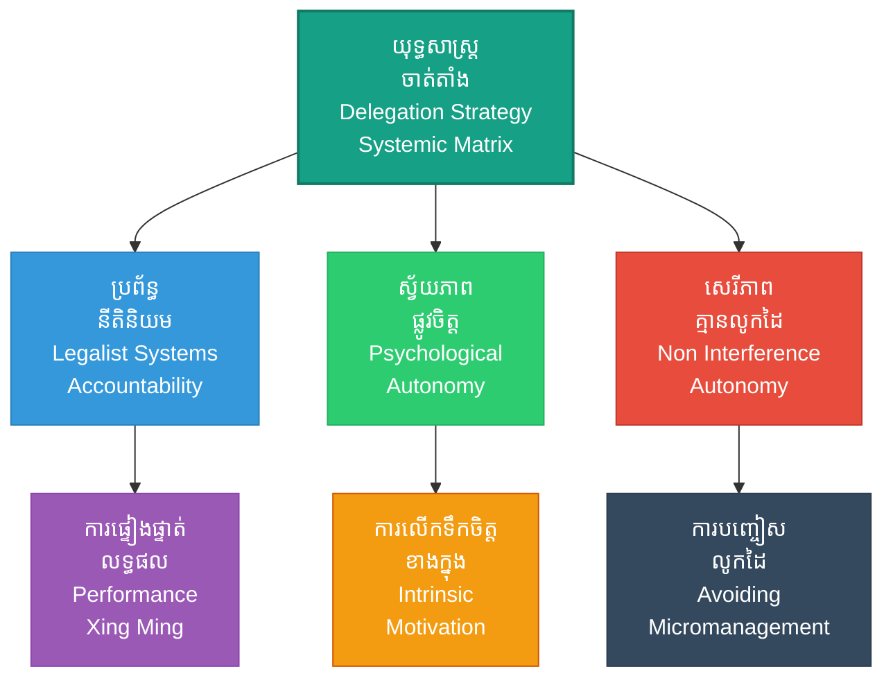

# Delegation Strategy (ការចាត់តាំងការងារ៖ សិល្បៈនៃការផ្តល់សិទ្ធិសម្រេចដល់អ្នកជំនាញ)

**Author:** ichamrong  
**Date:** 2026-05-27  
**Tags:** #delegation #autonomy #leadership #management #suntzu #trust #micromanagement  
**Category:** Biographies / Related / Leadership  
**Read Time:** ~15 min  

---

## 📌 មាតិកា (Table of Contents)
- [សេចក្តីផ្តើម៖ កាយវិភាគវិទ្យានៃយុទ្ធសាស្ត្រ (Introduction: Strategic Anatomy)](#intro)
- [១. ទស្សនៈវិភាគ និងបរិបទគ្រប់គ្រងមនុស្ស (Perspective & Modern Delegation Context)](#context)
- [២. 🏛️ [គ្រឹះទស្សនវិជ្ជា] ទស្សនវិជ្ជាស្នូល (The Philosophical Core)](#philosophy-core)
- [៣. 🧠 [យន្តការចិត្តសាស្ត្រ] យន្តការចិត្តសាស្ត្រ (Psychological Mechanism)](#psychological-mechanism)
- [៤. 📊 គំនូសបំរែបំរួលយុទ្ធសាស្ត្រ (Strategic Mermaid Diagram)](#diagram)
- [៥. 🚀 [មេរៀនអនុវត្ត] ការផ្សារភ្ជាប់គ្នារវាងគោលការណ៍ជាក់ស្តែង និងក្បួនសឹកស៊ុនអ៊ូ (Connecting to Sun Tzu's Art of War)](#suntzu-connection)
- [៦. ⚠️ [ភាពផ្ទុយគ្នា និងការរិះគន់] ភាពផ្ទុយគ្នា និងការរិះគន់ (Paradoxes & Criticisms)](#paradoxes-criticisms)
- [៧. តារាងប្រៀបធៀបយុទ្ធសាស្ត្រ (Strategic Comparison Table)](#comparison-table)
- [សេចក្តីសន្និដ្ឋាន (Conclusion)](#conclusion)
- [🔗 ឯកសារទាក់ទង (Related Topics)](#related-topics)
- [ឯកសារយោង (References)](#references)

---

## សេចក្តីផ្តើម៖ កាយវិភាគវិទ្យានៃយុទ្ធសាស្ត្រ (Introduction: Strategic Anatomy)

> **«មេទ័ពដែលពូកែនៅលើសមរភូមិ អាចបដិសេធមិនអនុវត្តតាមបញ្ជារបស់ស្តេចបាន ប្រសិនបើបញ្ជានោះដឹកនាំទៅរកបរាជ័យ។» — ស៊ុន អ៊ូ**

ការលូកដៃគ្រប់រឿងរបស់អ្នកដឹកនាំ (Micromanagement) គឺជាមេរោគដ៏កាចសាហាវដែលសម្លាប់ទំនុកចិត្ត និងប្រសិទ្ធភាពការងាររបស់បុគ្គលិក។ ស៊ុនអ៊ូបានសង្កត់ធ្ងន់យ៉ាងច្បាស់ថា ភាពជោគជ័យរបស់ស្ថាប័ន គឺផ្អែកលើ **«សិល្បៈនៃការផ្តល់សិទ្ធិសម្រេច (Autonomy) និងការចាត់តាំងការងារដល់អ្នកជំនាញ»**។

> [!IMPORTANT]
> **មេរៀនគ្រឹះ (Core Maxim):**
> ជោគជ័យយុទ្ធសាស្ត្រមិនមែនសម្រេចដោយអធិរាជអង្គុយក្នុងរាជវាំងនោះទេ តែវាសម្រេចដោយមេទ័ពដែលយល់ដឹងពីស្ថានភាពជាក់ស្តែង និងមានសិទ្ធិស្វ័យភាពពេញលេញក្នុងការសម្រេចចិត្តរហ័សលើសមរភូមិ។

---

## ១. ទស្សនៈវិភាគ និងសិល្បៈគ្រប់គ្រងមនុស្ស (Perspective & Modern Delegation Context)

អ្នកដឹកនាំសាជីវកម្មជារឿយៗតែងតែធ្លាក់ក្នុងអន្ទាក់ចង់គ្រប់គ្រងរាល់កិច្ចការតូចតាចក្នុងក្រុមហ៊ុន ព្រោះពួកគេខ្លាចបុគ្គលិកធ្វើខុស។ ស៊ុនអ៊ូបានព្រមានថា ស្តេចដែលមិនស្គាល់ស្ថានភាពសមរភូមិពិតប្រាកដ តែលូកដៃបញ្ជាមេទ័ពគ្រប់ជំហាន នឹងធ្វើឱ្យកងទ័ពច្របូកច្របល់ និងរងបរាជ័យយ៉ាងងាយ។

ការចាត់តាំងការងារដ៏ឆ្លាតវៃ គឺការជ្រើសរើសមនុស្សដែលមានសមត្ថភាព ផ្តល់គោលដៅ និងធនធានច្បាស់លាស់ រួចទុកសេរីភាពឱ្យពួកគេសម្រេចចិត្តដោះស្រាយបញ្ហាជាក់ស្តែង ស្របតាមស្ថានភាពការងារ។

---

## ២. 🏛️ [គ្រឹះទស្សនវិជ្ជា] ទស្សនវិជ្ជាស្នូល (The Philosophical Core)

ការចាត់តាំងការងារ និងការគ្រប់គ្រងស្ថាប័នប្រកបដោយប្រសិទ្ធភាព ឆ្លុះបញ្ចាំងពីគោលការណ៍ទស្សនវិជ្ជានាយកដ្ឋាន និងសង្គមចិនបុរាណ៖

### ក. ប្រព័ន្ធចាត់តាំងបែបនីតិនិយម (Legalist Delegation & Xing Ming)
នៅក្នុងទស្សនវិជ្ជានីតិនិយមចិន (Legalism/Fajia) ដែលតំណាងដោយលោក Han Feizi ការដឹកនាំមិនត្រូវផ្អែកលើអារម្មណ៍ ទំនាក់ទំនងផ្ទាល់ខ្លួន ឬកម្លាំងដឹកនាំផ្ទាល់ខ្លួននោះទេ ប៉ុន្តែត្រូវផ្អែកលើ «ប្រព័ន្ធវត្ថុបំណង» (Objective Systems)។ ល្បិចចាត់តាំងមួយដែលល្បីល្បាញគឺ *«ស៊ីង មីង» (Xing Ming - 形名)*៖
*   **ស៊ីង (Xing/Performance):** សម្ដៅលើលទ្ធផលការងារជាក់ស្តែង។
*   **មីង (Ming/Title):** សម្ដៅលើតួនាទី ឬការសន្យារបស់បុគ្គលិក។
*   ប្រព័ន្ធនីតិនិយមតម្រូវឱ្យអ្នកដឹកនាំ «មិនធ្វើអ្វីសោះ» (Wu Wei - 無為) នៅផ្នែកខាងលើ ដោយគ្រាន់តែរៀបចំច្បាប់ (*Fa*) និងប្រព័ន្ធត្រួតពិនិត្យឱ្យមានតម្លាភាព។ ប្រសិនបើលទ្ធផលការងារ (Xing) ត្រូវគ្នានឹងតួនាទី (Ming) ពួកគេនឹងទទួលបានរង្វាន់ ប្រសិនបើមិនត្រូវគ្នា ពួកគេនឹងត្រូវរងពិន័យ។ នេះធ្វើឱ្យស្ថាប័នដំណើរការដោយស្វ័យប្រវត្តិតាមយន្តការច្បាស់លាស់ មិនមែនដោយការលូកដៃរំខានរៀងរាល់ម៉ោងឡើយ។

### ខ. ការដឹកនាំដោយការមិនជ្រៀតជ្រែកបែបតៅ (Daoist Wu Wei Leadership)
ស៊ុនអ៊ូបានស្រូបយកគំនិតតៅយ៉ាងច្រើន ត្រង់ការអនុញ្ញាតឱ្យកងទ័ពផ្លាស់ប្តូរទៅតាមរូបរាងរបស់ដី។ ក្នុងកម្រិតដឹកនាំ អ្នកដឹកនាំដែលល្អបំផុតគឺមិនមែនជាអ្នកដែលលេចធ្លោជាងគេនោះទេ ប៉ុន្តែជាអ្នកដែលបង្កើតលក្ខខណ្ឌឱ្យការងារសម្រេចទៅបានដោយគ្មានការរំខាន រហូតដល់បុគ្គលិកនិយាយថា «ពួកយើងធ្វើវាបានដោយខ្លួនឯង!»។

> [!TIP]
> **គន្លឹះយុទ្ធសាស្ត្រ (Strategic Tip):**
> ក្នុងការដឹកនាំស្ថាប័នទំនើប ចូរប្រើប្រព័ន្ធ *Xing Ming* ដើម្បីកំណត់តួនាទី និងសូចនាករវាស់ស្ទង់ (KPIs) ឱ្យបានច្បាស់លាស់ រួចអនុវត្តគោលការណ៍ *Wu Wei* គឺការទុកសេរីភាពសម្រេចចិត្ត និងការគាំទ្រពីក្រោយខ្នង។

---

## ៣. 🧠 [យន្តការចិត្តសាស្ត្រ] យន្តការចិត្តសាស្ត្រ (Psychological Mechanism)

ការផ្តល់ស្វ័យភាពក្នុងការចាត់តាំងការងារ ត្រូវបានគាំទ្រដោយទ្រឹស្តីចិត្តសាស្ត្រសម័យទំនើប៖

### ក. ទ្រឹស្តីការកំណត់វាសនាដោយខ្លួនឯង (Self-Determination Theory - SDT)
ទ្រឹស្តីការកំណត់វាសនាដោយខ្លួនឯង (បង្កើតដោយលោក Edward Deci និង Richard Ryan) បង្ហាញថា មនុស្សសម្រេចបាននូវការលើកទឹកចិត្តខាងក្នុង (Intrinsic Motivation) និងការបំពេញការងារបានល្អបំផុត លុះត្រាតែតម្រូវការផ្លូវចិត្តស្នូល ៣ ត្រូវបានបំពេញ៖
1.  **ស្វ័យភាព (Autonomy):** អារម្មណ៍នៃការមានសេរីភាពក្នុងការជ្រើសរើស និងគ្រប់គ្រងសកម្មភាពរបស់ខ្លួន។ ការចាត់តាំងការងារដោយផ្តល់ទំនុកចិត្តរបស់ស៊ុនអ៊ូ បង្កើតឱ្យមានស្វ័យភាពផ្លូវចិត្តកម្រិតខ្ពស់នេះ។
2.  **សមត្ថភាព (Competence):** អារម្មណ៍នៃការមានជំនាញ និងប្រសិទ្ធភាពក្នុងការងារ។
3.  **ទំនាក់ទំនង (Relatedness):** អារម្មណ៍នៃការមានទំនាក់ទំនង និងជាផ្នែកមួយនៃក្រុម។

នៅពេលអ្នកដឹកនាំលូកដៃរំខានគ្រប់រឿង (Micromanagement) ពួកគេបានបំផ្លាញតម្រូវការ «ស្វ័យភាព» របស់បុគ្គលិកភ្លាមៗ ដែលនាំឱ្យបុគ្គលិកបាត់បង់ការច្នៃប្រឌិត និងមានអារម្មណ៍ថាគ្មានតម្លៃខ្លួនឯង។

### ខ. លំអៀងនៃការគ្រប់គ្រង និងការខ្លាចបាត់បង់ (Control Bias & Loss Aversion)
*   **លំអៀងនៃការគ្រប់គ្រង (Illusion of Control):** អ្នកដឹកនាំជឿថា ពួកគេអាចគ្រប់គ្រងលទ្ធផលខាងក្រៅបានល្អជាង ប្រសិនបើពួកគេតាមដានគ្រប់ជំហាន។
*   **ការខ្លាចបាត់បង់ (Loss Aversion):** ពួកគេខ្លាចកំហុសឆ្គងកើតឡើង រួចជ្រើសរើសការលូកដៃដើម្បីកាត់បន្ថយការភ័យខ្លាចផ្ទាល់ខ្លួន ប៉ុន្តែជាលទ្ធផល វាបង្កើតឱ្យមាន «ការជាប់គាំងការងារ» (Bottleneck) និងការចុះខ្សោយរបស់ស្ថាប័នទាំងមូល។

---

## ៤. 📊 គំនូសបំរែបំរួលយុទ្ធសាស្ត្រ (Strategic Mermaid Diagram)

---

## ៥. 🚀 [មេរៀនអនុវត្ត] ការផ្សារភ្ជាប់គ្នារវាងគោលការណ៍ជាក់ស្តែង និងក្បួនសឹកស៊ុនអ៊ូ (Connecting to Sun Tzu's Art of War)

### ក. ស្តេចមិនលូកដៃកិច្ចការមេទ័ព (Autonomy from Top Leader)
ស៊ុនអ៊ូបានសរសេរថា៖ «មានកត្តា ៥ ដែលនាំទៅរកជ័យជម្នះ ហើយកត្តាមួយក្នុងចំណោមនោះគឺ៖ មេទ័ពដែលមានសមត្ថភាព និងគ្មានការជ្រៀតជ្រែក ឬលូកដៃពីសំណាក់ស្តេច»។ ក្នុងក្រុមហ៊ុន អ្នកដឹកនាំជាន់ខ្ពស់ត្រូវផ្តល់សិទ្ធិសម្រេចចិត្តដល់ប្រធានផ្នែក (Middle managers) ក្នុងការគ្រប់គ្រងក្រុមការងាររបស់ពួកគេ។

### ខ. ការជ្រើសរើសមនុស្សដែលគួរឱ្យទុកចិត្ត (Trust Building)
«បើមិនទុកចិត្ត មិនត្រូវប្រើប្រាស់ បើប្រើប្រាស់ ត្រូវតែផ្តល់ទំនុកចិត្ត»។ មុនពេលប្រគល់ការងារធំ យើងត្រូវបណ្តុះបណ្តាល និងសាកល្បងសមត្ថភាពរបស់បុគ្គលិកនោះឱ្យច្បាស់លាស់។ នៅពេលប្រគល់ការងារហើយ ត្រូវផ្តល់ទំនុកចិត្តទាំងស្រុង ជួយសម្របសម្រួលធនធាន ប៉ុន្តែមិនត្រូវតាមឃ្លាំមើលគ្រប់វិនាទីឡើយ។

---

## ៦. ⚠️ [ភាពផ្ទុយគ្នា និងការរិះគន់] ភាពផ្ទុយគ្នា និងការរិះគន់ (Paradoxes & Criticisms)

ទោះបីជាស្វ័យភាព និងការចាត់តាំងការងារមានសារៈសំខាន់ក៏ដោយ វាក៏មាន «ដែនកំណត់ និងភាពផ្ទុយគ្នា» នៅក្នុងស្ថានភាពជាក់ស្តែង៖

### ក. អន្ទាក់នៃប្រព័ន្ធនីតិនិយមដែលរឹងត្អឹង (The Rigid Legalist Trap)
*   **ការបាត់បង់ការលើកទឹកចិត្តពិតប្រាកដ:** ការពឹងផ្អែកទាំងស្រុងលើប្រព័ន្ធវត្ថុបំណង និងការវាយតម្លៃ Xing Ming ដ៏តឹងរ៉ឹង បង្កើតឱ្យមានវប្បធម៌ស្ថាប័នដ៏ត្រជាក់ និងគ្មានមេត្តា។ បុគ្គលិកអាចនឹងផ្តោតតែលើការបំពេញការងារឱ្យត្រូវតាមលក្ខខណ្ឌច្បាប់ (*Fa*) ដើម្បីបញ្ចៀសការពិន័យ និងទទួលបានរង្វាន់ ប៉ុន្តែបាត់បង់ស្មារតីច្នៃប្រឌិត និងការលះបង់ចេញពីបេះដូងពិតប្រាកដ។

### ខ. ភាពវឹកវរដោយសារការបណ្តោយហួសកម្រិត (The Chaos of Abdication)
*   **ការយល់ច្រឡំរវាងស្វ័យភាព និងការបោះបង់ចោល:** ការផ្តល់ស្វ័យភាពសម្រេចចិត្តដោយគ្មានក្របខណ្ឌយុទ្ធសាស្ត្រច្បាស់លាស់ (Laissez-faire) អាចនាំឱ្យមានភាពច្របូកច្របល់។ ប្រសិនបើបុគ្គលិកគ្មានការណែនាំច្បាស់លាស់ ឬគ្មានការតម្រឹមទិសដៅ (Alignment) ពួកគេអាចនឹងដើរទៅរកផ្លូវផ្សេងៗគ្នា ដែលចុងក្រោយធ្វើឱ្យស្ថាប័នចុះខ្សោយ និងបែកបាក់។

> [!WARNING]
> **ភាពផ្ទុយគ្នា និងការរិះគន់ (Paradox & Risks):**
> ការចាត់តាំងការងារដោយគ្មានប្រព័ន្ធវាយតម្លៃ និងច្បាប់វិន័យ (Legalist System) នឹងបង្កើតនូវកម្លាំងស្វ័យភាពដែលគ្មានវិន័យ និងដឹកនាំស្ថាប័នទៅរកភាពអនាធិបតេយ្យ និងកង្វះការទទួលខុសត្រូវ។

---

## ៧. តារាងប្រៀបធៀបយុទ្ធសាស្ត្រ (Strategic Comparison Table)

| គោលការណ៍ស៊ុនអ៊ូ (Sun Tzu's Principle) | ការចាត់តាំងការងារ (Management Application) | លទ្ធផលជាក់ស្តែង (Practical Result) | ដែនកំណត់យុទ្ធសាស្ត្រ (Strategic Boundary) |
| :--- | :--- | :--- | :--- |
| *«គ្មានការជ្រៀតជ្រែកពីស្តេច»* | ការលុបបំបាត់ Micromanagement និងផ្តល់ស្វ័យភាព (Autonomy) | បង្កើនល្បឿននៃការសម្រេចចិត្ត និងដោះស្រាយបញ្ហាជាក់ស្តែងនៅលើទីលាន។ | អាចបង្កើតភាពច្របូកច្របល់ ប្រសិនបើគ្មានការត្រួតពិនិត្យ និងវាយតម្លៃចុងក្រោយ។ |
| *«ច្បាប់វិន័យច្បាស់លាស់មុនចាត់ការ»* | ការចាត់តាំងតាមប្រព័ន្ធវត្ថុបំណង (Xing Ming & Objective KPIs) | បុគ្គលិកយល់ដឹងពីភារកិច្ច និងការទទួលខុសត្រូវរបស់ខ្លួនយ៉ាងច្បាស់លាស់។ | អាចសម្លាប់គំនិតច្នៃប្រឌិត និងបង្កើតវប្បធម៌ការងាររឹងត្អឹងហួសកម្រិត។ |
| *«មេទ័ពមានសិទ្ធិបដិសេធបញ្ជាខុស»* | การជំរុញឱ្យហ៊ានបញ្ចេញមតិ (Constructive Dissent / psychological safety) | បង្ការកំហុសឆ្គងយុទ្ធសាស្ត្រធំៗដែលមើលមិនឃើញពីថ្នាក់លើ។ | អាចបង្កើតជាការបះបោរ ឬការមិនគោរពវិន័យដឹកនាំ ប្រសិនបើគ្មានព្រំដែនច្បាស់លាស់។ |

---

## 🧭 ការរុករកយុទ្ធសាស្ត្រ (Strategic Navigation - Down the Rabbit Hole)
*   **[« យុទ្ធសាស្ត្រមុន (Previous Strategy)](18-art-of-negotiation.md)**
*   **[យុទ្ធសាស្ត្របន្ទាប់ (Next Strategy) »](20-logistics-and-economics.md)**

---

## សេចក្តីសន្និដ្ឋាន (Conclusion)

ការចាត់តាំងការងារប្រកបដោយជោគជ័យ គឺមិនមែនជាការលះបង់ការគ្រប់គ្រងនោះទេ ប៉ុន្តែជាការកសាងប្រព័ន្ធការងារវត្ថុបំណងដ៏រឹងមាំ ដែលគាំទ្រដល់ស្វ័យភាព និងការលើកទឹកចិត្តខាងក្នុងរបស់បុគ្គលិក។ ការអនុវត្តគោលការណ៍ស៊ុនអ៊ូ និងនីតិនិយមយ៉ាងមានតុល្យភាព ជួយឱ្យអ្នកដឹកនាំអាច «មិនធ្វើអ្វីសោះ ប៉ុន្តែគ្រប់យ៉ាងត្រូវបានសម្រេច» (Wu Wei) ដោយសន្តិភាព និងប្រសិទ្ធភាពខ្ពស់បំផុត។

---

## 🔗 ឯកសារទាក់ទង (Related Topics)
*   [ជីវប្រវត្តិ ស៊ុន អ៊ូ (The Biography of Sun Tzu)](../01-sun-tzu-biography.md)
*   [សៀវភៅ The Art of War (The Art of War Book)](01-the-art-of-war.md)
*   [យុទ្ធសាស្ត្រវាយឆ្មក់របស់ ម៉ៅ សេទុង (Mao Zedong Strategy)](02-mao-zedong-guerrilla-warfare.md)

## ឯកសារយោង (References)
*   **Han Feizi.** *Han Feizi: Basic Writings (Translated by Burton Watson)*. Columbia University Press. (Analyzing Legalist delegation and Xing Ming).
*   **Deci, E. L., & Ryan, R. M.** (2000). *The "What" and "Why" of Goal Pursuits: Human Needs and the Self-Determination of Behavior*. Psychological Inquiry.
*   **Sun Tzu.** *The Art of War (Translated by Lionel Giles)*.
*   **Laozi.** *Tao Te Ching*. (Understanding Wu Wei in strategic leadership).
*   **Pink, D. H.** (2009). *Drive: The Surprising Truth About What Motivates Us*. Riverhead Books. (Applying Autonomy and Competence concepts to modern delegation).
*   **Wageman, R.** (2001). *How Leaders Foster Self-Managing Teams*. Organization Science.

---
*Last updated: 2026-05-27*
