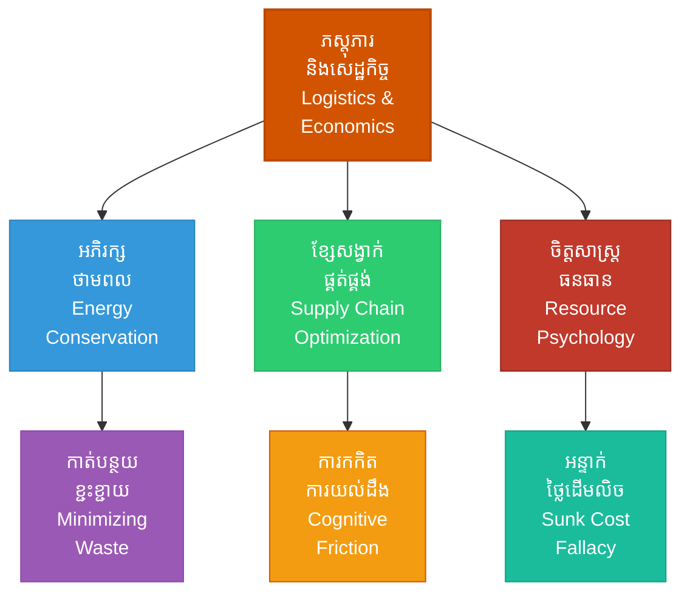

# Logistics and Economics (ភស្តុភារ និងសេដ្ឋកិច្ចសង្គ្រាម៖ គ្រឹះនៃនិរន្តរភាពអាជីវកម្ម និងយោធា)

**Author:** ichamrong  
**Date:** 2026-05-27  
**Tags:** #logistics #economics #supplychain #suntzu #finance #business #sustainability  
**Category:** Biographies / Related / Business  
**Read Time:** ~15 min  

---

## 📌 មាតិកា (Table of Contents)
- [សេចក្តីផ្តើម៖ កាយវិភាគវិទ្យានៃយុទ្ធសាស្ត្រ (Introduction: Strategic Anatomy)](#intro)
- [១. ទស្សនៈវិភាគ និងបរិបទសេដ្ឋកិច្ចអាជីវកម្ម (Perspective & Economic/Logistics Context)](#context)
- [២. 🏛️ [គ្រឹះទស្សនវិជ្ជា] ទស្សនវិជ្ជាស្នូល (The Philosophical Core)](#philosophy-core)
- [៣. 🧠 [យន្តការចិត្តសាស្ត្រ] យន្តការចិត្តសាស្ត្រ (Psychological Mechanism)](#psychological-mechanism)
- [៤. 📊 គំនូសបំរែបំរួលយុទ្ធសាស្ត្រ (Strategic Mermaid Diagram)](#diagram)
- [៥. 🚀 [មេរៀនអនុវត្ត] ការផ្សារភ្ជាប់គ្នារវាងគោលការណ៍ជាក់ស្តែង និងក្បួនសឹកស៊ុនអ៊ូ (Connecting to Sun Tzu's Art of War)](#suntzu-connection)
- [៦. ⚠️ [ភាពផ្ទុយគ្នា និងការរិះគន់] ភាពផ្ទុយគ្នា និងការរិះគន់ (Paradoxes & Criticisms)](#paradoxes-criticisms)
- [៧. តារាងប្រៀបធៀបយុទ្ធសាស្ត្រ (Strategic Comparison Table)](#comparison-table)
- [សេចក្តីសន្និដ្ឋាន (Conclusion)](#conclusion)
- [🔗 ឯកសារទាក់ទង (Related Topics)](#related-topics)
- [ឯកសារយោង (References)](#references)

---

## សេចក្តីផ្តើម៖ កាយវិភាគវិទ្យានៃយុទ្ធសាស្ត្រ (Introduction: Strategic Anatomy)

> **«សង្គ្រាមទាមទារលុយកាក់ដ៏ច្រើនសន្ធឹកសន្ធាប់ជារៀងរាល់ថ្ងៃ។ សង្គ្រាមដែលអូសបន្លាយយូរអង្វែង នឹងធ្វើឱ្យរដ្ឋធ្លាក់ចូលក្នុងវិបត្តិហិរញ្ញវត្ថុ និងវិនាសសូន្យមិនខាន។» — ស៊ុន អ៊ូ**

ស៊ុនអ៊ូយល់យ៉ាងច្បាស់ពីទំនាក់ទំនងរវាងសង្គ្រាម និងសេដ្ឋកិច្ច។ នៅក្នុងជំពូកទី ២ នៃក្បួនសឹក លោកបានបញ្ជាក់ថា ជ័យជម្នះយោធាគឺផ្អែកទាំងស្រុងលើភាពរឹងមាំនៃសេដ្ឋកិច្ច និងប្រព័ន្ធភស្តុភារ (Logistics)。 នៅក្នុងវិស័យអាជីវកម្មសម័យទំនើប គោលការណ៍នេះត្រូវបានគេស្គាល់ថា **«ការគ្រប់គ្រងខ្សែសង្វាក់ផ្គត់ផ្គង់» (Supply Chain Management)**។

> [!IMPORTANT]
> **មេរៀនគ្រឹះ (Core Maxim):**
> គ្មានភាពជោគជ័យខាងយុទ្ធវិធី ឬភាពក្លាហានរបស់យុទ្ធជនណាដែលអាចជួយសង្គ្រោះកងទ័ពបានឡើយ ប្រសិនបើប្រព័ន្ធផ្គត់ផ្គង់ស្បៀង និងការចរាចរហិរញ្ញវត្ថុខាងក្រោយត្រូវបាក់បែក និងដួលរលំ។

---

## ១. ទស្សនៈវិភាគ និងបរិបទសេដ្ឋកិច្ចអាជីវកម្ម (Perspective & Economic/Logistics Context)

សង្គ្រាមមិនមែនគ្រាន់តែជាការវាយប្រហារគ្នានៅលើសមរភូមិនោះទេ ប៉ុន្តែវាគឺជាសង្គ្រាមបង្ហូរធនធានសេដ្ឋកិច្ច។ មេទ័ពដែលឆ្លាតវៃត្រូវយល់ច្បាស់ពីការចំណាយថ្លៃដើមដឹកជញ្ជូនស្បៀង អាវុធ និងការរក្សាស្ថិរភាពហិរញ្ញវត្ថុរបស់រដ្ឋ។

នៅក្នុងពិភពជំនួញ ក្រុមហ៊ុនដែលឈ្នះគូប្រជែងមិនមែនគ្រាន់តែជាក្រុមហ៊ុនដែលមានការផ្សព្វផ្សាយល្អនោះទេ ប៉ុន្តែវាគឺជាក្រុមហ៊ុនដែលមានប្រព័ន្ធភស្តុភារ និងខ្សែសង្វាក់ផ្គត់ផ្គង់រឹងមាំ ដែលអនុញ្ញាតឱ្យពួកគេអាចចែកចាយផលិតផលទៅកាន់អតិថិជនបានលឿនបំផុត និងមានតម្លៃដើមទាបបំផុត។

---

## ២. 🏛️ [គ្រឹះទស្សនវិជ្ជា] ទស្សនវិជ្ជាស្នូល (The Philosophical Core)

គ្រឹះនៃភស្តុភារ និងសេដ្ឋកិច្ចមិនមែនគ្រាន់តែជាបញ្ហារូបវន្ត និងគណនេយ្យប៉ុណ្ណោះទេ ប៉ុន្តែត្រូវបានចាក់ឫសយ៉ាងជ្រៅនៅក្នុងទស្សនវិជ្ជាគ្រប់គ្រង៖

### ក. ការអភិរក្សថាមពលបែបតៅ (Daoist Energy Conservation)
ទស្សនវិជ្ជាតៅ (Daoism) ផ្តល់សារៈសំខាន់បំផុតលើការអភិរក្សថាមពលស្នូល ឬ «ជី» (Qi/Essence) និងការមិនខ្ជះខ្ជាយធនធានលើរឿងដែលមិនចាំបាច់។ ស៊ុនអ៊ូបានស្រូបយកគោលការណ៍នេះយ៉ាងជ្រៅទៅក្នុងទ្រឹស្តីសឹក ដោយចែងថា «ជ័យជម្នះដ៏ល្អបំផុត គឺជ័យជម្នះដោយមិនបាច់ប្រយុទ្ធ»។ នេះគឺជាការអភិរក្សថាមពល និងធនធានរបស់រដ្ឋឱ្យនៅគង់វង្ស។ ការចូលរួមក្នុងសមរភូមិដែលអូសបន្លាយ និងការវាយប្រហារបន្ទាយរឹងមាំ គឺជាការខ្ជះខ្ជាយថាមពលស្នូល និងការផ្ទុយនឹងច្បាប់ធម្មជាតិ (Ziran) ដែលនឹងនាំទៅរកការបំផ្លាញខ្លួនឯង។

### ខ. ការគ្រប់គ្រងវិន័យធនធានបែបនីតិនិយម (Legalist Resource Discipline)
ការគ្រប់គ្រងស្បៀង និងការដឹកជញ្ជូនត្រូវការវិន័យ និងការដាក់ទោស-រង្វាន់យ៉ាងតឹងរ៉ឹងបំផុត។ តាមទស្សនៈនីតិនិយម (Legalism) ធនធានទាំងអស់របស់រដ្ឋត្រូវតែត្រូវបានចុះបញ្ជី គ្រប់គ្រង និងបែងចែកដោយផ្អែកលើប្រសិទ្ធភាពការងារពិតប្រាកដ។ គ្មានកន្លែងសម្រាប់អំពើពុករលួយ ឬការខ្ជះខ្ជាយស្បៀងឡើយ ព្រោះវាជាដង្ហើមរបស់កងទ័ព។

> [!TIP]
> **គន្លឹះយុទ្ធសាស្ត្រ (Strategic Tip):**
> ក្នុងការរៀបចំផែនការប្រតិបត្តិការ ចូរលុបបំបាត់រាល់សកម្មភាពខ្ជះខ្ជាយធនធានដែលមិនបង្កើតតម្លៃបន្ថែម (Muda/Waste) ដើម្បីរក្សាកម្លាំងស្នូល (Qi) របស់ក្រុមហ៊ុនឱ្យបានគង់វង្សយូរអង្វែង។

---

## ៣. 🧠 [យន្តការចិត្តសាស្ត្រ] យន្តការចិត្តសាស្ត្រ (Psychological Mechanism)

ការគ្រប់គ្រងសេដ្ឋកិច្ច និងភស្តុភារប្រឈមមុខនឹងយន្តការចិត្តសាស្ត្រសំខាន់ៗដែលអ្នកដឹកនាំត្រូវតែយល់ដឹង៖

### ក. អន្ទាក់ថ្លៃដើមលិច និងការអស់កម្លាំងចិត្ត (Sunk-Cost Fallacy & Fatigue)
*   **អន្ទាក់ថ្លៃដើមលិច (Sunk-Cost Fallacy):** នេះគឺជាលំអៀងនៃការយល់ដឹងដែលធ្វើឱ្យមនុស្សបន្តបោះទុន បោះកម្លាំង ឬបង្ហូរជីវិតទាហានទៅក្នុងយុទ្ធនាការដែលគ្មានសង្ឃឹមឈ្នះ គ្រាន់តែដោយសារតែ «យើងបានចំណាយលើវាច្រើនពេករួចទៅហើយ» (We've already invested too much)។
*   **ការអស់កម្លាំងចិត្ត (Sunk-Cost Fatigue):** នៅពេលយុទ្ធនាការសឹកអូសបន្លាយវែងហួសកម្រិត ស្មារតីរបស់កងទ័ព និងប្រជាជននឹងរលាយសាបសូន្យ បង្កើតឱ្យមានការបាក់ទឹកចិត្ត និងអសកម្មភាព។ ស៊ុនអ៊ូបានព្រមានថា នៅពេលដែលធនធានអស់ ហើយស្មារតីរបស់ទាហានធ្លាក់ចុះ គូប្រជែងផ្សេងទៀតនឹងឆ្លៀតឱកាសវាយកម្ទេចយើងភ្លាមៗ។

### ខ. ការកកិតនៃខ្សែសង្វាក់ផ្គត់ផ្គង់ការយល់ដឹង (Cognitive Supply Chain Friction)
*   **ការកកិតការយល់ដឹង (Cognitive Friction):** នៅក្នុងភស្តុភារ ការដឹកជញ្ជូនមិនមែនមានបញ្ហាតែលើផ្លូវថ្នល់នោះទេ ប៉ុន្តែមានបញ្ហាលើ «ការសម្រេចចិត្ត និងទំនាក់ទំនង» (Decision-making friction)។ ព័ត៌មានដែលមិនច្បាស់លាស់ ការបញ្ជាផ្ទុយគ្នា និងការរាយការណ៍មិនពិត បង្កើតឱ្យមាន «បន្ទុកការយល់ដឹងខ្ពស់» (High Cognitive Load) ដល់អ្នកដឹកនាំ ដែលនាំឱ្យកើតមាន «ភាពនឿយហត់ក្នុងការសម្រេចចិត្ត» (Decision Fatigue)។
*   **លទ្ធផល:** នៅពេលអ្នកដឹកនាំអស់កម្លាំងខួរក្បាល ខ្សែសង្វាក់ផ្គត់ផ្គង់ទាំងមូលនឹងត្រូវគាំង ឬដំណើរការខុសទិសដៅ បង្កើតឱ្យមានគ្រោះមហន្តរាយនៅលើសមរភូមិជាក់ស្តែង។

---

## ៤. 📊 គំនូសបំរែបំរួលយុទ្ធសាស្ត្រ (Strategic Mermaid Diagram)

---

## ៥. 🚀 [មេរៀនអនុវត្ត] ការផ្សារភ្ជាប់គ្នារវាងគោលការណ៍ជាក់ស្តែង និងក្បួនសឹកស៊ុនអ៊ូ (Connecting to Sun Tzu's Art of War)

### ក. ការចិញ្ចឹមទ័ពដោយធនធានសត្រូវ (Supply Chain Efficiency)
«មេទ័ពឆ្លាតវៃត្រូវចេះចិញ្ចឹមកងទ័ពដោយប្រើប្រាស់ស្បៀងរបស់សត្រូវ»។ ក្នុងវិស័យពាណិជ្ជកម្ម នេះគឺជានិន្នាការសហការ និងប្រើប្រាស់ធនធានរួម (Outsourcing & Partnership) ដើម្បីកាត់បន្ថយការចំណាយលើការផលិត និងកន្លែងផ្ទុកទំនិញផ្ទាល់ខ្លួន (Warehousing)។

### ខ. การបញ្ចៀសសង្គ្រាមអូសបន្លាយ (Speed to Market)
ស៊ុនអ៊ូបានព្រមានថា៖ «គ្មានរដ្ឋណាមួយដែលទទួលបានផលប្រយោជន៍ពីសង្គ្រាមដែលអូសបន្លាយយូរអង្វែងឡើយ»។ ក្នុងអាជីវកម្ម ការអូសបន្លាយគម្រោង ឬការវាយលុកទីផ្សារយឺតពេក នឹងធ្វើឱ្យក្រុមហ៊ុនខាតបង់ថវិកាយ៉ាងសន្ធឹកសន្ធាប់ និងបាត់បង់ឱកាសប្រកួតប្រជែង។ ត្រូវវាយលុក និងសម្រេចគោលដៅឱ្យលឿនបំផុត។

---

## ៦. ⚠️ [ភាពផ្ទុយគ្នា និងការរិះគន់] ភាពផ្ទុយគ្នា និងការរិះគន់ (Paradoxes & Criticisms)

យុទ្ធសាស្ត្រសេដ្ឋកិច្ច និងភស្តុភារក៏មានភាពផ្ទុយគ្នា និងដែនកំណត់ដ៏គ្រោះថ្នាក់ផងដែរ៖

### ក. ភាពផុយស្រួយនៃការសន្សំសំចៃហួសហេតុ (The Fragility of Just-In-Time)
*   **ភាពផ្ទុយគ្នានៃប្រសិទ្ធភាព:** ការព្យាយាមកាត់បន្ថយការចំណាយស្តុកទំនិញឱ្យនៅសូន្យ (Just-in-Time Logistics) ជួយឱ្យក្រុមហ៊ុនសន្សំសំចៃលុយបានច្រើនក្នុងពេលធម្មតា។ ប៉ុន្តែវាបង្កើតឱ្យមាន «ភាពផុយស្រួយខ្លាំង» (Extreme Fragility)។ នៅពេលមានវិបត្តិរំខាន ឬ «ស្វានខ្មៅ» (ដូចជា COVID-19 ឬការបិទច្រកសមុទ្រ) ខ្សែសង្វាក់ផ្គត់ផ្គង់ដែលគ្មានទំនិញបម្រុង (Safety Stock) នឹងត្រូវដួលរលំភ្លាមៗ។ การសន្សំសំចៃហួសកម្រិតសម្លាប់ភាពធន់ (Resilience) របស់ស្ថាប័ន។

### ខ. ដែនកំណត់នៃការអភិរក្សថាមពល (The Inaction Trap of Energy Conservation)
*   **ការបាត់បង់ឱកាសដោយសារតែភាពអសកម្ម:** ការព្យាយាមរក្សាថាមពលស្នូល និងខ្លាចការបាត់បង់ធនធានខ្លាំងពេក អាចបង្កើតឱ្យមាន «ការមិនហ៊ានធ្វើសកម្មភាព» (Inaction)។ មេទ័ព ឬសហគ្រិនអាចនឹងពន្យារពេលវាយលុក ឬមិនហ៊ានបោះទុនលើឱកាសមាស ព្រោះបារម្ភពីហានិភ័យថ្លៃដើម ដែលចុងក្រោយនាំឱ្យពួកគេត្រូវចាញ់គូប្រជែងដែលមានភាពក្លាហាន និងរហ័សរហួនជាង។

> [!WARNING]
> **ភាពផ្ទុយគ្នា និងការរិះគន់ (Paradox & Risks):**
> ការផ្តោតតែលើការកាត់បន្ថយការចំណាយប្រតិបត្តិការ (Cost-cutting) អាចបំផ្លាញសមត្ថភាពស្រាវជ្រាវ និងអភិវឌ្ឍន៍ (R&D) រយៈពេលវែង និងសម្លាប់ការច្នៃប្រឌិតរបស់បុគ្គលិក។

---

## ៧. តារាងប្រៀបធៀបយុទ្ធសាស្ត្រ (Strategic Comparison Table)

| គោលការណ៍ស៊ុនអ៊ូ (Sun Tzu's Principle) | ការអនុវត្តក្នុងខ្សែសង្វាក់ផ្គត់ផ្គង់ (Supply Chain Application) | លទ្ធផលជាក់ស្តែង (Practical Result) | ដែនកំណត់យុទ្ធសាស្ត្រ (Strategic Boundary) |
| :--- | :--- | :--- | :--- |
| *«សង្គ្រាមអូសបន្លាយធ្វើឱ្យរដ្ឋវិនាស»* | យុទ្ធសាស្ត្រលក់លឿន (Fast Time-to-Market) | រក្សាចរន្តសាច់ប្រាក់ និងបញ្ចៀសការកកស្ទះទំនិញ និងអន្ទាក់ថ្លៃដើមលិច (Sunk Cost)。 | ប្រញាប់ពេកអាចបណ្តាលឱ្យផលិតផលខូចគុណភាព ឬខ្វះការត្រួតពិនិត្យ។ |
| *«ចិញ្ចឹមទ័ពដោយធនធានសត្រូវ»* | ការសហការ និងការប្រើប្រាស់ Outsourcing / M&A | កាត់បន្ថយថ្លៃដើមផលិត និងហានិភ័យស្តុកទំនិញផ្ទាល់ខ្លួន។ | ងាយនឹងបាត់បង់ការគ្រប់គ្រងលើគុណភាព និងកម្មសិទ្ធិបញ្ញា។ |
| *«ដឹងពីចម្ងាយផ្លូវ និងស្ថានភាពផ្លូវ»* | ការរៀបចំប្រព័ន្ធដឹកជញ្ជូនឆ្លាតវៃ (Logistics Optimization) | បញ្ជូនទំនិញដល់ដៃអតិថិជនបានលឿន និងមានតម្លៃថោកបំផុត។ | ប្រព័ន្ធទំនើបងាយរងការកកិតព័ត៌មាន (Cognitive Friction) បើខ្វះការសម្របសម្រួល។ |

---

## 🧭 ការរុករកយុទ្ធសាស្ត្រ (Strategic Navigation - Down the Rabbit Hole)
*   **[« យុទ្ធសាស្ត្រមុន (Previous Strategy)](19-delegation-strategy.md)**
*   **[យុទ្ធសាស្ត្របន្ទាប់ (Next Strategy) »](01-the-art-of-war.md)**

---

## សេចក្តីសន្និដ្ឋាន (Conclusion)

ភាពជោគជ័យ និងនិរន្តរភាពរបស់ស្ថាប័នមិនមែនវាស់វែងតែនៅលើភាពរំភើបនៃសមរភូមិនោះទេ ប៉ុន្តែសម្រេចបានដោយសារតែភាពរឹងមាំ និងមានរបៀបរៀបរយនៃប្រព័ន្ធភស្តុភារ និងសេដ្ឋកិច្ចខាងក្រោយ។ តាមរយៈការយល់ដឹងពីការអភិរក្សថាមពលស្នូល ការបញ្ចៀសអន្ទាក់ថ្លៃដើមលិច និងការកាត់បន្ថយការកកិតការយល់ដឹងក្នុងខ្សែសង្វាក់ផ្គត់ផ្គង់ យើងអាចដឹកនាំស្ថាប័នឱ្យទទួលបានជ័យជម្នះដ៏មានស្ថិរភាព និងអមតៈ។

---

## 🔗 ឯកសារទាក់ទង (Related Topics)
*   [ជីវប្រវត្តិ ស៊ុន អ៊ូ (The Biography of Sun Tzu)](../01-sun-tzu-biography.md)
*   [សៀវភៅ The Art of War (The Art of War Book)](01-the-art-of-war.md)
*   [យុទ្ធសាស្ត្រវាយឆ្មក់របស់ ម៉ៅ សេទុង (Mao Zedong Strategy)](02-mao-zedong-guerrilla-warfare.md)

## ឯកសារយោង (References)
*   **Christopher, M.** (2016). *Logistics & Supply Chain Management*. Pearson UK.
*   **Clausewitz, C. V.** *On War*. (For understanding operational friction).
*   **Arkes, H. R., & Blumer, C.** (1985). *The Psychology of Sunk Cost*. Organizational Behavior and Human Decision Processes.
*   **Sun Tzu.** *The Art of War (Translated by Lionel Giles)*.
*   **Laozi.** *Tao Te Ching*. (For understanding conservation of energy and Qi).
*   **Simchi-Levi, D., Kaminsky, P., & Simchi-Levi, E.** (2007). *Designing and Managing the Supply Chain: Concepts, Strategies, and Case Studies*. McGraw-Hill/Irwin.

---
*Last updated: 2026-05-27*
