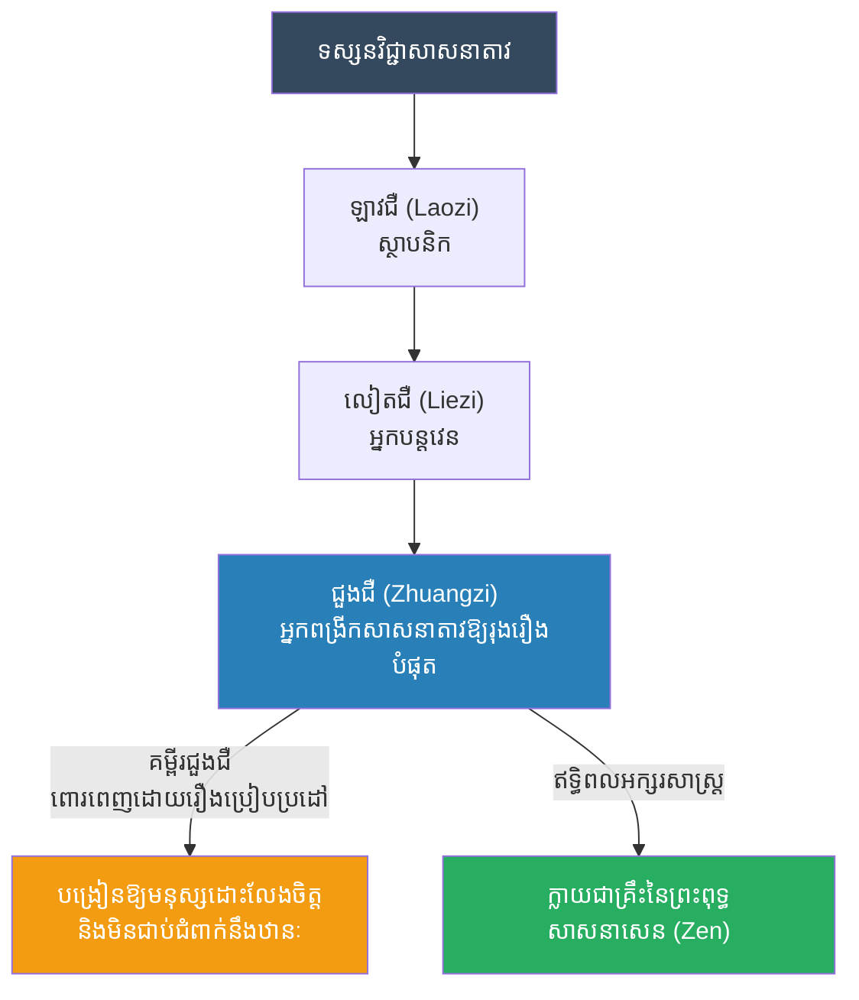

# The Biography of Zhuangzi (ជីវប្រវត្តិជួងជឺ)

**Author:** ichamrong
**Date:** 2026-05-23
**Tags:** #zhuangzi #daoism #philosophy #butterfly-dream #history
**Category:** Biographies
**Read Time:** ~10 min

---

## 📌 Table of Contents
- [១. តើជួងជឺជានរណា? (Who was Zhuangzi?)](#១-តើជួងជឺជានរណា-who-was-zhuangzi)
- [២. ប្រវត្តិសង្ខេប (Brief History)](#២-ប្រវត្តិសង្ខេប-brief-history)
- [៣. ទស្សនវិជ្ជាស្នូល៖ សុបិនមេអំបៅ និងសេរីភាព (The Butterfly Dream & Freedom)](#៣-ទស្សនវិជ្ជាស្នូល-សុបិនមេអំបៅ-និងសេរីភាព-the-butterfly-dream-freedom)
- [៤. ភាពទទេរស្អាត (The Usefulness of Uselessness)](#៤-ភាពទទេរស្អាត-the-usefulness-of-uselessness)
- [៥. កេរដំណែល (Legacy)](#៥-កេរដំណែល-legacy)
- [References](#references)

---

## ១. តើជួងជឺជានរណា? (Who was Zhuangzi?)

**ជួងជឺ (Zhuangzi / Chuang Tzu)** គឺជាទស្សនវិទូជនជាតិចិនដ៏មានឥទ្ធិពលបំផុតទី២ នៅក្នុងសាសនាតាវ (Daoism) បន្ទាប់ពីលោក ឡាវជឺ (Laozi)។ 

គាត់រស់នៅក្នុងអំឡុងសតវត្សទី ៤ មុនគ្រឹស្តសករាជ (សម័យរដ្ឋចម្បាំង - Warring States Period)។ ខណៈដែល ឡាវជឺ សរសេរពី "តាវ (Dao)" ក្នុងន័យធំទូលាយនិងអរូបី, ជួងជឺ បានយកទ្រឹស្តីនោះមកពង្រីក និងពន្យល់តាមរយៈរឿងព្រេងប្រៀបប្រដៅ រឿងកំប្លែង និងការសន្ទនាដ៏គួរឱ្យចាប់អារម្មណ៍។ សៀវភៅរបស់គាត់មានឈ្មោះថា **"គម្ពីរជួងជឺ (The Zhuangzi)"** ដែលត្រូវបានគេចាត់ទុកថាជាស្នាដៃអក្សរសាស្ត្រដ៏ពិរោះបំផុតមួយក្នុងប្រវត្តិសាស្ត្រចិន។

---

## ២. ប្រវត្តិសង្ខេប (Brief History)

ព័ត៌មានលម្អិតអំពីជីវិតរបស់គាត់មានតិចតួចណាស់។ គាត់ធ្លាប់ធ្វើជាមន្ត្រីតូចតាចម្នាក់នៅក្នុងរដ្ឋសុង (State of Song) ប៉ុន្តែក្រោយមកក៏បានលាលែងពីតំណែង។

ជួងជឺ គឺជាមនុស្សដែលស្អប់អំណាច និងទ្រព្យសម្បត្តិ។ មានរឿងមួយដំណាលថា ស្តេចនៃរដ្ឋជូ (State of Chu) បានបញ្ជូនរាជទូតមកអញ្ជើញ ជួងជឺ ឱ្យទៅធ្វើជានាយករដ្ឋមន្ត្រី ដោយសន្យាថានឹងផ្តល់មាសប្រាក់និងអំណាចកប់ពពក។ ពេលនោះ ជួងជឺកំពុងអង្គុយស្ទូចត្រី។ គាត់មិនទាំងងាកមើលមុខរាជទូតផង ហើយសួរថា៖
> *"ខ្ញុំឮថា ព្រះរាជាមានទុកអណ្តើកងាប់មួយក្បាលនៅក្នុងវាំង ហើយរុំវាដោយសូត្រមាសដើម្បីបូជា... តើអណ្តើកនោះចង់ស្លាប់ហើយទុកឆ្អឹងនៅលើទីសក្ការៈ ឬក៏ចង់រស់ហើយអូសកន្ទុយលេងក្នុងភក់?"*

រាជទូតឆ្លើយថា៖ *"ប្រាកដជាចង់រស់ហើយលេងក្នុងភក់ហើយ"។*
ជួងជឺតបវិញថា៖ *"បើអញ្ចឹង សូមអស់លោកត្រលប់ទៅវិញចុះ។ ទុកឱ្យខ្ញុំអូសកន្ទុយលេងក្នុងភក់នៅទីនេះចុះ ខ្ញុំមិនចង់ជាប់ទ្រុងមាសរបស់ស្តេចលោកទេ។"*

---

## ៣. ទស្សនវិជ្ជាស្នូល៖ សុបិនមេអំបៅ និងសេរីភាព (The Butterfly Dream & Freedom)

ទស្សនវិជ្ជារបស់ជួងជឺ គឺផ្តោតទៅលើ **"ការរំដោះចិត្តឱ្យមានសេរីភាពពេញលេញ និងការមិនប្រកាន់ខ្ជាប់ (Relativism)"**។ លោកបង្រៀនថាមនុស្សរងទុក្ខដោយសារតែពួកគេដាក់កម្រិតលើខ្លួនឯង តាមរយៈទស្សនៈតូចចង្អៀតដូចជា "ត្រូវ-ខុស" "ល្អ-អាក្រក់" "មាន-ក្រ" ជាដើម។ នៅក្នុងធម្មជាតិ គ្មានអ្វីត្រូវ ឬ ខុស នោះទេ។

រឿងប្រៀបប្រដៅដ៏ល្បីល្បាញបំផុតរបស់គាត់គឺ **"សុបិនមេអំបៅ (The Butterfly Dream)"**:
> *យប់មួយ ជួងជឺ បានយល់សប្តិឃើញខ្លួនឯងក្លាយជាសត្វមេអំបៅមួយក្បាល ហោះហើរយ៉ាងសប្បាយរីករាយ ដោយមិនដឹងទាល់តែសោះថាខ្លួនជាមនុស្សឈ្មោះជួងជឺ។ ស្រាប់តែគាត់ភ្ញាក់ពីដេក ហើយឃើញខ្លួនឯងជាជួងជឺវិញ។ ប៉ុន្តែពេលនោះ គាត់ចាប់ផ្តើមសង្ស័យថា៖ "តើខ្ញុំជាជួងជឺ ដែលកំពុងយល់សប្តិឃើញមេអំបៅ? ឬក៏ខ្ញុំជាមេអំបៅ ដែលកំពុងយល់សប្តិឃើញថាខ្លួនឯងជាជួងជឺ?"*

រឿងនេះបង្ហាញពីទស្សនៈថា អ្វីដែលយើងគិតថាជា "ការពិត" ប្រហែលជាគ្រាន់តែជាការយល់ឃើញរបស់យើងប៉ុណ្ណោះ។ ដូច្នេះហើយ យើងមិនគួរប្រកាន់ខ្ជាប់ពេកនោះទេ។

---

## ៤. ភាពទទេរស្អាត (The Usefulness of Uselessness)

ជួងជឺ តែងតែសរសើរពី **"ប្រយោជន៍នៃភាពគ្មានប្រយោជន៍ (The Usefulness of the Useless)"**។

គាត់បានលើកឧទាហរណ៍ពី "ដើមឈើធំមួយដើម"៖
> *មានដើមឈើចាស់មួយដើម ដែលមានរាងកោងក្ងិចក្ងក់ សាច់ឈើស្អុយរលួយ មិនអាចយកទៅធ្វើក្តារ ឬសង់ផ្ទះបានទេ។ ជាងឈើទាំងអស់ដើរកាត់ ហើយក៏ជេរប្រមាថដើមឈើនោះថា "ជាដើមឈើគ្មានប្រយោជន៍" គ្មាននរណាចង់កាប់វាទេ។ ជួងជឺ ពន្យល់ថា៖ "ដោយសារតែវា 'គ្មានប្រយោជន៍' ទើបវាអាចរួចជីវិតពីរណារបស់ជាងឈើ ហើយអាចរស់នៅបានរាប់ពាន់ឆ្នាំ និងផ្តល់ម្លប់ដល់មនុស្សសត្វជ្រកកោន។ ដូច្នេះ ភាពគ្មានប្រយោជន៍ គឺជាប្រយោជន៍ដ៏ធំបំផុតសម្រាប់ជីវិតវា!"*

គាត់ចង់ទូន្មានថា ពេលខ្លះ ការមិនសូវលេចធ្លោ ការមិនតាំងខ្លួនជាអ្នកចេះដឹង និងការរស់នៅដោយសាមញ្ញ គឺជាវិធីការពារខ្លួនឯងឱ្យរួចផុតពីគ្រោះថ្នាក់នៅក្នុងសង្គម។

---

## ៥. កេរដំណែល (Legacy)

ជួងជឺ មិនដែលបង្កើតសាលាបង្រៀនដូចខុងជឺទេ ប៉ុន្តែសៀវភៅរបស់គាត់ត្រូវបានគេអាននិងកោតសរសើររាប់ពាន់ឆ្នាំមកហើយ។ ព្រះពុទ្ធសាសនាសេន (Zen Buddhism / Chan Buddhism) ដែលរីកដុះដាលនៅប្រទេសចិន និងជប៉ុន គឺទទួលឥទ្ធិពលពីទស្សនៈ "ការមិនតោងជាប់ (Detachment)" និងរឿងកំប្លែងបង្កប់ធម៌របស់ជួងជឺ យ៉ាងខ្លាំង។

---

---

## 🔗 ឯកសារទាក់ទង (Related Topics)
* [សសរស្តម្ភទាំង ៣ នៃសាសនាតាវ (The Three Pillars of Daoism)](../laozi/02-daoist-lineage.md)
* [ជីវប្រវត្តិឡាវជឺ (Laozi Biography)](../laozi/01-laozi-biography.md)
* [ជីវប្រវត្តិលៀតជឺ (Liezi Biography)](../liezi/01-liezi-biography.md)

## References

*   **The Zhuangzi (Chuang Tzu)** — The foundational text containing his parables, including the famous Butterfly Dream.
*   **The Complete Works of Chuang Tzu translated by Burton Watson** — Widely considered one of the most accessible and poetic translations of Zhuangzi's writings.

---

*Last updated: 2026-05-23*
