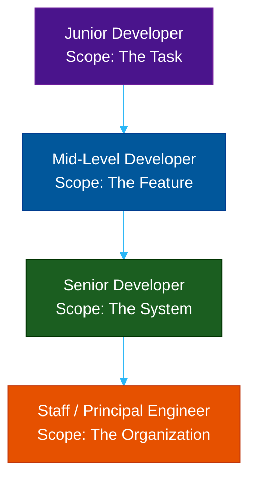

# The Software Engineer (Junior to Principal)

**Author:** ichamrong  
**Category:** Career & Leadership  
**Read Time:** ~20 min  

---

## 📌 Table of Contents
- [1. The Core Philosophy](#1-the-core-philosophy)
- [2. The Career Progression Ladder](#2-the-career-progression-ladder)
  - [The Junior Developer (Scope: The Task)](#the-junior-developer-scope-the-task)
  - [The Mid-Level Developer (Scope: The Feature)](#the-mid-level-developer-scope-the-feature)
  - [The Senior Developer (Scope: The System)](#the-senior-developer-scope-the-system)
  - [The Staff / Principal Engineer (Scope: The Organization)](#the-staff-principal-engineer-scope-the-organization)
- [3. The "T-Shaped" Engineer](#3-the-t-shaped-engineer)
- [4. The Autopsy: Why Engineers Fail](#4-the-autopsy-why-engineers-fail)
- [5. The Blueprint: The Survival Guide](#5-the-blueprint-the-survival-guide)
  - [A. The Hard Skills Roadmap](#a-the-hard-skills-roadmap)
  - [B. Soft Skills & Dark Psychology (The Shield)](#b-soft-skills-dark-psychology-the-shield)
- [6. Mental Health & Mental Models](#6-mental-health-mental-models)
  - [Mental Model 1: Inversion Thinking](#mental-model-1-inversion-thinking)
  - [Mental Model 2: The Dunning-Kruger Effect](#mental-model-2-the-dunning-kruger-effect)
  - [Mental Health: Diagnosing Burnout vs. Stress](#mental-health-diagnosing-burnout-vs-stress)
  - [Mental Health: Compartmentalization & Rubber Ducking](#mental-health-compartmentalization-rubber-ducking)
- [7. Recommended Reading](#7-recommended-reading)
- [🔗 External References](#external-references)
- [📚 Cross-References & Related Reading](#cross-references-related-reading)

---

## 1. The Core Philosophy

A Software Engineer is the architect and builder of the digital world. They translate abstract business requirements into highly efficient, scalable, and maintainable logic. While a Product Owner decides *what* the business needs to survive, the Software Engineer decides *how* that survival is technically executed.

The mark of a truly great engineer is not the complexity of the code they write, but the simplicity of the solutions they leave behind.

## 2. The Career Progression Ladder

In modern tech companies, the engineering ladder is split into the **Individual Contributor (IC)** track and the **Management** track. This guide focuses on the IC track.

### The Junior Developer (Scope: The Task)
- **Focus:** Learning how to write code that actually compiles and works.
- **Responsibility:** Completing well-defined, highly scoped tickets (e.g., "Fix this CSS bug," "Add a new column to this database table").
- **Success Metric:** Speed of learning. A junior's job is to ask a massive amount of questions, learn Git version control, and absorb coding standards.
- **Biggest Mistake:** Suffering in silence. Being stuck for 3 days because they are too afraid to ask a Senior for help.

### The Mid-Level Developer (Scope: The Feature)
- **Focus:** Writing code that is *maintainable*. They realize that making code "work" is easy; making it readable for the next developer is hard.
- **Responsibility:** Owning entire features from end to end. Reviewing Junior PRs. They can be handed an Epic and trusted to deliver it over a few sprints.
- **Success Metric:** Mastery of Design Patterns, SOLID principles, and writing robust unit tests.
- **Biggest Mistake:** "Mt. Stupid." They learn a new framework (like React or Kafka) and immediately try to force the entire team to rewrite the codebase to use it.

### The Senior Developer (Scope: The System)
- **Focus:** Solving problems *before* they happen. They optimize for system stability, security, and long-term scaling.
- **Responsibility:** Designing the system architecture. Mentoring Mid and Junior developers. They frequently push back against Product Owners when requirements are technically dangerous.
- **Success Metric:** Multiplying the productivity of the entire team. A Senior is successful when the Juniors they mentor are shipping code faster and safer.
- **Biggest Mistake:** Over-engineering. Building a massive microservice architecture for an app that only has 100 users.

### The Staff / Principal Engineer (Scope: The Organization)
- **Focus:** Cross-team architectural alignment and business impact.
- **Responsibility:** They rarely write daily feature code. Instead, they unblock multi-team initiatives, evaluate million-dollar cloud contracts, and establish the engineering standards for a 500+ person department.

---

## 3. The "T-Shaped" Engineer

To reach the Senior level, you must become a **T-Shaped Engineer**.
- **The Horizontal Bar (Broad Knowledge):** You know a little bit about everything. You understand basic UX design, how Docker works, how the CI/CD pipeline deploys code, and how DNS routing works.
- **The Vertical Bar (Deep Expertise):** You are an absolute master in one specific domain (e.g., high-performance Go backend systems, or interactive React frontends).

---

## 4. The Autopsy: Why Engineers Fail

- **The Brilliant Jerk:** The 10x developer who writes amazing code but destroys team morale by insulting Juniors in PR reviews and refusing to document their work. They are eventually fired because their toxicity reduces the output of everyone else by 20x.
- **Resume-Driven Development (RDD):** Choosing to use Kubernetes, GraphQL, and Rust for a simple blog just so the engineer can put those buzzwords on their resume. This saddles the company with massive technical debt.

---

## 5. The Blueprint: The Survival Guide

To survive and thrive, knowing syntax is only 20% of the job. You must master the following dimensions:

### A. The Hard Skills Roadmap
- **Programming & Architecture:** Deep dive into memory management, concurrency, Microservices, and SOLID patterns.
- **Infra & DevOps:** Docker, Kubernetes, CI/CD (GitHub Actions), and Cloud basics (AWS/GCP).
- **Security & Compliance:** OWASP Top 10 (SQL Injection, XSS), Zero Trust Architecture, and data privacy basics (GDPR/HIPAA).

### B. Soft Skills & Dark Psychology (The Shield)
Corporate environments can be political. You must understand "Dark Psychology" not to use it, but to defend yourself against it:
- **The Art of Pushback:** How to say "No" to unrealistic deadlines. Frame it as a tradeoff: *"We can deliver this in 2 weeks, but we will have to drop feature X or accept massive tech debt."*
- **The "Rockstar" Trap:** Managers will call you a "Hero" to manipulate your ego into working 80-hour weeks for free. Praise is not compensation. Set boundaries.
- **Managing Up:** Keep a "Brag Document"—a weekly list of bugs you fixed, features you shipped, and teammates you helped—to logically prove you deserve a raise during performance reviews.

---

## 6. Mental Health & Mental Models

### Mental Model 1: Inversion Thinking
Instead of asking, *"How do I make this feature work?"* ask, *"What is everything that could possibly make this feature fail or crash?"* By inverting the problem, you naturally write robust error handling and avoid catastrophic edge cases.

### Mental Model 2: The Dunning-Kruger Effect
Juniors often suffer from Imposter Syndrome (thinking they know nothing). Mid-levels often suffer from overconfidence. Seniors understand that the more they learn, the more they realize how much they *don't* know. Stay humble.

### Mental Health: Diagnosing Burnout vs. Stress
- **Stress:** You have too much to do, but you still care about the product. You feel anxious.
- **Burnout:** You have given up. You feel cynical, apathetic, and exhausted. You don't care if production crashes.

### Mental Health: Compartmentalization & Rubber Ducking
When you are stuck on a bug for 4 hours, your brain is fatigued. Stop typing. Explain the code out loud to a rubber duck (or a coworker). The act of vocalizing forces your brain to process logic differently. Furthermore, learn to leave work at work. Your self-worth is not tied to a rejected Pull Request.

---

## 7. Recommended Reading
- **Book:** *The Pragmatic Programmer* by David Thomas and Andrew Hunt (The Bible of Software Engineering).
- **Book:** *Clean Code* by Robert C. Martin.
- **Book:** *Designing Data-Intensive Applications* by Martin Kleppmann (Mandatory for Seniors).
- **Book:** *The Software Developer's Career Handbook* by John Sonmez (For navigating office politics).

---

## 🔗 External References
- [The Pragmatic Engineer (Gergely Orosz)](https://blog.pragmaticengineer.com/)
- [Roadmap.sh - Developer Roadmaps](https://roadmap.sh/)

## 📚 Cross-References & Related Reading
- **Agile Roles:** [The Product Owner](./role-02-product-owner.md) | [The Project Manager](./role-03-project-manager.md)

---

*Last updated: 2026-05-17*

## Related

- [SDLC Models](../management/sdlc/README.md)
- [Developer Habits](../developer-habits/README.md)
- [Mental Health & Well-being](../mental-health/README.md)
