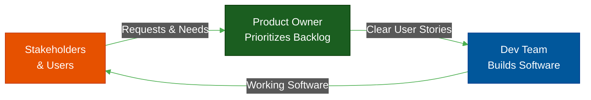

# The Product Owner (PO)

**Author:** ichamrong  
**Category:** Career & Leadership  
**Read Time:** ~15 min  

---

## 📌 Table of Contents
- [1. The Core Philosophy](#1-the-core-philosophy)
- [2. The Ecosystem: Where the PO Fits](#2-the-ecosystem-where-the-po-fits)
- [3. Responsibilities: The Day-to-Day](#3-responsibilities-the-day-to-day)
- [4. The Autopsy: Why Product Teams Fail](#4-the-autopsy-why-product-teams-fail)
- [5. The Blueprint: How to Succeed (Soft Skills & Dark Psychology)](#5-the-blueprint-how-to-succeed-soft-skills-dark-psychology)
- [6. Mental Health & Mental Models](#6-mental-health-mental-models)
  - [Mental Model 1: Confirmation Bias](#mental-model-1-confirmation-bias)
  - [Mental Model 2: The Pareto Principle (80/20 Rule)](#mental-model-2-the-pareto-principle-8020-rule)
  - [Mental Health: Stakeholder Pressure & Compartmentalization](#mental-health-stakeholder-pressure-compartmentalization)
- [7. Next Career Growth](#7-next-career-growth)
- [8. Recommended Reading](#8-recommended-reading)
- [🔗 External References](#external-references)
- [📚 Cross-References & Related Reading](#cross-references-related-reading)

---

## 1. The Core Philosophy

The Product Owner (PO) is the CEO of the product. They act as the single, authoritative voice of the customer and the business stakeholders. Their primary job is to define *WHAT* needs to be built and *WHY* it matters.

If the Software Engineer is the engine of the car, the Product Owner is the steering wheel. A Ferrari engine is useless if it's driving off a cliff. The PO ensures that every dollar spent on expensive engineering time is delivering maximum business value and moving the company in the right direction.

## 2. The Ecosystem: Where the PO Fits

## 3. Responsibilities: The Day-to-Day

Being a PO is not about dreaming up fun features; it is a grueling exercise in negotiation, data analysis, and documentation.

1. **Ruthless Prioritization:** The hardest part of being a PO is saying "No" to stakeholders (including the CEO). If everything is a Priority 1, nothing is. The PO must rank features strictly by ROI (Return on Investment).
2. **Backlog Grooming & Refinement:** The PO owns the Product Backlog. They ensure that the top tickets are perfectly refined, meeting the "Definition of Ready" so developers don't have to guess what to build.
3. **Writing User Stories:** Translating vague business requests ("make the app faster") into actionable tickets ("As a User, I want the dashboard to load in under 2 seconds, so I can view my stats immediately"). This includes writing bulletproof Acceptance Criteria.
4. **Measuring Success (KPIs):** A feature isn't "done" when the code is deployed; it's done when it moves the business metric (e.g., reducing cart abandonment by 5%).

## 4. The Autopsy: Why Product Teams Fail

- **The Feature Factory:** When a PO has no real authority and just acts as a secretary, taking orders from the CEO and passing them to the dev team. They pump out 100 features a year, but revenue never goes up because nobody is measuring if the features actually solve user problems.
- **The "Build Trap":** Measuring success by "number of story points delivered" instead of "amount of customer value created."

## 5. The Blueprint: How to Succeed (Soft Skills & Dark Psychology)

To survive as a PO, you must master stakeholder management and psychology:

- **Translating Tech to Business:** Never tell stakeholders "We need to pause feature development to refactor the database because queries are O(N^2)." Tell them "We need to pause to refactor because if we don't, the app will crash on Black Friday and we will lose $100k in sales."
- **Gaslighting Defense:** When a stakeholder verbally agrees to cut a feature scope, then later claims they never agreed. **Defense:** Always get it in writing (e.g., an email recap or a Jira comment). Document every decision.
- **Data over Opinions:** When the VP of Marketing demands a feature because they "feel it's right," counter them with A/B test data or user analytics. Data is the only shield against executive ego.

## 6. Mental Health & Mental Models

### Mental Model 1: Confirmation Bias
A deadly trap for POs. You fall in love with a feature idea you thought of, so you subconsciously only look for user data that *supports* building it, while ignoring the data that proves users don't care. **Cure:** Actively search for evidence that your idea is bad.

### Mental Model 2: The Pareto Principle (80/20 Rule)
80% of your users only use 20% of your features. As a PO, stop forcing the dev team to build massive, complex 100% solutions. Build the 20% MVP (Minimum Viable Product) that solves 80% of the problem, and move on.

### Mental Health: Stakeholder Pressure & Compartmentalization
POs absorb the immense stress from angry executives demanding faster delivery and higher revenue. **Never pass this panic down to the engineering team.** Your job is to act as an umbrella, shielding the developers from the rain of corporate politics so they can code in peace. Furthermore, practice compartmentalization to avoid burnout. You cannot control the market, only your backlog.

## 7. Next Career Growth
The PO is highly integrated into the business side of the company. The progression is typically:
- Product Owner ➔ Senior Product Manager ➔ Group Product Manager ➔ VP of Product ➔ Chief Product Officer (CPO).

---

## 8. Recommended Reading
- **Book:** *Inspired: How to Create Tech Products Customers Love* by Marty Cagan (The Bible of Product Management).
- **Book:** *Escaping the Build Trap* by Melissa Perri.
- **Book:** *Continuous Discovery Habits* by Teresa Torres.
- **Course:** Certified Scrum Product Owner (CSPO).

---

## 🔗 External References
- [Scrum.org: What is a Product Owner?](https://www.scrum.org/resources/what-is-a-product-owner)
- [Silicon Valley Product Group (SVPG)](https://svpg.com/)

## 📚 Cross-References & Related Reading
- **Development:** [The Software Engineer](./role-01-software-engineer.md)
- **Agile Workflow:** [DoR vs DoD](../management/dor-and-dod-guide.md)

---

*Last updated: 2026-05-17*

## Related

- [SDLC Models](../management/sdlc/README.md)
- [Developer Habits](../developer-habits/README.md)
- [Mental Health & Well-being](../mental-health/README.md)
