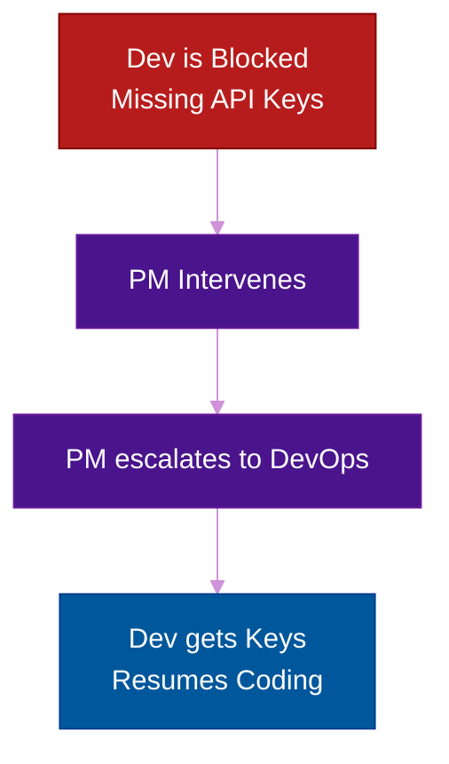

# The Project Manager / Scrum Master

**Author:** ichamrong  
**Category:** Career & Leadership  
**Read Time:** ~15 min  

---

## 📌 Table of Contents
- [1. The Core Philosophy](#1-the-core-philosophy)
- [2. The Core Workflow: The Unblocker](#2-the-core-workflow-the-unblocker)
- [3. Responsibilities: The Day-to-Day](#3-responsibilities-the-day-to-day)
- [4. The Autopsy: Why PMs Fail](#4-the-autopsy-why-pms-fail)
- [5. The Blueprint: Soft Skills & Dark Psychology](#5-the-blueprint-soft-skills-dark-psychology)
- [6. Mental Health & Mental Models](#6-mental-health-mental-models)
  - [Mental Model 1: The 5 Whys (Root Cause Analysis)](#mental-model-1-the-5-whys-root-cause-analysis)
  - [Mental Model 2: Optimism Bias (Hofstadter's Law)](#mental-model-2-optimism-bias-hofstadters-law)
  - [Mental Health: Servant Leadership & Burnout](#mental-health-servant-leadership-burnout)
- [7. Next Career Growth](#7-next-career-growth)
- [8. Recommended Reading](#8-recommended-reading)
- [🔗 External References](#external-references)
- [📚 Cross-References & Related Reading](#cross-references-related-reading)

---

## 1. The Core Philosophy

While the Product Owner owns the *What* (business value), the Project Manager (PM) or Scrum Master owns the *When* and the *How* (execution). They are the orchestrators of the Software Development Life Cycle (SDLC), ensuring that the team has everything they need to deliver high-quality software on time.

Software development is inherently chaotic. Developers get blocked by missing API keys, POs try to sneak new requirements in mid-sprint, and deadlines constantly loom. The PM is the grease in the engine that keeps everything running smoothly.

## 2. The Core Workflow: The Unblocker

## 3. Responsibilities: The Day-to-Day

A great PM does much more than just move Jira tickets around and schedule Zoom meetings.

1. **Blocker Removal:** Your #1 job is ensuring developers are never sitting idle because they are waiting on a dependency from another team, a design file from UI/UX, or clarification from a stakeholder.
2. **Process Enforcer:** You enforce the "Definition of Ready" (DoR) to ensure devs aren't given half-baked requirements, and the "Definition of Done" (DoD) to ensure code meets quality standards before release. You protect the sprint from scope creep.
3. **Ritual Facilitation:** You run the daily Standups, Sprint Planning, and Retrospectives, ensuring they remain highly focused and don't drag on for hours.
4. **Risk Tracking & Escalation:** Identifying when a project is turning from green (healthy) to yellow (at-risk) and alerting stakeholders *early*. A good PM never lets a delay be a surprise on delivery day.

## 4. The Autopsy: Why PMs Fail

- **The Micro-Manager:** A PM who treats developers like assembly-line workers. They message developers every 2 hours asking "Is it done yet?" This destroys morale and trust.
- **The Jira Admin:** A PM who cares more about the Burndown Chart looking perfect than actually delivering software. They force developers to spend 4 hours a week logging time instead of coding.

## 5. The Blueprint: Soft Skills & Dark Psychology

As a PM, your entire job revolves around managing human behavior and protecting your team.

- **Weaponized Incompetence:** When a stakeholder or external team pretends they don't know how to do a simple task (like generating a report) so you get frustrated and do it for them. Don't fall for it. Force them to follow the process.
- **Protecting the Team from the "Rockstar" Trap:** Executive leadership will try to force your devs to work nights and weekends by calling them "Heroes" or "Rockstars." Your job is to shield them. Push back on unrealistic timelines on behalf of your team. You are their armor.
- **Influencing Without Authority:** You do not manage the developers (you cannot fire them or promote them), yet you are responsible for their delivery. You must build trust so they *want* to work with you.

## 6. Mental Health & Mental Models

### Mental Model 1: The 5 Whys (Root Cause Analysis)
When a project fails or misses a deadline, do not blame the developer. Ask "Why" five times to find the system failure.
1. Why did we miss the deadline? *Because the DB migration failed.*
2. Why did it fail? *Because we didn't test on staging.*
3. Why didn't we test? *Because the staging server was down.*
4. Why was it down? *Because DevOps wasn't informed.*
5. Why weren't they informed? *Because our communication process is broken.* (Root Cause found!)

### Mental Model 2: Optimism Bias (Hofstadter's Law)
Humans are terrible at estimating time. Hofstadter's Law states: *"It always takes longer than you expect, even when you take into account Hofstadter's Law."* As a PM, you must always add risk buffers. Never plan a sprint to 100% capacity; plan for 80% to absorb the inevitable unexpected bugs.

### Mental Health: Servant Leadership & Burnout
Because your success is entirely dependent on the output of others, PMs suffer from high stress and anxiety. You must adopt a **"Servant Leader"** mentality—your power comes from helping them, not commanding them. Monitor yourself for burnout (cynicism and deep fatigue) when dealing with constant organizational blockers. Leave work at work.

## 7. Next Career Growth
- Junior PM / Junior Scrum Master ➔ Senior PM ➔ Program Manager (managing multiple projects) ➔ Portfolio Manager ➔ VP of Operations / PMO Director.

---

## 8. Recommended Reading
- **Book:** *Making Things Happen: Mastering Project Management* by Scott Berkun.
- **Book:** *Scrum: The Art of Doing Twice the Work in Half the Time* by Jeff Sutherland.
- **Book:** *Coaching Agile Teams* by Lyssa Adkins.
- **Certification:** PMP (Project Management Professional) or CSM (Certified ScrumMaster).

---

## 🔗 External References
- [Project Management Institute (PMI)](https://www.pmi.org/)
- [Atlassian: Scrum Master Role](https://www.atlassian.com/agile/scrum/scrum-master)

## 📚 Cross-References & Related Reading
- **Agile Roles:** [The Product Owner](./role-02-product-owner.md) | [Software Engineer](./role-01-software-engineer.md)

---

*Last updated: 2026-05-17*

## Related

- [SDLC Models](../management/sdlc/README.md)
- [Developer Habits](../developer-habits/README.md)
- [Mental Health & Well-being](../mental-health/README.md)
