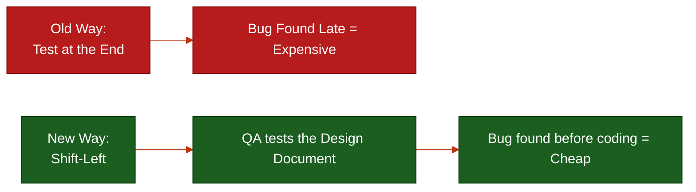

# Quality Assurance (QA) & SDET

**Author:** ichamrong  
**Category:** Career & Leadership  
**Read Time:** ~15 min  

---

## 📌 Table of Contents
- [1. The Core Philosophy](#1-the-core-philosophy)
- [2. The Ecosystem: Shift-Left Testing](#2-the-ecosystem-shift-left-testing)
- [3. Responsibilities: The Day-to-Day](#3-responsibilities-the-day-to-day)
- [4. The Autopsy: Why QA Teams Fail](#4-the-autopsy-why-qa-teams-fail)
- [5. Hard Skills: Security & Compliance](#5-hard-skills-security-compliance)
- [6. Soft Skills & Dark Psychology (The Shield)](#6-soft-skills-dark-psychology-the-shield)
- [7. Mental Health & Mental Models](#7-mental-health-mental-models)
  - [Mental Model 1: The Curse of Knowledge](#mental-model-1-the-curse-of-knowledge)
  - [Mental Model 2: The Pesticide Paradox](#mental-model-2-the-pesticide-paradox)
  - [Mental Health: The Bad News Bearer](#mental-health-the-bad-news-bearer)
- [8. Next Career Growth](#8-next-career-growth)
- [9. Recommended Reading](#9-recommended-reading)
- [🔗 External References](#external-references)
- [📚 Cross-References & Related Reading](#cross-references-related-reading)

---

## 1. The Core Philosophy

Quality Assurance (QA) engineers are the last line of defense and the gatekeepers of production. While software developers focus heavily on making the software *work* (the Happy Path), QA focuses on proving how the software *breaks* (the Edge Cases).

Advanced QA engineers who write automated testing code are known as **SDETs** (Software Development Engineers in Test). QA is a highly analytical, borderline adversarial role. They save companies millions of dollars because a bug caught in production costs 100x more to fix than a bug caught in the design phase.

## 2. The Ecosystem: Shift-Left Testing

Historically, QA was thrown at the end of the Waterfall process, testing finished code right before launch. Modern engineering uses **Shift-Left Testing**, meaning QA is involved from Day 1 of the requirements phase.

## 3. Responsibilities: The Day-to-Day

1. **Test Planning & Strategy:** Reading Product Owner specifications and mapping out a comprehensive matrix of positive, negative, boundary, and edge-case scenarios before the developer even starts coding.
2. **Manual Exploratory Testing:** Using human intuition to try and "break" the app in ways a script wouldn't think to do.
3. **Automation Engineering:** Writing code using Cypress, Selenium, or Playwright to automate repetitive tests. The goal is to build a massive regression suite that runs in the CI/CD pipeline so manual QA isn't needed for basic checks.
4. **Bug Triage:** Documenting bugs with exact reproduction steps, environment details, and video recordings so developers can fix them instantly.

## 4. The Autopsy: Why QA Teams Fail

- **The "Click Monkey":** A QA team that never learns automation. They just manually click the same 50 buttons every week. They eventually slow down the entire company's deployment pipeline because human testing cannot keep up with continuous integration.
- **The Adversarial Police:** A QA team that treats developers like enemies. They take joy in rejecting tickets and logging trivial bugs, creating a toxic environment where developers hide code from them.

## 5. Hard Skills: Security & Compliance

Modern QA is a highly technical role. You must test for:
- **Security:** OWASP Top 10 vulnerabilities. Can you execute an SQL Injection on the login field? Can you execute an XSS script in the comments section?
- **Infrastructure Limits:** Using tools like JMeter or k6 to simulate 10,000 users logging in at once (Load/Stress Testing) to see exactly when the cloud servers crash.
- **Accessibility (a11y):** Ensuring the software complies with legal standards for visually impaired users (screen readers, color contrast).

## 6. Soft Skills & Dark Psychology (The Shield)

- **The Art of Pushback:** QA is under immense pressure by project managers to "just pass" a ticket because the deadline is tomorrow. You must have a backbone of steel. If the code is dangerous, you hold the line and refuse the release.
- **Weaponized Incompetence:** Sometimes, a junior developer will push fundamentally broken code because they "knew QA would catch it." You are not their compiler. Force the developer to write unit tests before you accept their ticket. Protect your time.

## 7. Mental Health & Mental Models

### Mental Model 1: The Curse of Knowledge
Why can't developers test their own code? Because of the *Curse of Knowledge*. A developer knows exactly how the system is *supposed* to be used, so they naturally only test the "Happy Path." QA engineers come in blind (**First Principles Thinking**) and use the system like a chaotic, unpredictable user would, finding the true edge cases.

### Mental Model 2: The Pesticide Paradox
If you run the exact same manual tests or automated scripts every single day, eventually, bugs will evolve to sneak past them. Just like bugs developing a resistance to pesticides, QA engineers must constantly update, mutate, and evolve their test suites to find new bugs in unexplored areas of the code.

### Mental Health: The Bad News Bearer
QA's entire job is to tell developers that their baby is ugly (that their code is broken). This can cause intense friction. A great QA must have high emotional intelligence (EQ), framing bugs not as "You messed up," but as "We found a vulnerability that we need to patch together to protect the user."

---

## 8. Next Career Growth
The growth path for QA heavily favors transitioning into automation and architecture:
- Manual QA ➔ QA Automation Engineer ➔ SDET ➔ QA Architect ➔ Director of Quality.

---

## 9. Recommended Reading
- **Book:** *Agile Testing* by Lisa Crispin and Janet Gregory.
- **Book:** *Lessons Learned in Software Testing* by Cem Kaner.
- **Tooling:** Cypress.io Documentation, Playwright Documentation.

---

## 🔗 External References
- [ISTQB (International Software Testing Qualifications Board)](https://www.istqb.org/)
- [Ministry of Testing](https://www.ministryoftesting.com/)

## 📚 Cross-References & Related Reading
- **Development Pipeline:** [V-Model SDLC](../management/sdlc-04-v-model.md)
- **Quality Gates:** [DoR vs DoD](../management/dor-and-dod-guide.md)

---

*Last updated: 2026-05-17*

## Related

- [SDLC Models](../management/sdlc/README.md)
- [Developer Habits](../developer-habits/README.md)
- [Mental Health & Well-being](../mental-health/README.md)
