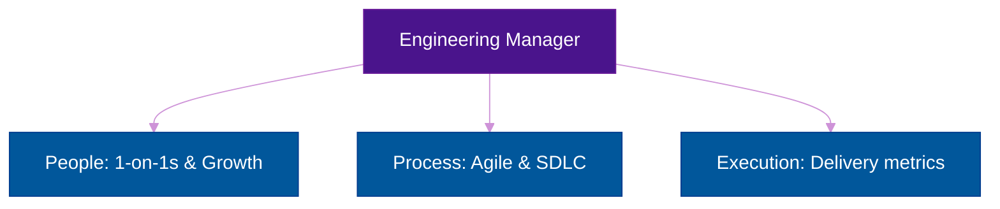

# The Operations / Engineering Manager (OM/EM)

**Author:** ichamrong  
**Category:** Career & Leadership  
**Read Time:** ~15 min  

---

## 📌 Table of Contents
- [1. The Core Philosophy](#1-the-core-philosophy)
- [2. The Ecosystem: The Management Triad](#2-the-ecosystem-the-management-triad)
- [3. Responsibilities: The Day-to-Day](#3-responsibilities-the-day-to-day)
- [4. The Autopsy: Why Managers Fail](#4-the-autopsy-why-managers-fail)
- [5. Soft Skills & Dark Psychology (The Shield)](#5-soft-skills-dark-psychology-the-shield)
- [6. Mental Health & Mental Models](#6-mental-health-mental-models)
  - [Mental Model 1: The Peter Principle](#mental-model-1-the-peter-principle)
  - [Mental Model 2: Systems Thinking](#mental-model-2-systems-thinking)
  - [Mental Health: The Feedback Vacuum](#mental-health-the-feedback-vacuum)
- [7. Next Career Growth](#7-next-career-growth)
- [8. Recommended Reading](#8-recommended-reading)
- [🔗 External References](#external-references)
- [📚 Cross-References & Related Reading](#cross-references-related-reading)

---

## 1. The Core Philosophy

An Engineering Manager (EM) or Operations Manager (OM) is a massive pivot in a tech career. Unlike a Senior Developer or a Tech Lead whose job is to manage *code and architecture*, an EM's job is to manage *people, processes, and systems*. 

You are no longer an Individual Contributor (IC). Your success is no longer measured by the elegance of your pull requests; it is measured by the health, growth, retention, and output of the engineering department.

## 2. The Ecosystem: The Management Triad

An effective Engineering Manager balances three distinct domains:

## 3. Responsibilities: The Day-to-Day

1. **1-on-1s (People):** Holding weekly, mandatory 30-minute meetings with direct reports. This is *not* a status update for tasks. This time is exclusively for career coaching, venting, finding out what motivates them, and building psychological safety.
2. **Hiring, Firing, and Retention (People):** Designing technical interview loops. Sourcing talent. More importantly, recognizing when an engineer is deeply toxic and having the courage to fire them to protect the rest of the team.
3. **Cross-Team Unblocking (Process):** While a Project Manager unblocks a daily sprint, an EM unblocks organizational silos. EMs negotiate API contracts with other departments, secure infrastructure budgets from the CFO, and shield the team from CEO interference.
4. **Performance Reviews (Execution):** Calibrating salaries, promoting deserving engineers, and putting struggling engineers on Performance Improvement Plans (PIPs).

## 4. The Autopsy: Why Managers Fail

- **The Micro-Manager:** A former Senior Dev who doesn't trust their team, so they review every single line of code and dictate *how* to build features. They strip the team of autonomy, causing the best engineers to quit.
- **The Tech-Abandoner:** A manager who stops caring about technology entirely to focus only on spreadsheets and JIRA. They lose the respect of their engineers because they can no longer understand the technical complexity of the work.

## 5. Soft Skills & Dark Psychology (The Shield)

- **Managing Toxic Rockstars:** A "10x developer" who degrades Juniors and destroys team morale is a net negative to the company. You must recognize when ego manipulation is happening on your team. It is your job to remove the toxic element, even if they are the most productive coder.
- **Diagnosing Burnout vs. Stress in your Team:** 
  - *Stress:* Your developer has too much to do, but still deeply cares about the product. They feel anxious. You can fix this by removing scope.
  - *Burnout:* Your developer has given up. They feel cynical and don't care if production crashes. You must intervene with mandatory, disconnected time off to reset their dopamine baseline.
- **Managing Up:** You must constantly justify your team's existence and budget to executives who only look at profit margins. You must translate technical debt reduction into financial savings to secure funding.

## 6. Mental Health & Mental Models

### Mental Model 1: The Peter Principle
"People in a hierarchy tend to rise to their level of incompetence." Just because someone is a brilliant Senior Developer does *not* mean they will be a good Manager. Coding requires logic; management requires empathy. As an EM, you must recognize when an engineer wants to stay on the technical track (Principal Engineer) versus moving to the management track, and support both equally.

### Mental Model 2: Systems Thinking
A bug in production is rarely a developer's fault; it is a *system* fault. Why did the system allow the developer to merge bad code? Why didn't the CI/CD pipeline catch it? EMs must stop blaming individuals for human error and start fixing the factory floor (the CI/CD, the testing culture, the PR review process).

### Mental Health: The Feedback Vacuum
When you transition from Developer to Manager, you lose your primary source of instant dopamine. A compiler tells a developer immediately if their code works. A manager won't know if their 1-on-1 coaching worked for 6 to 12 months. This causes extreme imposter syndrome and anxiety in new managers. You must learn to compartmentalize the organizational pressure and find deep satisfaction in the long-term career growth of others.

---

## 7. Next Career Growth
The management track scales upward based on the size of the organization:
- Engineering Manager ➔ Senior EM ➔ Director of Engineering (managing managers) ➔ VP of Engineering ➔ Chief Technology Officer (CTO).

---

## 8. Recommended Reading
- **Book:** *The Manager's Path* by Camille Fournier (The definitive guide to engineering management).
- **Book:** *An Elegant Puzzle: Systems of Engineering Management* by Will Larson.
- **Book:** *Radical Candor* by Kim Scott (How to give feedback).

---

## 🔗 External References
- [Harvard Business Review: Transitioning to Management](https://hbr.org/)
- [LeadDev Community](https://leaddev.com/)

## 📚 Cross-References & Related Reading
- **Team Roles:** [The Software Engineer](./role-01-software-engineer.md) | [The Project Manager](./role-03-project-manager.md)

---

*Last updated: 2026-05-17*

## Related

- [SDLC Models](../management/sdlc/README.md)
- [Developer Habits](../developer-habits/README.md)
- [Mental Health & Well-being](../mental-health/README.md)
