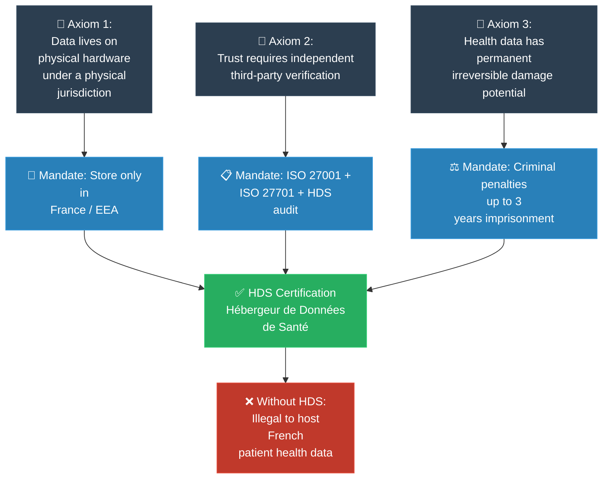
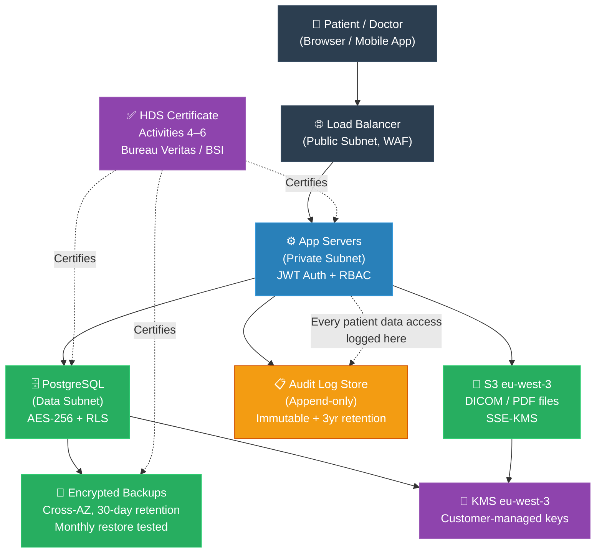

# MIT Professor: HDS — Hébergeur de Données de Santé (គោលការណ៍គ្រឹះនៃការការពារទិន្នន័យសុខភាព)

**Author:** ichamrong  
**Date:** 2026-05-20  
**Tags:** #mit-professor #first-principles #compliance #hds #france #healthcare #data-protection  
**Category:** Concepts / Compliances / MIT Professor  
**Read Time:** ~6 min  

---

## 📌 មាតិកា (Table of Contents)
- [១. បញ្ហាស្នូល (The Core Problem)](#១-បញ្ហាស្នូល-the-core-problem)
- [២. ការទាញហេតុផលពីគោលការណ៍គ្រឹះ (First Principles Derivation)](#២-ការទាញហេតុផលពីគោលការណ៍គ្រឹះ-first-principles-derivation)
- [៣. ដ្យាក្រាមលំហូរ (Visual Derivation)](#៣-ដ្យាក្រាមលំហូរ-visual-derivation)
- [៤. របៀបអនុវត្ត HDS — ជាម្ចាស់វេទិកា Doctolib (How to Apply HDS as a Platform Owner)](#៤-របៀបអនុវត្ត-hds-ជាម្ចាស់វេទិកា-doctolib-how-to-apply-hds-as-a-platform-owner)
- [៥. Related Posts](#៥-related-posts)

---

## ១. បញ្ហាស្នូល (The Core Problem)

Health data is not ordinary data. A leaked credit card can be replaced. A leaked medical record — HIV status, psychiatric history, genetic profile — cannot. The damage is permanent: employment lost, insurance denied, relationships destroyed. France asked a fundamental question: **who is allowed to touch the servers that hold this data?**

ទិន្នន័យសុខភាពមិនមែនជាទិន្នន័យធម្មតាទេ។ កាតឥណទានដែលលេចធ្លាយអាចប្ដូរថ្មីបាន។ ប៉ុន្តែប្រវត្តិវេជ្ជសាស្ត្រ — ដូចជាស្ថានភាពផ្ទុកមេរោគ HIV ប្រវត្តិចិត្តសាស្ត្រ និងព័ត៌មានហ្សែន (Genetic profile) — គឺមិនអាចប្តូរបានឡើយ។ ការលេចធ្លាយទិន្នន័យទាំងនេះនឹងបង្កផលប៉ះពាល់ដល់ជីវិតបុគ្គលជាអចិន្ត្រៃយ៍។ ដូច្នេះហើយ ប្រទេសបារាំងបានចោទជាសំណួរគ្រឹះមួយថា៖ **តើអ្នកណាខ្លះដែលគួរទទួលបានសិទ្ធិចូលទៅកាន់ម៉ាស៊ីនមេ (Servers) ដែលផ្ទុកទិន្នន័យដ៏រសើបនេះ?**

---

## ២. ការទាញហេតុផលពីគោលការណ៍គ្រឹះ (First Principles Derivation)

### English

**Axiom 1: Data only exists somewhere physical.**  
Software is abstract, but data must live on a physical disk, in a physical data centre, under a physical jurisdiction. The moment you understand this, you understand that *who controls the hardware controls the data*. Every cloud vendor, every SaaS platform, is ultimately running on a machine bolted to a floor, somewhere.

**Axiom 2: Trust must be formally verifiable, not self-declared.**  
Any vendor can claim "we take security seriously." That claim is worthless without an independent, structured verification process. Certification bodies exist precisely because trust cannot be taken on faith in high-stakes domains — the same reason we don't let bridges be "self-certified" by the company that built them.

**Axiom 3: Health data has a unique threat profile.**  
Unlike financial data (which has a clear monetary value), health data has lifelong personal and social consequences. Its sensitivity demands controls beyond what GDPR alone provides. GDPR tells you the *rights* — HDS tells you the *technical fortress* required to exercise those rights safely.

**Derivation:**  
From Axiom 1: France mandated that hosting must happen on soil where French/EU law applies — data storage in France or EEA only.  
From Axiom 2: France created a certification regime (ISO 27001 + ISO 27701 + HDS-specific controls) audited by accredited third parties — not self-assessed.  
From Axiom 3: France attached criminal penalties (not just administrative fines) — up to 3 years imprisonment — because the stakes justify criminal-law-level deterrence.

**The result is HDS:** a mandatory certification that answers the question *"is this server worthy of holding a patient's most private truths?"*

### Khmer

**គោលការណ៍គ្រឹះ ១: ទិន្នន័យត្រូវតែមានទីតាំងជាក់ស្តែង**  
សូហ្វវែរជាអ្វីដែលអរូបី ប៉ុន្តែទិន្នន័យត្រូវតែស្ថិតក្នុងថាស (disk) ជាក់ស្តែង ក្នុងមជ្ឈមណ្ឌលទិន្នន័យជាក់ស្តែង ក្រោមដែនដីច្បាប់ជាក់ស្តែង។ នៅពេលដែលអ្នកយល់ដឹងចំណុចនេះ អ្នកយល់ថា *អ្នកដែលគ្រប់គ្រងផ្នែករឹង (hardware) គឺជាអ្នកគ្រប់គ្រងទិន្នន័យ*។

**គោលការណ៍គ្រឹះ ២: ការជឿទុកចិត្តត្រូវការការផ្ទៀងផ្ទាត់ជាផ្លូវការ មិនមែនការប្រកាសខ្លួនឯងទេ**  
ក្រុមហ៊ុនផ្តល់សេវាណាក៏អាចអះអាងបានដែរថា "យើងយកចិត្តទុកដាក់ខ្ពស់បំផុតលើសុវត្ថិភាពទិន្នន័យ"។ ប៉ុន្តែការអះអាងទាំងនោះគ្មានតម្លៃទេ ប្រសិនបើគ្មានដំណើរការផ្ទៀងផ្ទាត់ពីស្ថាប័នឯករាជ្យណាមួយ។

**គោលការណ៍គ្រឹះ ៣: ទិន្នន័យសុខភាពមានកម្រិតហានិភ័យពិសេសខុសប្លែកពីគេ**  
មិនដូចទិន្នន័យហិរញ្ញវត្ថុទេ ការបែកធ្លាយទិន្នន័យសុខភាពនឹងបន្សល់ទុកនូវផលប៉ះពាល់ដល់ជីវិតបុគ្គលជាអចិន្ត្រៃយ៍។

**ការទាញហេតុផល:**  
ពីគោលការណ៍ ១ → ការរក្សាទុកទិន្នន័យត្រូវតែធ្វើឡើងនៅលើទឹកដីប្រទេសបារាំង ឬតំបន់ EEA ប៉ុណ្ណោះ  
ពីគោលការណ៍ ២ → តម្រូវឱ្យមានការវាយតម្លៃយកវិញ្ញាបនប័ត្រ ISO 27001 + ISO 27701 + HDS ពីភ្នាក់ងារសវនកម្មឯករាជ្យ  
ពីគោលការណ៍ ៣ → ការអនុវត្តទោសព្រហ្មទណ្ឌ (មិនមែនត្រឹមតែការពិន័យជាប្រាក់) ពោលគឺរហូតដល់ជាប់ពន្ធនាគារ ៣ ឆ្នាំ។

---

## ៣. ដ្យាក្រាមលំហូរ (Visual Derivation)



---

## ៤. របៀបអនុវត្ត HDS — ជាម្ចាស់វេទិកា Doctolib (How to Apply HDS as a Platform Owner)

This section derives the full engineering procedure from first principles — from zero to a live, HDS-certified platform that real French patients can use.

---

### Phase 0 — Decide Before Writing a Line of Code

Before choosing any technology, answer three architectural questions that HDS forces:

```
Q1: Where will ALL patient data be stored?
    Answer must be: France or EEA.
    → Eliminates: US-only SaaS (Heroku, Render.com, PlanetScale global)
    → Allowed: AWS eu-west-3 (Paris), Azure France Central, OVHcloud, Scaleway

Q2: Who certifies what?
    → Cloud provider (AWS/GCP/Azure): Activities 1–3 (their cert, not yours)
    → You (Doctolib-like platform): Activities 4, 5, 6 (your cert, mandatory)

Q3: Can a hospital retrieve every byte of their data if they leave?
    → Reversibility is a hard technical requirement, not a "nice to have"
    → Design data export from Day 1
```

---

### Phase 1 — Tech Stack Selection (Axiom 1 Applied)

Choose every layer with data residency as a hard constraint:

| Layer | Requirement | Compliant choices |
|:------|:------------|:-----------------|
| **Cloud** | HDS Activity 1–3 certified | AWS `eu-west-3`, Azure `francecentral`, GCP `europe-west9`, OVHcloud, Scaleway |
| **Database** | Deployed in chosen region, encrypted at rest | RDS PostgreSQL (eu-west-3), Aurora, self-managed Postgres on HDS infra |
| **Object storage** | Patient files (PDFs, DICOM images) in France/EEA only | S3 `eu-west-3`, Azure Blob `francecentral` |
| **Secrets** | Keys never leave France/EEA | AWS KMS (eu-west-3), HashiCorp Vault on-prem |
| **Email/SMS** | Transactional — must not leak PHI in body | Mailjet (French, HDS-aware), or route through your own relay |
| **CDN** | Must not cache patient data | Disable caching for authenticated routes; static assets only |
| **Logging** | Audit logs are health data if they contain patient IDs | CloudWatch (eu-west-3), Datadog EU region |
| **CI/CD** | Pipeline secrets and build artefacts stay in EU | GitHub Actions with EU runners, GitLab EU |

> **Trap:** Using a globally-distributed SaaS (e.g., a US-hosted error tracker like Sentry's default endpoint) that receives patient identifiers in stack traces = HDS violation.

---

### Phase 2 — Security Architecture (Axiom 2 Applied)

Implement the controls that the HDS auditor will physically verify:

#### 2a. Encryption

```
At rest:
  □ Database: AES-256 (RDS encryption enabled, KMS key in eu-west-3)
  □ S3 bucket: SSE-KMS with customer-managed key
  □ Backups: Encrypted before leaving primary storage

In transit:
  □ TLS 1.2 minimum everywhere (TLS 1.3 preferred)
  □ Internal service-to-service: mutual TLS (mTLS) or VPC-internal only
  □ No HTTP endpoints — HSTS enforced
```

#### 2b. Access Control — Audit Trails

This is the most scrutinised HDS control. Every access to patient data must be logged:

```
Minimum audit log record:
  {
    "timestamp": "2026-05-20T09:12:44Z",
    "actor_id": "dr-456",              // who
    "actor_role": "physician",
    "action": "READ",                  // what
    "resource": "patient_record",
    "patient_id": "hashed-or-pseudonymised",
    "ip_address": "10.0.4.12",        // from where
    "request_id": "uuid"
  }

Rules:
  □ Immutable — logs cannot be edited or deleted (append-only store)
  □ Separate storage — audit logs not in same DB as app data
  □ Retention: minimum 3 years (ANS recommendation)
  □ Access to audit logs itself is logged
```

#### 2c. RBAC — Role-Based Access

```
Roles for a Doctolib-like platform:
  PATIENT        → own records only (read)
  PHYSICIAN      → own patients' records (read/write)
  ADMIN_STAFF    → scheduling only, no clinical data
  PLATFORM_ADMIN → infrastructure, no patient data
  AUDITOR        → audit logs only (read)

Implementation:
  □ Row-level security in PostgreSQL (RLS policies)
  □ JWT scopes map to roles
  □ No wildcard admin role that can see all patients
```

#### 2d. Network Isolation

```
VPC architecture:
  Public subnet:   Load balancer only (no patient data)
  Private subnet:  Application servers
  Data subnet:     Database + storage (no internet access)
  
  □ Security groups: DB only accepts connections from app subnet
  □ No SSH from internet — bastion host or AWS SSM Session Manager
  □ WAF in front of load balancer
```

---

### Phase 3 — Backup and Reversibility (Activity 6)

```
Backup policy:
  □ Daily automated snapshots — RDS automated backup
  □ Cross-AZ replication (still within eu-west-3)
  □ Retention: 30 days minimum
  □ Monthly restore test — document RTO/RPO
     RTO target: < 4 hours
     RPO target: < 24 hours

Reversibility (patient can leave, hospital can leave):
  □ Export API: GET /api/v1/export/patient/{id}
     Returns: FHIR R4 Bundle (JSON) with all records
  □ Bulk export for hospital offboarding:
     Returns: encrypted ZIP, FHIR format, within 24 hours
  □ Data deletion: DELETE cascade across all tables + S3 objects
     + confirmation receipt logged in audit trail
```

---

### Phase 4 — Incident Notification Procedure (ANS Requirement)

HDS requires you to notify ANS when a security incident affects health data:

```
Incident detection → Classification → Notification

Timeline:
  T+0:    Incident detected (monitoring alert, user report, etc.)
  T+0–4h: Classify severity
           MAJOR = patient data confirmed compromised or at risk
           MINOR = internal system issue, no patient data exposure
  T+4h:   If MAJOR → notify ANS (signalement.ans-sante.fr)
           Minimum content:
             - Nature of incident
             - Estimated number of patients affected
             - Data categories involved
             - Containment measures taken
  T+72h:  Notify affected patients (if breach confirmed)
  T+30d:  Final incident report to ANS

Implementation:
  □ Runbook: who calls ANS, what number, what template
  □ Pagerduty/OpsGenie escalation policy wired to "HDS incident" label
  □ ANS contact details in on-call handbook (not just in someone's head)
```

---

### Phase 5 — Certification Process (Activity 4–6 Audit)

```
Month 1–3: Gap analysis
  □ Engage HDS-accredited auditor (BSI, Bureau Veritas, LSTI, EY CertifyPoint)
  □ Auditor reviews: architecture docs, security policies, access logs sample
  □ Gap report: list of missing controls

Month 3–9: ISO 27001 implementation (if not already done)
  □ ISMS scope document
  □ Risk register
  □ Security policies (access control, incident response, backup, etc.)
  □ Internal audit
  □ ISO 27001 certification audit (Stage 1 + Stage 2)

Month 9–12: ISO 27701 (privacy layer)
  □ Privacy policy aligned with GDPR
  □ Data processing register (ROPA)
  □ Data subject rights procedure tested

Month 12–15: HDS audit
  □ Stage 1: Document review (2–3 days remote)
  □ Stage 2: On-site technical verification
     Auditor tests: can they access patient data without proper role?
                    are audit logs immutable?
                    does backup restore actually work?
                    does data export work?
  □ Certificate issued — valid 3 years
  □ Annual surveillance audit scheduled
```

---

### Phase 6 — Go-Live Checklist

Only after HDS certificate in hand:

```
Before first real patient uses the platform:

Infrastructure:
  □ All data confirmed in eu-west-3 (or chosen EEA region)
  □ TLS 1.2+ enforced on all endpoints
  □ Database encryption verified (aws rds describe-db-instances --query 'StorageEncrypted')
  □ KMS key rotation enabled
  □ Backup restore tested successfully within last 30 days
  □ Audit logging verified: test record shows up in immutable store

Access:
  □ No default admin credentials in production
  □ MFA enforced for all staff accounts
  □ Patient data not visible in application logs (mask before logging)
  □ Error tracking tool receives no PHI (sanitise before sending to Sentry/Datadog)

Legal:
  □ HDS certificate attached to platform
  □ contrat d'hébergement signed with each hospital client
     (includes: data location clause, audit rights, incident notification SLA,
      portability/reversibility clause, subcontractor disclosure)
  □ DPA (GDPR Data Processing Agreement) signed with each hospital
  □ Privacy policy live and accessible to patients

Operations:
  □ ANS incident notification runbook tested
  □ On-call rotation knows HDS breach procedure
  □ Subcontractors verified as HDS-certified (your DB provider, your email relay, etc.)
  □ Next annual surveillance audit date in calendar
```

---

### Architecture Diagram — Doctolib-like HDS Stack



---

## ៥. Related Posts

### 🔗 Explore All Viewpoints:
* 🧪 **Read the Feynman Simplification:** [Feynman Technique: HDS](../02-feynman-technique/01-hds.md) — Plain-language explanation with no jargon
* 👶 **Read the ELI5:** [ELI5: HDS](../03-eli5/01-hds.md) — Secret diary analogy for total beginners
* 🎭 **Read the Story:** [Storyteller: HDS](../07-storyteller-narrative-arc/01-hds.md) — A startup's painful journey to certification
* 🎙️ **Listen to the Podcast:** [Podcast: HDS](../10-podcast/01-hds.md) — Two engineers debate why HDS exists
* 💼 **Read the Interview:** [Interview: HDS](../11-interview/01-hds.md) — Technical compliance interview Q&A
* 📖 **Read the Parable:** [Parable: HDS](../06-parables/01-hds.md) — The hospital that trusted the wrong cloud
* 📚 **Full Compliance Reference:** [HDS France](../../../compliances/eu-specific/05-hds-france.md) — Complete regulation guide
