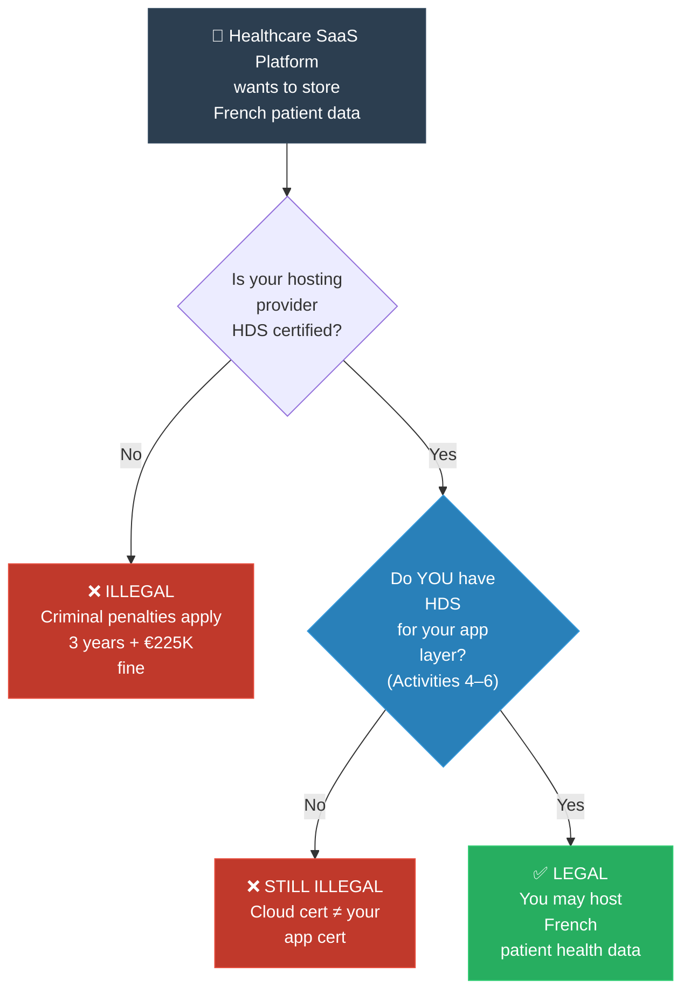
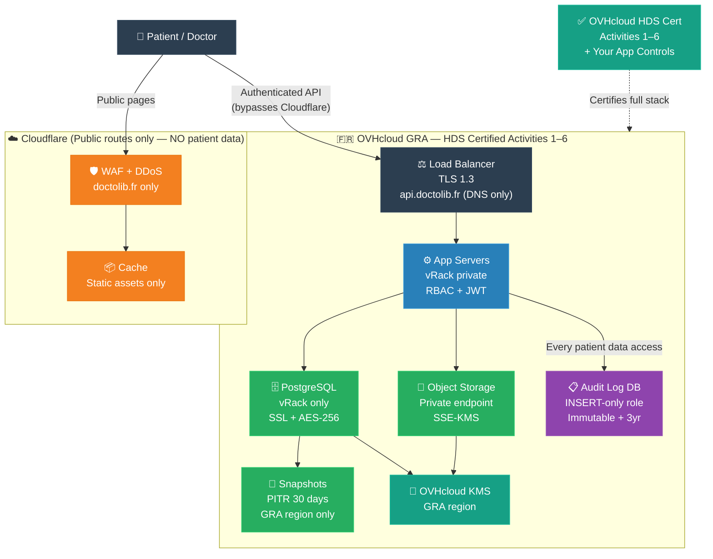

# Feynman Technique: HDS (ការពន្យល់ HDS ដោយគ្មានពាក្យច្បាប់)

**Author:** ichamrong  
**Date:** 2026-05-20  
**Tags:** #feynman-technique #simplification #compliance #hds #france #healthcare  
**Category:** Concepts / Compliances / Feynman Technique  
**Read Time:** ~5 min  

---

## 📌 មាតិកា (Table of Contents)
- [១. ការពន្យល់បែបសាមញ្ញបំផុត (The Simple Explanation)](#១-ការពន្យល់បែបសាមញ្ញបំផុត-the-simple-explanation)
- [២. ដំណើរការជាក់ស្ដែង (How It Works in Practice)](#២-ដំណើរការជាក់ស្ដែង-how-it-works-in-practice)
- [៣. ដ្យាក្រាមលំហូរ (Visual Flowchart)](#៣-ដ្យាក្រាមលំហូរ-visual-flowchart)
- [៤. Related Posts](#៤-related-posts)

---

## ១. ការពន្យល់បែបសាមញ្ញបំផុត (The Simple Explanation)

### English

Imagine you run a pharmacy. You need to store your patients' prescription records — what medications they take, what conditions they have. You decide to rent space in a warehouse to keep those files safe.

But here's the thing: you can't just rent *any* warehouse. You cannot walk into the nearest storage unit and dump patient files there. The French government says: **the warehouse must have a special licence.** That licence is called **HDS**.

To get the HDS licence, the warehouse must prove three things:
1. The files are stored **inside France or Europe** — not on a server in Singapore or the US
2. The warehouse has passed a **serious security inspection** by an independent auditor (not a self-assessment — a real third party with teeth)
3. The warehouse has actual, tested systems: encrypted storage, strict access logs, backup and recovery, the ability to hand you back your files if you want to leave

If you, the pharmacy, store patient files with a warehouse that does **not** have HDS, you are breaking the law. Not just a fine — a criminal offence. Up to 3 years in prison for the individuals responsible.

HDS is France's answer to the question: *"Who is allowed to hold the most sensitive information a human being can have about themselves?"*

### Khmer

ស្រមៃថាអ្នកបើកឱសថស្ថានមួយ។ អ្នកត្រូវរក្សាទុកកំណត់ត្រាវេជ្ជបញ្ជារបស់អ្នកជំងឺ — ថ្នាំអ្វីដែលពួកគេប្រើប្រាស់ ជំងឺអ្វីដែលពួកគេមាន។ អ្នកសម្រេចចិត្តជួលកន្លែងក្នុងឃ្លាំងមួយដើម្បីរក្សាទុកឯកសារទាំងនោះ។

ប៉ុន្តែ នេះជាបញ្ហា៖ អ្នកមិនអាចជួល*ឃ្លាំងណាក៏បាន*ទេ។ រដ្ឋាភិបាលបារាំងនិយាយថា៖ **ឃ្លាំងត្រូវតែមានអាជ្ញាប័ណ្ណពិសេស**។ អាជ្ញាប័ណ្ណនោះហៅថា **HDS**។

ដើម្បីទទួលអាជ្ញាប័ណ្ណ HDS ឃ្លាំងត្រូវតែបញ្ជាក់ ៣ ចំណុច៖
1. ឯកសារត្រូវរក្សាទុក **ក្នុងប្រទេសបារាំង ឬ EU** — មិនមែននៅសិង្ហបុរី ឬអាមេរិកទេ
2. ឃ្លាំងនោះត្រូវ **ឆ្លងការត្រួតពិនិត្យសុវត្ថិភាពដ៏តឹងរ៉ឹង** ពីអ្នកធ្វើសវនកម្មឯករាជ្យ
3. ឃ្លាំងមានប្រព័ន្ធជាក់ស្ដែង៖ ការអ៊ិនគ្រីប (Encryption) ប្រព័ន្ធកត់ត្រាអ្នកចូលមើលយ៉ាងតឹងរ៉ឹង និងការបម្រុងទុកទិន្នន័យ (Backup)

ប្រសិនបើអ្នករក្សាទុកឯកសារអ្នកជំងឺជាមួយឃ្លាំងដែល **ពុំ** មានអាជ្ញាប័ណ្ណ HDS នោះអ្នកកំពុងល្មើសច្បាប់។ វាជាបទល្មើសព្រហ្មទណ្ឌ — អាចជាប់ពន្ធនាគាររហូតដល់ ៣ ឆ្នាំ។

---

## ២. ដំណើរការជាក់ស្ដែង (How It Works in Practice)

**The six things a certified HDS host must do:**

| # | What | Why |
|:--|:-----|:----|
| 1 | Physical infrastructure in France/EEA | Jurisdiction guarantee |
| 2 | ISO 27001 — information security management | Baseline security controls |
| 3 | ISO 27701 — privacy management layer on top of 27001 | GDPR alignment |
| 4 | HDS-specific controls | Health-sector extras (reversibility, ANS incident notification) |
| 5 | Audit by accredited body (BSI, Bureau Veritas, LSTI) | Independent verification |
| 6 | 3-year certificate + annual surveillance audits | Ongoing accountability |

**For a SaaS healthcare company:**
- Cloud infrastructure (AWS/Azure/GCP) handles activities 1–3 — they're already HDS certified
- **You** must certify for activities 4–6 (application hosting, maintenance, backup)
- The big cloud's certification does not cover your application layer

---

## ៣. ដ្យាក្រាមលំហូរ (Visual Flowchart)



---

## ៤. ការអនុវត្ត HDS ជាក់ស្ដែង — វេទិកា Doctolib លើ OVHcloud + Cloudflare

*Same Doctolib-like platform. Same HDS rules. Different tech stack — OVHcloud for hosting (French, fully HDS-certified Activities 1–6), Cloudflare for edge/CDN.*

---

### ហេតុអ្វីបានជា OVHcloud + Cloudflare?

```
OVHcloud:
  ✅ French company — data centres in Strasbourg, Roubaix, Gravelines
  ✅ HDS certified Activities 1–6 (full stack — not just infra)
  ✅ GDPR / French sovereignty guarantee
  ✅ Cheaper than AWS for EU workloads
  ⚠️ Smaller managed service ecosystem than AWS

Cloudflare:
  ✅ DDoS protection, WAF, TLS termination at edge
  ✅ Can be configured so NO patient data passes through Cloudflare
  ⚠️ Cloudflare is US-based — patient data must NEVER reach Cloudflare nodes
  → Rule: Cloudflare handles only unauthenticated public routes
           All authenticated API calls bypass Cloudflare (direct to OVHcloud)
```

---

### Phase 0 — Architecture Decision: What Cloudflare Can and Cannot Touch

This is the most important decision in this stack. Get it wrong and you fail HDS:

```
✅ Cloudflare MAY handle:
   - Marketing pages (doctolib.fr homepage, blog)
   - Static assets (JS bundles, CSS, images)
   - DDoS protection at DNS level
   - Bot protection on login page (before auth)

❌ Cloudflare MUST NOT handle:
   - Any API call after authentication (Bearer token in header)
   - Patient record endpoints (/api/appointments, /api/records/*)
   - File uploads/downloads (prescriptions, test results)
   - Any response body containing patient identifiers

Implementation:
   Two DNS records:
     doctolib.fr          → Cloudflare proxy (orange cloud ON)
     api.doctolib.fr      → OVHcloud IP directly (orange cloud OFF / DNS only)
   
   All authenticated frontend calls go to api.doctolib.fr (bypasses Cloudflare)
```

---

### Phase 1 — OVHcloud Infrastructure Setup

#### 1a. Choose the Right OVHcloud Products

| Layer | OVHcloud product | HDS note |
|:------|:----------------|:---------|
| Compute | **Public Cloud** — `d2-8` or `b2-15` instances | Choose `GRA` (Gravelines) or `SBG` (Strasbourg) region |
| Database | **Cloud Databases — PostgreSQL** | Managed, encrypted, auto-backup — GRA region |
| Object storage | **Object Storage** (S3-compatible) | GRA region — for DICOM, PDF files |
| Private network | **vRack** | Isolates DB from public internet |
| Load balancer | **Load Balancer** | TLS termination, no patient data cached |
| Secrets | **Key Management Service (KMS)** or HashiCorp Vault on OVH VM | Customer-managed keys |
| Backups | **Snapshot + Volume Backup** | Same region, encrypted |

#### 1b. vRack Network Topology

```
Internet
    │
    ▼
Cloudflare (public routes only — no auth)
    │
    ▼
OVHcloud Load Balancer (TLS 1.3 termination)
    │
    ▼
App Servers (vRack — private network)
    │             │
    ▼             ▼
PostgreSQL     Object Storage
(vRack only)   (private endpoint)
    │
    ▼
Audit Log Store (separate DB instance, append-only user)
```

All traffic from App → DB stays inside vRack. Database has no public IP.

#### 1c. Terraform Skeleton (OVHcloud Provider)

```hcl
# Provider
terraform {
  required_providers {
    ovh = { source = "ovh/ovh" }
  }
}

# Private network (vRack)
resource "ovh_cloud_project_network_private" "hds_net" {
  service_name = var.ovh_project_id
  name         = "hds-private"
  regions      = ["GRA11"]
  vlan_id      = 100
}

# App server
resource "ovh_cloud_project_instance" "app" {
  service_name = var.ovh_project_id
  region       = "GRA11"
  flavor_name  = "b2-15"
  image_name   = "Ubuntu 24.04"

  network {
    network_id = ovh_cloud_project_network_private.hds_net.id
    private_ip = "10.0.0.10"
  }
}

# Managed PostgreSQL
resource "ovh_cloud_project_database" "hds_db" {
  service_name = var.ovh_project_id
  description  = "hds-postgres"
  engine       = "postgresql"
  version      = "16"
  plan         = "business"    # HA with replica
  nodes {
    region     = "GRA"
    flavor     = "db1-15"
    network_id = ovh_cloud_project_network_private.hds_net.id
  }
  backup_regions = ["GRA"]     # Stay in France
  backup_time    = "02:00:00"  # Nightly at 2am
}

# Object storage bucket (patient files)
resource "ovh_cloud_project_container" "patient_files" {
  service_name  = var.ovh_project_id
  region        = "GRA"
  name          = "patient-files"
  archive       = false
}
```

---

### Phase 2 — Security Controls on OVHcloud

#### 2a. Encryption

```
At rest:
  OVHcloud managed PostgreSQL → encryption enabled by default (AES-256)
  Object Storage → server-side encryption with OVHcloud KMS
  VM disks → encrypted volumes (OVH block storage encryption)

In transit:
  Load Balancer → App: TLS 1.3 (OVHcloud LB native support)
  App → DB: SSL enforced (OVHcloud managed DB enforces SSL by default)
  App → Object Storage: HTTPS only (private endpoint inside vRack)

Key management:
  Option A: OVHcloud KMS (managed, stays in GRA region)
  Option B: HashiCorp Vault on dedicated OVH VM inside vRack
            → More control, more ops overhead
```

#### 2b. Audit Logs — OVHcloud Implementation

```sql
-- Separate PostgreSQL instance (audit_db) — different credentials
-- App server has INSERT-only role on this DB

CREATE TABLE audit_log (
  id          BIGSERIAL PRIMARY KEY,
  ts          TIMESTAMPTZ NOT NULL DEFAULT NOW(),
  actor_id    TEXT NOT NULL,
  actor_role  TEXT NOT NULL,
  action      TEXT NOT NULL,   -- READ | WRITE | DELETE | EXPORT
  resource    TEXT NOT NULL,
  patient_ref TEXT NOT NULL,   -- pseudonymised (hashed patient ID)
  ip          TEXT NOT NULL,
  request_id  UUID NOT NULL
);

-- No UPDATE, no DELETE — enforced at role level
REVOKE UPDATE, DELETE ON audit_log FROM app_user;

-- Separate read-only role for auditor access
CREATE ROLE auditor LOGIN;
GRANT SELECT ON audit_log TO auditor;
```

#### 2c. Cloudflare WAF Rules for HDS

Even though patient data bypasses Cloudflare, configure WAF for the public routes:

```
Page Rules:
  doctolib.fr/api/*   → Bypass Cloudflare (pass-through, no caching)
  api.doctolib.fr/*   → DNS only (not proxied — direct to OVH IP)

Firewall Rules (on doctolib.fr):
  Block requests with Authorization header → force to api.doctolib.fr
  Rate limit: login page → 10 attempts / minute / IP
  Bot Fight Mode: ON for login, signup pages

Cache Rules:
  Cache nothing with Set-Cookie header
  Cache nothing with Authorization header
  Cache only: *.js, *.css, *.png, *.woff2 (static assets)
```

---

### Phase 3 — Backup + Reversibility on OVHcloud

```
Automated backups:
  OVHcloud managed PostgreSQL:
    □ Daily snapshot — retained 14 days (configurable to 30)
    □ Point-in-time recovery (PITR) — restore to any minute
    □ Backup stored in same GRA region (France) — never leaves

Object storage backups:
  □ Enable versioning on patient-files bucket
  □ Cross-container replication to second OVH GRA bucket
  □ Lifecycle policy: delete versions older than 90 days

Monthly restore drill:
  □ Restore snapshot to staging DB
  □ Verify row counts match production
  □ Document RTO achieved (target < 4h)
  □ Log result in compliance record

Patient data export (Reversibility):
  □ FHIR R4 Bundle export endpoint
  □ Hospital offboarding: async job → encrypted ZIP → pre-signed OVH Object Storage URL (expires 24h)
  □ Deletion: cascade delete + S3 object delete + audit log entry
```

---

### Phase 4 — Monitoring + Incident Notification

```
OVHcloud native monitoring:
  □ OVHcloud Logs Data Platform → centralised log aggregation
  □ Alert on: failed login > 10/min, unusual DB query volume,
              access to patient records outside business hours

Application-level:
  □ Every API response to patient data endpoint writes to audit_log
  □ Dead man's switch: if audit_log write rate drops to 0 → alert
    (means audit logging broke — HDS violation in progress)

ANS incident notification (same procedure regardless of cloud):
  T+0:    Alert fires (OVHcloud monitoring or app alert)
  T+4h:   If patient data involved → notify ANS
           URL: signalement.ans-sante.fr
  T+72h:  Notify affected patients
  T+30d:  Final report to ANS

Emergency contacts in runbook:
  □ OVHcloud support: HDS-tier SLA response (4h critical)
  □ ANS: +33 (0)1 XX XX XX XX (store in on-call doc)
  □ DPO contact
  □ Legal counsel
```

---

### Phase 5 — OVHcloud-Specific Certification Shortcuts

OVHcloud being HDS-certified for Activities 1–6 gives you a real advantage:

```
What OVHcloud's HDS cert covers (auditor will accept without re-testing):
  ✅ Activity 1: Physical data centre security (Gravelines, Strasbourg)
  ✅ Activity 2: Infrastructure management (virtualisation, networking)
  ✅ Activity 3: Infrastructure operation (OS patching, monitoring)
  ✅ Activity 4: Application hosting (managed services like Cloud DB)
  ✅ Activity 5: Application maintenance (OVHcloud-managed components)
  ✅ Activity 6: Data backup (OVHcloud snapshot service)

What YOU still need to certify:
  ⚠️ Your application code and configuration
  ⚠️ Your access control implementation (RBAC, audit logs)
  ⚠️ Your incident response procedure
  ⚠️ Your data export / portability capability
  ⚠️ Your contracts with hospitals (contrat d'hébergement)

→ With OVHcloud, the HDS audit scope is narrower than with AWS.
  AWS covers Activities 1–3 only. OVHcloud covers 1–6 for managed services.
  The auditor focuses almost entirely on your application layer controls.
```

---

### Phase 6 — Go-Live Checklist (OVH + Cloudflare Stack)

```
Infrastructure:
  □ All OVH resources deployed in GRA (Gravelines) or SBG (Strasbourg)
  □ vRack: DB has no public IP — verified in OVH Control Panel
  □ Object storage: private endpoint only (no public URL for patient files)
  □ TLS 1.3 on Load Balancer — verified with: curl -v --tlsv1.3 https://api.doctolib.fr
  □ DB SSL enforced: psql sslmode=verify-full — test connection

Cloudflare:
  □ api.doctolib.fr record → DNS Only (grey cloud) — confirmed in Cloudflare dashboard
  □ No Cloudflare cache rules apply to /api/* routes
  □ WAF active on doctolib.fr public routes
  □ Page Rule: bypass cache for any request with Cookie or Authorization header

Security:
  □ Audit log DB on separate instance, app has INSERT-only role
  □ No patient data in application logs (grep production logs for patient IDs)
  □ Error reports to Sentry/equivalent → sanitised before sending (no PHI in payloads)
  □ MFA enforced for all OVHcloud Control Panel accounts

Legal:
  □ OVHcloud HDS certificate number recorded in your compliance register
  □ contrat d'hébergement with each hospital client signed
  □ DPA signed with each hospital
  □ Cloudflare DPA reviewed — confirm patient data never reaches Cloudflare

Operations:
  □ ANS incident notification runbook tested (dry run)
  □ On-call engineer knows: how to pull audit logs, how to notify ANS
  □ Monthly DB restore drill scheduled in calendar
  □ HDS certificate surveillance audit date in calendar (annual)
```

---

### Full Stack Diagram — OVHcloud + Cloudflare



---

## ៤. Related Posts

### 🔗 Explore All Viewpoints:
* 🧠 **Read the First Principles:** [MIT Professor: HDS](../01-mit-professor/01-hds.md) — Why France created HDS from first axioms
* 👶 **Read the ELI5:** [ELI5: HDS](../03-eli5/01-hds.md) — Secret diary analogy for total beginners
* 🎭 **Read the Story:** [Storyteller: HDS](../07-storyteller-narrative-arc/01-hds.md) — A startup's painful journey to certification
* 🎙️ **Listen to the Podcast:** [Podcast: HDS](../10-podcast/01-hds.md) — Two engineers debate why HDS exists
* 💼 **Read the Interview:** [Interview: HDS](../11-interview/01-hds.md) — Technical compliance interview Q&A
* 📖 **Read the Parable:** [Parable: HDS](../06-parables/01-hds.md) — The hospital that trusted the wrong cloud
* 📚 **Full Compliance Reference:** [HDS France](../../../compliances/eu-specific/05-hds-france.md) — Complete regulation guide
