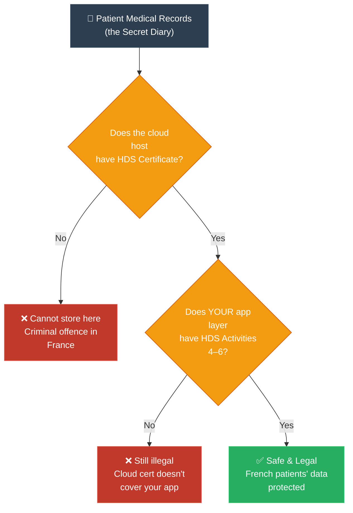

# ELI5: HDS (ការពន្យល់ HDS ដូចក្មេងអាយុ ៥ ឆ្នាំ)

**Author:** ichamrong  
**Date:** 2026-05-20  
**Tags:** #eli5 #simplification #compliance #hds #france #healthcare  
**Category:** Concepts / Compliances / ELI5  
**Read Time:** ~4 min  

---

## 📌 មាតិកា (Table of Contents)
- [១. គិតឱ្យសាមញ្ញ (Think Like a 5-Year-Old)](#១-គិតឱ្យសាមញ្ញ-think-like-a-5-year-old)
- [២. ស្ពានភ្ជាប់ទៅកាន់ការពិត (Bridge to Reality)](#២-ស្ពានភ្ជាប់ទៅកាន់ការពិត-bridge-to-reality)
- [៣. ដ្យាក្រាមលំហូរ (Visual Flowchart)](#៣-ដ្យាក្រាមលំហូរ-visual-flowchart)
- [៤. Related Posts](#៤-related-posts)

---

## ១. គិតឱ្យសាមញ្ញ (Think Like a 5-Year-Old)

### English

Imagine you have a very special diary. In that diary, you write everything — your secret fears, your illnesses, what medicines you take. It is the most private thing you own.

Now, you need to keep that diary somewhere safe while you are at school. You cannot carry it everywhere.

Your mum says: **"You can only leave your diary with a babysitter who has passed a special government test."**

Not just any babysitter. Not the cheapest one. Not the one who *says* they are trustworthy. Only the one who has gone through a real inspection — where a serious person from the government came to their house, checked the locks on the doors, checked that the diary cannot be taken outside the country, checked that they can give the diary back to you the moment you ask — and then gave them **a special certificate** saying: *"This babysitter is allowed to keep your most private things."*

That certificate is called **HDS**.

In France, patient medical records are that diary. Hospitals and doctors cannot store them with just any cloud company. The cloud company must have the HDS certificate — proving they passed the government's inspection and are truly safe enough to hold France's most private secrets.

### Khmer

ស្រមៃថាអ្នកមានសៀវភៅកំណត់ហេតុសម្ងាត់ (Diary) ដ៏ពិសេសមួយ។ នៅក្នុងនោះ អ្នកបានសរសេររឿងរ៉ាវសំខាន់ៗដូចជា — ជំងឺរបស់អ្នក ថ្នាំដែលអ្នកលេប និងការភ័យខ្លាចរបស់អ្នក។ វាជារបស់ឯកជនបំផុតក្នុងជីវិតរបស់អ្នក។

ពេលដែលអ្នកទៅរៀន អ្នកត្រូវទុកសៀវភៅកំណត់ហេតុនោះនៅកន្លែងណាមួយឲ្យមានសុវត្ថិភាព។

ម្តាយរបស់អ្នកបានប្រាប់ថា៖ **«កូនអាចផ្ញើសៀវភៅកំណត់ហេតុនេះ ទៅឲ្យអ្នកមើលថែរក្សាក្មេង (Babysitter) ណាដែលបានឆ្លងកាត់ការធ្វើតេស្តពិសេសពីរដ្ឋាភិបាលតែប៉ុណ្ណោះ។»**

មិនមែនឲ្យអ្នកមើលថែណាក៏បាននោះទេ។ មិនមែនឲ្យអ្នកមើលថែដែលយកតម្លៃថោកជាងគេនោះទេ។ ក៏មិនមែនឲ្យអ្នកដែលគ្រាន់តែ *អះអាង* ថាខ្លួនអាចទុកចិត្តបាននោះដែរ។ គឺបានតែអ្នកមើលថែ ដែលរដ្ឋាភិបាលបានចុះទៅពិនិត្យមើលផ្ទះ ពិនិត្យមើលសោទ្វារ ធានាថាសៀវភៅនោះមិនអាចយកចេញទៅក្រៅប្រទេសបាន រួចហើយទើបផ្តល់ **វិញ្ញាបនប័ត្រ** បញ្ជាក់ថា៖ "*អ្នកមើលថែម្នាក់នេះ ត្រូវបានអនុញ្ញាតឲ្យរក្សាទុករបស់ឯកជនរបស់អ្នក។*"

វិញ្ញាបនប័ត្រនោះហើយ ដែលគេហៅថា **HDS** ។

នៅប្រទេសបារាំង កំណត់ត្រាវេជ្ជសាស្ត្ររបស់អ្នកជំងឺប្រៀបបាននឹងសៀវភៅកំណត់ហេតុនោះអញ្ចឹង។ មន្ទីរពេទ្យ និងវេជ្ជបណ្ឌិត មិនអាចរក្សាទុកកំណត់ត្រាទាំងនោះនៅតាមប្រព័ន្ធ Cloud ណាក៏បាននោះទេ។ ក្រុមហ៊ុន Cloud ចាំបាច់ត្រូវតែមានវិញ្ញាបនប័ត្រ HDS — ដើម្បីបញ្ជាក់ថាពួកគេបានឆ្លងកាត់ការត្រួតពិនិត្យយ៉ាងត្រឹមត្រូវ និងមានសមត្ថភាពគ្រប់គ្រាន់ក្នុងការរក្សាទុកទិន្នន័យឯកជនបំផុតរបស់អ្នកជំងឺបារាំង។

---

## ២. ស្ពានភ្ជាប់ទៅកាន់ការពិត (Bridge to Reality)

The babysitter inspection checks **6 things** (called Activities):

| Activity | What the inspector checks | Babysitter analogy |
|:---------|:--------------------------|:-------------------|
| 1 | Physical building (data centre) | Is the house in France/EU? |
| 2 | Infrastructure (servers) | Are the locks and walls solid? |
| 3 | Operating systems | Is the household staff trained? |
| 4 | Your application (the software) | Is the room where your diary lives safe? |
| 5 | Maintenance | Can they fix problems without losing your diary? |
| 6 | Backup | Do they have a copy in case of fire? |

Big cloud providers like AWS inspect themselves for activities 1–3 (the house and locks). But **activity 4, 5, 6 — the room where your specific diary lives — that is YOUR job to certify**, even if you are renting the house from AWS.

If you skip any of these, it is like leaving your diary with someone who only passed the door-lock test but never showed their bedroom was safe. Not good enough.

---

## ៣. ដ្យាក្រាមលំហូរ (Visual Flowchart)

---

## ៤. Related Posts

### 🔗 Explore All Viewpoints:
* 🧠 **Read the First Principles:** [MIT Professor: HDS](../01-mit-professor/01-hds.md) — Why France created HDS from fundamental axioms
* 🧪 **Read the Feynman Simplification:** [Feynman Technique: HDS](../02-feynman-technique/01-hds.md) — Plain-language explanation with no jargon
* 🎭 **Read the Story:** [Storyteller: HDS](../07-storyteller-narrative-arc/01-hds.md) — A startup's painful journey to certification
* 🎙️ **Listen to the Podcast:** [Podcast: HDS](../10-podcast/01-hds.md) — Two engineers debate why HDS exists
* 💼 **Read the Interview:** [Interview: HDS](../11-interview/01-hds.md) — Technical compliance interview Q&A
* 📖 **Read the Parable:** [Parable: HDS](../06-parables/01-hds.md) — The hospital that trusted the wrong cloud
* 📚 **Full Compliance Reference:** [HDS France](../../../compliances/eu-specific/05-hds-france.md) — Complete regulation guide
