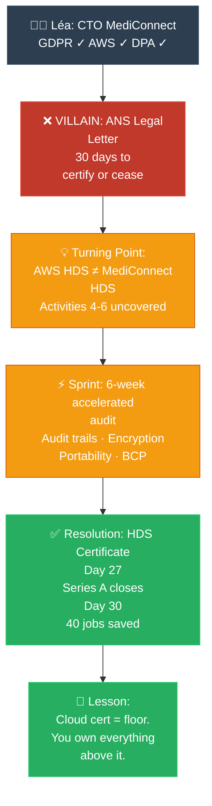

# Storyteller: HDS (ក្រុមហ៊ុនដែលស្ទើរខ្ចាតដោយព្រោះ Cloud ខុស)

**Author:** ichamrong  
**Date:** 2026-05-20  
**Tags:** #storyteller #narrative-arc #compliance #hds #france #healthcare  
**Category:** Concepts / Compliances / Storyteller  
**Read Time:** ~6 min  

---

## 📌 មាតិកា (Table of Contents)
- [១. តួអង្គ និងការតស៊ូ (Hero & Conflict)](#១-តួអង្គ-និងការតស៊ូ-hero-conflict)
- [២. ដំណោះស្រាយ (The Resolution)](#២-ដំណោះស្រាយ-the-resolution)
- [៣. ដ្យាក្រាមលំហូរ (Visual Flowchart)](#៣-ដ្យាក្រាមលំហូរ-visual-flowchart)
- [៤. Related Posts](#៤-related-posts)

---

## ១. តួអង្គ និងការតស៊ូ (Hero & Conflict)

### English

**The Hero:** Léa, a passionate CTO of a fast-growing French telemedicine startup, MediConnect.

**The Villain:** A legal letter. Three lines. From the ANS — the French national health digital agency. It read: *"MediConnect is not HDS certified. You are illegally hosting patient health data. You have 30 days to comply or cease operations."*

**The Conflict:** Léa had done everything right — she thought. She had read the GDPR. She had chosen AWS as her cloud provider. AWS is a reputable, global platform. She had signed a Data Processing Agreement. Her engineers had implemented encryption. Passwords were hashed. Penetration tests had been passed.

But she had made one fatal assumption: *"AWS is already compliant, so we are compliant."*

She did not know that AWS's HDS certification covered only activities 1 through 3 — the physical data centres and infrastructure. The *application layer* — the code MediConnect deployed, the database that held patient records, the backup jobs that ran every night — that was entirely outside AWS's HDS scope. **MediConnect was responsible for certifying activities 4 through 6. And they had not.**

The letter arrived two weeks before MediConnect's Series A funding close. The investors had a clean data compliance clause. If they could not prove HDS certification within 30 days, the deal was dead. Three years of work. 40 employees. Evaporated.

Léa sat in her office at midnight, staring at the letter, wondering how a regulation she had never heard of was about to destroy everything she had built.

### Khmer

**វីរនារី:** លីអូ (Léa) គឺជា CTO ដ៏មានទឹកចិត្តប្រកបដោយភាពស្វាហាប់របស់ស្ដាតអាប MediConnect ដែលជាក្រុមហ៊ុនផ្តល់សេវាសុខភាពពីចម្ងាយ (Telemedicine) កំពុងរីកចម្រើនយ៉ាងឆាប់រហ័សនៅប្រទេសបារាំង។

**បញ្ហាធំ:** លិខិតព្រមានផ្លូវច្បាប់មួយដែលមានតែ ៣ ប្រយោគ ផ្ញើមកពីភ្នាក់ងារ ANS ដែលជាភ្នាក់ងារឌីជីថលសុខភាពជាតិបារាំង៖ «MediConnect មិនទាន់មានវិញ្ញាបនប័ត្រ HDS ទេ។ អ្នកកំពុងរក្សាទុកទិន្នន័យអ្នកជំងឺដោយខុសច្បាប់។ អ្នកមានពេល ៣០ ថ្ងៃដើម្បីអនុវត្តតាមច្បាប់ ឬត្រូវបញ្ឈប់ប្រតិបត្តិការ។»

**ជម្លោះ:** លីអូ គិតថានាងបានធ្វើអ្វីៗគ្រប់យ៉ាងត្រឹមត្រូវអស់ហើយ។ នាងបានអនុវត្តតាមច្បាប់ GDPR ។ នាងបានជ្រើសរើសក្រុមហ៊ុន AWS ជាអ្នកផ្តល់សេវា Cloud ដ៏ល្បីល្បាញ ហើយនាងថែមទាំងបានចុះហត្ថលេខាលើកិច្ចព្រមព្រៀង DPA ទៀតផង។ ប៉ុន្តែនាងមានការយល់ខុសដ៏ធ្ងន់ធ្ងរមួយ៖ **«AWS មានវិញ្ញាបនប័ត្រត្រឹមត្រូវ ដូច្នេះយើងក៏ស្របច្បាប់ដែរ»**។

វិញ្ញាបនប័ត្រ HDS របស់ AWS គ្របដណ្ដប់តែលើសកម្មភាពទី ១ ដល់ទី ៣ ប៉ុណ្ណោះ គឺផ្នែកហេដ្ឋារចនាសម្ព័ន្ធ។ ចំណែកឯ **Application Layer** ដូចជាមូលដ្ឋានទិន្នន័យផ្ទុកកំណត់ត្រាអ្នកជំងឺ និងការបម្រុងទុកទិន្នន័យប្រចាំយប់ សុទ្ធតែស្ថិតនៅក្រៅវិសាលភាព HDS របស់ AWS ទាំងអស់។ ក្រុមហ៊ុន MediConnect ត្រូវតែសុំវិញ្ញាបនប័ត្រដោយខ្លួនឯងសម្រាប់សកម្មភាពទី ៤ ដល់ទី ៦ ប៉ុន្តែពួកគេមិនទាន់បានធ្វើនៅឡើយទេ។

លិខិតនេះបានមកដល់ ២ សប្ដាហ៍មុនពេលក្រុមហ៊ុនបិទបញ្ចប់ការគៀងគរទុន Series A ។ ប្រសិនបើ MediConnect មិនអាចបង្ហាញវិញ្ញាបនប័ត្រ HDS ក្នុងរយៈពេល ៣០ ថ្ងៃទេនោះ ដំណើរការក្រុមហ៊ុនដែលខិតខំកសាងមក នឹងត្រូវរលាយសាបសូន្យក្នុងមួយប៉ព្រិចភ្នែក។

---

## ២. ដំណោះស្រាយ (The Resolution)

### English

Léa did not panic — she acted.

She called Bureau Veritas at 8 AM the next morning. She explained the situation. The certification body had seen this before — a startup, a funding deadline, a compliance gap discovered too late. They offered an accelerated programme: not a 12-month certification marathon, but a focused 6-week sprint targeting the gap: activities 4, 5, and 6.

Léa's team worked around the clock. They documented every data flow touching patient records. They implemented audit trails on every database access — who read what, when, from which IP. They encrypted every backup. They built a tested data-portability export, proving that if a client hospital wanted to leave, they could retrieve every byte of their data within 24 hours. They wrote and tested an incident notification procedure to ANS.

On day 27, Bureau Veritas issued the provisional certification letter.

On day 30, Léa attached it to an email to her Series A investors.

The deal closed.

MediConnect learned the lesson that no conference, no textbook, and no AWS documentation page had ever made vivid: **a cloud provider's certification is a floor, not a ceiling. You are responsible for everything you build on top of it.**

**The Lesson:** HDS is not bureaucratic overhead — it is the technical proof that a patient's most private information is protected at every layer of the stack, including yours.

### Khmer

លីអូ មិនបានភ័យស្លន់ស្លោឡើយ — នាងបានចាត់វិធានការភ្លាមៗ។

នាងបានទូរស័ព្ទទៅកាន់ស្ថាប័ន Bureau Veritas នៅម៉ោង ៨ ព្រឹក។ ស្ថាប័ននេះធ្លាប់ជួបករណីបែបនេះច្រើនមកហើយ គឺក្រុមហ៊ុនស្ដាតអាបដែលដល់ថ្ងៃផុតកំណត់គៀងគរទុន ស្រាប់តែរកឃើញថាខ្លួនខ្វះចន្លោះផ្នែកច្បាប់អនុលោមភាព។ ពួកគេបានផ្តល់ជម្រើសសវនកម្មបន្ទាន់រយៈពេល ៦ សប្តាហ៍ ជំនួសឲ្យរយៈពេល ១២ ខែ។

ក្រុមការងាររបស់ លីអូ បានធ្វើការទាំងយប់ទាំងថ្ងៃ។ ពួកគេបានកត់ត្រារាល់ការហូរចេញចូលនៃទិន្នន័យ បង្កើតប្រព័ន្ធតាមដាន (Audit Trail) រាល់ការចូលប្រើប្រាស់មូលដ្ឋានទិន្នន័យ ធ្វើកូដនីយកម្ម (Encrypt) លើការបម្រុងទុកទិន្នន័យទាំងអស់ និងបានរៀបចំយន្តការទាញយកទិន្នន័យត្រឡប់មកវិញ (Data Portability)។

នៅថ្ងៃទី ២៧ ស្ថាប័ន Bureau Veritas បានចេញលិខិតបញ្ជាក់វិញ្ញាបនប័ត្របណ្តោះអាសន្ន។

នៅថ្ងៃទី ៣០ លីអូ បានផ្ញើលិខិតនោះតាមអ៊ីមែលទៅកាន់អ្នកវិនិយោគ។

ទីបំផុតកិច្ចព្រមព្រៀងវិនិយោគត្រូវបានចុះហត្ថលេខាដោយជោគជ័យ។

MediConnect បានរៀនសូត្រមេរៀនដ៏សំខាន់មួយដែលគ្មានសន្និសីទ សៀវភៅ ឬឯកសារ AWS ណាធ្លាប់បានបង្រៀនឡើយ នោះគឺ៖ **វិញ្ញាបនប័ត្ររបស់ក្រុមហ៊ុន Cloud គ្រាន់តែជាគ្រឹះមូលដ្ឋានប៉ុណ្ណោះ មិនមែនជាដំបូលការពារអ្នកពីភ្លៀងនោះទេ។ អ្នកគឺជាអ្នកទទួលខុសត្រូវទាំងស្រុងចំពោះអ្វីៗដែលអ្នកសាងសង់នៅពីលើវា។**

**មេរៀន:** HDS មិនមែនគ្រាន់តែជានីតិវិធីរដ្ឋបាលនោះទេ — វាជាការបញ្ជាក់ផ្នែកបច្ចេកទេសថា ទិន្នន័យផ្ទាល់ខ្លួនរបស់អ្នកជំងឺត្រូវបានការពារយ៉ាងត្រឹមត្រូវនៅគ្រប់ស្រទាប់នៃប្រព័ន្ធ។

---

## ៣. ដ្យាក្រាមលំហូរ (Visual Flowchart)

---

## ៤. Related Posts

### 🔗 Explore All Viewpoints:
* 🧠 **Read the First Principles:** [MIT Professor: HDS](../01-mit-professor/01-hds.md) — Why France created HDS from first axioms
* 🧪 **Read the Feynman Simplification:** [Feynman Technique: HDS](../02-feynman-technique/01-hds.md) — Plain-language explanation with no jargon
* 👶 **Read the ELI5:** [ELI5: HDS](../03-eli5/01-hds.md) — Secret diary analogy for total beginners
* 🎙️ **Listen to the Podcast:** [Podcast: HDS](../10-podcast/01-hds.md) — Two engineers debate why HDS exists
* 💼 **Read the Interview:** [Interview: HDS](../11-interview/01-hds.md) — Technical compliance interview Q&A
* 📖 **Read the Parable:** [Parable: HDS](../06-parables/01-hds.md) — The hospital that trusted the wrong cloud
* 📚 **Full Compliance Reference:** [HDS France](../../../compliances/eu-specific/05-hds-france.md) — Complete regulation guide
