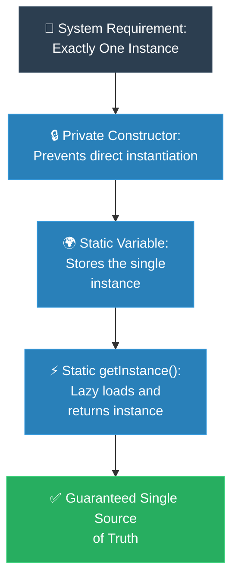

# MIT Professor: Singleton (គោលការណ៍គ្រឹះដំបូងនៃ Singleton)

**Author:** ichamrong  
**Date:** 2026-05-18  
**Tags:** #mit-professor #first-principles #design-patterns #singleton #clean-code  
**Category:** Concepts / MIT Professor  
**Read Time:** ~5 min  

---

## 📌 មាតិកា (Table of Contents)
- [១. បញ្ហាស្នូល (The Core Problem)](#១-បញ្ហាស្នូល-the-core-problem)
- [២. ការទាញហេតុផលពីគោលការណ៍គ្រឹះ (First Principles Derivation)](#២-ការទាញហេតុផលពីគោលការណ៍គ្រឹះ-first-principles-derivation)
- [៣. ដ្យាក្រាមលំហូរ (Visual Derivation)](#៣-ដ្យាក្រាមលំហូរ-visual-derivation)
- [៤. Related Posts](#៤-related-posts)

---

## ១. បញ្ហាស្នូល (The Core Problem)

We want to manage a shared resource (like a database connection pool or hardware port) where having multiple instances causes memory exhaustion, thread lockups, or inconsistent state. 

យើងចង់គ្រប់គ្រងធនធានរួមគ្នា (ដូចជា Database Connection Pool ឬ Hardware Port) ដែលការបង្កើត Object ច្រើននឹងបណ្តាលឱ្យហូរហៀរមេម៉ូរី (Memory Exhaustion) ការជាប់គាំងខ្សែស្រឡាយដំណើរការ (Thread Lockups) ឬស្ថានភាពទិន្នន័យមិនស៊ីសង្វាក់គ្នា (Inconsistent State)។

---

## ២. ការទាញហេតុផលពីគោលការណ៍គ្រឹះ (First Principles Derivation)

### English
* **Axiom 1:** Think about how computers physically work. Every time you use the `new` keyword, the computer carves out a brand-new, completely separate block of memory.
* **Axiom 2:** If our goal is to guarantee that only *one* single truth exists in our entire system, we have to take away everyone else's ability to create new instances. We must protect the creation process.
* **Derivation:** So, how do we do this? First, we make the class constructor `private`, effectively locking the front door. But if the door is locked, how does anyone get in? We build a safe, controlled gateway—a `public static` method (like `getInstance()`). This gateway checks if an instance already exists. If it doesn't, it creates one carefully. If it does, it simply hands over the exact same instance, ensuring everyone shares the exact same truth.

### Khmer
* **គោលការណ៍គ្រឹះ ១៖** គិតអំពីដំណើរការរបស់កុំព្យូទ័រជាទូទៅ។ រាល់ពេលដែលអ្នកប្រើប្រាស់ពាក្យគន្លឹះ `new` កុំព្យូទ័រនឹងកាត់យកទំហំមេម៉ូរីថ្មីមួយ ដែលដាច់ដោយឡែកពីគ្នាទាំងស្រុង។
* **គោលការណ៍គ្រឹះ ២៖** ប្រសិនបើគោលដៅរបស់យើងគឺធានាឱ្យបាននូវការពិត "តែមួយគត់" នៅក្នុងប្រព័ន្ធទាំងមូល យើងចាំបាច់ត្រូវដកសិទ្ធិអ្នកដទៃក្នុងការបង្កើត Object ថ្មី។ យើងត្រូវតែលាក់និងការពារយន្តការនៃការបង្កើតនេះ។
* **ការទាញហេតុផល៖** តើយើងត្រូវធ្វើដូចម្តេច? ជាដំបូង យើងត្រូវប្តូរ Constructor របស់ Class នោះឱ្យទៅជា `private` ដែលប្រៀបដូចជាការចាក់សោទ្វារខាងមុខមិនឱ្យអ្នកណាចូលតាមចិត្ត។ ប៉ុន្តែបើទ្វារត្រូវបានចាក់សោរ តើគេអាចទាញយក Object នោះមកប្រើដោយរបៀបណា? ដំណោះស្រាយគឺ យើងត្រូវបង្កើតច្រកទ្វារសុវត្ថិភាពមួយ — តាមរយៈមុខងារ `public static` (ដូចជា `getInstance()`)។ ច្រកទ្វារនេះនឹងរង់ចាំត្រួតពិនិត្យ៖ ប្រសិនបើ Object មិនទាន់មានទេ វានឹងបង្កើតវាយ៉ាងប្រុងប្រយ័ត្ន។ ប៉ុន្តែបើមានហើយ វានឹងប្រគល់ Object ដដែលនោះត្រឡប់ទៅវិញ ដែលជួយធានាថាគ្រប់គ្នាសុទ្ធតែបានប្រើប្រាស់ប្រភពនៃការពិតតែមួយដូចៗគ្នា។

---

## ៣. ដ្យាក្រាមលំហូរ (Visual Derivation)

---

## ៤. Related Posts

### 🔗 Explore All Viewpoints:
* 📖 **Read the Parable:** [The Bank's Only Vault (ទូដែកតែមួយគត់របស់ធនាគារ)](../../parables/75-the-banks-only-vault.md) — Explains the emotional core of shared truth.
* 🧠 **Read the First Principles Derivation:** [MIT Professor Strategy: Singleton (គោលការណ៍គ្រឹះដំបូងនៃ Singleton)](../01-mit-professor/01-singleton.md) — Derives the pattern from fundamental computer axioms.
* 👶 **Read the Feynman Simplification:** [Feynman Technique: Singleton (ការពន្យល់ពី Singleton ដោយគ្មានពាក្យបច្ចេកទេស)](../02-feynman-technique/04-singleton.md) — Breaks it down using the central clock tower.
* 👦 **Read the ELI5 Metaphor:** [ELI5: Singleton (ម៉ាស៊ីនខួងខ្មៅដៃតែមួយគត់ក្នុងថ្នាក់រៀន)](../03-eli5/04-singleton.md) — Teaches it to a five-year-old using classroom pencil sharpeners.
* 🌉 **Read the Analogy Bridge:** [Analogy Bridge: Singleton (ស្ពានប្រៀបធៀបនៃប្រភពពិតតែមួយគត់)](../04-analogy-bridge/04-singleton.md) — Maps it to a hotel front desk and shows where physical limits fail compared to code threads.
* 🧐 **Read the Socratic Discovery:** [Socratic Method: Singleton (ការបង្កើតប្រព័ន្ធការពិតតែមួយគត់តាមវិធីសាស្ត្រសូក្រាត)](../05-socratic-method/04-singleton.md) — Guide your self-discovery through mentor-student dialogue.
* 📰 **Read the Journalist Summary:** [Journalist: Singleton (ការធានាឱ្យមានការពិតតែមួយគត់ក្នុងប្រព័ន្ធទាំងមូល)](../06-journalist-inverted-pyramid/04-singleton.md) — Get the high-impact lede, volatile visibility, and thread-safety details first.
* 🎭 **Read the Storyteller Narrative:** [Storyteller: Singleton (អាណាព្យាបាលនៃសេចក្តីពិត និងកងទ័ពក្លូនបង្កចលាចល)](../07-storyteller-narrative-arc/04-singleton.md) — Follow Kiri's heroic journey to vanquish the duplicate logger clone army.
* ⚙️ **Read the Engineer Spec:** [Engineer: Singleton (ការសម្របសម្រួលប្រភពពិតតែមួយគត់ និងទប់ស្កាត់ការខ្ជះខ្ជាយធនធាន)](../08-engineer-requirements-constraints-solution/03-singleton.md) — Read the rigorous engineering specification, DCL performance details, and candidate elimination.
* 📊 **Read the Pros & Cons:** [Pros & Cons Compared: Singleton (ការប្រៀបធៀបគុណសម្បត្តិ និងគុណវិបត្តិនៃ Singleton)](../09-pros-and-cons-compared/01-singleton.md) — Full trade-off analysis and decision matrix.
* 🛠️ **Read the Code Implementation:** [Creational Patterns: The Art of Instantiation](../../../clean-code/design-patterns/01-creational-patterns.md#the-singleton) — Production-grade Java with double-checked locking and thread safety.
