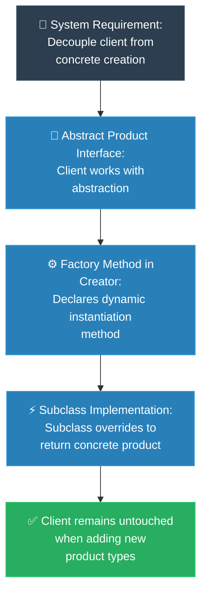

# MIT Professor: Factory Method (គោលការណ៍គ្រឹះដំបូងនៃ Factory Method)

**Author:** ichamrong  
**Date:** 2026-05-18  
**Tags:** #mit-professor #first-principles #design-patterns #factory-method #clean-code  
**Category:** Concepts / MIT Professor  
**Read Time:** ~5 min  

---

## 📌 មាតិកា (Table of Contents)
- [១. បញ្ហាស្នូល (The Core Problem)](#១-បញ្ហាស្នូល-the-core-problem)
- [២. ការទាញហេតុផលពីគោលការណ៍គ្រឹះ (First Principles Derivation)](#២-ការទាញហេតុផលពីគោលការណ៍គ្រឹះ-first-principles-derivation)
- [៣. ដ្យាក្រាមលំហូរ (Visual Derivation)](#៣-ដ្យាក្រាមលំហូរ-visual-derivation)
- [៤. Related Posts](#៤-related-posts)

---

## ១. បញ្ហាស្នូល (The Core Problem)

Have you ever noticed how rigid code becomes when you directly create objects using the `new` keyword? By doing this, your main code becomes deeply tied to a very specific, concrete class. The moment your business needs to grow and you want to introduce a new type of product, you're forced to dig back into your original code and change it. This tightly coupled approach breaks the beautiful Open-Closed Principle—where our code should be open to growing, but closed to being constantly rewritten.

តើអ្នកធ្លាប់កត់សម្គាល់ទេថាកូដរបស់យើងនឹងក្លាយទៅជារឹងស្អិតប៉ុណ្ណា នៅពេលដែលយើងបង្កើត Object ដោយផ្ទាល់តាមរយៈពាក្យគន្លឹះ `new`? ការធ្វើបែបនេះ ធ្វើឱ្យកូដគោលរបស់យើងចងភ្ជាប់យ៉ាងតឹងរ៉ឹងទៅនឹង Class ជាក់លាក់ណាមួយ។ នៅពេលដែលអាជីវកម្មរបស់អ្នករីកចម្រើន ហើយអ្នកចង់បន្ថែមប្រភេទផលិតផលថ្មី អ្នកនឹងត្រូវបង្ខំចិត្តត្រឡប់ទៅកែប្រែកូដចាស់ឡើងវិញ។ ភាពចងភ្ជាប់គ្នាស្អិតនេះ បានបំផ្លាញនូវភាពស្រស់ស្អាតនៃគោលការណ៍ Open-Closed Principle ដែលចង់ឱ្យកូដរបស់យើងបើកចំហសម្រាប់ការអភិវឌ្ឍបន្ថែម តែមិនគួរត្រូវកែប្រែចុះឡើងនោះទេ។

---

## ២. ការទាញហេតុផលពីគោលការណ៍គ្រឹះ (First Principles Derivation)

### English
* **Axiom 1:** Tying our code directly to concrete details is a trap. It violates a core engineering law—the Dependency Inversion Principle. To build resilient systems, we must rely on meaningful interfaces rather than rigid, hardcoded implementations.
* **Axiom 2:** Think about the client using your code. They just want to consume the product. They shouldn't have to carry the burden of knowing exactly *how* or *which* specific version of that product needs to be created.
* **Derivation:** Our solution is beautiful in its simplicity: we completely separate the act of *using* an object from the act of *creating* it. We introduce an abstract creator class that holds a special "Factory Method" (like `createProduct()`). Now, instead of the client blindly calling `new Product()`, they simply ask this factory method for what they need. The brilliant part is that the specific subclasses of this creator are the ones that decide exactly which concrete product to build. The client? They stay perfectly blissfully unaware, happily interacting only with the overarching abstract interface.

### Khmer
* **គោលការណ៍គ្រឹះ ១៖** ការចងភ្ជាប់កូដរបស់យើងដោយផ្ទាល់ទៅនឹងព័ត៌មានលម្អិតជាក់លាក់ គឺជាអន្ទាក់មួយ។ វាបានបំពានលើច្បាប់វិស្វកម្មដ៏សំខាន់មួយ គឺ Dependency Inversion Principle។ ដើម្បីកសាងប្រព័ន្ធដែលរឹងមាំ យើងត្រូវពឹងផ្អែកលើចំណុចប្រទាក់ (Interfaces) ដែលមានអត្ថន័យ ជាជាងការចងភ្ជាប់កូដយ៉ាងរឹងកំព្រឹស។
* **គោលការណ៍គ្រឹះ ២៖** សាកគិតពីអ្នកប្រើប្រាស់កូដ (Client) របស់អ្នកមើល។ ពួកគេគ្រាន់តែចង់ប្រើប្រាស់ផលិតផលប៉ុណ្ណោះ។ ពួកគេមិនគួរទទួលបន្ទុកក្នុងការដឹងច្បាស់ថា តើផលិតផលនោះត្រូវបង្កើតឡើងដោយរបៀបណា ឬត្រូវបង្កើតកំណែមួយណានោះទេ។
* **ការទាញហេតុផល៖** ដំណោះស្រាយរបស់យើងពិតជាស្រស់ស្អាតដោយសារភាពសាមញ្ញរបស់វា៖ យើងបំបែកសកម្មភាពនៃ *ការប្រើប្រាស់* ចេញពី *ការបង្កើត* ទាំងស្រុង។ យើងបង្កើតនូវ Creator Class មួយដែលដើរតួជា "Factory Method" (ដូចជា `createProduct()`)។ ឥឡូវនេះ ជំនួសឱ្យការហៅ `new Product()` ដោយផ្ទាល់កូនកូដគ្រាន់តែស្នើសុំអ្វីដែលពួកគេត្រូវការពី Factory Method នេះប៉ុណ្ណោះ។ ចំណុចដ៏អស្ចារ្យនោះគឺ Subclasses របស់ Creator នឹងជាអ្នកសម្រេចចិត្តដោយខ្លួនឯងថាត្រូវបង្កើតផលិតផលជាក់លាក់មួយណា។ ចំណែកឯកូនកូដវិញ? ពួកគេនៅតែអាចធ្វើការដោយរលូន និងមានក្តីសុខ តាមរយៈការប្រស្រ័យទាក់ទងតែជាមួយ Abstract Interface ប៉ុណ្ណោះ។

---

## ៣. ដ្យាក្រាមលំហូរ (Visual Derivation)

---

## ៤. Related Posts

### 🔗 Explore All Viewpoints:
* 📖 **Read the Parable:** [The CEO and the Regional Managers (នាយកប្រតិបត្តិ និងអ្នកគ្រប់គ្រងតំបន់)](../../parables/77-the-ceo-and-regional-managers.md) — The emotional core of delegating local decisions.
* 🧠 **Read the First Principles Derivation:** [MIT Professor Strategy: Factory Method (គោលការណ៍គ្រឹះដំបូងនៃ Factory Method)](../01-mit-professor/02-factory-method.md) — Derives the pattern step-by-step from base interface dependency laws.
* 👶 **Read the Feynman Simplification:** [Feynman Technique: Factory Method (ការពន្យល់ពី Factory Method ដោយគ្មានពាក្យបច្ចេកទេស)](../02-feynman-technique/06-factory-method.md) — Breaks it down using the hotel cleaner recruitment agency.
* 👦 **Read the ELI5 Metaphor:** [ELI5: Factory Method (ការពន្យល់ពី Factory Method ដូចក្មេងអាយុ ៥ ឆ្នាំ)](../03-eli5/06-factory-method.md) — Teaches a five-year-old using the magic toy machine slot.
* 🌉 **Read the Analogy Bridge:** [Analogy Bridge: Factory Method (ស្ពានប្រៀបធៀបនៃ Factory Method)](../04-analogy-bridge/06-factory-method.md) — Maps regional postal transport hubs to virtual methods, outlining physical limitations.
* 🧐 **Read the Socratic Discovery:** [Socratic Method: Factory Method (ការបង្កើត Object តាមតម្រូវការយឺតយ៉ាវតាមវិធីសាស្ត្រសូក្រាត)](../05-socratic-method/06-factory-method.md) — Socrates guides your discovery out of switch block coupling.
* 📰 **Read the Journalist Summary:** [Journalist: Factory Method (ការបំបែកកូដបង្កើត Object ឱ្យមានសេរីភាពសម្រេចចិត្តលើ Subclass)](../06-journalist-inverted-pyramid/06-factory-method.md) — High-impact news lede, OCP compliance, and SRP isolation details first.
* 🎭 **Read the Storyteller Narrative:** [Storyteller: Factory Method (វីរបុរស Factory Method និងការដោះលែងប្រព័ន្ធផ្ញើសារពីរនរក switch)](../07-storyteller-narrative-arc/06-factory-method.md) — Junior developer Dara's battle to vanquish the switch statement monster on Black Friday.
* ⚙️ **Read the Engineer Spec:** [Engineer: Factory Method (ការបំបែកកូដបង្កើត Object តាមរយៈការវាយតម្លៃតម្រូវការ និងឧបសគ្គកំណត់)](../08-engineer-requirements-constraints-solution/04-factory-method.md) — Technical requirements, ADR candidate matrix, and SLA evaluation.
* 📊 **Read the Pros & Cons:** [Pros & Cons Compared: Factory Method (ការប្រៀបធៀបគុណសម្បត្តិ និងគុណវិបត្តិនៃ Factory Method)](../09-pros-and-cons-compared/03-factory-method.md) — Full trade-off analysis and decision matrix.
* 🛠️ **Read the Code Implementation:** [Creational Patterns: The Art of Instantiation](../../../clean-code/design-patterns/01-creational-patterns.md#the-factory-method) — Production-grade Java with subclass dispatch and Open/Closed Principle.
