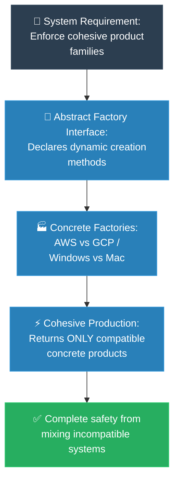

# MIT Professor: Abstract Factory (គោលការណ៍គ្រឹះដំបូងនៃ Abstract Factory)

**Author:** ichamrong  
**Date:** 2026-05-18  
**Tags:** #mit-professor #first-principles #design-patterns #abstract-factory #clean-code  
**Category:** Concepts / MIT Professor  
**Read Time:** ~5 min  

---

## 📌 មាតិកា (Table of Contents)
- [១. បញ្ហាស្នូល (The Core Problem)](#១-បញ្ហាស្នូល-the-core-problem)
- [២. ការទាញហេតុផលពីគោលការណ៍គ្រឹះ (First Principles Derivation)](#២-ការទាញហេតុផលពីគោលការណ៍គ្រឹះ-first-principles-derivation)
- [៣. ដ្យាក្រាមលំហូរ (Visual Derivation)](#៣-ដ្យាក្រាមលំហូរ-visual-derivation)
- [៤. Related Posts](#៤-related-posts)

---

## ១. បញ្ហាស្នូល (The Core Problem)

Imagine trying to build an experience that spans across entirely different worlds—like crafting UI controls for Windows and macOS, or deploying services across AWS and GCP. These are families of objects that belong together. If we let our code manually piece these components together one by one, human error is inevitable. We might accidentally drop a Windows button right in the middle of a sleek macOS window. Not only does this look terrible, but it actively causes devastating crashes and unpredictable system bugs.

ស្រមៃថាអ្នកកំពុងព្យាយាមបង្កើតបទពិសោធន៍មួយដែលគ្របដណ្តប់លើពិភពលោកខុសៗគ្នាទាំងស្រុង — ដូចជាការរចនា UI Controls សម្រាប់ Windows និង macOS ព្រមៗគ្នា ឬការដាក់ឱ្យដំណើរការសេវាកម្មនៅលើ AWS និង GCP ជាដើម។ ទាំងនេះគឺជាក្រុមនៃ Object ដែលត្រូវតែនៅជាមួយគ្នា។ ប្រសិនបើយើងបណ្តោយឱ្យកូដរបស់យើងផ្គុំសមាសធាតុទាំងនេះដោយដៃម្តងមួយៗ នោះកំហុសរបស់មនុស្សច្បាស់ជានឹងកើតមានឡើងជាមិនខាន។ យើងអាចនឹងច្រឡំដាក់ប៊ូតុងរបស់ Windows ទៅក្នុងផ្ទាំងដ៏ស្រស់ស្អាតរបស់ macOS ដោយអចេតនា។ វាមិនត្រឹមតែមើលទៅអាក្រក់ប៉ុណ្ណោះទេ ថែមទាំងអាចបណ្តាលឱ្យប្រព័ន្ធគាំង និងមានបញ្ហាធ្ងន់ធ្ងរដែលយើងនឹកស្មានមិនដល់ទៀតផង។

---

## ២. ការទាញហេតុផលពីគោលការណ៍គ្រឹះ (First Principles Derivation)

### English
* **Axiom 1:** A truly elegant system must be completely independent. It shouldn't care about the gritty details of how its individual pieces are created, put together, or displayed to the world.
* **Axiom 2:** When objects belong to a family, they are destined to work together in harmony. We must relentlessly protect this relationship, ensuring that these related parts are never separated or mixed with incompatible pieces.
* **Derivation:** Because of this, we elevate our thinking and abstract the creation of the *entire family* at once. We declare a master blueprint—an `AbstractFactory` interface—that holds the specific methods for every single piece of the family (like `createButton()` or `createCheckbox()`). We then build dedicated factories (`WindowsFactory`, `MacFactory`) whose sole purpose is to spawn pieces that perfectly match. When our system starts up, we simply hand the client the right factory. From that moment on, the client relies entirely on that factory, guaranteeing a flawless, contamination-free environment where everything naturally belongs together.

### Khmer
* **គោលការណ៍គ្រឹះ ១៖** ប្រព័ន្ធដែលល្អឥតខ្ចោះពិតប្រាកដ ត្រូវតែមានឯករាជ្យភាព។ វាមិនគួរខ្វាយខ្វល់ពីព័ត៌មានលម្អិតដ៏ស្មុគស្មាញ អំពីរបៀបដែលសមាសធាតុនីមួយៗត្រូវបានបង្កើត ផ្គុំចូលគ្នា ឬបង្ហាញចេញមកក្រៅនោះទេ។
* **គោលការណ៍គ្រឹះ ២៖** នៅពេលដែល Object ទាំងឡាយស្ថិតនៅក្នុងក្រុមតែមួយ ពួកវាត្រូវបានកំណត់ឱ្យធ្វើការរួមគ្នាយ៉ាងចុះសម្រុង។ យើងត្រូវតែការពារទំនាក់ទំនងនេះឱ្យបានតឹងរ៉ឹងបំផុត ដើម្បីធានាថាផ្នែកដែលពាក់ព័ន្ធទាំងនេះមិនត្រូវបានបំបែកចេញពីគ្នា ឬលាយឡំជាមួយនឹងសមាសធាតុដែលមិនត្រូវគ្នាឡើយ។
* **ការទាញហេតុផល៖** ដោយសារហេតុនេះហើយ យើងត្រូវលើកកម្ពស់ការគិតរបស់យើង ដោយធ្វើអរូបនីយកម្ម (Abstract) លើការបង្កើត *ក្រុមទាំងមូល* ក្នុងពេលតែមួយ។ យើងបង្កើតប្លង់គោលមួយ — គឺ Interface `AbstractFactory` — ដែលផ្ទុកនូវមុខងារជាក់លាក់សម្រាប់រាល់សមាសធាតុទាំងអស់ក្នុងក្រុម (ដូចជា `createButton()` ឬ `createCheckbox()`)។ បន្ទាប់មក យើងបង្កើតរោងចក្រជំនាញ (ដូចជា `WindowsFactory`, `MacFactory`) ដែលមានតួនាទីតែមួយគត់ គឺបង្កើតសមាសធាតុដែលត្រូវគ្នាយ៉ាងល្អឥតខ្ចោះ។ នៅពេលប្រព័ន្ធចាប់ផ្តើមដំណើរការ យើងគ្រាន់តែប្រគល់រោងចក្រដែលត្រឹមត្រូវទៅឱ្យកូនកូដ (Client)។ ចាប់ពីពេលនោះមក កូនកូដនឹងពឹងផ្អែកទាំងស្រុងលើរោងចក្រនោះ ដែលធានាបាននូវបរិស្ថានដ៏ល្អឥតខ្ចោះ គ្មានការលាយឡំ ហើយអ្វីៗគ្រប់យ៉ាងដំណើរការជាមួយគ្នាយ៉ាងស៊ីសង្វាក់។

---

## ៣. ដ្យាក្រាមលំហូរ (Visual Derivation)

---

## ៤. Related Posts

* 📖 **Read the Parable:** [The Mismatched Furniture Store (ហាងលក់គ្រឿងសង្ហារឹមចម្រុះ)](../../parables/78-the-mismatched-furniture-store.md)
* 🛠️ **Read the Code Implementation:** [Creational Patterns: The Art of Instantiation](../../../clean-code/design-patterns/01-creational-patterns.md#the-abstract-factory)
