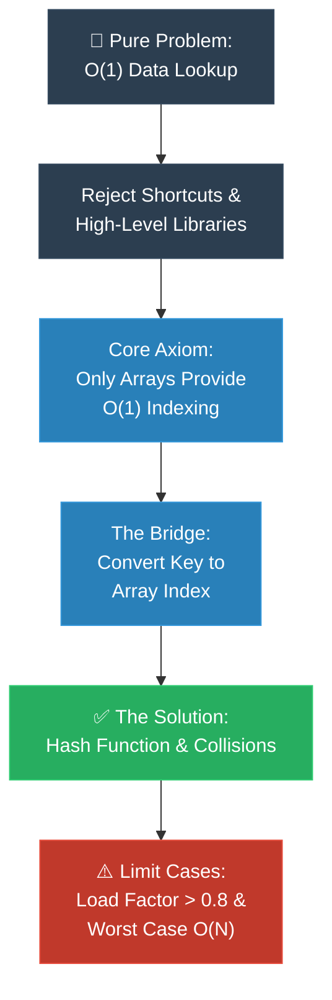

# Strategy 01: The MIT Professor (First Principles / គោលការណ៍គ្រឹះដំបូង)

**Author:** ichamrong  
**Date:** 2026-05-18  
**Tags:** #explanation-strategies #mit-professor #first-principles #pedagogy  
**Category:** Concepts / Explanation Strategies  
**Read Time:** ~5 min  

---

## 📌 មាតិកា (Table of Contents)
- [សេចក្តីផ្តើម (Introduction)](#សេចក្តីផ្តើម-introduction)
- [រូបមន្តនៃការដោះស្រាយ (The Formula)](#រូបមន្តនៃការដោះស្រាយ-the-formula)
- [ដ្យាក្រាមលំហូរ (Visual Flowchart)](#ដ្យាក្រាមលំហូរ-visual-flowchart)
- [ឧទាហរណ៍ជាក់ស្តែង៖ ហេτώអ្វីត្រូវមាន Hash Table? (Practical Example)](#ឧទាហរណ៍ជាក់ស្តែង៖-ហេតុអ្វីត្រូវមាន-hash-table-practical-example)
- [មេរៀន និងដែនកំណត់ (When to Use & Limitations)](#មេរៀន-និងដែនកំណត់-when-to-use-limitations)

---

## សេចក្តីផ្តើម (Introduction)

The **MIT Professor** strategy is crafted for curious, capable minds who crave more than just surface-level answers—they demand to know *why* systems are built the way they are. It boldly strips away the shortcuts, the fluff, and the confusing early analogies. Instead, it invites you on a profound journey, walking with you step-by-step from absolute, undeniable truths (axioms) down to the final solution. By the end, you won't just memorize a pattern; you'll feel the inevitable logic that makes the final code the *only* beautiful conclusion.

យុទ្ធសាស្ត្រ **MIT Professor (គោលការណ៍គ្រឹះដំបូង)** ត្រូវបានច្នៃប្រឌិតឡើងសម្រាប់អ្នករៀនដែលមានភាពចង់ដឹងចង់ឃើញ និងមានសមត្ថភាព ដែលចង់បានលើសពីចម្លើយសាមញ្ញៗ — ពួកគេចង់យល់ដឹងឱ្យស៊ីជម្រៅថា *ហេតុអ្វី* បានជាប្រព័ន្ធទាំងនោះត្រូវរចនាឡើងបែបនេះ។ វិធីសាស្ត្រនេះហ៊ានកាត់ចោលទាំងស្រុងនូវផ្លូវកាត់ ការពន្យល់រាក់ៗ និងការប្រៀបធៀបដែលធ្វើឱ្យស្មុគស្មាញនៅដំណាក់កាលដំបូង។ ផ្ទុយទៅវិញ វាអញ្ជើញអ្នកឱ្យចូលរួមក្នុងដំណើរដ៏អស្ចារ្យមួយ ដោយដើរជាមួយអ្នកមួយជំហានម្តងៗ ចាប់ពីការពិតដែលមិនអាចប្រកែកបាន (Axioms) រហូតដល់ការរកឃើញដំណោះស្រាយចុងក្រោយ។ នៅទីបញ្ចប់ អ្នកមិនត្រឹមតែទន្ទេញចាំនូវទម្រង់កូដប៉ុណ្ណោះទេ តែអ្នកនឹងមានអារម្មណ៍ដឹងពីតក្កវិជ្ជាដ៏រឹងមាំ ដែលធ្វើឱ្យកូដចុងក្រោយក្លាយជាការសន្និដ្ឋានដ៏ស្រស់ស្អាតតែមួយគត់។

---

## រូបមន្តនៃការដោះស្រាយ (The Formula)

```
1. Confront the PROBLEM bravely, in its purest and most unforgiving form.
2. Strip away the noise: resist the urge to jump to quick fixes or easy analogies.
3. Ground yourself in truth: build the solution gently, step-by-step, from unshakeable core axioms.
4. Reveal the inevitable logic: show how this path is the only true way forward.
5. Bridge the gap: bring in relatable, real-world analogies to make the concept feel like second nature.
6. Acknowledge boundaries: honestly explore the breaking points and limits of your creation.
```

---

## ដ្យាក្រាមលំហូរ (Visual Flowchart)



---

## ឧទាហរណ៍ជាក់ស្តែង៖ ហេតុអ្វីត្រូវមាន Hash Table? (Practical Example)

### The First Principles Derivation (English)
> *"Imagine the ultimate goal: we want instant, zero-delay access to our data, mathematically known as O(1) lookup. When we look closely at how computer memory actually physically operates, there is only one true way to achieve this magic: direct array indexing. So, the profound question we face is this: how do we take something chaotic and unpredictable—like a person's name or a complex object—and gracefully transform it into a neat, valid array index? That beautiful transformation is the essence of hashing. The hash function is our bridge, and every other complex decision we make downstream (handling collisions, managing load, expanding the space) naturally blossoms from this one simple, powerful need."*

### ការទាញហេតុផលពីគោលការណ៍គ្រឹះ (Khmer)
> *«ស្រមៃមើលពីគោលដៅដ៏ខ្ពង់ខ្ពស់របស់យើង៖ យើងចង់ទាញយកទិន្នន័យមកប្រើប្រាស់បានភ្លាមៗ ដោយគ្មានការពន្យារពេល ដែលតាមភាសាគណិតវិទ្យាហៅថា O(1) Lookup។ នៅពេលដែលយើងក្រឡេកមើលឱ្យជិតពីរបៀបដែលអង្គចងចាំកុំព្យូទ័រធ្វើការជាក់ស្តែង គឺមានវិធីពិតប្រាកដតែមួយគត់ដើម្បីសម្រេចនូវភាពអស្ចារ្យនេះ៖ នោះគឺការចង្អុលទីតាំងដោយផ្ទាល់ (Direct Array Indexing)។ ដូច្នេះ សំណួរដ៏ស៊ីជម្រៅដែលយើងត្រូវប្រឈមមុខគឺ៖ តើយើងអាចយកអ្វីមួយដែលគ្មានសណ្តាប់ធ្នាប់ និងពិបាកទាយទុក — ដូចជាឈ្មោះមនុស្ស ឬ Object ដ៏ស្មុគស្មាញ — មកបំប្លែងយ៉ាងទន់ភ្លន់ឱ្យក្លាយជា Index ដ៏រៀបរយនិងត្រឹមត្រូវមួយដោយរបៀបណា? ការបំប្លែងដ៏ស្រស់ស្អាតនោះហើយ គឺជាបេះដូងនៃ Hashing។ មុខងារ Hash Function គឺជាស្ពានចម្លងរបស់យើង ហើយរាល់ការសម្រេចចិត្តដ៏ស្មុគស្មាញផ្សេងៗទៀតដែលកើតមានតាមក្រោយ (ការដោះស្រាយការជាន់គ្នា, ការគ្រប់គ្រងទំហំផ្ទុក, ការពង្រីកទំហំ) គឺសុទ្ធតែលេចចេញជារូបរាងយ៉ាងធម្មជាតិ ចេញពីតម្រូវការដ៏សាមញ្ញ និងមានឥទ្ធិពលតែមួយនេះប៉ុណ្ណោះ។»*

---

## មេរៀន និងដែនកំណត់ (When to Use & Limitations)

### 📈 Best For (សាកសមបំផុតសម្រាប់)
* **Technical Documentation:** Writing API specifications, architectural guides, or system designs.
* **Onboarding Engineers:** Bringing senior developers into a complex, custom-built codebase.
* **Academic & High-Authority Posts:** Writing papers or high-end blog posts that establish authority.

### ⚠️ Limitations (ដែនកំណត់)
* **High Cognitive Load:** Requires the audience to pay close attention.
* **Not for Beginners:** Will overwhelm someone without prior technical foundations.
* **Requires Time:** Cannot be compressed into a 30-second elevator pitch.

---

---

## 📚 Implemented Patterns (គំរូស្ថាបត្យកម្មដែលបានអនុវត្ត)

Here are the design patterns explained in depth using the **MIT Professor (First Principles)** strategy:

* **[01. Singleton (គោលការណ៍គ្រឹះដំបូងនៃ Singleton)](./01-singleton.md)** — Axiom 1: A single database/resource coordinator must guarantee a single source of truth. Axiom 2: Global state is dangerous unless strictly locked. Derivation: Private constructor, static instance, thread-safe lazy loading.
* **[02. Factory Method (គោលការណ៍គ្រឹះដំបូងនៃ Factory Method)](./02-factory-method.md)** — Axiom 1: Direct instantiation couples clients to concrete classes. Axiom 2: Clients only care about abstract products. Derivation: Defer instantiation to subclasses via abstract virtual factory method.
* **[03. Abstract Factory (គោលការណ៍គ្រឹះដំបូងនៃ Abstract Factory)](./03-abstract-factory.md)** — Axiom 1: System must be independent of how its products are created. Axiom 2: Enforce cohesive family of objects. Derivation: Abstract factory interface containing multiple virtual factory methods.
* **[04. Builder (គោលការណ៍គ្រឹះដំបូងនៃ Builder)](./04-builder.md)** — Axiom 1: Positional parameters on call stack cause compile-time swap bugs. Axiom 2: Objects must initialize to valid state atomically. Axiom 3: Multi-threading requires immutability. Derivation: Nested mutable builder class that materializes immutable products safely.

---

## Related
* [← Back to Concepts](../README.md)
* [Strategy 02: Feynman Technique](../02-feynman-technique/README.md)
* [Strategy 08: The Engineer Strategy](../08-engineer-requirements-constraints-solution/README.md)
