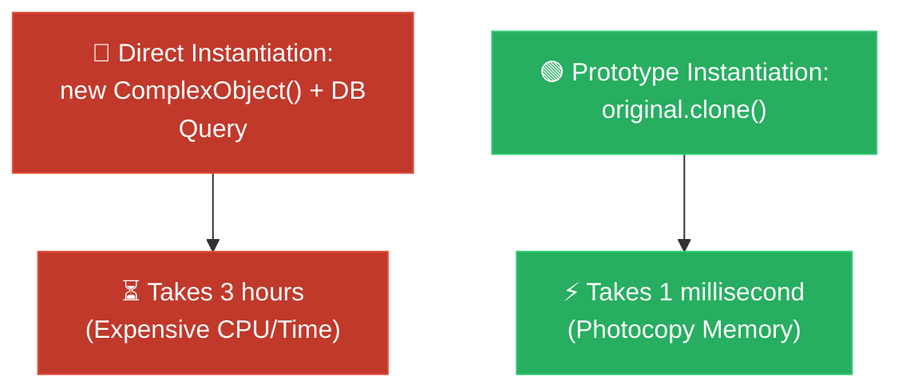

# Feynman Technique: Prototype (ការថតចម្លងគំរូកូដដោយសាមញ្ញ)

**Author:** ichamrong  
**Date:** 2026-05-18  
**Tags:** #feynman-technique #simplification #design-patterns #prototype #clean-code  
**Category:** Concepts / Feynman Technique  
**Read Time:** ~5 min  

---

## 📌 មាតិកា (Table of Contents)
- [១. ការពន្យល់បែបសាមញ្ញបំផុត (The Child-Friendly Explanation)](#១-ការពន្យល់បែបសាមញ្ញបំផុត-the-child-friendly-explanation)
- [២. របៀបដែលវាដោះស្រាយបញ្ហា (How It Works)](#២-របៀបដែលវាដោះស្រាយបញ្ហា-how-it-works)
- [៣. ដ្យាក្រាមលំហូរ (Visual Flowchart)](#៣-ដ្យាក្រាមលំហូរ-visual-flowchart)
- [៤. Related Posts](#៤-related-posts)

---

## ១. ការពន្យល់បែបសាមញ្ញបំផុត (The Child-Friendly Explanation)

### English
Imagine you’ve just poured your heart into drawing a breathtaking, incredibly detailed picture of a dragon. It took you three grueling hours of hard work. Now, your friend sees it and says, 'I love this! Can I have the exact same one, but with blue scales?'

Are you going to sit down and spend another exhausting three hours drawing it all over again from a blank page? Of course not! That would be a huge waste of time and energy (in programming, this is like burning CPU power and making slow database queries). Instead, you simply walk over to a magical photocopier, slip your original masterpiece in, press **Copy**, and effortlessly color the new scales blue.

That magical photocopier is the **Prototype Pattern**. Your beautiful original drawing is the **Prototype**, and the smooth process of copying it is the **Clone method**.

### Khmer
សាកស្រមៃថា អ្នកទើបតែបានចំណាយកម្លាំងកាយចិត្តយ៉ាងនឿយហត់អស់រយៈពេល ៣ ម៉ោងពេញ ដើម្បីគូររូបនាគដ៏រស់រវើក និងស្រស់ស្អាតឥតខ្ចោះមួយ។ ពេលនោះ មិត្តភក្តិរបស់អ្នកបានឃើញ ហើយលាន់មាត់ថា 'ខ្ញុំចូលចិត្តរូបនេះណាស់! តើខ្ញុំអាចសុំរូបនាគដូចគ្នាបេះបិទនេះមួយបានទេ តែសុំប្តូរស្រកាទៅជាពណ៌ខៀវវិញ?'

តើអ្នកនឹងអង្គុយចុះ ហើយចំណាយពេល ៣ ម៉ោងដ៏នឿយហត់ម្តងទៀត ដើម្បីគូររូបថ្មីពីក្រដាសសឬ? ប្រាកដជារកកលមិនអញ្ចឹងទេ! វាពិតជាខ្ជះខ្ជាយពេលវេលា និងកម្លាំងខ្លាំងណាស់ (នៅក្នុងការសរសេរកូដ វាប្រៀបដូចជាការប្រើប្រាស់កម្លាំងម៉ាស៊ីន CPU ធ្ងន់ៗ និងការទាញទិន្នន័យយឺតៗពី Database អញ្ចឹងដែរ)។ ផ្ទុយទៅវិញ អ្នកគ្រាន់តែដើរទៅកាន់ម៉ាស៊ីនថតចម្លងវេទមន្តមួយ ដាក់រូបគំនូរដើមរបស់អ្នកចូល ចុចប៊ូតុង **Copy (ថតចម្លង)** រួចយកវាមកផាត់ស្រកាពណ៌ខៀវយ៉ាងងាយស្រួលជាការស្រេច!

ម៉ាស៊ីនថតចម្លងវេទមន្តនោះហើយ គឺជា **Prototype Pattern**។ គំនូរដើមដ៏ស្រស់ស្អាតរបស់អ្នក គឺជា **Prototype (គំរូដើម)** ហើយដំណើរការថតចម្លងដ៏រលូននោះ គឺជាមុខងារ **Clone (ក្លូន)**។

---

## ២. របៀបដែលវាដោះស្រាយបញ្ហា (How It Works)

We define a `clone()` method directly inside our object interface. When we need a new object, instead of calling `new ComplexObject()` and querying the database again, we just call `existingObject.clone()`. The object itself knows how to copy its own memory fields (either via shallow copy or deep copy), returning a perfect replica instantly and cheaply.

យើងបង្កើតមុខងារ `clone()` មួយនៅចំកណ្តាល Interface របស់ Object តែម្តង។ នៅពេលយើងចង់បាន Object ថ្មី ជំនួសឱ្យការហៅ `new ComplexObject()` និងទាញទិន្នន័យពី Database ឡើងវិញ យើងគ្រាន់តែហៅ `existingObject.clone()`។ Object នោះនឹងចម្លងទិន្នន័យមេម៉ូរីរបស់ខ្លួនឯង (តាមរយៈ Shallow copy ឬ Deep copy) ដោយផ្តល់មកវិញនូវរូបចម្លងដ៏ល្អឥតខ្ចោះភ្លាមៗ និងចំណាយតិចបំផុត។

---

## ៣. ដ្យាក្រាមលំហូរ (Visual Flowchart)

---

## ៤. Related Posts

* 📖 **Read the Parable:** [The Lazy Wizard and the Clone Spell (វេទមន្តខ្ជិល និងមន្តអាគមថតចម្លង)](../../parables/79-the-lazy-wizard-and-the-clone-spell.md)
* 🛠️ **Read the Code Implementation:** [Creational Patterns: The Art of Instantiation](../../../clean-code/design-patterns/01-creational-patterns.md#the-prototype)
