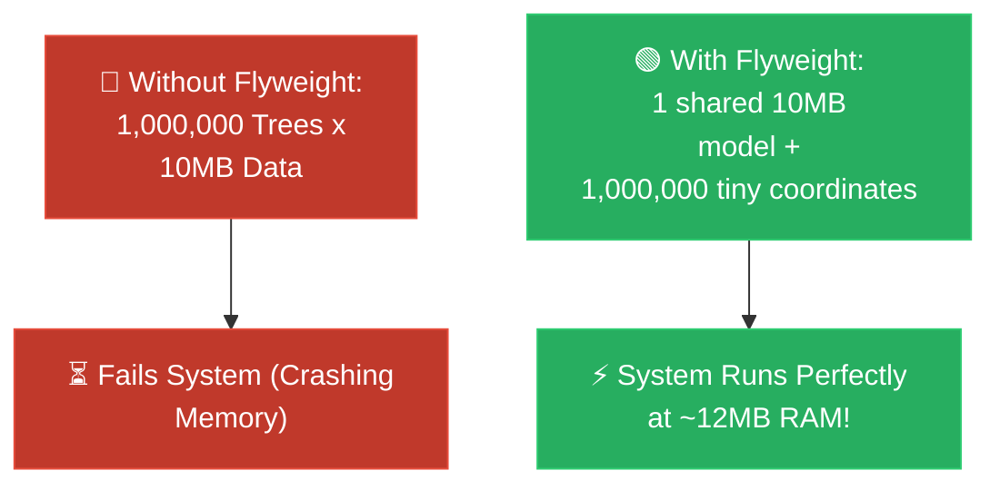

# Feynman Technique: Flyweight (ការសន្សំសំចៃមេម៉ូរីដោយការចែករំលែកទិន្នន័យ)

**Author:** ichamrong  
**Date:** 2026-05-18  
**Tags:** #feynman-technique #simplification #design-patterns #flyweight #clean-code  
**Category:** Concepts / Feynman Technique  
**Read Time:** ~5 min  

---

## 📌 មាតិកា (Table of Contents)
- [១. ការពន្យល់បែបសាមញ្ញបំផុត (The Child-Friendly Explanation)](#១-ការពន្យល់បែបសាមញ្ញបំផុត-the-child-friendly-explanation)
- [២. ឫសគល់នៃបញ្ហា៖ Intrinsic vs Extrinsic (Core Mechanics)](#២-ឫសគល់នៃបញ្ហា-intrinsic-vs-extrinsic-core-mechanics)
- [៣. ដ្យាក្រាមលំហូរ (Visual Flowchart)](#៣-ដ្យាក្រាមលំហូរ-visual-flowchart)
- [៤. Related Posts](#៤-related-posts)

---

## ១. ការពន្យល់បែបសាមញ្ញបំផុត (The Child-Friendly Explanation)

### English
Imagine you are dreaming up a beautiful video game, and you want to plant a vast, breathtaking forest with **1,000,000 trees**. If you build a completely separate, heavy 3D model for every single tree—each carrying its own thick textures and leaves (say, 10MB each)—your poor game would suddenly demand **10 Terabytes of RAM**. Your computer would literally freeze and crash under the crushing weight.

But what if you used a clever illusion? Instead of forcing the computer to memorize that heavy 10MB tree one million times, you gently place that gorgeous 3D model into memory exactly **once**. Then, for the million trees scattered across the forest, you simply remember a tiny whisper of information for each one: its exact `X` and `Y` location, and how healthy it is. When the game renders, all 1,000,000 trees look at that one single, beautifully shared model!

This brilliant act of sharing heavy burdens is called the **Flyweight Pattern**.

### Khmer
សាកស្រមៃថា អ្នកកំពុងបង្កើតហ្គេមដ៏ស្រស់ស្អាតមួយ ហើយអ្នកចង់ដាំព្រៃឈើដ៏ធំល្វឹងល្វើយដែលមាន **ដើមឈើរហូតដល់ ១,០០០,០០០ ដើម**។ ប្រសិនបើអ្នកសាងសង់រូបរាង 3D ថ្មីនិងធ្ងន់ៗសម្រាប់ដើមឈើនីមួយៗដាច់ដោយឡែកពីគ្នា (ឧបមាថាទំហំ 10MB ក្នុងមួយដើម) នោះហ្គេមដ៏កម្សត់របស់អ្នកនឹងទាមទារ **មេម៉ូរីទំហំដល់ទៅ 10 Terabytes** ឯណោះ។ កុំព្យូទ័ររបស់អ្នកច្បាស់ជាគាំងកក និងគាំងរលត់ក្រោមទម្ងន់ដ៏សង្កត់សង្កិននេះជាមិនខាន។

ប៉ុន្តែ ចុះបើអ្នកប្រើល្បិចដ៏ឆ្លាតវៃមួយវិញ? ជំនួសឱ្យការបង្ខំកុំព្យូទ័រឱ្យចងចាំដើមឈើទំហំ 10MB នោះមួយលានដង អ្នកគ្រាន់តែរក្សាទុករូបរាង 3D ដ៏ស្រស់ស្អាតនោះនៅក្នុងមេម៉ូរីតែ **ម្តងគត់**។ បន្ទាប់មក សម្រាប់ដើមឈើទាំងមួយលានដើមដែលរាយប៉ាយពេញព្រៃ អ្នកគ្រាន់តែចងចាំព័ត៌មានដ៏តូចបន្តិចបន្តួចសម្រាប់ពួកវានីមួយៗប៉ុណ្ណោះ៖ គឺទីតាំង `X` និង `Y` ជាក់លាក់របស់វា ព្រមទាំងកម្រិតឈាមរបស់វា។ នៅពេលហ្គេមចាប់ផ្តើមបង្ហាញរូបភាព ដើមឈើទាំង ១ លានដើមនោះ នឹងងាកទៅមើលរូបរាង 3D តែមួយគត់ដែលត្រូវបានចែករំលែករួមគ្នាយ៉ាងស្រស់ស្អាតនោះ!

សកម្មភាពដ៏ឆ្លាតវៃក្នុងការចែករំលែកបន្ទុកដ៏ធ្ងន់នេះហើយ ដែលយើងហៅថា **Flyweight Pattern**។

---

## ២. ឫសគល់នៃបញ្ហា៖ Intrinsic vs Extrinsic (Core Mechanics)

To make this work, we divide the object's data into two types:
1. **Intrinsic State (ទិន្នន័យខាងក្នុងរួមគ្នា):** Large, constant data that is identical across all instances (e.g., the 3D model, the texture). This is stored inside the Flyweight object.
2. **Extrinsic State (ទិន្នន័យខាងក្រៅដាច់ដោយឡែក):** Tiny, unique data that changes depending on context (e.g., coordinates `X`, `Y`, `color`). This is passed to the Flyweight object from the outside at runtime.

---

## ៣. ដ្យាក្រាមលំហូរ (Visual Flowchart)

---

## ៤. Related Posts

* 📖 **Read the Parable:** [The Forest of a Million Trees (ព្រៃឈើរាប់លានដើម)](../../parables/85-the-forest-of-a-million-trees.md)
* 🛠️ **Read the Code Implementation:** [Structural Patterns: The Architecture of Objects](../../../clean-code/design-patterns/02-structural-patterns.md#the-flyweight)
