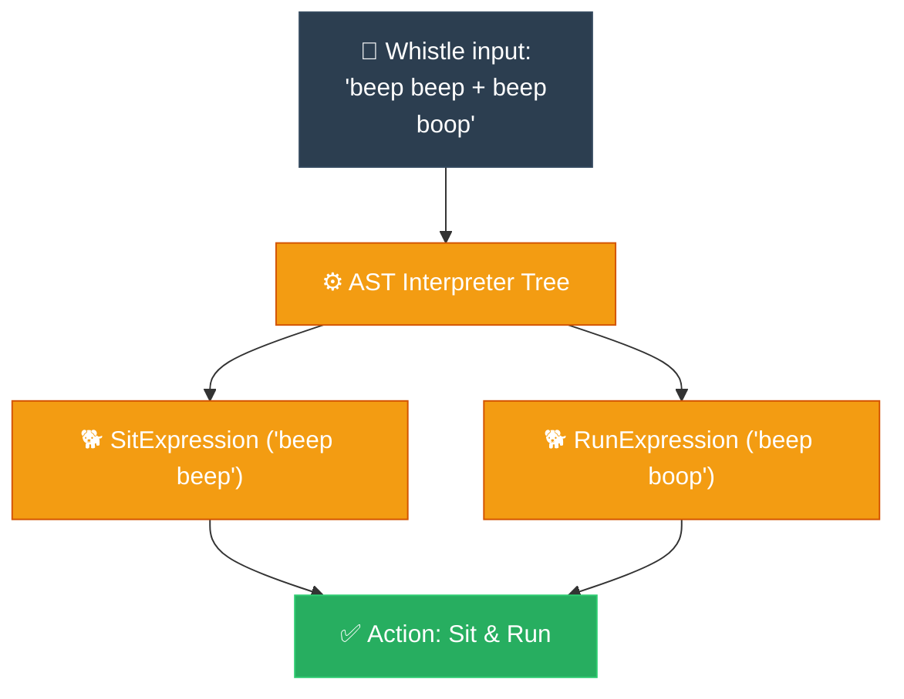

# Feynman Technique: Interpreter (ការបកប្រែភាសា និងកូដបញ្ជាដោយសាមញ្ញ)

**Author:** ichamrong  
**Date:** 2026-05-18  
**Tags:** #feynman-technique #simplification #design-patterns #interpreter #clean-code  
**Category:** Concepts / Feynman Technique  
**Read Time:** ~5 min  

---

## 📌 មាតិកា (Table of Contents)
- [១. ការពន្យល់បែបសាមញ្ញបំផុត (The Child-Friendly Explanation)](#១-ការពន្យល់បែបសាមញ្ញបំផុត-the-child-friendly-explanation)
- [២. របៀបដែលវាដំណើរការ (How It Works)](#២-របៀបដែលវាដំណើរការ-how-it-works)
- [៣. ដ្យាក្រាមលំហូរ (Visual Flowchart)](#៣-ដ្យាក្រាមលំហូរ-visual-flowchart)
- [៤. Related Posts](#៤-related-posts)

---

## ១. ការពន្យល់បែបសាមញ្ញបំផុត (The Child-Friendly Explanation)

### English
Imagine you’ve just built an adorable little robot dog, and you want to teach it some fun tricks. But there's a catch: your little companion doesn't understand our complex human language. It only responds to a secret, musical whistle code:
* `beep beep` tells it to gently "Sit"
* `beep boop` excites it to "Run"
* `boop boop` lets it know it's time to "Eat"

When you blow a sequence like `beep beep + beep boop`, you expect your robot dog to process those sounds, piece them together, and gracefully perform the actions: **Sit down, and then immediately Run**.

The **Interpreter Pattern** is exactly like the little electronic brain inside that robot dog. It patiently listens to a string of strange symbols or sounds, figures out exactly what each piece means by looking up its hidden rules, and then brings those commands to life, one by one.

### Khmer
ស្រមៃថា អ្នកទើបតែបានបង្កើតកូនឆ្កែរ៉ូបូតដ៏គួរឱ្យស្រលាញ់មួយ ហើយអ្នកចង់បង្រៀនវាឱ្យចេះក្បាច់សប្បាយៗ។ ប៉ុន្តែមានបញ្ហាមួយ៖ មិត្តសម្លាញ់តូចរបស់អ្នកនេះមិនយល់ពីភាសាមនុស្សដ៏ស្មុគស្មាញនោះទេ។ វាស្តាប់យល់តែភាសាកញ្ចែសម្ងាត់ ដែលមានសំឡេងដូចតន្ត្រីប៉ុណ្ណោះ៖
* ឮសំឡេង `beep beep` ប្រាប់ឱ្យវា «អង្គុយ» ចុះយ៉ាងទន់ភ្លន់
* ឮសំឡេង `beep boop` ដាស់អារម្មណ៍វាឱ្យ «រត់»
* ឮសំឡេង `boop boop` ផ្តល់សញ្ញាថាដល់ពេលត្រូវ «ញ៉ាំ» ហើយ

នៅពេលអ្នកផ្លុំកញ្ចែជាបន្តបន្ទាប់គ្នាដូចជា `beep beep + beep boop` អ្នកពិតជារំពឹងថាកូនឆ្កែរ៉ូបូតរបស់អ្នកនឹងស្តាប់សំឡេងទាំងនោះ ផ្គុំវាចូលគ្នា រួចបញ្ចេញកាយវិការយ៉ាងស្វាហាប់៖ ពោលគឺ **អង្គុយចុះ រួចហើយក្រោកបន្តរត់ភ្លាមៗ**។

**Interpreter Pattern** គឺប្រៀបបានទៅនឹងខួរក្បាលអេឡិចត្រូនិកដ៏តូចដែលលាក់ខ្លួននៅក្នុងកូនឆ្កែរ៉ូបូតនោះឯង។ វាស្តាប់ដោយអត់ធ្មត់នូវខ្សែអក្សរ ឬនិមិត្តសញ្ញាចម្លែកៗ ព្យាយាមយល់ន័យរបស់វាម្តងមួយៗដោយផ្អែកលើច្បាប់សម្ងាត់ រួចហើយក៏បញ្ជាឱ្យកាយវិការទាំងនោះលេចចេញជារូបរាងឡើងពិតៗ តាមលំដាប់លំដោយយ៉ាងត្រឹមត្រូវ។

---

## ២. របៀបដែលវាដំណើរការ (How It Works)

We define a common interface called `Expression` with an `interpret(Context)` method. We then write:
1. **Terminal Expressions (តំណាងឱ្យពាក្យចុងក្រោយ):** Direct translations like `SitExpression` or `RunExpression`.
2. **Non-Terminal Expressions (តំណាងឱ្យច្បាប់តភ្ជាប់):** Rules that join words together, like `SequenceExpression` (And) or `OrExpression`.

We parse our sentence into an Abstract Syntax Tree (AST) made of these expressions and call `interpret()`.

---

## ៣. ដ្យាក្រាមលំហូរ (Visual Flowchart)

---

## ៤. Related Posts

* 📖 **Read the Parable:** [The Musician and the Sheet Music (តន្ត្រីករ និងក្រដាសណោតភ្លេង)](../../parables/97-the-musician-and-the-sheet-music.md)
* 🛠️ **Read the Code Implementation:** [Behavioral Patterns: The Dynamics of Objects](../../../clean-code/design-patterns/03-behavioral-patterns.md#the-interpreter)
