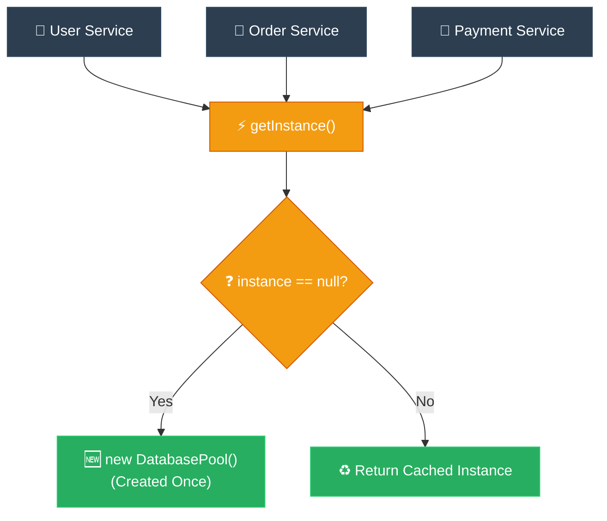

# Feynman Technique: Singleton (ការពន្យល់ពី Singleton ដោយគ្មានពាក្យបច្ចេកទេស)

**Author:** ichamrong  
**Date:** 2026-05-18  
**Tags:** #feynman-technique #simplification #design-patterns #singleton #clean-code  
**Category:** Concepts / Feynman Technique  
**Read Time:** ~5 min  

---

## 📌 មាតិកា (Table of Contents)
- [១. ការពន្យល់បែបសាមញ្ញបំផុត (The Child-Friendly Explanation)](#១-ការពន្យល់បែបសាមញ្ញបំផុត-the-child-friendly-explanation)
- [២. របៀបដែលវាដោះស្រាយបញ្ហា (How It Works)](#២-របៀបដែលវាដោះស្រាយបញ្ហា-how-it-works)
- [៣. ដ្យាក្រាមលំហូរ (Visual Flowchart)](#៣-ដ្យាក្រាមលំហូរ-visual-flowchart)
- [៤. Related Posts](#៤-related-posts)

---

## ១. ការពន្យល់បែបសាមញ្ញបំផុត (The Child-Friendly Explanation)

### English
Picture a bustling little town where no one thought to build a central clock. Instead, every single person relies on their own pocket watch. Over time, those watches slowly drift out of sync. When the mayor steps out and asks, 'Excuse me, what time is it?' fifty people shout back fifty completely different answers. It’s pure, frustrating chaos!

To restore peace and order, the town decides to build **one beautiful, towering clock** right in the heart of the town square. From that day on, personal watches are banned. If the baker, the teacher, or the mayor wants to know the time, they all look up at that exact same clock face. 

Suddenly, there is only **one source of truth**. The entire town breathes a sigh of relief, moving together in perfect, quiet synchronization.

In the world of coding, that reassuring clock tower is the **Singleton Pattern**. Instead of letting different pieces of your application confusingly create their own messy, separate copies of a vital resource (like a connection to your database), you gently enforce a rule: everyone must look at and share **exactly one instance** of that resource. No more confusion.

### Khmer
សាកស្រមៃមើលទីក្រុងដ៏អ៊ូអរមួយ ដែលគ្មាននរណាម្នាក់នឹកឃើញសាងសង់នាឡិកាកណ្តាលប្រចាំក្រុងទាល់តែសោះ។ ផ្ទុយទៅវិញ ប្រជាពលរដ្ឋម្នាក់ៗពឹងផ្អែកតែលើនាឡិកាហោប៉ៅរៀងៗខ្លួន។ យូរៗទៅ នាឡិកាទាំងនោះក៏ចាប់ផ្តើមដើរលឿន ឬយឺតខុសៗគ្នា។ ថ្ងៃមួយ នៅពេលដែលអភិបាលក្រុងដើរចេញមកក្រៅ ហើយសួរថា 'សូមទោស តើឥឡូវម៉ោងប៉ុន្មានហើយ?' មនុស្ស ៥០ នាក់ស្រែកឆ្លើយប្រាប់ម៉ោងខុសៗគ្នា ៥០ បែប។ វាពិតជាស្ថានភាពដ៏វឹកវរ និងគួរឱ្យឈឺក្បាលខ្លាំងណាស់!

ដើម្បីស្តារភាពស្ងប់ស្ងាត់ និងសណ្តាប់ធ្នាប់ឡើងវិញ ទីក្រុងក៏សម្រេចចិត្តសាងសង់ **ប៉មនាឡិកាដ៏ស្រស់ស្អាតនិងខ្ពស់ត្រដែតមួយ** នៅចំកណ្តាលបេះដូងនៃទីលានក្រុង។ ចាប់ពីថ្ងៃនោះមក គ្មាននរណាម្នាក់ត្រូវបានអនុញ្ញាតឱ្យប្រើនាឡិកាផ្ទាល់ខ្លួនទៀតទេ។ ទោះជាអ្នកដុតនំ គ្រូបង្រៀន ឬអភិបាលក្រុងក្តី ប្រសិនបើចង់ដឹងម៉ោង ពួកគេទាំងអស់គ្នាត្រូវតែងើបមុខសម្លឹងមើលទៅកាន់មុខនាឡិកាតែមួយគត់នោះ។

ភ្លាមៗនោះ ការពិតបានក្លាយជា **ប្រភពតែមួយគត់ (One source of truth)**។ អ្នកក្រុងទាំងមូលដកដង្ហើមធូរទ្រូង ហើយរស់នៅស្របពេលគ្នាយ៉ាងស្ងប់ស្ងាត់ និងល្អឥតខ្ចោះ។

នៅក្នុងពិភពនៃការសរសេរកូដ ប៉មនាឡិកាដែលផ្តល់ភាពកក់ក្តៅនោះហើយ គឺជា **Singleton Pattern**។ ជំនួសឱ្យការបណ្តោយឱ្យផ្នែកផ្សេងៗនៃកម្មវិធីរបស់អ្នកបង្កើតច្បាប់ចម្លងរញ៉េរញ៉ៃដាច់ដោយឡែកពីគ្នានូវធនធានដ៏សំខាន់ (ដូចជាការភ្ជាប់ទៅកាន់ Database ជាដើម) អ្នកគ្រាន់តែបង្កើតវិន័យដ៏ទន់ភ្លន់មួយ៖ គ្រប់គ្នាត្រូវតែសម្លឹងមើល និងប្រើប្រាស់ **Object តែមួយគត់រួមគ្នា**។ លែងមានភាពច្របូកច្របល់ទៀតហើយ។

---

## ២. របៀបដែលវាដោះស្រាយបញ្ហា (How It Works)

We prevent other parts of the application from calling the `new` operator by making the class constructor `private`. We then create a `private static` variable inside the class to hold the single instance of our object, and provide a `public static` method (usually named `getInstance()`) as the only doorway to access it. When code calls `getInstance()`, it checks if the single instance already exists. If not, it creates it once and saves it. If it does, it simply returns the saved one.

យើងការពារកុំឱ្យផ្នែកផ្សេងទៀតនៃកម្មវិធីហៅពាក្យគន្លឹះ `new` បាន ដោយការដាក់ Constructor របស់ Class ឱ្យទៅជា `private`។ បន្ទាប់មក យើងបង្កើតអថេរ `private static` មួយនៅក្នុង Class នោះដើម្បីរក្សាទុក Object តែមួយគត់នោះ ហើយផ្តល់នូវមុខងារ `public static` មួយ (ជាទូទៅឈ្មោះថា `getInstance()`) ជាច្រកទ្វារតែមួយគត់ដើម្បីចូលប្រើប្រាស់វា។ នៅពេលកូដផ្សេងទៀតហៅ `getInstance()` វានឹងពិនិត្យមើលថាតើ Object នោះត្រូវបានបង្កើតហើយឬនៅ។ បើមិនទាន់ទេ វានឹងបង្កើតម្តងគត់រួចរក្សាទុក ប៉ុន្តែបើមានរួចហើយ វានឹងហុច Object ដែលរក្សាទុកនោះមកវិញភ្លាមៗ។

---

## ៣. ដ្យាក្រាមលំហូរ (Visual Flowchart)

---

## ៤. Related Posts

### 🔗 Explore All Viewpoints:
* 📖 **Read the Parable:** [The Bank's Only Vault (ទូដែកតែមួយគត់របស់ធនាគារ)](../../parables/75-the-banks-only-vault.md) — Explains the emotional core of shared truth.
* 🧠 **Read the First Principles Derivation:** [MIT Professor Strategy: Singleton (គោលការណ៍គ្រឹះដំបូងនៃ Singleton)](../01-mit-professor/01-singleton.md) — Derives the pattern from fundamental computer axioms.
* 👶 **Read the Feynman Simplification:** [Feynman Technique: Singleton (ការពន្យល់ពី Singleton ដោយគ្មានពាក្យបច្ចេកទេស)](../02-feynman-technique/04-singleton.md) — Breaks it down using the central clock tower.
* 👦 **Read the ELI5 Metaphor:** [ELI5: Singleton (ម៉ាស៊ីនខួងខ្មៅដៃតែមួយគត់ក្នុងថ្នាក់រៀន)](../03-eli5/04-singleton.md) — Teaches it to a five-year-old using classroom pencil sharpeners.
* 🌉 **Read the Analogy Bridge:** [Analogy Bridge: Singleton (ស្ពានប្រៀបធៀបនៃប្រភពពិតតែមួយគត់)](../04-analogy-bridge/04-singleton.md) — Maps it to a hotel front desk and shows where physical limits fail compared to code threads.
* 🧐 **Read the Socratic Discovery:** [Socratic Method: Singleton (ការបង្កើតប្រព័ន្ធការពិតតែមួយគត់តាមវិធីសាស្ត្រសូក្រាត)](../05-socratic-method/04-singleton.md) — Guide your self-discovery through mentor-student dialogue.
* 📰 **Read the Journalist Summary:** [Journalist: Singleton (ការធានាឱ្យមានការពិតតែមួយគត់ក្នុងប្រព័ន្ធទាំងមូល)](../06-journalist-inverted-pyramid/04-singleton.md) — Get the high-impact lede, volatile visibility, and thread-safety details first.
* 🎭 **Read the Storyteller Narrative:** [Storyteller: Singleton (អាណាព្យាបាលនៃសេចក្តីពិត និងកងទ័ពក្លូនបង្កចលាចល)](../07-storyteller-narrative-arc/04-singleton.md) — Follow Kiri's heroic journey to vanquish the duplicate logger clone army.
* ⚙️ **Read the Engineer Spec:** [Engineer: Singleton (ការសម្របសម្រួលប្រភពពិតតែមួយគត់ និងទប់ស្កាត់ការខ្ជះខ្ជាយធនធាន)](../08-engineer-requirements-constraints-solution/03-singleton.md) — Read the rigorous engineering specification, DCL performance details, and candidate elimination.
* 📊 **Read the Pros & Cons:** [Pros & Cons Compared: Singleton (ការប្រៀបធៀបគុណសម្បត្តិ និងគុណវិបត្តិនៃ Singleton)](../09-pros-and-cons-compared/01-singleton.md) — Full trade-off analysis and decision matrix.
* 🛠️ **Read the Code Implementation:** [Creational Patterns: The Art of Instantiation](../../../clean-code/design-patterns/01-creational-patterns.md#the-singleton) — Production-grade Java with double-checked locking and thread safety.
