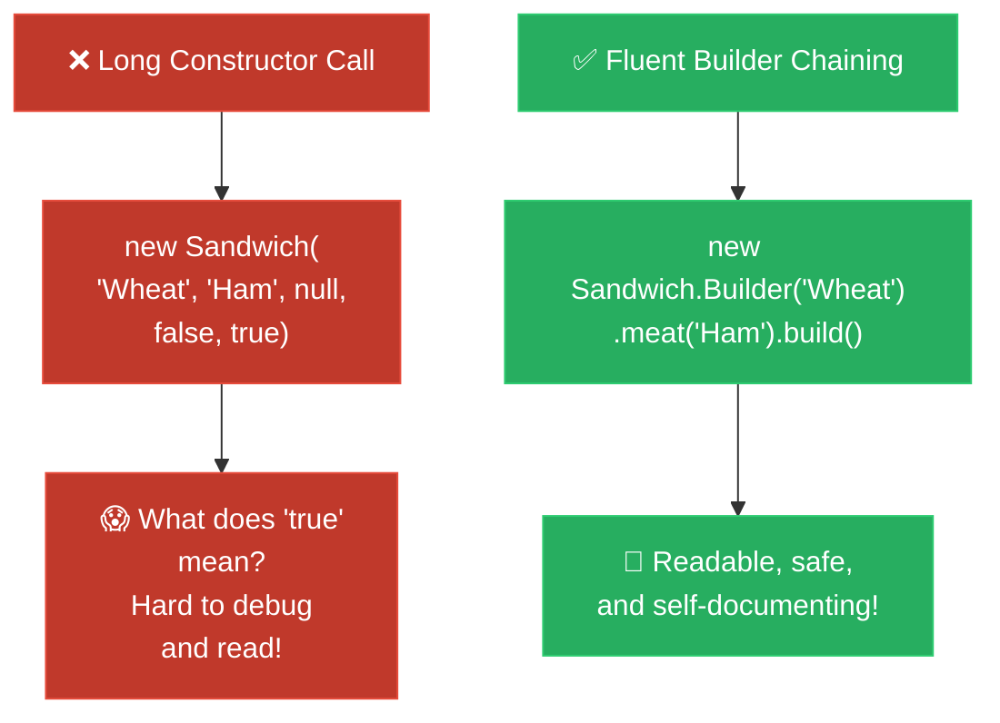

# Feynman Technique: Builder (ការពន្យល់ពី Builder ដោយគ្មានពាក្យបច្ចេកទេស)

**Author:** ichamrong  
**Date:** 2026-05-18  
**Tags:** #feynman-technique #simplicity #design-patterns #builder #clean-code  
**Category:** Concepts / Feynman Technique  
**Read Time:** ~6 min  

---

## 📌 មាតិកា (Table of Contents)
- [សេចក្តីផ្តើម (Introduction)](#សេចក្តីផ្តើម-introduction)
- [ការពន្យល់ជាភាសាអង់គ្លេស (English Explanation)](#ការពន្យល់ជាភាសាអង់គ្លេស-english-explanation)
- [ការពន្យល់ជាភាសាខ្មែរ (Khmer Explanation)](#ការពន្យល់ជាភាសាខ្មែរ-khmer-explanation)
- [ដ្យាក្រាមលំហូរ (Visual Flowchart)](#ដ្យាក្រាមលំហូរ-visual-flowchart)
- [Related Posts](#related-posts)

---

## សេចក្តីផ្តើម (Introduction)

The core principle of the **Feynman Technique** is to teach a complex concept using extremely simple language and analogies, completely avoiding confusing jargon. If you cannot explain it to a beginner, you do not truly understand it yourself.

គោលការណ៍គ្រឹះនៃវិធីសាស្ត្រ **Feynman Technique** គឺការបង្រៀន ឬពន្យល់អំពីគោលគំនិតដែលស្មុគស្មាញ ដោយប្រើប្រាស់ភាសាសាមញ្ញបំផុត និងការប្រៀបធៀបដែលងាយយល់ ដោយចៀសវាងការប្រើពាក្យបច្ចេកទេសស្មុគស្មាញ។ ប្រសិនបើអ្នកមិនអាចពន្យល់វាឱ្យអ្នកទើបតែរៀនយល់បានទេ នោះមានន័យថាអ្នកខ្លួនឯងក៏មិនទាន់យល់វាច្បាស់លាស់ដែរ។

---

## ការពន្យល់ជាភាសាអង់គ្លេស (English Explanation)

### The Problem: The 47-Question Waiter
Picture yourself walking into a cozy little sandwich shop, but the waiter standing there is incredibly strict and exhausting. Before you can even sit down, he points a pen at you and angrily demands that you answer **47 very specific questions** in an exact, unbroken order: 
*'Which bread? Which meat? Which cheese? Which sauce? Lettuce? Tomatoes? Pickles? Salt? Pepper?...'*

It’s completely overwhelming! Even if all you wanted was a simple ham and cheese sandwich, you are forced to stand there and say 'No' 45 separate times to things you never even wanted. Worse yet, if you stumble and skip question 34 by accident, the entire order collapses—you might end up eating a bread full of mustard with no meat at all.

In the programming world, we call this exhausting nightmare a **Telescoping Constructor**. Looking at code like `new Sandwich("Wheat", "Ham", "Swiss", null, false, false, true, false, ...)`, it feels like reading a secret code. No human being can tell what those random `true` and `false` values mean without digging through a massive manual.

### The Solution: The Friendly Checklist (Builder)
Now imagine walking into a much kinder, smarter sandwich shop. The staff greets you warmly and simply hands you a cute, easy-to-read **Checklist** on a small slip of paper.
1. The paper already has a perfectly normal, delicious standard sandwich filled out for you.
2. If you want a little extra cheese, you just peacefully check the box that says 'Cheese'. You ignore the rest.
3. Finally, you smile and hand the paper to the chef (in code, we call this `.build()`).

In programming, this checklist is the **Builder Pattern**. You create the object step-by-step, setting only what you care about, and then tell the system to build it:
```java
Sandwich sandwich = new Sandwich.Builder("Wheat") // Required bread
    .meat("Ham")                                  // Add optional ham
    .cheese("Swiss")                              // Add optional cheese
    .build();                                     // materializes the sandwich
```
It’s easy to read, impossible to mix up the order of ingredients, and you get exactly what you ordered every time.

---

## ការពន្យល់ជាភាសាខ្មែរ (Khmer Explanation)

### បញ្ហា៖ អ្នករត់តុដែលសួរដេញដោល ៤៧ សំណួរ
សាកស្រមៃថា អ្នកកំពុងដើរចូលទៅកាន់ហាងសាំងវិចដ៏កក់ក្តៅមួយ ប៉ុន្តែអ្នករត់តុដែលឈរនៅទីនោះ បែរជាមានភាពតឹងរ៉ឹងនិងធ្វើឱ្យអ្នកហត់នឿយយ៉ាងខ្លាំង។ មុនពេលដែលអ្នកអាចអង្គុយចុះបាន គាត់ចង្អុលប៊ិចមករកអ្នក ហើយបង្គាប់ឱ្យអ្នកឆ្លើយសំណួរយ៉ាងលម្អិតដល់ទៅ **៤៧ សំណួរ** តាមលំដាប់លំដោយដែលមិនអាចរំលងបាន៖
*«យកនំប៉័ងអ្វី? សាច់អ្វី? ឈីសអ្វី? ទឹកជ្រលក់អ្វី? ដាក់សាឡាត់ទេ? ប៉េងប៉ោះ? ត្រសក់ត្រាំ? អំបិល? ម្រេច?...»*

វាពិតជាគួរឱ្យថប់ដង្ហើមខ្លាំងណាស់! សូម្បីតែអ្នកគ្រាន់តែចង់បានសាំងវិចសាច់ហេមនិងឈីសដ៏សាមញ្ញមួយក៏ដោយ ក៏អ្នកត្រូវបង្ខំចិត្តឈរនៅទីនោះ រួចនិយាយពាក្យ 'ទេ' ដដែលៗ ៤៥ ដង សម្រាប់អ្វីដែលអ្នកមិនធ្លាប់ចង់បានសោះ។ អ្វីដែលកាន់តែអាក្រក់ ប្រសិនបើអ្នកនិយាយរអាក់រអួល ហើយរំលងសំណួរទី ៣៤ ដោយចៃដន្យ នោះការបញ្ជាទិញទាំងមូលនឹងរលាយវិនាស — អ្នកអាចនឹងទទួលបាននំប៉័ងប្រឡាក់ពេញដោយទឹកម៉ាស្ដាត តែគ្មានសាច់សូម្បីមួយបន្ទះ។

នៅក្នុងពិភពសរសេរកម្មវិធី យើងហៅសុបិន្តអាក្រក់ដ៏គួរឱ្យហត់នឿយនេះថា **Telescoping Constructor**។ នៅពេលសម្លឹងមើលកូដដូចជា `new Sandwich("Wheat", "Ham", "Swiss", null, false, false, true, false, ...)` វាមានអារម្មណ៍ដូចជាកំពុងអានកូដសម្ងាត់អញ្ចឹង។ គ្មានមនុស្សណាម្នាក់អាចប្រាប់បានទេថា តើតម្លៃ `true` និង `false` ទាំងនោះមានន័យយ៉ាងណា បើមិនបើកសៀវភៅណែនាំក្រាស់ឃ្មឹកមើលសិននោះ។

### ដំណោះស្រាយ៖ ក្រដាសបញ្ជីជម្រើសដ៏រាក់ទាក់ (Builder)
ឥឡូវនេះ សាកស្រមៃម្តងទៀតថា អ្នកកំពុងដើរចូលទៅកាន់ហាងសាំងវិចមួយទៀតដែលឆ្លាតវៃ និងរួសរាយជាងមុនឆ្ងាយណាស់។ បុគ្គលិកស្វាគមន៍អ្នកយ៉ាងកក់ក្តៅ រួចហុច **ក្រដាសបញ្ជីជម្រើស (Checklist)** តូចមួយដែលងាយស្រួលអានបំផុតមកឱ្យអ្នក។
១. នៅលើក្រដាសនោះ មានជម្រើសសាំងវិចស្តង់ដារដ៏ឈ្ងុយឆ្ងាញ់ ដែលបានបំពេញរួចជាស្រេចសម្រាប់អ្នក។
២. ប្រសិនបើអ្នកគ្រាន់តែចង់បន្ថែមឈីសបន្តិចបន្តួច អ្នកគ្រាន់តែគូសធីកយ៉ាងស្ងប់ស្ងាត់នៅលើប្រអប់ដែលមានពាក្យថា 'ឈីស' ជាការស្រេច។ ចំណុចផ្សេងទៀត អ្នកអាចមើលរំលងបានទាំងអស់។
៣. ចុងក្រោយ អ្នកញញឹម ហើយហុចក្រដាសនោះទៅឱ្យចុងភៅ (នៅក្នុងកូដ យើងហៅសកម្មភាពនេះថា `.build()`)។

នៅក្នុងការសរសេរកម្មវិធី ក្រដាសបញ្ជីជម្រើសនេះហើយគឺជា **Builder Pattern**។ អ្នកបង្កើត Object ជាជំហានៗ ដោយកំណត់តែអ្វីដែលអ្នកចង់បាន រួចប្រាប់ប្រព័ន្ធឱ្យបង្កើតវា៖
```java
Sandwich sandwich = new Sandwich.Builder("Wheat") // នំប៉័ងដែលតម្រូវឱ្យមាន
    .meat("Ham")                                  // បន្ថែមសាច់
    .cheese("Swiss")                              // បន្ថែមឈីស
    .build();                                     // បង្កើតសាំងវិចជាស្ថាពរ
```
វាមានភាពងាយស្រួលអាន មិនអាចច្រឡំលំដាប់ធាតុផ្សំឡើយ ហើយអ្នកទទួលបានសាំងវិចត្រឹមត្រូវឥតខ្ចោះរាល់ពេល។

---

## ដ្យាក្រាមលំហូរ (Visual Flowchart)



---

## Related Posts

### 🔗 Explore All Viewpoints:
* 📖 **Read the Parable:** [The 47-Question Waiter (អ្នករត់តុសួរ ៤៧ សំណួរ)](../../parables/76-the-overwhelmed-sandwich-shop.md) — The emotional story of a chaotic customer experience.
* 🧠 **Read the First Principles Derivation:** [MIT Professor Strategy: Builder (គោលការណ៍គ្រឹះដំបូងនៃ Builder)](../01-mit-professor/04-builder.md) — Derives the pattern from stack frame layouts and thread safety laws.
* 👶 **Read the Feynman Simplification:** [Feynman Technique: Builder (ការពន្យល់ពី Builder ដោយគ្មានពាក្យបច្ចេកទេស)](../02-feynman-technique/05-builder.md) — Breaks it down using a simple cafe menu checklist.
* 👦 **Read the ELI5 Metaphor:** [ELI5: Builder (ការពន្យល់ពី Builder ដូចក្មេងអាយុ ៥ ឆ្នាំ)](../03-eli5/05-builder.md) — Teaches a five-year-old using Lego spaceship construction books.
* 🌉 **Read the Analogy Bridge:** [Analogy Bridge: Builder (ស្ពានប្រៀបធៀបនៃ Builder)](../04-analogy-bridge/05-builder.md) — Maps real sandwich ticks to fluent Java methods, outlining physical limitations.
* 🧐 **Read the Socratic Discovery:** [Socratic Method: Builder (ការបង្កើត Object ស្មុគស្មាញតាមវិធីសាស្ត្រសូក្រាត)](../05-socratic-method/05-builder.md) — Probes yourself via a mentor-student constructor debate.
* 📰 **Read the Journalist Summary:** [Journalist: Builder (ការបង្កើត Object ស្មុគស្មាញជាជំហានៗ)](../06-journalist-inverted-pyramid/05-builder.md) — Quick news lede, telescoping prevention, and step-by-step assembly validation.
* 🎭 **Read the Storyteller Narrative:** [Storyteller: Builder (វីរបុរស Builder និងសង្គ្រាមប៉ារ៉ាម៉ែត្ររញ៉េរញ៉ៃ)](../07-storyteller-narrative-arc/05-builder.md) — Sopheap's battle against a production parameter bomb catastrophe on Black Friday.
* ⚙️ **Read the Engineer Spec:** [Engineer: Builder (ការបង្កើត Object ស្មុគស្មាញជាជំហានៗ)](../08-engineer-requirements-constraints-solution/01-builder.md) — Read the formal engineering requirements and candidate evaluation table.
* 📊 **Read the Pros & Cons:** [Pros & Cons Compared: Builder (ការប្រៀបធៀបគុណសម្បត្តិ និងគុណវិបត្តិនៃ Builder)](../09-pros-and-cons-compared/02-builder.md) — Full trade-off analysis and decision matrix.
* 🛠️ **Read the Code Implementation:** [Creational Patterns: The Art of Instantiation](../../../clean-code/design-patterns/01-creational-patterns.md#the-builder) — Production-grade Java with fluent chaining and immutable object construction.
