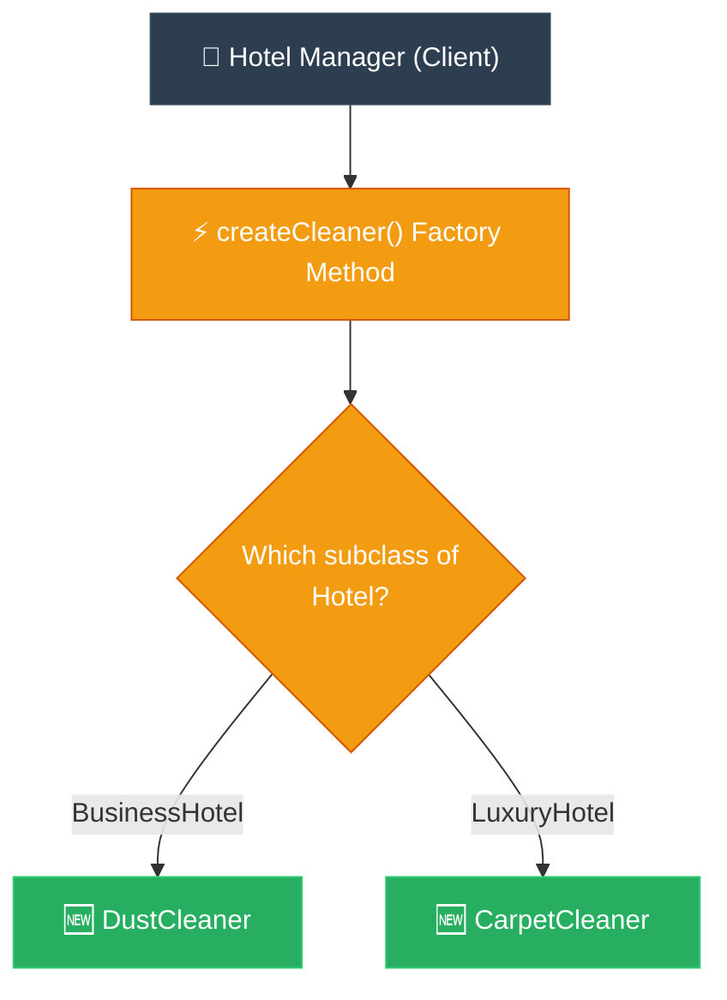

# Feynman Technique: Factory Method (ការពន្យល់ពី Factory Method ដោយគ្មានពាក្យបច្ចេកទេស)

**Author:** ichamrong  
**Date:** 2026-05-18  
**Tags:** #feynman-technique #simplification #design-patterns #factory-method #clean-code  
**Category:** Concepts / Feynman Technique  
**Read Time:** ~5 min  

---

## 📌 មាតិកា (Table of Contents)
- [១. ការពន្យល់បែបសាមញ្ញបំផុត (The Child-Friendly Explanation)](#១-ការពន្យល់បែបសាមញ្ញបំផុត-the-child-friendly-explanation)
- [២. របៀបដែលវាដោះស្រាយបញ្ហា (How It Works)](#២-របៀបដែលវាដោះស្រាយបញ្ហា-how-it-works)
- [៣. ដ្យាក្រាមលំហូរ (Visual Flowchart)](#៣-ដ្យាក្រាមលំហូរ-visual-flowchart)
- [៤. Related Posts](#៤-related-posts)

---

## ១. ការពន្យល់បែបសាមញ្ញបំផុត (The Child-Friendly Explanation)

### English
Imagine you are the proud manager of a beautiful, giant hotel. Every single morning, the rooms must be perfectly cleaned for the new guests. To get this done, you desperately need **workers**. The problem? You have no idea what kind of mess is waiting behind each door. One room might just need a light dusting, another might have a wine stain needing a deep carpet wash, and another might need someone dangling outside to clean the windows.

If you, the hardworking manager, tried to personally find, hire, and train every single specific type of cleaner, you would collapse from exhaustion. You’d have to memorize which chemicals the carpet washers use, and how to safely tie ropes for the window cleaners. It’s too much!

So, to save your sanity, you establish a brilliant new rule: **"I will partner with a trusted Recruitment Agency."** Now, you simply pick up the phone and say, *"Please send me someone who knows how to clean."*

You don't have to stress about *how* the agency trains them or exactly *who* walks through the door. The agency looks at the situation and decides perfectly which specialist to send. When the worker arrives, you just smile, point at the room, and say `clean()`. The magic happens, and your hotel sparkles.

In programming, this huge sigh of relief is the **Factory Method Pattern**. Your main code (the hotel manager) stops using the `new` keyword to manually create every single object. Instead, it gently hands that stressful responsibility over to a helper method (the recruitment agency).

### Khmer
ស្រមៃថា អ្នកគឺជាអ្នកគ្រប់គ្រងដ៏មានមោទនភាពម្នាក់ នៃសណ្ឋាគារយក្សដ៏ស្រស់ស្អាតមួយ។ ជារៀងរាល់ព្រឹកព្រលឹម បន្ទប់ទាំងអស់ត្រូវតែសម្អាតយ៉ាងល្អឥតខ្ចោះសម្រាប់ភ្ញៀវថ្មី។ ដើម្បីធ្វើការងារនេះបាន អ្នកពិតជាត្រូវការ **បុគ្គលិក** យ៉ាងខ្លាំង។ ប៉ុន្តែបញ្ហានៅត្រង់ថា អ្នកមិនអាចដឹងមុនទាល់តែសោះថា មានភាពកខ្វក់ប្រភេទណាកំពុងរង់ចាំនៅក្រោយទ្វារនីមួយៗ។ បន្ទប់ខ្លះប្រហែលជាត្រូវការត្រឹមតែការជូតធូលីស្រាលៗ ចំណែកបន្ទប់មួយទៀតអាចមានប្រឡាក់ស្នាមស្រា ដែលទាមទារការបោកកម្រាលព្រំយ៉ាងជ្រៅ ហើយបន្ទប់មួយផ្សេងទៀតអាចនឹងត្រូវការអ្នកពាក់ខ្សែពួរចុះពីលើដំបូលដើម្បីជូតកញ្ចក់បង្អួច។

ប្រសិនបើអ្នក ដែលជាអ្នកគ្រប់គ្រងដ៏នឿយហត់ ព្យាយាមដើររក ជួល និងបណ្តុះបណ្តាលអ្នកសម្អាតគ្រប់ប្រភេទទាំងអស់ដោយផ្ទាល់ដៃ អ្នកច្បាស់ជាដួលសន្លប់ដោយសារភាពហត់នឿយជាមិនខាន។ អ្នកនឹងត្រូវចងចាំថាតើអ្នកបោកកម្រាលព្រំប្រើសារធាតុគីមីអ្វីខ្លះ ហើយត្រូវចងខ្សែពួរសុវត្ថិភាពយ៉ាងម៉េចសម្រាប់អ្នកជូតបង្អួច។ វាពិតជាបន្ទុកដ៏ធ្ងន់ធ្ងរពេកហើយ!

ដូច្នេះ ដើម្បីសង្គ្រោះសុខភាពផ្លូវចិត្តរបស់អ្នក អ្នកក៏បានបង្កើតច្បាប់ដ៏ឆ្លាតវៃថ្មីមួយ៖ **«ខ្ញុំនឹងសហការជាមួយទីភ្នាក់ងារជ្រើសរើសបុគ្គលិកដែលគួរឱ្យទុកចិត្តមួយ»**។ ឥឡូវនេះ អ្នកគ្រាន់តែលើកទូរស័ព្ទ រួចនិយាយយ៉ាងសាមញ្ញថា៖ *«សូមជួយបញ្ជូននរណាម្នាក់ដែលចេះសម្អាតមកឱ្យខ្ញុំផង»*។

អ្នកលែងត្រូវឈឺក្បាលខ្វាយខ្វល់ថា តើទីភ្នាក់ងារនោះបណ្តុះបណ្តាលពួកគេដោយរបៀបណា ឬបញ្ជូនអ្នកណាឱ្យដើរចូលមកតាមទ្វារនោះទេ។ ទីភ្នាក់ងារនឹងពិនិត្យមើលស្ថានភាព រួចសម្រេចចិត្តយ៉ាងត្រឹមត្រូវបំផុតថាត្រូវបញ្ជូនអ្នកជំនាញមួយណា។ នៅពេលបុគ្គលិកនោះមកដល់ អ្នកគ្រាន់តែញញឹម ចង្អុលទៅបន្ទប់ រួចប្រាប់ឱ្យ «សម្អាត!» ( `clean()` )។ ភាពអស្ចារ្យនឹងកើតឡើង ហើយសណ្ឋាគាររបស់អ្នកនឹងភ្លឺចែងចាំងឡើងវិញ។

នៅក្នុងការសរសេរកូដ ការដកដង្ហើមធូរទ្រូងដ៏ធំនេះហើយ គឺជា **Factory Method Pattern**។ កូដចម្បងរបស់អ្នក (អ្នកគ្រប់គ្រងសណ្ឋាគារ) ឈប់ប្រើប្រាស់ពាក្យគន្លឹះ `new` ដើម្បីបង្កើត Object ម្តងមួយៗដោយផ្ទាល់ដៃទៀតហើយ។ ផ្ទុយទៅវិញ វាបានផ្ទេរបន្ទុកដ៏តានតឹងនោះយ៉ាងទន់ភ្លន់ ទៅឱ្យ Method ជំនួយមួយ (ទីភ្នាក់ងារជ្រើសរើសបុគ្គលិក) ជាអ្នកចាត់ចែងជំនួសវិញ។

---

## ២. របៀបដែលវាដោះស្រាយបញ្ហា (How It Works)

We define an abstract class or interface for the product (`Cleaner`). We then create an abstract creator class (`Hotel`) which defines the factory method (`createCleaner()`). Subclasses of the creator (`BusinessHotel`, `LuxuryHotel`) override this factory method to return different concrete subclasses of the product (`DustCleaner`, `CarpetCleaner`). The client code talks exclusively to the abstract creator and abstract product, keeping them completely decoupled.

យើងកំណត់ abstract class ឬ interface សម្រាប់ផលិតផល (`Cleaner`)។ បន្ទាប់មកយើងបង្កើត abstract creator class (`Hotel`) ដែលកំណត់ factory method (`createCleaner()`)។ Subclasses របស់ creator (`BusinessHotel`, `LuxuryHotel`) នឹងសរសេរលុបលើ (override) factory method នេះ ដើម្បីហុចមកវិញនូវ concrete subclasses ផ្សេងគ្នានៃផលិតផល (`DustCleaner`, `CarpetCleaner`)។ កូនកូដ (Client) ប្រស្រ័យទាក់ទងតែជាមួយ abstract creator និង abstract product ប៉ុណ្ណោះ ដែលធ្វើឱ្យពួកវាដាច់ចេញពីគ្នាទាំងស្រុង (Decoupled)។

---

## ៣. ដ្យាក្រាមលំហូរ (Visual Flowchart)

---

## ៤. Related Posts

### 🔗 Explore All Viewpoints:
* 📖 **Read the Parable:** [The CEO and the Regional Managers (នាយកប្រតិបត្តិ និងអ្នកគ្រប់គ្រងតំបន់)](../../parables/77-the-ceo-and-regional-managers.md) — The emotional core of delegating local decisions.
* 🧠 **Read the First Principles Derivation:** [MIT Professor Strategy: Factory Method (គោលការណ៍គ្រឹះដំបូងនៃ Factory Method)](../01-mit-professor/02-factory-method.md) — Derives the pattern step-by-step from base interface dependency laws.
* 👶 **Read the Feynman Simplification:** [Feynman Technique: Factory Method (ការពន្យល់ពី Factory Method ដោយគ្មានពាក្យបច្ចេកទេស)](../02-feynman-technique/06-factory-method.md) — Breaks it down using the hotel cleaner recruitment agency.
* 👦 **Read the ELI5 Metaphor:** [ELI5: Factory Method (ការពន្យល់ពី Factory Method ដូចក្មេងអាយុ ៥ ឆ្នាំ)](../03-eli5/06-factory-method.md) — Teaches a five-year-old using the magic toy machine slot.
* 🌉 **Read the Analogy Bridge:** [Analogy Bridge: Factory Method (ស្ពានប្រៀបធៀបនៃ Factory Method)](../04-analogy-bridge/06-factory-method.md) — Maps regional postal transport hubs to virtual methods, outlining physical limitations.
* 🧐 **Read the Socratic Discovery:** [Socratic Method: Factory Method (ការបង្កើត Object តាមតម្រូវការយឺតយ៉ាវតាមវិធីសាស្ត្រសូក្រាត)](../05-socratic-method/06-factory-method.md) — Socrates guides your discovery out of switch block coupling.
* 📰 **Read the Journalist Summary:** [Journalist: Factory Method (ការបំបែកកូដបង្កើត Object ឱ្យមានសេរីភាពសម្រេចចិត្តលើ Subclass)](../06-journalist-inverted-pyramid/06-factory-method.md) — High-impact news lede, OCP compliance, and SRP isolation details first.
* 🎭 **Read the Storyteller Narrative:** [Storyteller: Factory Method (វីរបុរស Factory Method និងការដោះលែងប្រព័ន្ធផ្ញើសារពីរនរក switch)](../07-storyteller-narrative-arc/06-factory-method.md) — Junior developer Dara's battle to vanquish the switch statement monster on Black Friday.
* ⚙️ **Read the Engineer Spec:** [Engineer: Factory Method (ការបំបែកកូដបង្កើត Object តាមរយៈការវាយតម្លៃតម្រូវការ និងឧបសគ្គកំណត់)](../08-engineer-requirements-constraints-solution/04-factory-method.md) — Technical requirements, ADR candidate matrix, and SLA evaluation.
* 📊 **Read the Pros & Cons:** [Pros & Cons Compared: Factory Method (ការប្រៀបធៀបគុណសម្បត្តិ និងគុណវិបត្តិនៃ Factory Method)](../09-pros-and-cons-compared/03-factory-method.md) — Full trade-off analysis and decision matrix.
* 🛠️ **Read the Code Implementation:** [Creational Patterns: The Art of Instantiation](../../../clean-code/design-patterns/01-creational-patterns.md#the-factory-method) — Production-grade Java with subclass dispatch and Open/Closed Principle.
