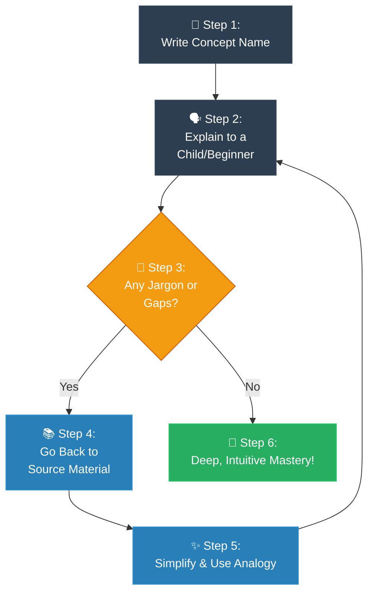

# Strategy 02: The Feynman Technique (បច្ចេកទេសហ្វាយម៉ាន)

**Author:** ichamrong  
**Date:** 2026-05-18  
**Tags:** #explanation-strategies #feynman-technique #simplification #learning  
**Category:** Concepts / Explanation Strategies  
**Read Time:** ~5 min  

---

## 📌 មាតិកា (Table of Contents)
- [សេចក្តីផ្តើម (Introduction)](#សេចក្តីផ្តើម-introduction)
- [រូបមន្តនៃការដោះស្រាយ (The Formula)](#រូបមន្តនៃការដោះស្រាយ-the-formula)
- [ដ្យាក្រាមលំហូរ (Visual Flowchart)](#ដ្យាក្រាមលំហូរ-visual-flowchart)
- [ឧទាហរណ៍ជាក់ស្តែង៖ ការពន្យល់ពី Recursion (Practical Example)](#ឧទាហរណ៍ជាក់ស្តែង-ការពន្យល់ពី-recursion-practical-example)
- [មេរៀន និងដែនកំណត់ (When to Use & Limitations)](#មេរៀន-និងដែនកំណត់-when-to-use-limitations)

---

## សេចក្តីផ្តើម (Introduction)

The **Feynman Technique** is lovingly named after the brilliant, Nobel Prize-winning physicist Richard Feynman, a man who believed that true genius lies in simplicity. The core philosophy is incredibly humbling: **if you cannot explain a complex idea in simple, everyday words to a beginner, you simply do not understand it well enough yet.** This isn’t just a teaching tool; it is a beautiful, powerful mirror that reveals the hidden gaps in our own knowledge. It challenges us to strip away the intimidating, robotic jargon and gently translate it into a deep, intuitive clarity that anyone can connect with.

យុទ្ធសាស្ត្រ **Feynman Technique (បច្ចេកទេសហ្វាយម៉ាន)** ត្រូវបានដាក់ឈ្មោះដោយក្តីគោរពតាមលោក Richard Feynman អ្នករូបវិទ្យាដ៏ឈ្លាសវៃម្ចាស់រង្វាន់ណូបែល ដែលតែងតែជឿជាក់ថាភាពវៃឆ្លាតពិតប្រាកដគឺស្ថិតនៅលើភាពសាមញ្ញ។ ទស្សនវិជ្ជាស្នូលរបស់វាគឺពិតជាចាក់ដោតខ្លាំងណាស់៖ **ប្រសិនបើអ្នកមិនអាចពន្យល់គំនិតដ៏ស្មុគស្មាញមួយ ដោយប្រើប្រាស់ពាក្យពេចន៍សាមញ្ញប្រចាំថ្ងៃទៅកាន់អ្នកទើបចាប់ផ្តើមរៀនបានទេ នោះមានន័យថាអ្នកគ្រាន់តែមិនទាន់យល់វាច្បាស់លាស់គ្រប់គ្រាន់នៅឡើយ។** វាមិនត្រឹមតែជាវិធីសាស្ត្របង្រៀនប៉ុណ្ណោះទេ តែវាប្រៀបដូចជាកញ្ចក់ដ៏មានឥទ្ធិពល និងស្រស់ស្អាតមួយ ដែលជួយឆ្លុះបញ្ចាំងឱ្យឃើញពីចន្លោះប្រហោងដែលលាក់កំបាំងនៅក្នុងចំណេះដឹងរបស់យើង។ វាជំរុញឱ្យយើងលះបង់ចោលនូវពាក្យបច្ចេកទេសរឹងឆ្អឹង គួរឱ្យខ្លាច ហើយបំប្លែងពួកវាយ៉ាងទន់ភ្លន់ទៅជាការយល់ដឹងដ៏ស៊ីជម្រៅ ដែលនរណាក៏អាចមានអារម្មណ៍ផ្សារភ្ជាប់ និងងាយយល់បានដែរ។

---

## រូបមន្តនៃការដោះស្រាយ (The Formula)

```
1. Write the CONCEPT NAME at the top of a blank page.
2. Explain it as if teaching a complete beginner (out loud or in writing).
3. Identify GAPS in your explanation (places where you get stuck or use jargon).
4. Go back to the source material to fill those exact gaps.
5. Simplify the language, using everyday analogies instead of professional terms.
6. Repeat until you can explain the concept with absolute simplicity.
```

---

## ដ្យាក្រាមលំហូរ (Visual Flowchart)



---

## ឧទាហរណ៍ជាក់ស្តែង៖ ការពន្យល់ពី Recursion (Practical Example)

### The Jargon-Free Explanation (English)
> *"What exactly is Recursion? The textbooks say 'it's a function that calls itself.' But what does that actually feel like? Imagine you’re desperately searching for your house keys. You check your big coat pocket. Not there. You grab your backpack and look inside. Inside the backpack, you find a smaller pouch. You open the pouch, and inside that, there's an even tinier zipped pocket. You keep gently diving deeper and deeper into these hidden spaces until you either joyfully find your keys, or you finally run out of pockets to check. Recursion is exactly that beautiful, repetitive search—it’s simply a piece of code taking a deep breath and asking, 'Can I solve this right now? No? Okay, let me make the problem just a little bit smaller, and ask myself again.'"* 

### ការពន្យល់បែបហ្វាយម៉ាន (Khmer)
> *«តើអ្វីទៅជា Recursion ឱ្យប្រាកដ? សៀវភៅពុម្ពតែងតែប្រាប់ថា 'វាជាមុខងារដែលហៅខ្លួនឯង។' ប៉ុន្តែតើអារម្មណ៍ពិតរបស់វាជាអ្វីទៅ? សាកស្រមៃថា អ្នកកំពុងស្វែងរកសោផ្ទះយ៉ាងតក់ក្រហល់។ អ្នកលូកឆែកមើលហោប៉ៅអាវធំ — គ្មានទេ។ អ្នកក៏ទាញកាបូបស្ពាយមកបើកមើល។ នៅក្នុងកាបូបស្ពាយនោះ អ្នកឃើញមានកាបូបតូចមួយទៀត។ អ្នកបើកកាបូបតូចនោះ ហើយនៅខាងក្នុងនោះ បែរជាមានហោប៉ៅរូតតូចមួយទៀត។ អ្នកនៅតែបន្តមុជចូលកាន់តែជ្រៅទៅៗ ទៅក្នុងចន្លោះកំបាំងទាំងនោះដោយការអត់ធ្មត់ រហូតទាល់តែអ្នករកឃើញសោដោយក្តីត្រេកអរ ឬក៏អស់ហោប៉ៅដែលត្រូវឆែក។ Recursion គឺជាការស្វែងរកដ៏ស្រស់ស្អាតនិងដដែលៗនោះឯង — វាគ្រាន់តែជាកូដមួយដុំដែលដកដង្ហើមធំ រួចសួរខ្លួនឯងថា 'តើខ្ញុំអាចដោះស្រាយរឿងនេះភ្លាមៗនៅពេលនេះបានទេ? បើមិនបានទេ មិនអីទេ ទុកឱ្យខ្ញុំបំបែកបញ្ហានេះឱ្យតូចជាងមុនបន្តិច រួចសួរខ្លួនឯងម្តងទៀតចុះ។'»*

---

## មេរៀន និងដែនកំណត់ (When to Use & Limitations)

### 📈 Best For (សាកសមបំផុតសម្រាប់)
* **Self-Study & Learning:** Perfect for mastering highly complex algorithm design or design patterns.
* **Mentoring & Teaching:** Preparing presentations or training sessions for juniors.
* **Code Reviews:** Explaining *why* a particular piece of logic is refactored into a simpler shape.

### ⚠️ Limitations (ដែនកំណត់)
* **Takes Time:** You must actively stop, research, and rewrite until it is perfect.
* **Requires Honesty:** You must be willing to admit what you *don't* know.
* **Metaphor Safety:** Sometimes, extreme simplification can slightly distort edge cases (e.g., forgetting the "base case" in recursion).

---

---

## 📚 Implemented Patterns (គំរូស្ថាបត្យកម្មដែលបានអនុវត្ត)

Here are the design patterns explained with childlike clarity using the **Feynman Technique**:

* **[01. Prototype (ការថតចម្លងគំរូកូដដោយសាមញ្ញ)](./01-prototype.md)** — Explains Prototype as a dragon drawing photocopy machine, bypassing expensive drawing time (instantiation/DB query time).
* **[02. Flyweight (ការសន្សំសំចៃមេម៉ូរីដោយការចែករំលែកទិន្នន័យ)](./02-flyweight.md)** — Explains Flyweight as a game forest with 1,000,000 trees, sharing one 3D model (intrinsic state) while saving unique coordinates (extrinsic state) in separate pointers.
* **[03. Interpreter (ការបកប្រែភាសា និងកូដបញ្ជាដោយសាមញ្ញ)](./03-interpreter.md)** — Explains Interpreter as a robot dog's secret whistle brain, breaking whistle sequences down into sit, run, and eat commands.
* **[04. Singleton (ការពន្យល់ពី Singleton ដោយគ្មានពាក្យបច្ចេកទេស)](./04-singleton.md)** — Explains Singleton as a town hall's central clock tower, establishing a single source of truth for all citizens.
* **[05. Builder (ការពន្យល់ពី Builder ដោយគ្មានពាក្យបច្ចេកទេស)](./05-builder.md)** — Explains Builder as a custom sandwich ordering paper checklist, preventing waitstaff from asking 47 confusing questions.
* **[06. Factory Method (ការពន្យល់ពី Factory Method ដោយគ្មានពាក្យបច្ចេកទេស)](./06-factory-method.md)** — Explains Factory Method as a general hotel cleaner recruitment agency, delegating specific tasks to specialized cleaners.

---

## Related
* [← Back to Concepts](../README.md)
* [Strategy 01: MIT Professor](../01-mit-professor/README.md)
* [Strategy 03: ELI5](../03-eli5/README.md)
