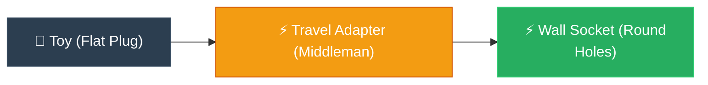

# ELI5: Adapter (ឌុយបំប្លែងចរន្តអគ្គិសនី)

**Author:** ichamrong  
**Date:** 2026-05-18  
**Tags:** #eli5 #simplification #design-patterns #adapter #clean-code  
**Category:** Concepts / ELI5  
**Read Time:** ~5 min  

---

## 📌 មាតិកា (Table of Contents)
- [១. គិតឱ្យសាមញ្ញ (Think Like a 5-Year-Old)](#១-គិតឱ្យសាមញ្ញ-think-like-a-5-year-old)
- [២. ស្ពានភ្ជាប់ទៅកាន់កូដ (Bridge to Code)](#២-ស្ពានភ្ជាប់ទៅកាន់កូដ-bridge-to-code)
- [៣. ដ្យាក្រាមលំហូរ (Visual Flowchart)](#៣-ដ្យាក្រាមលំហូរ-visual-flowchart)
- [៤. Related Posts](#៤-related-posts)

---

## ១. គិតឱ្យសាមញ្ញ (Think Like a 5-Year-Old)

### English
Imagine you are traveling halfway across the world to America, and you brought along your absolute favorite toy. This toy uses a special flat double-pin power plug. But when you finally arrive at your hotel and try to plug it in, you discover the wall socket only has round holes! Oh no, it doesn’t fit at all!

Are you going to cry and throw your favorite toy away? Of course not! Are you going to grab a hammer and smash the hotel wall to rebuild their socket? Definitely not! 

Instead, you do something very simple and smart: you buy a little plastic **Travel Adapter**. You gently plug your toy into the adapter, and then you plug the adapter straight into the wall. The adapter sits happily in the middle, magically translating those flat pins into round holes, so the electricity flows smoothly and your toy comes to life!

In programming, this helpful little middleman is exactly what we call the **Adapter Pattern**.

### Khmer
សាកស្រមៃថា អ្នកកំពុងធ្វើដំណើរឆ្លងទ្វីបទៅកាន់ប្រទេសអាមេរិក ដោយបានយកតុក្កតាដោតភ្លើងជាទីស្រឡាញ់បំផុតរបស់អ្នកទៅជាមួយផងដែរ។ តុក្កតានោះប្រើឌុយពិសេសដែលមានជើងសំប៉ែតពីរ។ ប៉ុន្តែនៅពេលដែលអ្នកទៅដល់សណ្ឋាគារ ហើយព្យាយាមដោតវាទៅក្នុងជញ្ជាំង អ្នកស្រាប់តែឃើញថារន្ធព្រីភ្លើងមានតែរន្ធមូលៗប៉ុណ្ណោះ! អូព្រះអើយ ឌុយរបស់តុក្កតាដោតមិនចូលទាល់តែសោះ!

តើអ្នកនឹងយំ ហើយបោះតុក្កតាសម្លាញ់នោះចោលឬ? ប្រាកដជាទេ! តើអ្នកនឹងយកញញួរទៅវាយគាស់ជញ្ជាំងសណ្ឋាគារដើម្បីប្តូររន្ធព្រីភ្លើងមែនទេ? ពិតជាមិនអាចទៅរួចទេ!

ផ្ទុយទៅវិញ អ្នកធ្វើរឿងដ៏សាមញ្ញនិងឆ្លាតវៃបំផុតមួយ៖ អ្នកគ្រាន់តែទិញ **ឌុយបំប្លែង (Travel Adapter)** ជ័រតូចមួយ។ អ្នកដោតឌុយតុក្កតារបស់អ្នកទៅក្នុងឌុយបំប្លែងនោះថ្នមៗ រួចយកឌុយបំប្លែងនោះទៅដោតនឹងជញ្ជាំង។ ឌុយបំប្លែងស្ថិតនៅកណ្តាលយ៉ាងរលូន ជួយបកប្រែជើងសំប៉ែតទៅជាជើងមូលដោយអព្ភូតហេតុ ធ្វើឱ្យចរន្តអគ្គិសនីរត់ចូលយ៉ាងរលូន ហើយតុក្កតារបស់អ្នកក៏មានជីវិតដំណើរការឡើងវិញ!

នៅក្នុងការសរសេរកូដ អ្នកសម្របសម្រួលនៅកណ្តាលដ៏មានប្រយោជន៍នេះហើយ គឺជា **Adapter Pattern**។

---

## ២. ស្ពានភ្ជាប់ទៅកាន់កូដ (Bridge to Code)

When we want to use an external library (like a Stripe Payment gateway) but our core system only understands our custom interface (`PaymentProcessor`), we don't rewrite our entire core system or modify Stripe's code. We write a class called `StripeAdapter` that implements `PaymentProcessor` and internally calls Stripe's methods, translating our variables to their variables.

នៅពេលយើងចង់ប្រើប្រាស់បណ្ណាល័យក្រៅ (ដូចជា Stripe Payment) ប៉ុន្តែប្រព័ន្ធស្នូលរបស់យើងស្គាល់តែ Interface ផ្ទាល់ខ្លួន (`PaymentProcessor`) យើងមិនចាំបាច់សរសេរប្រព័ន្ធស្នូលឡើងវិញ ឬទៅកែប្រែកូដរបស់ Stripe នោះទេ។ យើងគ្រាន់តែបង្កើត Class មួយឈ្មោះថា `StripeAdapter` ដែលអនុវត្តតាម `PaymentProcessor` ហើយហៅកូដរបស់ Stripe ពីខាងក្នុង ដោយបកប្រែអថេររបស់យើងទៅជាអថេររបស់គេ។

---

## ៣. ដ្យាក្រាមលំហូរ (Visual Flowchart)

---

## ៤. Related Posts

* 📖 **Read the Parable:** [The American Tourist and the Power Plug (អ្នកទេសចរអាមេរិក និងឌុយភ្លើង)](../../parables/80-the-american-tourist.md)
* 🛠️ **Read the Code Implementation:** [Structural Patterns: The Architecture of Objects](../../../clean-code/design-patterns/02-structural-patterns.md#the-adapter)
