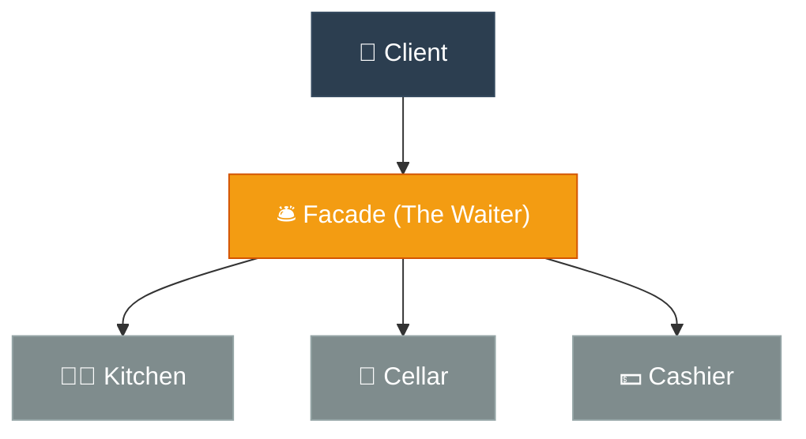

# ELI5: Facade (ចំណុចទំនាក់ទំនងសាមញ្ញតែមួយ)

**Author:** ichamrong  
**Date:** 2026-05-18  
**Tags:** #eli5 #simplification #design-patterns #facade #clean-code  
**Category:** Concepts / ELI5  
**Read Time:** ~5 min  

---

## 📌 មាតិកា (Table of Contents)
- [១. គិតឱ្យសាមញ្ញ (Think Like a 5-Year-Old)](#១-គិតឱ្យសាមញ្ញ-think-like-a-5-year-old)
- [២. ស្ពានភ្ជាប់ទៅកាន់កូដ (Bridge to Code)](#២-ស្ពានភ្ជាប់ទៅកាន់កូដ-bridge-to-code)
- [៣. ដ្យាក្រាមលំហូរ (Visual Flowchart)](#៣-ដ្យាក្រាមលំហូរ-visual-flowchart)
- [៤. Related Posts](#៤-related-posts)

---

## ១. គិតឱ្យសាមញ្ញ (Think Like a 5-Year-Old)

### English
Imagine you walk into a beautifully decorated, fancy restaurant. All you want is to enjoy a nice, juicy steak, drink a refreshing glass of apple juice, and comfortably pay your bill.

Now, imagine if you had to do all of this yourself. You would have to run into the hot, chaotic kitchen to shout your order at the busy chef, stumble down into the dark, creepy basement just to find the apple juice, and then run all the way to the manager's office to calculate your own taxes and print a receipt. You would be completely exhausted and confused!

But thankfully, that’s not what happens. Instead, you just sit comfortably at your table and speak to **one incredibly helpful person: the Waiter**. You simply smile and say, *"I’d like a steak, some apple juice, and the bill, please."* The Waiter magically handles all that stressful running around between the kitchen, the basement, and the cash register, bringing everything back to you perfectly organized.

That friendly Waiter is the **Facade Pattern**. They bravely hide all the messy, stressful, and complicated background systems behind a single, smiling face.

### Khmer
សាកស្រមៃថា អ្នកកំពុងដើរចូលទៅក្នុងភោជនីយដ្ឋានដ៏ប្រណិត និងស្រស់ស្អាតមួយ។ អ្វីដែលអ្នកចង់បាន គឺគ្រាន់តែញ៉ាំសាច់អាំងដ៏ឈ្ងុយឆ្ងាញ់ ផឹកទឹកប៉ោមត្រជាក់ៗមួយកែវ រួចបង់លុយដោយក្តីសុខប៉ុណ្ណោះ។

ឥឡូវនេះ សាកស្រមៃមើលថា ប្រសិនបើអ្នកត្រូវធ្វើរឿងទាំងអស់នេះដោយខ្លួនឯង តើវានឹងទៅជាយ៉ាងណា? អ្នកច្បាស់ជាត្រូវរត់ចូលទៅក្នុងផ្ទះបាយដ៏ក្តៅស្អុះស្អាប់ និងរញ៉េរញ៉ៃ ដើម្បីស្រែកប្រាប់ការកម្ម៉ង់ទៅកាន់ចុងភៅដែលកំពុងរវល់ រួចត្រូវដើរទច់ង៉ក់ចុះទៅបន្ទប់ក្រោមដីដ៏ងងឹតគួរឱ្យខ្លាចដើម្បីស្វែងរកទឹកប៉ោម ហើយបន្ទាប់មកត្រូវរត់ទៅការិយាល័យអ្នកគ្រប់គ្រងដើម្បីគណនាពន្ធ និងបោះពុម្ពវិក្កយបត្រដោយខ្លួនឯងទៀត។ អ្នកច្បាស់ជាហត់នឿយ និងវង្វេងស្មារតីជាមិនខាន!

ប៉ុន្តែសំណាងល្អ វាមិនមានរឿងបែបនោះកើតឡើងទេ។ ផ្ទុយទៅវិញ អ្នកគ្រាន់តែអង្គុយយ៉ាងស្រួលនៅលើកៅអី ហើយនិយាយជាមួយ **មនុស្សដ៏មានប្រយោជន៍ម្នាក់គត់៖ នោះគឺអ្នករត់តុ**។ អ្នកគ្រាន់តែញញឹម ហើយនិយាយថា៖ *«ខ្ញុំសុំសាច់អាំង ទឹកប៉ោម និងគិតលុយផង។»* អ្នករត់តុនឹងចាត់ចែងការរត់ចុះរត់ឡើងដ៏ស្មុគស្មាញទាំងអស់នៅក្នុងផ្ទះបាយ បន្ទប់ក្រោមដី និងបញ្ជរគិតលុយជំនួសអ្នក រួចយកអ្វីៗគ្រប់យ៉ាងមកជូនអ្នកយ៉ាងរៀបរយ និងល្អឥតខ្ចោះ។

អ្នករត់តុដ៏រាក់ទាក់នោះហើយ គឺជា **Facade Pattern**។ ពួកគេបានលាក់បាំងប្រព័ន្ធការងារដ៏ស្មុគស្មាញ តានតឹង និងរញ៉េរញ៉ៃទាំងអស់នោះ នៅពីក្រោយស្នាមញញឹម និងទម្រង់ទំនាក់ទំនងដ៏សាមញ្ញតែមួយ។

---

## ២. ស្ពានភ្ជាប់ទៅកាន់កូដ (Bridge to Code)

In software, rather than forcing the client to initialize `DatabaseConnection`, `QueryParser`, `CacheManager`, and `TransactionLogger` to perform a simple user login, we write a `LoginFacade` class with a single method: `login(username, password)`. The facade orchestrates all the underlying complex classes, exposing a clean, simple API to the client.

នៅក្នុងប្រព័ន្ធកូដ ជំនួសឱ្យការតម្រូវឱ្យកូនកូដហៅ `DatabaseConnection`, `QueryParser`, `CacheManager` និង `TransactionLogger` ដោយដៃ ដើម្បីធ្វើសកម្មភាពចូលប្រព័ន្ធ (Login) ធម្មតា យើងគ្រាន់តែបង្កើត Class `LoginFacade` មួយដែលមានមុខងារតែមួយគត់គឺ `login(username, password)`។ Facade ជាអ្នករៀបចំលំដាប់ការងារនៃ Class ស្មុគស្មាញទាំងអស់នោះ ដោយផ្តល់នូវ API ដ៏សាមញ្ញ និងស្អាតដល់កូនកូដ។

---

## ៣. ដ្យាក្រាមលំហូរ (Visual Flowchart)

---

## ៤. Related Posts

* 📖 **Read the Parable:** [The Restaurant Waiter (អ្នករត់តុក្នុងភោជនីយដ្ឋាន)](../../parables/82-the-restaurant-waiter.md)
* 🛠️ **Read the Code Implementation:** [Structural Patterns: The Architecture of Objects](../../../clean-code/design-patterns/02-structural-patterns.md#the-facade)
