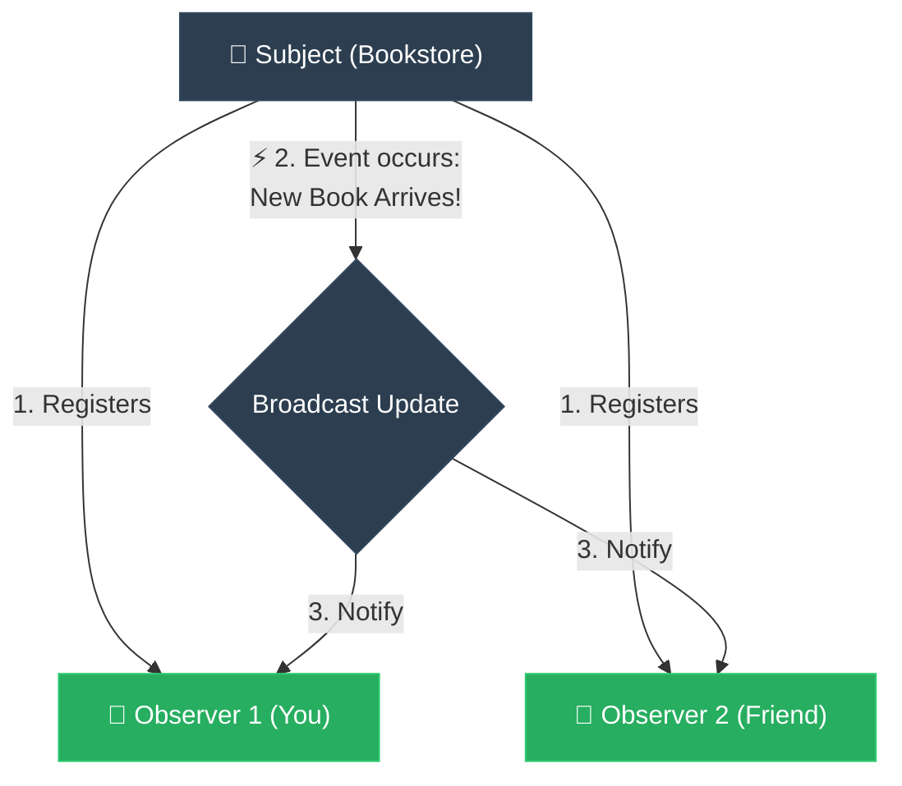

# ELI5: Observer (ការចុះឈ្មោះជាវព័ត៌មានដោយស្វ័យប្រវត្តិ)

**Author:** ichamrong  
**Date:** 2026-05-18  
**Tags:** #eli5 #simplification #design-patterns #observer #clean-code  
**Category:** Concepts / ELI5  
**Read Time:** ~5 min  

---

## 📌 មាតិកា (Table of Contents)
- [១. គិតឱ្យសាមញ្ញ (Think Like a 5-Year-Old)](#១-គិតឱ្យសាមញ្ញ-think-like-a-5-year-old)
- [២. ស្ពានភ្ជាប់ទៅកាន់កូដ (Bridge to Code)](#២-ស្ពានភ្ជាប់ទៅកាន់កូដ-bridge-to-code)
- [៣. ដ្យាក្រាមលំហូរ (Visual Flowchart)](#៣-ដ្យាក្រាមលំហូរ-visual-flowchart)
- [៤. Related Posts](#៤-related-posts)

---

## ១. គិតឱ្យសាមញ្ញ (Think Like a 5-Year-Old)

### English
Imagine you are absolutely obsessed with a brand-new comic book series. Every single day, you bravely walk 20 whole minutes under the hot sun to the local bookstore, just to ask the owner: *"Excuse me, is issue #5 out yet?"* And every day, the owner shakes his head and says: *"Not yet, kid. Go back home."* You keep doing this, day after day. It’s totally exhausting and a huge waste of your precious playtime!

But then, you get a brilliant idea. Instead of walking there every day, you write your email down on a little notepad at the counter and tell the owner: *"Hey! The second that issue #5 arrives in the store, please just send me an email!"*

Now, you can stay home, relax, and play with your friends. The magical moment the new comic book is finally delivered, the owner simply looks at that notepad and sends a quick email to you (and to everyone else who wrote their name down). You get the happy news instantly, walk over, and buy it!

That little notepad is the **Observer List**, the bookstore holding the books is the **Subject**, and you, waiting happily at home, are the **Observer**.

### Khmer
សាកស្រមៃថា អ្នកពិតជាងប់ងល់នឹងសៀវភៅរឿងស៊េរីថ្មីមួយខ្លាំងណាស់។ ជារៀងរាល់ថ្ងៃ អ្នកត្រូវខំដើរហាលថ្ងៃក្តៅហែងអស់រយៈពេល ២០ នាទី ទៅកាន់ហាងសៀវភៅក្នុងស្រុក គ្រាន់តែដើម្បីសួរម្ចាស់ហាងថា៖ *«សុំទោសពូ តើសៀវភៅលេខ ៥ ចេញលក់ហើយឬនៅ?»* ហើយរាល់ថ្ងៃ ម្ចាស់ហាងតែងតែគ្រវីក្បាលរួចឆ្លើយថា៖ *«នៅទេក្មួយ អត់ទាន់មកដល់ទេ។ ទៅផ្ទះវិញសិនទៅ!»* អ្នកនៅតែបន្តធ្វើបែបនេះ ពីមួយថ្ងៃទៅមួយថ្ងៃ។ វាពិតជាធ្វើឱ្យអ្នកហត់នឿយ និងខ្ជះខ្ជាយពេលវេលាលេងដ៏មានតម្លៃរបស់អ្នកខ្លាំងណាស់!

ប៉ុន្តែស្រាប់តែថ្ងៃមួយ អ្នកនឹកឃើញគំនិតដ៏ឆ្លាតវៃមួយ។ ជំនួសឱ្យការដើរទៅហាងរាល់ថ្ងៃ អ្នកសរសេរអ៊ីមែលរបស់អ្នកទុកនៅលើក្រដាសតូចមួយនៅបញ្ជរ រួចប្រាប់ម្ចាស់ហាងថា៖ *«ពូ! ពេលណាសៀវភៅលេខ ៥ មកដល់ហាងភ្លាម ពូជួយផ្ញើអ៊ីមែលប្រាប់ខ្ញុំមួយផងណា!»*

ពេលនេះ អ្នកអាចនៅផ្ទះ សម្រាក និងលេងជាមួយមិត្តភក្តិយ៉ាងសប្បាយ។ គ្រាដ៏រំភើបដែលសៀវភៅរឿងថ្មីត្រូវបានដឹកមកដល់ភ្លាម ម្ចាស់ហាងគ្រាន់តែមើលទៅក្រដាសនោះ រួចផ្ញើអ៊ីមែលមួយប្រាប់អ្នក (និងប្រាប់ក្មេងៗផ្សេងទៀតដែលបានចុះឈ្មោះ) ព្រមគ្នា។ អ្នកទទួលបានដំណឹងល្អភ្លាមៗ រួចទើបដើរទៅទិញដោយក្តីរំភើប!

ក្រដាសចុះឈ្មោះតូចនោះ គឺជា **Observer List (បញ្ជីអ្នកតាមដាន)** ហាងសៀវភៅដែលរង់ចាំសៀវភៅចូល គឺជា **Subject (ប្រធានបទ)** ហើយអ្នក ដែលកំពុងរង់ចាំដំណឹងយ៉ាងសប្បាយចិត្តនៅផ្ទះ គឺជា **Observer (អ្នកតាមដាន)**។

---

## ២. ស្ពានភ្ជាប់ទៅកាន់កូដ (Bridge to Code)

In software, instead of having a `Dashboard` periodically query (poll) the database to see if there is new payment data, the `PaymentService` maintains a list of interested parties (`Observers`). When a payment completes, it loops through this list and calls `observer.update(paymentData)` on each, pushing updates instantly and saving server CPU resources.

នៅក្នុងប្រព័ន្ធកូដ ជំនួសឱ្យការឱ្យ `Dashboard` ធ្វើការសួរ (Poll) ទៅកាន់ Database រាល់វិនាទី ដើម្បីដឹងថាមានទិន្នន័យទូទាត់ថ្មីឬអត់ `PaymentService` គ្រាន់តែរក្សាទុកបញ្ជីនៃអ្នកពាក់ព័ន្ធ (`Observers`)។ ពេលការទូទាត់ប្រាក់ជោគជ័យ វានឹងរត់លុបលើបញ្ជីនោះ ហើយហៅមុខងារ `observer.update(paymentData)` លើម្នាក់ៗ ដើម្បីបញ្ជូនព័ត៌មានភ្លាមៗ និងសន្សំសំចៃ CPU របស់ Server។

---

## ៣. ដ្យាក្រាមលំហូរ (Visual Flowchart)

---

## ៤. Related Posts

* 📖 **Read the Parable:** [The Town Crier and the Villagers (អ្នកប្រកាសព័ត៌មាន និងអ្នកភូមិ)](../../parables/92-the-newspaper-subscription.md)
* 🛠️ **Read the Code Implementation:** [Behavioral Patterns: The Dynamics of Objects](../../../clean-code/design-patterns/03-behavioral-patterns.md#the-observer)
