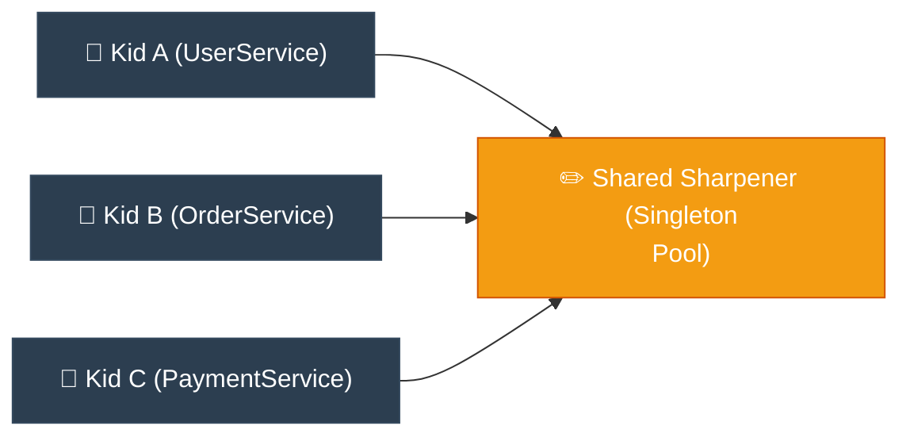

# ELI5: Singleton (ម៉ាស៊ីនខួងខ្មៅដៃតែមួយគត់ក្នុងថ្នាក់រៀន)

**Author:** ichamrong  
**Date:** 2026-05-18  
**Tags:** #eli5 #simplification #design-patterns #singleton #clean-code  
**Category:** Concepts / ELI5  
**Read Time:** ~5 min  

---

## 📌 មាតិកា (Table of Contents)
- [១. គិតឱ្យសាមញ្ញ (Think Like a 5-Year-Old)](#១-គិតឱ្យសាមញ្ញ-think-like-a-5-year-old)
- [២. ស្ពានភ្ជាប់ទៅកាន់កូដ (Bridge to Code)](#២-ស្ពានភ្ជាប់ទៅកាន់កូដ-bridge-to-code)
- [៣. ដ្យាក្រាមលំហូរ (Visual Flowchart)](#៣-ដ្យាក្រាមលំហូរ-visual-flowchart)
- [៤. Related Posts](#៤-related-posts)

---

## ១. គិតឱ្យសាមញ្ញ (Think Like a 5-Year-Old)

### English
Imagine a lively kindergarten classroom filled with 30 creative little kids, all eagerly drawing pictures. Suddenly, everyone needs to sharpen their pencils at the exact same time.

Now, imagine what would happen if every single kid brought their own giant, incredibly noisy electric pencil sharpener and slammed it down on their tiny little desk. There would be absolutely no room left for their drawing paper! The loud, buzzing noise of 30 machines running at once would be deafening, and there would be a massive mess of pencil shavings exploding all over the floor!

To save the classroom from total chaos, the wise teacher smiles and makes a gentle rule: **"No more bringing your own pencil sharpeners from home, please!"**

Instead, she buys **exactly one big, beautiful, super-fast magic pencil sharpener** and places it carefully on her desk at the very front of the room. Now, whenever any child needs a sharp pencil, they simply stand up, walk to the front, and use that same shared sharpener. 

It magically saves desk space, saves money, and keeps the whole classroom clean, peaceful, and happy.

In the programming world, that one shared, peaceful classroom sharpener is the **Singleton Pattern**.

### Khmer
សាកស្រមៃមើលថ្នាក់មត្តេយ្យដ៏អ៊ូអរមួយ ដែលពោរពេញទៅដោយក្មេងៗដ៏គួរឱ្យស្រលាញ់ចំនួន ៣០ នាក់ ដែលកំពុងតែខិតខំគូររូបយ៉ាងសប្បាយរីករាយ។ ស្រាប់តែពេលនោះ គ្រប់គ្នាសុទ្ធតែត្រូវការខួងខ្មៅដៃរបស់ពួកគេក្នុងពេលតែមួយ។

ឥឡូវនេះ សាកស្រមៃមើលថា តើនឹងមានរឿងអ្វីកើតឡើង ប្រសិនបើក្មេងម្នាក់ៗ សុទ្ធតែបានយកម៉ាស៊ីនខួងខ្មៅដៃអគ្គិសនីដ៏ធំៗ និងឮសម្លេងខ្លាំងៗរៀងៗខ្លួន មកដាក់ទង្គិចចុះលើតុរៀនដ៏តូចរបស់ពួកគេនោះ? តុរៀនច្បាស់ជាលែងមានកន្លែងទំនេរសម្រាប់ដាក់ក្រដាសគំនូរទៀតហើយ! សម្លេងរោទ៍កងរំពងនៃម៉ាស៊ីនទាំង ៣០ ដំណើរការព្រមគ្នា នឹងធ្វើឱ្យថ្លង់ហឹងត្រចៀក ហើយកាកសំណល់ឈើខ្មៅដៃច្បាស់ជាហោះរាយប៉ាយកខ្វក់ពេញការ៉ូផ្ទាល់ដីជាមិនខាន!

ដើម្បីសង្គ្រោះថ្នាក់រៀនពីភាពវឹកវរនេះ អ្នកគ្រូដ៏ឈ្លាសវៃបានញញឹម រួចបង្កើតវិន័យដ៏ទន់ភ្លន់មួយថា៖ **«សូមកុំយកម៉ាស៊ីនខួងខ្មៅដៃពីផ្ទះមកថ្នាក់រៀនទៀតអីណា៎កូនៗ!»**

ផ្ទុយទៅវិញ អ្នកគ្រូបានទិញ **ម៉ាស៊ីនខួងខ្មៅដៃអគ្គិសនីដ៏ធំ ស្រស់ស្អាត និងលឿនបំផុតតែមួយគត់** យកមកដាក់យ៉ាងមានរបៀបនៅលើតុរបស់អ្នកគ្រូនៅខាងមុខថ្នាក់។ ពេលនេះ រាល់ពេលដែលក្មេងណាម្នាក់ត្រូវការខួងខ្មៅដៃ ពួកគេគ្រាន់តែក្រោកឈរ ដើរទៅខាងមុខ ហើយប្រើប្រាស់ម៉ាស៊ីនខួងតែមួយគត់ដែលប្រើរួមគ្នានោះ។

វាជួយសន្សំសំចៃទំហំតុរៀនបានយ៉ាងអស្ចារ្យ សន្សំសំចៃលុយ និងរក្សាបរិយាកាសក្នុងថ្នាក់ឱ្យនៅតែស្អាត ស្ងប់ស្ងាត់ និងពោរពេញដោយក្តីសុខ។

នៅក្នុងពិភពសរសេរកម្មវិធី ម៉ាស៊ីនខួងខ្មៅដៃតែមួយគត់ដែលផ្តល់ភាពស្ងប់ស្ងាត់នេះហើយ គឺជា **Singleton Pattern**។

---

## ២. ស្ពានភ្ជាប់ទៅកាន់កូដ (Bridge to Code)

When your code connects to a database, it uses a connection "pool." Creating a new connection pool is heavy and uses a lot of computer memory (like bringing 30 big pencil sharpeners). If every service (`UserService`, `OrderService`, `PaymentService`) creates its own pool, the system runs out of memory and crashes. By using the **Singleton Pattern**, we guarantee there is only **one pool object** in memory, and every service shares it safely.

នៅពេលដែលកូដរបស់អ្នកភ្ជាប់ទៅកាន់ Database វាប្រើប្រាស់ "Connection Pool"។ ការបង្កើត Pool ថ្មីនីមួយៗគឺស៊ីកម្លាំងម៉ាស៊ីន និងចំណាយមេម៉ូរីកុំព្យូទ័រច្រើនណាស់ (ដូចជាការយកម៉ាស៊ីនខួងខ្មៅដៃធំៗ ៣០ គ្រឿងចូលថ្នាក់រៀនអញ្ចឹង)។ ប្រសិនបើ Service នីមួយៗ (`UserService`, `OrderService`, `PaymentService`) បង្កើត Pool ផ្ទាល់ខ្លួនរៀងៗខ្លួន នោះប្រព័ន្ធនឹងអស់មេម៉ូរី ហើយគាំងជាមិនខាន។ ដោយការប្រើប្រាស់ **Singleton Pattern** យើងធានាថាមាន **Object Pool តែមួយគត់** នៅក្នុងមេម៉ូរី ហើយគ្រប់ Service ទាំងអស់ចែករំលែកវាដោយសុវត្ថិភាព។

---

## ៣. ដ្យាក្រាមលំហូរ (Visual Flowchart)

---

## ៤. Related Posts

### 🔗 Explore All Viewpoints:
* 📖 **Read the Parable:** [The Bank's Only Vault (ទូដែកតែមួយគត់របស់ធនាគារ)](../../parables/75-the-banks-only-vault.md) — Explains the emotional core of shared truth.
* 🧠 **Read the First Principles Derivation:** [MIT Professor Strategy: Singleton (គោលការណ៍គ្រឹះដំបូងនៃ Singleton)](../01-mit-professor/01-singleton.md) — Derives the pattern from fundamental computer axioms.
* 👶 **Read the Feynman Simplification:** [Feynman Technique: Singleton (ការពន្យល់ពី Singleton ដោយគ្មានពាក្យបច្ចេកទេស)](../02-feynman-technique/04-singleton.md) — Breaks it down using the central clock tower.
* 👦 **Read the ELI5 Metaphor:** [ELI5: Singleton (ម៉ាស៊ីនខួងខ្មៅដៃតែមួយគត់ក្នុងថ្នាក់រៀន)](../03-eli5/04-singleton.md) — Teaches it to a five-year-old using classroom pencil sharpeners.
* 🌉 **Read the Analogy Bridge:** [Analogy Bridge: Singleton (ស្ពានប្រៀបធៀបនៃប្រភពពិតតែមួយគត់)](../04-analogy-bridge/04-singleton.md) — Maps it to a hotel front desk and shows where physical limits fail compared to code threads.
* 🧐 **Read the Socratic Discovery:** [Socratic Method: Singleton (ការបង្កើតប្រព័ន្ធការពិតតែមួយគត់តាមវិធីសាស្ត្រសូក្រាត)](../05-socratic-method/04-singleton.md) — Guide your self-discovery through mentor-student dialogue.
* 📰 **Read the Journalist Summary:** [Journalist: Singleton (ការធានាឱ្យមានការពិតតែមួយគត់ក្នុងប្រព័ន្ធទាំងមូល)](../06-journalist-inverted-pyramid/04-singleton.md) — Get the high-impact lede, volatile visibility, and thread-safety details first.
* 🎭 **Read the Storyteller Narrative:** [Storyteller: Singleton (អាណាព្យាបាលនៃសេចក្តីពិត និងកងទ័ពក្លូនបង្កចលាចល)](../07-storyteller-narrative-arc/04-singleton.md) — Follow Kiri's heroic journey to vanquish the duplicate logger clone army.
* ⚙️ **Read the Engineer Spec:** [Engineer: Singleton (ការសម្របសម្រួលប្រភពពិតតែមួយគត់ និងទប់ស្កាត់ការខ្ជះខ្ជាយធនធាន)](../08-engineer-requirements-constraints-solution/03-singleton.md) — Read the rigorous engineering specification, DCL performance details, and candidate elimination.
* 📊 **Read the Pros & Cons:** [Pros & Cons Compared: Singleton (ការប្រៀបធៀបគុណសម្បត្តិ និងគុណវិបត្តិនៃ Singleton)](../09-pros-and-cons-compared/01-singleton.md) — Full trade-off analysis and decision matrix.
* 🛠️ **Read the Code Implementation:** [Creational Patterns: The Art of Instantiation](../../../clean-code/design-patterns/01-creational-patterns.md#the-singleton) — Production-grade Java with double-checked locking and thread safety.
