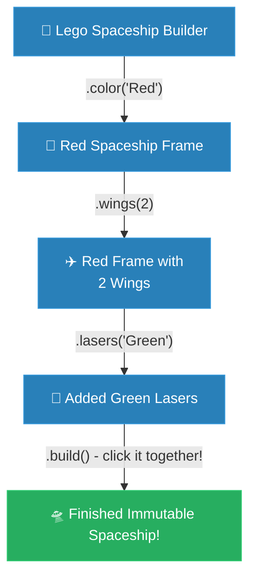

# ELI5: Builder (ការពន្យល់ពី Builder ដូចក្មេងអាយុ ៥ ឆ្នាំ)

**Author:** ichamrong  
**Date:** 2026-05-18  
**Tags:** #eli5 #childhood-analogy #design-patterns #builder #clean-code  
**Category:** Concepts / ELI5  
**Read Time:** ~5 min  

---

## 📌 មាតិកា (Table of Contents)
- [១. ការពន្យល់បែបក្មេងអាយុ ៥ ឆ្នាំ (The Lego Spaceship Metaphor)](#១-ការពន្យល់បែបក្មេងអាយុ-៥-ឆ្នាំ-the-lego-spaceship-metaphor)
- [២. ការពន្យល់ជាភាសាខ្មែរ (Khmer Translation)](#២-ការពន្យល់ជាភាសាខ្មែរ-khmer-translation)
- [៣. ដ្យាក្រាមលំហូរ (Visual Flowchart)](#៣-ដ្យាក្រាមលំហូរ-visual-flowchart)
- [៤. Related Posts](#៤-related-posts)

---

## ១. ការពន្យល់បែបក្មេងអាយុ ៥ ឆ្នាំ (The Lego Spaceship Metaphor)

Imagine you are super excited to build the coolest, most amazing **Lego Spaceship** in the world. 

### The Bad Way: The Giant, Confusing Bucket
If I suddenly dumped a giant bucket containing **100 mixed-up Lego blocks** right in front of you and yelled: *"Build this whole spaceship perfectly, all at once, right now!"* you would feel completely overwhelmed and probably want to cry. You might accidentally forget to attach the wings, put the rocket engine upside down, or completely lose the tiny pilot's seat in the huge mess.

In computer coding, trying to build a huge, confusing object all in one breathless breath is called a **Telescopic Constructor**. It looks like a terrifying secret code:
`new Spaceship("Red", 4, 2, true, false, "Laser", "Ion Engine", true)`
If you make even one tiny mistake, or accidentally mix up the number of wings with the number of lasers, the entire spaceship crashes and burns!

### The Good Way: The Friendly Instruction Book (The Builder)
Luckily, Lego is much kinder. Instead of yelling at you, they gently hand you a colorful, easy-to-follow **Step-by-Step Instruction Book**.
1. First, you happily open the book and snap the main body together.
2. The book gently points: *"Okay, now let's add the wings."* So you carefully click the wings into place (`.addWings(2)`).
3. Next, it says: *"Awesome! Now let's snap on the red lasers."* So you click the lasers on securely (`.addLasers("Red")`).
4. Finally, when every single piece is exactly where you want it, you press the glass window over the pilot, smile, and proudly say: *"Finished!"* (in code, we say `.build()`).

And just like that, you have a beautiful, sturdy Lego Spaceship, built safely and peacefully, step-by-step, without a single tear or moment of confusion!

---

## ២. ការពន្យល់ជាភាសាខ្មែរ (Khmer Translation)

សាកស្រមៃថា កូនកំពុងតែរំភើបញាប់ញ័រចង់ដំឡើង **យានអវកាស Lego** ដ៏ឡូយ និងអស្ចារ្យបំផុតក្នុងពិភពលោក។

### វិធីមិនល្អ៖ ធុងជ័រដ៏ធំដែលគួរឱ្យឈឺក្បាល
ប្រសិនបើស្រាប់តែពុកចាក់ធុងជ័រដ៏ធំមួយដែលមាន **បំណែក Lego ១០០ លាយឡំគ្នា** នៅចំពីមុខកូន រួចស្រែកប្រាប់ថា៖ *«ដំឡើងយានអវកាសនេះឱ្យល្អឥតខ្ចោះ ក្នុងពេលតែមួយ និងឱ្យរួចរាល់ភ្លាមៗឥឡូវនេះ!»* កូនច្បាស់ជាមានអារម្មណ៍ភ័យស្លន់ស្លោ និងចង់យំមិនខាន។ កូនប្រហែលជានឹងភ្លេចភ្ជាប់ស្លាប ដាក់ម៉ាស៊ីនរ៉ុក្កែតបញ្ច្រាសក្បាលចុះក្រោម ឬអាចនឹងជ្រុះបាត់កៅអីអ្នកបើកបរដ៏តូចនៅក្នុងគំនរដ៏រញ៉េរញ៉ៃនោះ។

នៅក្នុងកូដកុំព្យូទ័រ ការព្យាយាមសាងសង់ Object ដ៏ធំ និងគួរឱ្យឈឺក្បាលក្នុងពេលហត់ដង្ហើមតែមួយបែបនេះ ត្រូវបានគេហៅថា **Telescopic Constructor**។ វាមានរូបរាងគួរឱ្យខ្លាចដូចជាកូដសម្ងាត់អញ្ចឹង៖
`new Spaceship("Red", 4, 2, true, false, "Laser", "Ion Engine", true)`
ប្រសិនបើកូនធ្វើខុសតែបន្តិច ឬច្រឡំចំនួនស្លាប ជាមួយនឹងចំនួនកាំភ្លើងឡាស៊ែរដោយអចេតនា នោះយានអវកាសទាំងមូលនឹងខូចទ្រង់ទ្រាយ និងផ្ទុះឆេះជាក់ជាមិនខាន!

### វិធីល្អ៖ សៀវភៅណែនាំដ៏រួសរាយ (The Builder)
សំណាងល្អ ក្រុមហ៊ុន Lego ពិតជាចិត្តល្អណាស់។ ជំនួសឱ្យការស្រែកគំហកដាក់កូន ពួកគេបានហុច **សៀវភៅណែនាំជាជំហានៗ** ដ៏មានពណ៌ចម្រុះ និងងាយស្រួលអានបំផុតមកឱ្យកូនដោយទន់ភ្លន់។
១. ដំបូង កូនបើកសៀវភៅដោយក្តីសប្បាយរីករាយ រួចចាប់ផ្តើមផ្គុំតួខ្លួនយានអវកាសបញ្ចូលគ្នា។
២. សៀវភៅចង្អុលបង្ហាញថ្នមៗថា៖ *«អូខេ ឥឡូវនេះយើងដាក់ស្លាបចូលណា៎កូន។»* កូនក៏ផ្គុំស្លាបនោះឱ្យចូលសន្លាក់យ៉ាងប្រយ័ត្នប្រយែង (`.addWings(2)`)។
៣. បន្ទាប់មក វាប្រាប់ទៀតថា៖ *«អស្ចារ្យណាស់! ឥឡូវនេះភ្ជាប់កាំភ្លើងឡាស៊ែរពណ៌ក្រហមចូលទៅ។»* កូនក៏ភ្ជាប់ឡាស៊ែរនោះយ៉ាងរឹងមាំ (`.addLasers("Red")`)។
៤. ចុងក្រោយ នៅពេលដែលបំណែកនីមួយៗស្ថិតនៅកន្លែងដែលកូនចង់បានយ៉ាងល្អឥតខ្ចោះហើយ កូនគ្រាន់តែសង្កត់កញ្ចក់បិទពីលើអ្នកបើកបរ ញញឹម ហើយនិយាយដោយមោទនភាពថា៖ *«រួចរាល់ហើយ!»* (នៅក្នុងកូដ យើងនិយាយថា `.build()`)។

ហើយដោយគ្រាន់តែធ្វើបែបនេះ កូនក៏ទទួលបាននូវយានអវកាស Lego ដ៏ស្រស់ស្អាត និងរឹងមាំមួយ ដែលត្រូវបានដំឡើងដោយសុវត្ថិភាព និងភាពស្ងប់ស្ងាត់ ជាជំហានៗ ដោយមិនមានការស្រក់ទឹកភ្នែក ឬភាពវឹកវរ សូម្បីតែបន្តិច!

---

## ៣. ដ្យាក្រាមលំហូរ (Visual Flowchart)

---

## ៤. Related Posts

### 🔗 Explore All Viewpoints:
* 📖 **Read the Parable:** [The 47-Question Waiter (អ្នករត់តុសួរ ៤៧ សំណួរ)](../../parables/76-the-overwhelmed-sandwich-shop.md) — The emotional story of a chaotic customer experience.
* 🧠 **Read the First Principles Derivation:** [MIT Professor Strategy: Builder (គោលការណ៍គ្រឹះដំបូងនៃ Builder)](../01-mit-professor/04-builder.md) — Derives the pattern from stack frame layouts and thread safety laws.
* 👶 **Read the Feynman Simplification:** [Feynman Technique: Builder (ការពន្យល់ពី Builder ដោយគ្មានពាក្យបច្ចេកទេស)](../02-feynman-technique/05-builder.md) — Breaks it down using a simple cafe menu checklist.
* 👦 **Read the ELI5 Metaphor:** [ELI5: Builder (ការពន្យល់ពី Builder ដូចក្មេងអាយុ ៥ ឆ្នាំ)](../03-eli5/05-builder.md) — Teaches a five-year-old using Lego spaceship construction books.
* 🌉 **Read the Analogy Bridge:** [Analogy Bridge: Builder (ស្ពានប្រៀបធៀបនៃ Builder)](../04-analogy-bridge/05-builder.md) — Maps real sandwich ticks to fluent Java methods, outlining physical limitations.
* 🧐 **Read the Socratic Discovery:** [Socratic Method: Builder (ការបង្កើត Object ស្មុគស្មាញតាមវិធីសាស្ត្រសូក្រាត)](../05-socratic-method/05-builder.md) — Probes yourself via a mentor-student constructor debate.
* 📰 **Read the Journalist Summary:** [Journalist: Builder (ការបង្កើត Object ស្មុគស្មាញជាជំហានៗ)](../06-journalist-inverted-pyramid/05-builder.md) — Quick news lede, telescoping prevention, and step-by-step assembly validation.
* 🎭 **Read the Storyteller Narrative:** [Storyteller: Builder (វីរបុរស Builder និងសង្គ្រាមប៉ារ៉ាម៉ែត្ររញ៉េរញ៉ៃ)](../07-storyteller-narrative-arc/05-builder.md) — Sopheap's battle against a production parameter bomb catastrophe on Black Friday.
* ⚙️ **Read the Engineer Spec:** [Engineer: Builder (ការបង្កើត Object ស្មុគស្មាញជាជំហានៗ)](../08-engineer-requirements-constraints-solution/01-builder.md) — Read the formal engineering requirements and candidate evaluation table.
* 📊 **Read the Pros & Cons:** [Pros & Cons Compared: Builder (ការប្រៀបធៀបគុណសម្បត្តិ និងគុណវិបត្តិនៃ Builder)](../09-pros-and-cons-compared/02-builder.md) — Full trade-off analysis and decision matrix.
* 🛠️ **Read the Code Implementation:** [Creational Patterns: The Art of Instantiation](../../../clean-code/design-patterns/01-creational-patterns.md#the-builder) — Production-grade Java with fluent chaining and immutable object construction.
