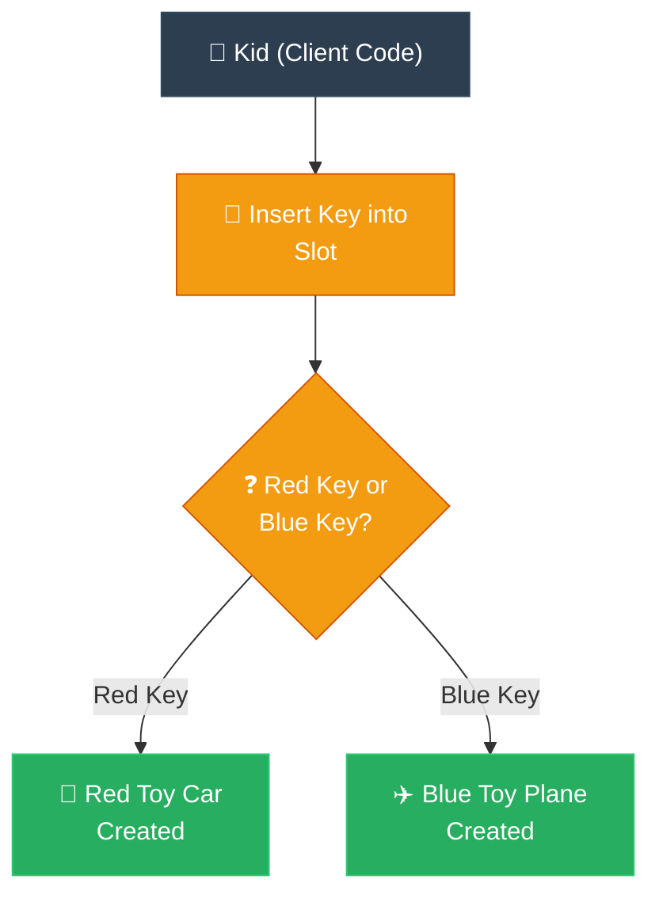

# ELI5: Factory Method (ការពន្យល់ពី Factory Method ដូចក្មេងអាយុ ៥ ឆ្នាំ)

**Author:** ichamrong  
**Date:** 2026-05-18  
**Tags:** #eli5 #metaphor #design-patterns #factory-method #clean-code  
**Category:** Concepts / ELI5  
**Read Time:** ~3 min  

---

## 📌 មាតិកា (Table of Contents)
- [១. រឿងប្រៀបធៀបសាមញ្ញបំផុត (The 5-Year-Old Metaphor)](#១-រឿងប្រៀបធៀបសាមញ្ញបំផុត-the-5-year-old-metaphor)
- [២. ហេតុអ្វីបានជាវាល្អ? (Why It's Awesome)](#២-ហេតុអ្វីបានជាវាល្អ-why-its-awesome)
- [៣. ដ្យាក្រាមលំហូរ (Visual Flowchart)](#៣-ដ្យាក្រាមលំហូរ-visual-flowchart)
- [៤. Related Posts](#៤-related-posts)

---

## ១. រឿងប្រៀបធៀបសាមញ្ញបំផុត (The 5-Year-Old Metaphor)

### English
Imagine you own a wonderful, magical **Toy Machine**. You love playing with different toys, but you certainly don’t want to go through the exhausting, messy work of building a brand new machine every single time you want a new toy. Building heavy machines is way too much work for a kid!

Instead, this clever magic machine has a glowing little slot right in the front. 
* If you gently insert a **Red Plastic Key**, the machine hums, dings, and magically pops out a shiny **Red Toy Car**!
* If you slide in a **Blue Plastic Key**, the machine whirls and pops out a beautiful **Blue Toy Plane**!

The machine itself doesn't have a giant brain to memorize how to build every single toy in the world beforehand. It only has one simple, happy job: **it looks at the key you give it, and pops out exactly the right toy to match.**

You, the happy player, never have to pick up a screwdriver or build any toys yourself. You just hand the machine the correct key, and it does all the hard, messy work of bringing the toy to life for you.

In the world of computer coding, that delightful Toy Machine is the **Factory Method**. Instead of your code awkwardly trying to glue together complex objects by hand using messy raw code, it simply presses a special "creation button" (the method). This button knows exactly how to build and deliver the perfect object you asked for, completely automatically.

### Khmer
សាកស្រមៃថា កូនមាន **ម៉ាស៊ីនផលិតប្រដាប់ក្មេងលេង** វេទមន្តដ៏អស្ចារ្យមួយ។ កូនចូលចិត្តលេងប្រដាប់ក្មេងលេងច្រើនប្រភេទណាស់ ប៉ុន្តែកូនប្រាកដជាមិនចង់ហត់នឿយ និងប្រឡាក់ប្រឡូស ក្នុងការសាងសង់ម៉ាស៊ីនថ្មីសន្លាងមួយ រាល់ពេលដែលកូនចង់បានរបស់លេងថ្មីមួយនោះទេ។ ការសាងសង់ម៉ាស៊ីនដែកធ្ងន់ៗ គឺជាការងារដ៏លំបាកពេកហើយសម្រាប់ក្មេងៗ!

ជំនួសមកវិញ ម៉ាស៊ីនវេទមន្តដ៏ឆ្លាតវៃនេះ មានរន្ធបញ្ចេញពន្លឺតូចមួយនៅចំពីមុខ។
* ប្រសិនបើកូនស៊ក **សោជជ័រពណ៌ក្រហម** ចូលថ្នមៗ ម៉ាស៊ីននឹងលាន់សម្លេងង៉ឺតៗ ឮសម្លេងទីង ហើយលោតចេញ **ឡានជ័រពណ៌ក្រហម** ដ៏ភ្លឺរលោងមួយយ៉ាងអស្ចារ្យ!
* ប្រសិនបើកូនរុញ **សោជជ័រពណ៌ខៀវ** ចូល ម៉ាស៊ីននឹងវិលកង់ រួចលោតចេញ **យន្តហោះជ័រពណ៌ខៀវ** ដ៏ស្រស់ស្អាតមួយមកក្រៅ!

ម៉ាស៊ីនខ្លួនឯងនេះមិនមានខួរក្បាលធំសម្បើមដើម្បីទន្ទេញចាំពីរបៀបបង្កើតប្រដាប់ក្មេងលេងគ្រប់ប្រភេទនៅលើពិភពលោកទុកជាមុននោះទេ។ វាមានការងារដ៏សាមញ្ញ និងគួរឱ្យសប្បាយចិត្តតែមួយគត់៖ **វាគ្រាន់តែមើលទៅលើសោដែលកូនឱ្យវា រួចវានឹងលោតបញ្ចេញនូវប្រដាប់ក្មេងលេងដែលត្រូវគ្នាបេះបិទមកក្រៅ។**

កូន ដែលជាអ្នកលេងដ៏សប្បាយរីករាយ មិនចាំបាច់កាន់ទួណឺវីស ឬខំប្រឹងធ្វើប្រដាប់ក្មេងលេងដោយខ្លួនឯងម្តងណាឡើយ។ កូនគ្រាន់តែហុចសោដែលត្រឹមត្រូវទៅឱ្យម៉ាស៊ីន រួចវានឹងរ៉ាប់រងធ្វើការងារដ៏លំបាក និងប្រឡាក់ប្រឡូសទាំងអស់ ដើម្បីបង្កើតប្រដាប់ក្មេងលេងនោះជូនកូន។

នៅក្នុងពិភពនៃការសរសេរកូដកុំព្យូទ័រ ម៉ាស៊ីនផលិតរបស់លេងដ៏គួរឱ្យត្រេកអរនោះហើយ គឺជា **Factory Method**។ ជំនួសឱ្យការដែលកូដរបស់កូនព្យាយាមយកកាវមកបិទផ្គុំ Object ស្មុគស្មាញដោយផ្ទាល់ដៃយ៉ាងរញ៉េរញ៉ៃ វាគ្រាន់តែចុច «ប៊ូតុងបង្កើត» ពិសេសមួយ (ហៅថា Method)។ ប៊ូតុងនេះដឹងយ៉ាងច្បាស់ពីរបៀបសាងសង់ និងប្រគល់ Object ដ៏ល្អឥតខ្ចោះដែលកូនបានសុំដោយស្វ័យប្រវត្តិ។

---

## ២. ហេតុអ្វីបានជាវាល្អ? (Why It's Awesome)

* **No Mess:** You don't have to keep a pile of plastic, screws, and paint in your bedroom. The machine hides all the dirty work.
* **Easy to Expand:** If you want a green toy dinosaur, you don't build a new machine. You just make a green key, teach the slot how to read it, and you're done!

* **គ្មានភាពរញ៉េរញ៉ៃ៖** អ្នកមិនចាំបាច់គរគោកគំនរជ័រ វីស និងថ្នាំលាបក្នុងបន្ទប់របស់អ្នកឡើយ។ ម៉ាស៊ីនលាក់បាំងការងារកខ្វក់ទាំងអស់។
* **ងាយស្រួលពង្រីកមុខងារ៖** ប្រសិនបើអ្នកចង់បានឌីណូស័រជ័រពណ៌បៃតង អ្នកមិនបាច់សាងសង់ម៉ាស៊ីនថ្មីទេ។ អ្នកគ្រាន់តែធ្វើសោពណ៌បៃតងមួយ ហើយបង្រៀនម៉ាស៊ីនឱ្យអានវា ជាការស្រេច!

---

## ៣. ដ្យាក្រាមលំហូរ (Visual Flowchart)

---

## ៤. Related Posts

### 🔗 Explore All Viewpoints:
* 📖 **Read the Parable:** [The CEO and the Regional Managers (នាយកប្រតិបត្តិ និងអ្នកគ្រប់គ្រងតំបន់)](../../parables/77-the-ceo-and-regional-managers.md) — The emotional core of delegating local decisions.
* 🧠 **Read the First Principles Derivation:** [MIT Professor Strategy: Factory Method (គោលការណ៍គ្រឹះដំបូងនៃ Factory Method)](../01-mit-professor/02-factory-method.md) — Derives the pattern step-by-step from base interface dependency laws.
* 👶 **Read the Feynman Simplification:** [Feynman Technique: Factory Method (ការពន្យល់ពី Factory Method ដោយគ្មានពាក្យបច្ចេកទេស)](../02-feynman-technique/06-factory-method.md) — Breaks it down using the hotel cleaner recruitment agency.
* 👦 **Read the ELI5 Metaphor:** [ELI5: Factory Method (ការពន្យល់ពី Factory Method ដូចក្មេងអាយុ ៥ ឆ្នាំ)](../03-eli5/06-factory-method.md) — Teaches a five-year-old using the magic toy machine slot.
* 🌉 **Read the Analogy Bridge:** [Analogy Bridge: Factory Method (ស្ពានប្រៀបធៀបនៃ Factory Method)](../04-analogy-bridge/06-factory-method.md) — Maps regional postal transport hubs to virtual methods, outlining physical limitations.
* 🧐 **Read the Socratic Discovery:** [Socratic Method: Factory Method (ការបង្កើត Object តាមតម្រូវការយឺតយ៉ាវតាមវិធីសាស្ត្រសូក្រាត)](../05-socratic-method/06-factory-method.md) — Socrates guides your discovery out of switch block coupling.
* 📰 **Read the Journalist Summary:** [Journalist: Factory Method (ការបំបែកកូដបង្កើត Object ឱ្យមានសេរីភាពសម្រេចចិត្តលើ Subclass)](../06-journalist-inverted-pyramid/06-factory-method.md) — High-impact news lede, OCP compliance, and SRP isolation details first.
* 🎭 **Read the Storyteller Narrative:** [Storyteller: Factory Method (វីរបុរស Factory Method និងការដោះលែងប្រព័ន្ធផ្ញើសារពីរនរក switch)](../07-storyteller-narrative-arc/06-factory-method.md) — Junior developer Dara's battle to vanquish the switch statement monster on Black Friday.
* ⚙️ **Read the Engineer Spec:** [Engineer: Factory Method (ការបំបែកកូដបង្កើត Object តាមរយៈការវាយតម្លៃតម្រូវការ និងឧបសគ្គកំណត់)](../08-engineer-requirements-constraints-solution/04-factory-method.md) — Technical requirements, ADR candidate matrix, and SLA evaluation.
* 📊 **Read the Pros & Cons:** [Pros & Cons Compared: Factory Method (ការប្រៀបធៀបគុណសម្បត្តិ និងគុណវិបត្តិនៃ Factory Method)](../09-pros-and-cons-compared/03-factory-method.md) — Full trade-off analysis and decision matrix.
* 🛠️ **Read the Code Implementation:** [Creational Patterns: The Art of Instantiation](../../../clean-code/design-patterns/01-creational-patterns.md#the-factory-method) — Production-grade Java with subclass dispatch and Open/Closed Principle.
