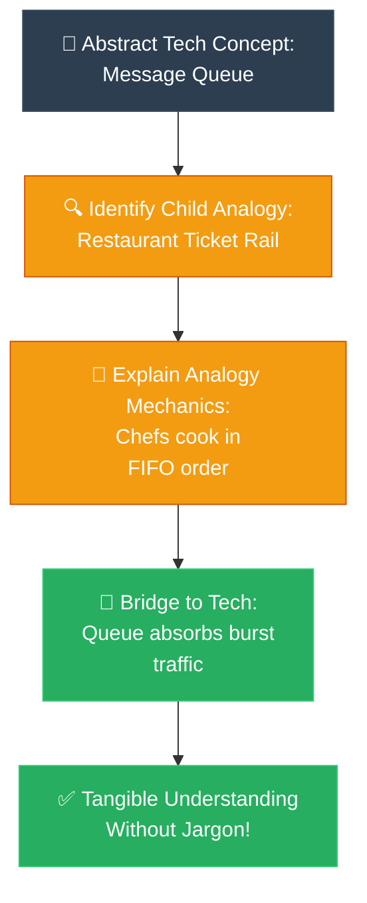

# Strategy 03: ELI5 — Explain Like I'm 5 (ពន្យល់ដូចក្មេងអាយុ ៥ ឆ្នាំ)

**Author:** ichamrong  
**Date:** 2026-05-18  
**Tags:** #explanation-strategies #eli5 #analogies #communication  
**Category:** Concepts / Explanation Strategies  
**Read Time:** ~5 min  

---

## 📌 មាតិកា (Table of Contents)
- [សេចក្តីផ្តើម (Introduction)](#សេចក្តីផ្តើម-introduction)
- [រូបមន្តនៃការដោះស្រាយ (The Formula)](#រូបមន្តនៃការដោះស្រាយ-the-formula)
- [ដ្យាក្រាមលំហូរ (Visual Flowchart)](#ដ្យាក្រាមលំហូរ-visual-flowchart)
- [ឧទាហរណ៍ជាក់ស្តែង៖ DNS និង Message Queue (Practical Examples)](#ឧទាហរណ៍ជាក់ស្តែង-dns-និង-message-queue-practical-examples)
- [មេរៀន និងដែនកំណត់ (When to Use & Limitations)](#មេរៀន-និងដែនកំណត់-when-to-use-limitations)

---

## សេចក្តីផ្តើម (Introduction)

The **ELI5 (Explain Like I'm 5)** strategy is a beautiful approach designed to take cold, complex, and highly abstract topics and instantly turn them into something warm, tangible, and immediate. It is perfectly crafted for non-technical stakeholders, curious clients, or brand-new learners who might feel intimidated by heavy engineering jargon. By gently mapping a difficult technical concept to a single, universally understood physical object or a joyful childhood experience, you instantly disarm their fears. This approach effortlessly builds trust, sparking a sudden *"Aha!"* moment of pure intuition.

យុទ្ធសាស្ត្រ **ELI5 (ពន្យល់ដូចក្មេងអាយុ ៥ ឆ្នាំ)** គឺជាវិធីសាស្ត្រដ៏ស្រស់ស្អាតមួយ ដែលត្រូវបានបង្កើតឡើងដើម្បីយកប្រធានបទបច្ចេកវិទ្យាដែលស្ងួតក្រៀម ស្មុគស្មាញ និងអរូបីបំផុត មកបំប្លែងភ្លាមៗឱ្យក្លាយជាអ្វីមួយដែលកក់ក្តៅ រូបី និងងាយស្រាប់ចាប់យកបាន។ វាត្រូវបានរចនាឡើងយ៉ាងស័ក្តិសមបំផុតសម្រាប់ដៃគូពិភាក្សាដែលមិនមែនជាអ្នកបច្ចេកទេស អតិថិជនដែលចង់ដឹងចង់ឃើញ ឬអ្នកទើបចូលរៀនដំបូង ដែលអាចនឹងមានអារម្មណ៍ភ័យខ្លាចចំពោះពាក្យបច្ចេកទេសវិស្វកម្មដ៏ធ្ងន់ៗ។ តាមរយៈការភ្ជាប់គំនិតបច្ចេកទេសដ៏លំបាក ទៅនឹងវត្ថុរូបវន្ត ឬបទពិសោធន៍កុមារភាពដ៏រីករាយដែលមនុស្សគ្រប់គ្នាសុទ្ធតែធ្លាប់ឆ្លងកាត់ អ្នកបានជួយបំបាត់ភាពភ័យខ្លាចរបស់ពួកគេភ្លាមៗ។ វិធីសាស្ត្រនេះជួយកសាងទំនុកចិត្តយ៉ាងងាយស្រួល និងបង្កើតបាននូវអារម្មណ៍យល់ដឹង *"អូ! ខ្ញុំយល់ហើយ!"* ប្រកបដោយភាពភ្លឺស្វាង និងវិចារណញាណពិតប្រាកដ។

---

## រូបមន្តនៃការដោះស្រាយ (The Formula)

```
1. Select ONE physical object or everyday childhood experience.
2. Commit to that single analogy completely (avoid mixing metaphors).
3. Walk through the analogy fully so the audience understands the mechanics.
4. Bridge: "In software / system design, X is exactly like that because..."
5. Eliminate all jargon. If a professional term is necessary, define it instantly.
```

---

## ដ្យាក្រាមលំហូរ (Visual Flowchart)



---

## ឧទាហរណ៍ជាក់ស្តែង៖ DNS និង Message Queue (Practical Examples)

### 1. Explaining a Message Queue ( restaurant ticket rail )
* **English:** *"Imagine a restaurant kitchen. Orders come in faster than the chefs can cook. Instead of yelling at the chefs to cook faster, you put the orders on a ticket rail — in order, first order first. The chefs take tickets from the left side, cook, and the rail slowly empties. The queue is that ticket rail. It absorbs the burst of incoming orders and smooths out the work."*
* **Khmer:** *«សូមស្រមៃគិតពីផ្ទះបាយភោជនីយដ្ឋានមួយ។ ភ្ញៀវកម្ម៉ង់ម្ហូបលឿនជាងចុងភៅអាចធ្វើទាន់។ ជំនួសឱ្យការស្រែកដាក់ចុងភៅឱ្យធ្វើឱ្យលឿន អ្នកយកក្រដាសកម្ម៉ង់នោះទៅដោតលើរបារកៀបក្រដាស (Ticket Rail) — តាមលំដាប់លំដោយ ក្រដាសមកមុនដោតមុន។ ចុងភៅដកក្រដាសពីខាងឆ្វេងយកទៅធ្វើ រួចរបារនោះក៏សល់ទំនេរម្តងបន្តិចៗ។ Message Queue គឺដូចជារបារកៀបក្រដាសនោះឯង។ វាជួយស្រូបយកតម្រូវការដែលមកបុកគ្នាខ្លាំង និងសម្រាលបន្ទុកការងារឱ្យរលូន។»*

### 2. Explaining DNS ( phone contacts book )
* **English:** *"You know how your phone has a contact named 'Mom' but the phone actually dials a number? DNS is exactly that. You type 'google.com' (the name) and DNS translates it to '142.250.80.46' (the number the internet actually uses)."*
* **Khmer:** *«អ្នកដឹងទេថា ទូរស័ព្ទរបស់អ្នកមានឈ្មោះទំនាក់ទំនងដូចជា 'ម៉ាក់' ប៉ុន្តែទូរស័ព្ទពិតជាខលទៅកាន់លេខទូរស័ព្ទវែងមួយ? DNS គឺពិតជាដូចជាសៀវភៅទូរស័ព្ទនោះឯង។ អ្នកវាយពាក្យ 'google.com' (ដែលជាឈ្មោះ) ហើយ DNS នឹងបកប្រែវាទៅជាលេខ '142.250.80.46' (ដែលជាលេខពិតប្រាកដដែលប្រព័ន្ធអ៊ីនធឺណិតប្រើប្រាស់)។»*

---

## មេរៀន និងដែនកំណត់ (When to Use & Limitations)

### 📈 Best For (សាកសមបំផុតសម្រាប់)
* **Client & Stakeholder Meetings:** Discussing technical architecture with managers or non-technical business partners.
* **Product Demos & Pitches:** Hooking the audience with immediate clarity before diving into value.
* **Documentation READMEs:** Providing a high-level, inviting introduction to a codebase or service.

### ⚠️ Limitations (ដែនកំណត់)
* **Lacks Precision:** Over-simplifies complex rules (like DNS caching, propagation, or queue serialization).
* **Metaphor Breakdown:** If the audience asks deep questions, you must gently transition to another strategy.
* **Ego Check:** Ensure the explanation is simplified but never patronizing (treating them like a child vs. explaining to a child).

---

---

## 📚 Implemented Patterns (គំរូស្ថាបត្យកម្មដែលបានអនុវត្ត)

Here are the design patterns explained with 5-year-old clarity using the **ELI5** strategy:

* **[01. Adapter (ឌុយបំប្លែងចរន្តអគ្គិសនី)](./01-adapter.md)** — Explains Adapter as a travel adapter for dual-pin American toy plugs to fit into round European hotel sockets.
* **[02. Facade (ចំណុចទំនាក់ទំនងសាមញ្ញតែមួយ)](./02-facade.md)** — Explains Facade as the restaurant waiter, hiding the complicated kitchen, cashier, and wine cellar behind a single face.
* **[03. Observer (ការចុះឈ្មោះជាវព័ត៌មានដោយស្វ័យប្រវត្តិ)](./03-observer.md)** — Explains Observer as a comic book subscription list, eliminating daily bookstore inquiries (polling) in favor of automated delivery.
* **[04. Singleton (ម៉ាស៊ីនខួងខ្មៅដៃតែមួយគត់ក្នុងថ្នាក់រៀន)](./04-singleton.md)** — Explains Singleton as a classroom's single pencil sharpener, saving space and ensuring orderly sharing.
* **[05. Builder (ការពន្យល់ពី Builder ដូចក្មេងអាយុ ៥ ឆ្នាំ)](./05-builder.md)** — Explains Builder as a step-by-step Lego spaceship instruction booklet, click-assembling toys securely instead of dumping 100 blocks at once.
* **[06. Factory Method (ការពន្យល់ពី Factory Method ដូចក្មេងអាយុ ៥ ឆ្នាំ)](./06-factory-method.md)** — Explains Factory Method as a magic Toy Machine that builds different toys depending on the plastic key color inserted.

---

## Related
* [← Back to Concepts](../README.md)
* [Strategy 02: Feynman Technique](../02-feynman-technique/README.md)
* [Strategy 04: The Analogy Bridge](../04-analogy-bridge/README.md)
