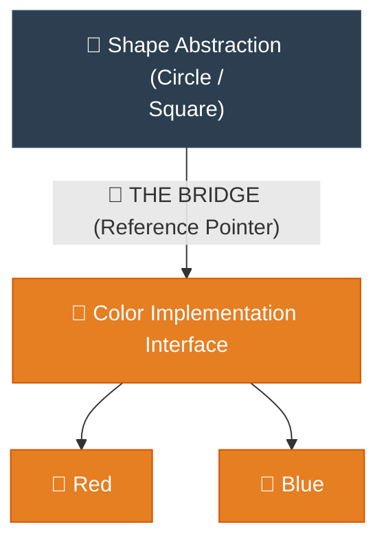

# Analogy Bridge: Bridge (ស្ពានតភ្ជាប់រវាងការងារពីរដាច់ដោយឡែក)

**Author:** ichamrong  
**Date:** 2026-05-18  
**Tags:** #analogy-bridge #analogy #design-patterns #bridge #clean-code  
**Category:** Concepts / Analogy Bridge  
**Read Time:** ~5 min  

---

## 📌 មាតិកា (Table of Contents)
- [១. ស្ពានភ្ជាប់គំនិត (The Analogy Bridge)](#១-ស្ពានភ្ជាប់គំនិត-the-analogy-bridge)
- [២. ព្រំដែននៃភាពដូចគ្នា (Where the Analogy Breaks)](#២-ព្រំដែននៃភាពដូចគ្នា-where-the-analogy-breaks)
- [៣. ដ្យាក្រាមលំហូរ (Visual Flowchart)](#៣-ដ្យាក្រាមលំហូរ-visual-flowchart)
- [៤. Related Posts](#៤-related-posts)

---

## ១. ស្ពានភ្ជាប់គំនិត (The Analogy Bridge)

### English
* **Known Domain (Real World):** Imagine you own a beautiful, small workshop making wooden **Toys** (Cars, Trains) in different **Colors** (Red, Blue). At first, it's easy. But as children ask for more variations—Green Cars, Yellow Trains, Blue Planes—you realize you are spending all your time building separate painting molds for every single combination. The sheer amount of work is overwhelming and stressful! You have the classic $M \times N$ problem.
* **Unknown Domain (Software Architecture):** In the software world, this happens when you tightly couple an abstraction (like `Device`: TV, Radio) to its specific implementations (like `Remote` brands: Sony, LG) using inheritance. Every new device or remote brand forces you to create endless new classes, creating a nightmare of duplicated code.
* **The Bridge:** To save your workshop, you separate the responsibilities. `Shape` focuses purely on being a shape, and `Color` becomes its own independent job. You hire a dedicated painter (the **Bridge**). The `Shape` simply hands itself to the painter and says, "Please apply your color to me." Now, a Circle just holds hands with a Red color object. You only need $M + N$ molds, bringing peace and simplicity back to your design!

### Khmer
* **ដែនដឹងស្គាល់ (ពិភពពិត):** ស្រមៃថាអ្នកជាម្ចាស់រោងជាងដ៏ស្រស់ស្អាតមួយដែលផលិត **តុក្កតាឈើ** (ឡាន, រថភ្លើង) ក្នុង **ពណ៌** ផ្សេងៗគ្នា (ក្រហម, ខៀវ)។ ដំបូងឡើយវាហាក់ដូចជាងាយស្រួល។ ប៉ុន្តែនៅពេលដែលក្មេងៗចាប់ផ្តើមទាមទារម៉ូដថ្មីៗ—ឡានពណ៌បៃតង រថភ្លើងពណ៌លឿង យន្តហោះពណ៌ខៀវ—អ្នកស្រាប់តែដឹងថា អ្នកកំពុងចំណាយពេលស្ទើរតែទាំងអស់ដើម្បីបង្កើតពុម្ពដាច់ដោយឡែកសម្រាប់គ្រប់ការផ្គូផ្គងទាំងអស់។ ការងារដ៏គរជើងនេះពិតជាគួរឱ្យតានតឹងខ្លាំងណាស់! (នេះគឺជាបញ្ហា $M \times N$)។
* **ដែនមិនស្គាល់ (ស្ថាបត្យកម្មកូដ):** នៅក្នុងពិភពកូដ រឿងនេះកើតឡើងនៅពេលដែលអ្នកចងភ្ជាប់ Abstraction (ដូចជាប្រភេទ `Device`៖ TV, Radio) ទៅនឹងការអនុវត្តជាក់ស្តែងរបស់វា (ដូចជាម៉ាក `Remote`៖ Sony, LG) តាមរយៈការប្រើ Inheritance។ រាល់ឧបករណ៍ ឬម៉ាកថ្មីៗដែលថែមចូល សុទ្ធតែបង្ខំឱ្យអ្នកបង្កើត Class ថ្មីៗរាប់មិនអស់ ដែលបង្កើតជាភាពវឹកវរក្នុងប្រព័ន្ធ។
* **ស្ពានតភ្ជាប់ (The Bridge):** ដើម្បីសង្គ្រោះរោងជាងរបស់អ្នក អ្នកសម្រេចចិត្តបំបែកការងារពីគ្នា។ `Shape` ផ្តោតតែលើការរក្សារូបរាងរបស់វា ហើយ `Color` ក្លាយជាការងារឯករាជ្យមួយទៀត។ អ្នកជួលជាងលាបពណ៌ម្នាក់ (ចាត់ទុកជា **ស្ពានតភ្ជាប់**)។ រូបរាងគ្រាន់តែប្រគល់ខ្លួនឱ្យជាងលាបពណ៌ ហើយនិយាយថា «សូមជួយផាត់ពណ៌របស់អ្នកមកលើខ្ញុំផង»។ ឥឡូវនេះ រង្វង់គ្រាន់តែចាប់ដៃជាមួយ Object ពណ៌ក្រហមប៉ុណ្ណោះ។ អ្នកត្រូវការត្រឹមតែ $M + N$ Classes ដែលនាំភាពសាមញ្ញ និងសន្តិភាពត្រលប់មកការងាររបស់អ្នកវិញ!

---

## ២. ព្រំដែននៃភាពដូចគ្នា (Where the Analogy Breaks)

In the toy factory, shape and color are physically combined into a single, permanent plastic object. In programming, shape and color remain two completely separate objects in memory; the Shape object merely holds a reference pointer (`color.applyColor()`) to delegate the coloring logic at runtime.

នៅក្នុងរោងចក្រតុក្កតា រូបរាង និងពណ៌ត្រូវបានរលាយចូលគ្នាជាសាច់តែមួយនៃប្លាស្ទិកជារៀងរហូត។ នៅក្នុងកូដ រូបរាង និងពណ៌នៅតែជា Object ពីរដាច់ដោយឡែកពីគ្នានៅក្នុងមេម៉ូរីដដែល។ Object រូបរាងគ្រាន់តែរក្សាទុក Pointer ចង្អុលទៅកាន់ (`color.applyColor()`) ដើម្បីបញ្ជូនការងារផាត់ពណ៌ទៅឱ្យ Object ពណ៌ចាត់ចែងនៅពេលដំណើរការប៉ុណ្ណោះ។

---

## ៣. ដ្យាក្រាមលំហូរ (Visual Flowchart)

---

## ៤. Related Posts

* 📖 **Read the Parable:** [The Universal Remote (តេឡេបញ្ជាសកល)](../../parables/83-the-universal-remote.md)
* 🛠️ **Read the Code Implementation:** [Structural Patterns: The Architecture of Objects](../../../clean-code/design-patterns/02-structural-patterns.md#the-bridge)
