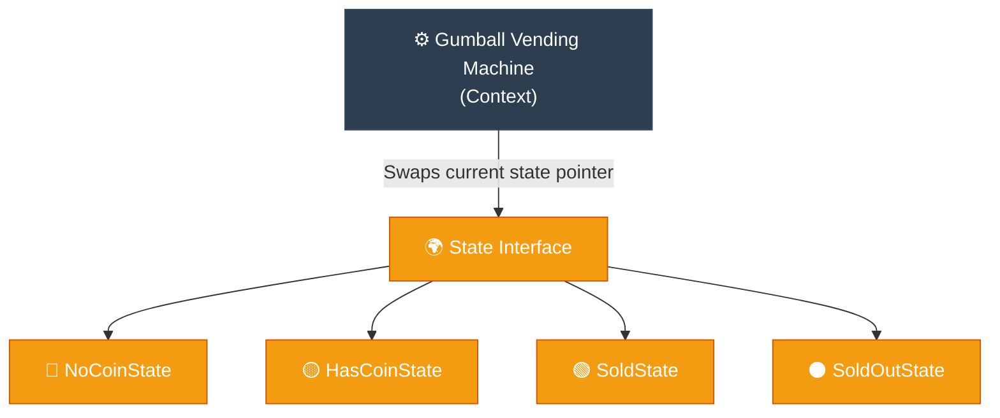

# Analogy Bridge: State (ការគ្រប់គ្រងស្ថានភាពផ្លាស់ប្តូរនៃប្រព័ន្ធ)

**Author:** ichamrong  
**Date:** 2026-05-18  
**Tags:** #analogy-bridge #analogy #design-patterns #state #clean-code  
**Category:** Concepts / Analogy Bridge  
**Read Time:** ~5 min  

---

## 📌 មាតិកា (Table of Contents)
- [១. ស្ពានភ្ជាប់គំនិត (The Analogy Bridge)](#១-ស្ពានភ្ជាប់គំនិត-the-analogy-bridge)
- [២. ព្រំដែននៃភាពដូចគ្នា (Where the Analogy Breaks)](#២-ព្រំដែននៃភាពដូចគ្នា-where-the-analogy-breaks)
- [៣. ដ្យាក្រាមលំហូរ (Visual Flowchart)](#៣-ដ្យាក្រាមលំហូរ-visual-flowchart)
- [៤. Related Posts](#៤-related-posts)

---

## ១. ស្ពានភ្ជាប់គំនិត (The Analogy Bridge)

### English
* **Known Domain (Real World):** Imagine standing in front of a colorful **Magic Gumball Machine**. Depending on its "mood" (its current state), it reacts entirely differently to your touch. If it's *Empty*, turning the crank gives you nothing but a sad click. If it's *Waiting for a Coin*, it refuses to turn. But the moment you drop a coin in, its mood shifts to *Ready*—and a joyful turn of the crank rewards you with a sweet gumball!
* **Unknown Domain (Software Architecture):** In software, we often write objects that change behavior based on their internal condition. If we use massive, tangled blocks of `if-else` or `switch` statements to control these "moods," the code becomes a fragile, unreadable nightmare. Changing one behavior risks breaking the entire machine.
* **The Bridge:** Instead of one messy brain trying to remember everything, the State pattern gives the machine a smooth, elegant way to transition. We create a beautiful, separate `State` class for every single mood (`NoCoinState`, `HasCoinState`, `SoldState`). The machine simply holds hands with its *current* state and trusts it completely to handle any action. When a gumball is dispensed, the current state gently passes the baton to the next state, keeping the entire system perfectly organized and stress-free.

### Khmer
* **ដែនដឹងស្គាល់ (ពិភពពិត):** ស្រមៃថាអ្នកកំពុងឈរនៅមុខ **ម៉ាស៊ីនលក់ស្ករគ្រាប់វេទមន្ត** ដ៏ចម្រុះពណ៌មួយ។ អាស្រ័យលើ «អារម្មណ៍» (ស្ថានភាពបច្ចុប្បន្ន) របស់វា វាមានប្រតិកម្មខុសគ្នាស្រឡះនៅពេលអ្នកប៉ះវា។ បើវា *ទទេស្អាត* ការបង្វិលកុងតាក់មិនផ្តល់អ្វីក្រៅពីសំឡេង «តឹក» ដ៏ក្រៀមក្រំនោះទេ។ បើវា *កំពុងរង់ចាំកាក់* វានឹងរឹងមុខមិនព្រមវិលឡើយ។ ប៉ុន្តែគ្រាន់តែអ្នកទម្លាក់កាក់ចូលភ្លាម អារម្មណ៍របស់វានឹងប្តូរទៅជា *រួចរាល់*—ហើយការបង្វិលកុងតាក់ដោយក្តីរំភើប នឹងផ្តល់រង្វាន់ដល់អ្នកនូវស្ករគ្រាប់ដ៏ផ្អែមឆ្ងាញ់!
* **ដែនមិនស្គាល់ (ស្ថាបត្យកម្មកូដ):** នៅក្នុងការសរសេរកូដ យើងតែងតែមាន Object ដែលផ្លាស់ប្តូរអាកប្បកិរិយាអាស្រ័យលើស្ថានភាពខាងក្នុងរបស់វា។ ប្រសិនបើយើងប្រើលក្ខខណ្ឌ `if-else` ឬ `switch` ត្រួតៗគ្នាដ៏រញ៉េរញ៉ៃដើម្បីគ្រប់គ្រង «អារម្មណ៍» ទាំងនេះ នោះកូដនឹងក្លាយជាសុបិនអាក្រក់ដែលងាយបាក់បែក និងពិបាកអានបំផុត។ ការកែប្រែចំណុចណាមួយអាចនឹងធ្វើឱ្យខូចម៉ាស៊ីនទាំងមូល។
* **ស្ពានតភ្ជាប់ (The Bridge):** ជំនួសឱ្យការប្រើខួរក្បាលដ៏រញ៉េរញ៉ៃមួយដើម្បីចងចាំគ្រប់យ៉ាង State Pattern ផ្តល់នូវមធ្យោបាយដ៏រលូន និងស្រស់ស្អាតក្នុងការផ្លាស់ប្តូរស្ថានភាព។ យើងបង្កើត Class `State` ដាច់ដោយឡែកដ៏ស្រស់ស្អាតមួយសម្រាប់អារម្មណ៍នីមួយៗ (`NoCoinState`, `HasCoinState`, `SoldState`)។ ម៉ាស៊ីនគ្រាន់តែចាប់ដៃជាមួយស្ថានភាព *បច្ចុប្បន្ន* របស់វា ហើយទុកចិត្តវាទាំងស្រុងក្នុងការចាត់ចែងរាល់សកម្មភាព។ នៅពេលដែលស្ករគ្រាប់ធ្លាក់ចុះមក ស្ថានភាពបច្ចុប្បន្ននឹងបញ្ជូនតួនាទីយ៉ាងថ្នមៗទៅកាន់ស្ថានភាពបន្ទាប់ ដែលជួយឱ្យប្រព័ន្ធទាំងមូលមានរបៀបរៀបរយ និងគ្មានភាពតានតឹង។

---

## ២. ព្រំដែននៃភាពដូចគ្នា (Where the Analogy Breaks)

In a physical vending machine, states are mechanical configurations of gears and levers. In software, states are independent, garbage-collectable objects in the JVM heap memory. The context machine (`GumballMachine`) must actively manage reference swaps, destroying old state objects or reusing static state instances to prevent memory leaks.

នៅក្នុងម៉ាស៊ីនលក់ទំនិញពិតប្រាកដ ស្ថានភាពគឺជាការរៀបចំបែបមេកានិចនៃប្រព័ន្ធប៉ាឡុង និងកុងតាក់។ នៅក្នុងកូដ ស្ថានភាពគឺជា Object ឯករាជ្យនៅក្នុង JVM Heap Memory។ ម៉ាស៊ីន (`GumballMachine`) ត្រូវតែគ្រប់គ្រងការដោះដូរ Reference ទាំងនេះដោយយកចិត្តទុកដាក់ ដោយលុបចោល Object ស្ថានភាពចាស់ ឬប្រើឡើងវិញនូវ Static State Instances ដើម្បីការពារកុំឱ្យហូរហៀរមេម៉ូរី។

---

## ៣. ដ្យាក្រាមលំហូរ (Visual Flowchart)

---

## ៤. Related Posts

* 📖 **Read the Parable:** [The Magic Vending Machine (ម៉ាស៊ីនលក់ភេសជ្ជៈវេទមន្ត)](../../parables/94-the-magic-vending-machine.md)
* 🛠️ **Read the Code Implementation:** [Behavioral Patterns: The Dynamics of Objects](../../../clean-code/design-patterns/03-behavioral-patterns.md#the-state)
