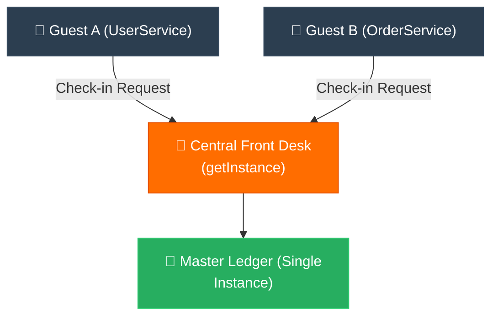

# Analogy Bridge: Singleton (ស្ពានប្រៀបធៀបនៃប្រភពពិតតែមួយគត់)

**Author:** ichamrong  
**Date:** 2026-05-18  
**Tags:** #analogy-bridge #analogy #design-patterns #singleton #clean-code  
**Category:** Concepts / Analogy Bridge  
**Read Time:** ~5 min  

---

## 📌 មាតិកា (Table of Contents)
- [១. ស្ពានភ្ជាប់គំនិត (The Analogy Bridge)](#១-ស្ពានភ្ជាប់គំនិត-the-analogy-bridge)
- [២. ព្រំដែននៃភាពដូចគ្នា (Where the Analogy Breaks)](#២-ព្រំដែននៃភាពដូចគ្នា-where-the-analogy-breaks)
- [៣. ដ្យាក្រាមលំហូរ (Visual Flowchart)](#៣-ដ្យាក្រាមលំហូរ-visual-flowchart)
- [៤. Related Posts](#៤-related-posts)

---

## ១. ស្ពានភ្ជាប់គំនិត (The Analogy Bridge)

### English
* **Known Domain (Real World):** Imagine stepping into a grand, beautifully lit hotel with hundreds of elegant rooms. If there was no central reception, chaos would instantly ruin the peace. Guests would try to check in with the bartender, the bellboy, or the cleaner. Two exhausted families might be sent to the exact same room, leading to confusion, tears, and a ruined vacation. To preserve the calm and welcoming atmosphere, the hotel routes everyone to **one caring Central Front Desk** that holds the master guestbook, ensuring every family is perfectly accommodated.
* **Unknown Domain (Software Architecture):** In software, vital resources like a Database Connection, a System Logger, or a Configuration Manager act as the heart of your application. If every part of your app (`UserService`, `PaymentService`) creates its own heart, they will fight over resources, overwrite each other's data, and ultimately crash the system in a chaotic tug-of-war.
* **The Bridge:** The Singleton Pattern acts just like that **warm, guiding Front Desk**. It gently closes off the ability to create multiple messy versions (using a private constructor) and offers a single, open door (`getInstance()`). Whenever a service needs help, it simply asks this one wise coordinator, guaranteeing perfect harmony and a single source of truth across the entire application.

### Khmer
* **ដែនដឹងស្គាល់ (ពិភពពិត):** ស្រមៃថាអ្នកកំពុងបោះជំហានចូលទៅក្នុងសណ្ឋាគារដ៏ធំទូលាយ និងស្រស់ស្អាតមួយដែលមានបន្ទប់រាប់រយ។ ប្រសិនបើគ្មានតុទទួលភ្ញៀវកណ្តាលទេ ភាពវឹកវរនឹងបំផ្លាញសន្តិភាពនៅទីនោះភ្លាមៗ។ ភ្ញៀវនឹងព្យាយាមសុំ Check-in ជាមួយអ្នកឆុងស្រា អ្នកយួរវ៉ាលី ឬអ្នកអនាម័យ។ គ្រួសារដែលកំពុងហត់នឿយពីរគ្រួសារអាចនឹងត្រូវគេបញ្ជូនទៅកាន់បន្ទប់តែមួយ ដែលបង្កជាការភ័ន្តច្រឡំ ទឹកភ្នែក និងបំផ្លាញភាពសប្បាយរីករាយក្នុងថ្ងៃឈប់សម្រាក។ ដើម្បីរក្សាបរិយាកាសស្ងប់ស្ងាត់ និងកក់ក្តៅ សណ្ឋាគារបានតម្រង់ទិសអ្នកគ្រប់គ្នាទៅកាន់ **តុទទួលភ្ញៀវកណ្តាលតែមួយគត់** ដែលជាអ្នកកាន់សៀវភៅបញ្ជីធំ ដើម្បីធានាថាគ្រួសារនីមួយៗទទួលបានការស្នាក់នៅយ៉ាងល្អឥតខ្ចោះ។
* **ដែនមិនស្គាល់ (ស្ថាបត្យកម្មកូដ):** នៅក្នុងកូដ ធនធានសំខាន់ៗដូចជា Database Connection, System Logger ឬ Configuration Manager ប្រៀបបាននឹងបេះដូងនៃកម្មវិធីរបស់អ្នក។ ប្រសិនបើផ្នែកនីមួយៗនៃកម្មវិធី (`UserService`, `PaymentService`) ព្យាយាមបង្កើតបេះដូងរៀងៗខ្លួន ពួកវានឹងដណ្តើមធនធានគ្នា សរសេរជាន់លើទិន្នន័យគ្នាទៅវិញទៅមក ហើយទីបំផុតនឹងធ្វើឱ្យប្រព័ន្ធទាំងមូលដួលរលំដោយសារការទាញព្រ័ត្រដ៏វឹកវរនេះ។
* **ស្ពានតភ្ជាប់ (The Bridge):** Singleton Pattern ដើរតួប្រៀបដូចជា **តុទទួលភ្ញៀវដ៏កក់ក្តៅ និងផ្តល់ការណែនាំ** នោះអញ្ចឹង។ វាបិទទ្វារយ៉ាងថ្នមៗមិនឱ្យមានការបង្កើតច្បាប់ចម្លងរញ៉េរញ៉ៃច្រើន (តាមរយៈ private constructor) និងបើកច្រកទ្វារតែមួយគត់ជានិច្ច (`getInstance()`)។ រាល់ពេលដែល Service ណាមួយត្រូវការជំនួយ វាគ្រាន់តែសួរទៅកាន់អ្នកសម្របសម្រួលដ៏ឈ្លាសវៃតែមួយគត់នេះ ដែលធានាបាននូវភាពចុះសម្រុងគ្នា និងប្រភពនៃការពិតតែមួយគត់នៅក្នុងកម្មវិធីទាំងមូល។

---

## ២. ព្រំដែននៃភាពដូចគ្នា (Where the Analogy Breaks)

In the physical hotel, the Front Desk is a physical structure where guests must physically line up and wait, bottlenecking one by one. In programming, once the Singleton instance is initialized, multiple parallel threads can access the same object simultaneously at the speed of memory. The Singleton only bottlenecks threads during its initial creation if synchronized, but thereafter, it serves concurrent reads and writes concurrently without blocking them, provided the internal methods are thread-safe.

នៅក្នុងសណ្ឋាគារពិតប្រាកដ តុទទួលភ្ញៀវកណ្តាលគឺជាកន្លែងជាក់ស្តែងដែលភ្ញៀវត្រូវតម្រង់ជួររង់ចាំម្តងម្នាក់ៗ ដែលបង្កើតឱ្យមានការកកស្ទះ (Bottleneck)។ នៅក្នុងការសរសេរកូដ នៅពេលដែល Object Singleton ត្រូវបានបង្កើតរួចរាល់ នោះខ្សែស្រឡាយការងារ (Threads) ច្រើនអាចចូលប្រើប្រាស់ Object តែមួយនោះក្នុងពេលដំណាលគ្នាបានយ៉ាងលឿនបំផុតតាមល្បឿនមេម៉ូរី។ Singleton នឹងធ្វើឱ្យស្ទះការងារតែក្នុងអំឡុងពេលបង្កើតដំបូងប៉ុណ្ណោះ (ប្រសិនបើប្រើ Synchronization) ប៉ុន្តែបន្ទាប់ពីនោះ វានឹងបម្រើការងារអាន និងសរសេរក្នុងពេលដំណាលគ្នាដោយគ្មានការស្ទះឡើយ ដរាបណាមុខងារខាងក្នុងរបស់វាត្រូវបានរចនាឡើងដោយមានសុវត្ថិភាព (Thread-safe)។

---

## ៣. ដ្យាក្រាមលំហូរ (Visual Flowchart)

---

## ៤. Related Posts

### 🔗 Explore All Viewpoints:
* 📖 **Read the Parable:** [The Bank's Only Vault (ទូដែកតែមួយគត់របស់ធនាគារ)](../../parables/75-the-banks-only-vault.md) — Explains the emotional core of shared truth.
* 🧠 **Read the First Principles Derivation:** [MIT Professor Strategy: Singleton (គោលការណ៍គ្រឹះដំបូងនៃ Singleton)](../01-mit-professor/01-singleton.md) — Derives the pattern from fundamental computer axioms.
* 👶 **Read the Feynman Simplification:** [Feynman Technique: Singleton (ការពន្យល់ពី Singleton ដោយគ្មានពាក្យបច្ចេកទេស)](../02-feynman-technique/04-singleton.md) — Breaks it down using the central clock tower.
* 👦 **Read the ELI5 Metaphor:** [ELI5: Singleton (ម៉ាស៊ីនខួងខ្មៅដៃតែមួយគត់ក្នុងថ្នាក់រៀន)](../03-eli5/04-singleton.md) — Teaches it to a five-year-old using classroom pencil sharpeners.
* 🌉 **Read the Analogy Bridge:** [Analogy Bridge: Singleton (ស្ពានប្រៀបធៀបនៃប្រភពពិតតែមួយគត់)](../04-analogy-bridge/04-singleton.md) — Maps it to a hotel front desk and shows where physical limits fail compared to code threads.
* 🧐 **Read the Socratic Discovery:** [Socratic Method: Singleton (ការបង្កើតប្រព័ន្ធការពិតតែមួយគត់តាមវិធីសាស្ត្រសូក្រាត)](../05-socratic-method/04-singleton.md) — Guide your self-discovery through mentor-student dialogue.
* 📰 **Read the Journalist Summary:** [Journalist: Singleton (ការធានាឱ្យមានការពិតតែមួយគត់ក្នុងប្រព័ន្ធទាំងមូល)](../06-journalist-inverted-pyramid/04-singleton.md) — Get the high-impact lede, volatile visibility, and thread-safety details first.
* 🎭 **Read the Storyteller Narrative:** [Storyteller: Singleton (អាណាព្យាបាលនៃសេចក្តីពិត និងកងទ័ពក្លូនបង្កចលាចល)](../07-storyteller-narrative-arc/04-singleton.md) — Follow Kiri's heroic journey to vanquish the duplicate logger clone army.
* ⚙️ **Read the Engineer Spec:** [Engineer: Singleton (ការសម្របសម្រួលប្រភពពិតតែមួយគត់ និងទប់ស្កាត់ការខ្ជះខ្ជាយធនធាន)](../08-engineer-requirements-constraints-solution/03-singleton.md) — Read the rigorous engineering specification, DCL performance details, and candidate elimination.
* 📊 **Read the Pros & Cons:** [Pros & Cons Compared: Singleton (ការប្រៀបធៀបគុណសម្បត្តិ និងគុណវិបត្តិនៃ Singleton)](../09-pros-and-cons-compared/01-singleton.md) — Full trade-off analysis and decision matrix.
* 🛠️ **Read the Code Implementation:** [Creational Patterns: The Art of Instantiation](../../../clean-code/design-patterns/01-creational-patterns.md#the-singleton) — Production-grade Java with double-checked locking and thread safety.
